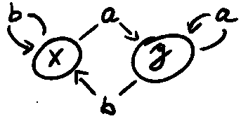
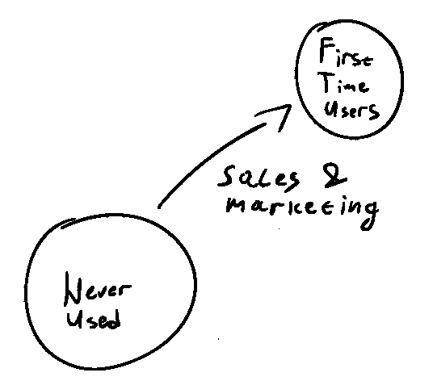
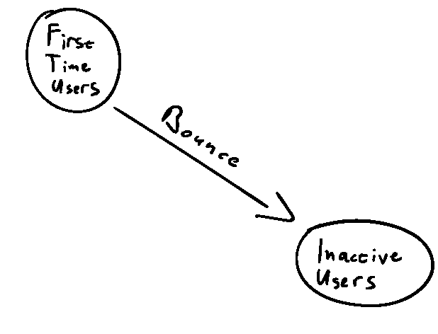
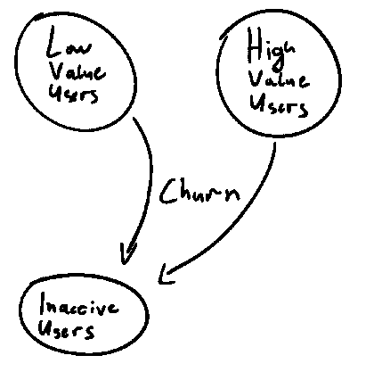
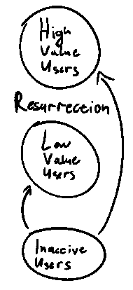
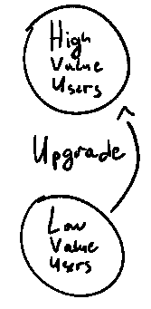
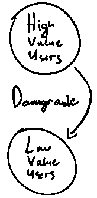

# 使用状态机发展您的启动产品

> 原文：<https://medium.datadriveninvestor.com/grow-your-startup-product-using-state-machine-40f6b1b47e57?source=collection_archive---------10----------------------->

Photo by [ANGELA BENITO](https://unsplash.com/@angelareinosa?utm_source=unsplash&utm_medium=referral&utm_content=creditCopyText) on [Unsplash](https://unsplash.com/s/photos/growth?utm_source=unsplash&utm_medium=referral&utm_content=creditCopyText)

# 什么是状态机？

[状态机](https://en.wikipedia.org/wiki/Finite-state_machine) e 是描述算法的数学过程。换句话说，它表示一个包含给定观察的所有可能状态的图。例如，如果我们表示以下字符串的字符状态:

状态机应该是这样的:

圆圈(x 和 y)表示观察可能处于的状态，而箭头表示从一个状态到另一个状态的转换(a 或 b)。类似于这个例子，状态机可以应用于多种情况。其中之一是用于启动产品的状态机。

# 启动产品状态机

利用状态机的方法之一，也是这篇文章关注的，是改进你的产品。下面是产品 grow 的例子(受 Evernote 方法的启发):

在此图中，节点代表产品侧的用户状态。另一方面，分支(箭头)代表不同状态的用户转换。用户从一个状态到另一个状态的转换可能是好的或坏的，这取决于不同的分支。

 [## 在创业之旅中，拥抱学习|数据驱动的投资者

### 好像建立一个数百万美元的公司还不够困难，企业家必须额外照顾他们的…

www.datadriveninvestor.com](https://www.datadriveninvestor.com/2018/10/16/on-the-entrepreneurial-trek-embrace-the-learning/) 

对于每个分支，您可以有一个单独的团队。他们可以专注于减少或增加其分支的转换数量。但通常情况并非如此。在大多数创业公司，员工并不多，为了保持这种状态，专注是首要任务。因此，下面的帖子主要关注最重要的措施。

# 销售和营销

您可以做的第一步是使用 branch 1 将从未使用过您产品的用户转移到首次用户。要做到这一点，有大量的技术可以使用，如公关，搜索引擎优化，广告等。

但问题是，什么时候应该尝试增加这些交易的数量？由于投资者的作用，大多数创业公司都专注于这一步。在他们看来，创业公司的成长和产品的发展都需要尽可能多的用户。

# 跳出率

最常见的早期创业产品问题是跳出率。此比率表示首次用户成为非活动用户的百分比。这意味着他们试用了你的产品，使用了一小段时间，然后就退出了。这是最需要干预的分支。

因此，要回答上面的问题:首次用户的交易数量应该增长，直到你有足够的统计用户来确定跳出率的百分比。如果您的跳出率太高，您应该先解决这个问题，然后再开始增加首次用户事务。

为了知道你的产品跳出率是高还是低，你首先需要知道你的健康跳出率。健康的跳出率因产品而异，但一般来说，粗略估计健康的跳出率是 30%左右。如果您的跳出率高于 30%，那么这是您需要解决的第一件事，因为您针对目标客户群的产品有问题。

为什么？因为如果你花了数百万美元为你的产品吸引新用户，而你的流失率是 90%，那么他们中的大多数都会离开，你会因为高跳出率而浪费大量金钱。

# 流失率

流失率，或者有时称为关注率，代表在一定时间内离开你的产品的客户(用户)数量。这些用户可能来自低价值用户(在一定时间间隔内多次使用你的产品的人)，也可能来自高价值用户(经常使用你的产品的人)。

因此，低价值客户流失的原因可能是多种多样的。例如，他们最终不喜欢你的产品，他们很难理解它，等等。另一方面是高价值的流失。它远比低价值更重要，因为高价值用户是那些经常使用你的产品并可能为此付费的人。没有他们，你的产品可能会过时。高价值流失率增加的原因可能是您产品的新缺陷、市场中的新竞争对手、新法规等。

# 恢复

复活用户是那些从非活跃状态转变为低价值甚至更好的高价值用户的用户。它们的主要属性是它们从首次用户状态转变为非活动状态。这意味着他们已经知道你的产品，他们尝试过，但出于某种原因，他们停止使用它。关于他们的伟大之处在于，你不需要投入太多的钱来吸引他们购买产品(不像从未使用过的产品)，因为他们已经知道了。

随着时间的推移，这成为了一个很好的(而且便宜的)获得新客户的方法，因为你已经支付了获得他们的成本。一开始，这一步并不重要，因为你需要时间来建立一个不活跃的用户群。但是，如果可能的话，一开始也不要忽略这一点。如果用户不是长期缺席，这是吸引用户到你的产品的一个很好的方法。更准确的说，吸引一个不活跃用户的成本和用户不活跃的时间成正比。所以请记住，尽快采取行动，以建立一个战略或复活他们。

# 提升

这代表某个曾经是低价值用户的人，变成了高价值用户。

但是，为了升级，你首先需要知道你的低价值用户和高价值用户之间的区别。根据您的产品，这也可能有很大的不同。但是，通常，你可以通过他们是否为你的产品付费来区分他们。此外，一种方法是根据它们的终身价值将它们分开。这意味着要估算出他们使用你的产品所能支付的总终身价值。早期阶段的一个很好的标志是使用你的产品的频率。如果他们经常使用你的产品，他们将来有更大的机会付钱给你。

与升级 si 相反，逻辑上降级。升级也是类似的故事。你需要思考哪里出了问题，用户走向低价值状态的哲学是什么。

# 靶心

这可能是最好的交易。这条线代表用户从首次用户到高价值用户。这笔交易是在产品与市场高度契合的情况下发生的，并实现了用户的最佳预期。

# 高价值用户环回

从长远来看，这可能是最重要的事务(在这种情况下是回送)。意思是把高价值用户保持为高价值用户。

这是通过向您保证妥善照顾客户和您的产品来实现的。建立合适的客户支持将增加用户停留在高价值状态的机会。此外，产品的不断开发，提供额外的功能和修复将确保用户在这种状态下的长寿命。

# 结论

你如何运用这些知识？根据您所处的阶段，您可以确定最重要的事务并直接处理它们。由于每个分支都可以用一个数字度量来表示，所以您可以确定哪个分支(事务)是优先的，并因此将您的时间集中在解决它上。

此外，您可以使用这个状态机来创建您的用户路线图。更准确地说，定义你的理想(或其他类型)客户如何行动，什么影响州与州之间的某些交易，等等。例如，用户将他/她的状态从数字 1 改变为数字 3、数字 8、数字 5、数字 6 等。

最后，将这些知识作为你在耗时的方法上的优势。为了行动更快，让你的商业策略更简单。并且，如果你有任何可以开发这个状态机的建议，给出一个命题来讨论它🙂祝你好运，改善你的创业！

*原载于 2020 年 2 月 11 日*[*【https://www.nvukobrat.com】*](https://www.nvukobrat.com/entrepreneurship/grow-your-startup-product-using-state-machine/)*。*