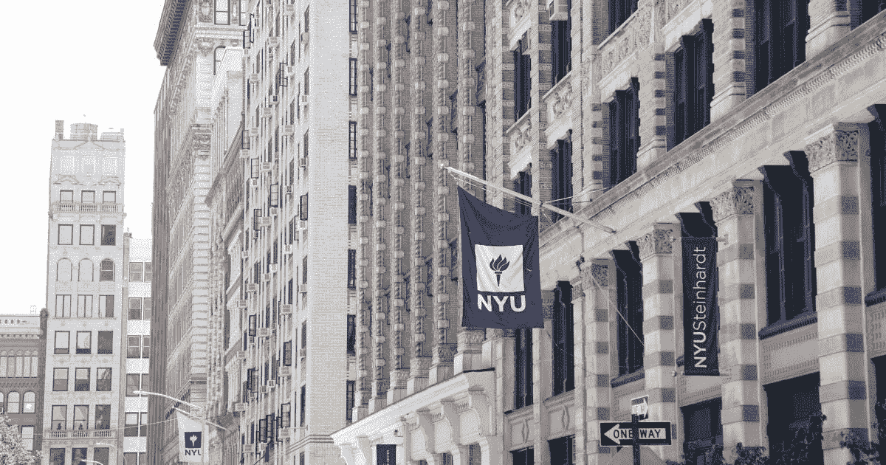
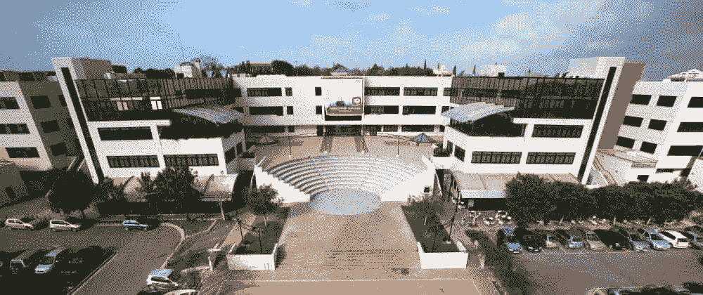
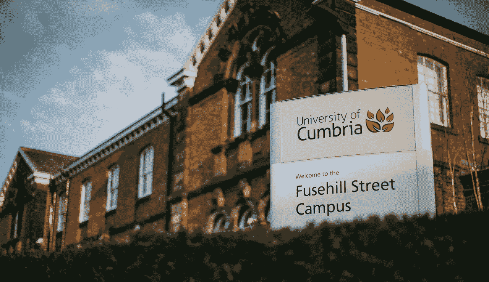

# 对大学区块链课程的兴趣日益增长

> 原文：<https://medium.datadriveninvestor.com/growing-interest-in-blockchain-courses-in-universities-78a42f267627?source=collection_archive---------13----------------------->

企业、政府、医院和零售商正在利用数字账本转变运营方式，以共享数据、创建版权、收集投票，甚至跟踪食品，以及其他各种用途。随着区块链更深地融入世界经济，世界上更多的大学正在教授这项技术，提供更多的课程和扩展授课方式。

 [## 5 行业转型区块链应用|数据驱动投资者

### 除非你一直生活在岩石下，否则我相信你现在已经听说过区块链了。而区块链…

www.datadriveninvestor.com](https://www.datadriveninvestor.com/2019/02/13/5-real-world-blockchain-applications/) 

一些大学开始推出区块链课程，为那些愿意完全理解这个不断发展的系统如何运作的人提供答案。在这里你可以找到美国和欧洲开设区块链课程的前 8 所大学的名单。

# 1.美国纽约大学

纽约大学(NYU)成为美国“第一所”为学生提供区块链技术专业的大学。它侧重于区块链的应用，而不是区块链的信息技术编码。

由于 2014 年纽约大学开始提供区块链课程，开设的第一门课程是“比特币和其他加密货币的法律和商业”这门课程的重点是区块链的经济部分，现在仍然可以使用，它解释了比特币和其他替代支付机制。

NYU 的学生也可以报名参加“数字货币:货币和支付的革命？”本课程向参与者介绍数字货币和新兴的移动支付系统。

# 2.美国普林斯顿大学

第二个上榜的教育中心也将那些愿意学习区块链的人带到了世界上最具标志性的大学之一，新泽西的普林斯顿大学开设了一门与区块链相关的课程，名为“比特币和加密货币技术”这门在线课程通过 Coursera 提供，解决了关于比特币的重要问题。

如果你有兴趣知道以下问题的答案，我们建议你考虑一下:比特币是如何工作的？比特币的与众不同之处在哪里？你的比特币有多安全？比特币用户匿名程度如何？比特币的价格是由什么决定的？加密货币可以监管吗？未来会怎样？

# 3.美国斯坦福大学

美国的另一个主要机构斯坦福大学也开设了一门关于区块链的特殊课程，名为比特币工程。它专注于研究如何开发支持比特币的应用。

你将能够掌握关于比特币以及比特币计算的成熟介绍。

# 4.美国加州大学伯克利分校

加州是世界上几所主要大学的所在地，也是通信和技术相关学位的重要中心。加州伯克利分校为他们的学生提供了一门开源的本科加密货币课程。与此同时，伯克利学生运行组织组织加密会议，并主持讲座，开发人员教程，研讨会等。

此外，该组织还利用尖端的区块链和加密技术开展辅助项目和研究。

# 5.塞浦路斯尼科西亚大学

美国的第一所大学位于地中海东部的一个小岛上，在塞浦路斯，特别是在尼科西亚。事实上，尼科西亚是塞浦路斯最大的独立大学，它提供了第一个在线数字货币理学硕士学位。

“数字货币入门”学位的第一门课程是免费开放的 MOOC 课程，面向任何有兴趣了解数字货币基本原理的人。它由著名的比特币专家 Andreas Antonopoulos 和 Antonis Polemitis 教授，包括 12 个在线直播课程。

# 6.英国坎布里亚大学

英国人在教育方面也名列前茅，坎布里亚郡在这份名单中突出了他们的第一所学校。这所大学推出了一门免费的硕士级在线课程，重点是货币的未来。据报道，在课程中，学生们探索了比特币社区中普遍存在的一种假设，即货币最好被理解为一种具有内在价值的资产。

# 7.美国区块链大学

位于加利福尼亚州的区块链大学结合了由区块链生态系统中最具影响力的头脑领导的强大学术教学与面向解决方案的设计思维和实践培训。该大学为开发者、管理者和企业家提供区块链技术教育。

# 8.英国 B9 实验室学院

最后一个教育机构来自英国，B9 Lab Academy 为技术高管和分析师提供区块链课程。这些课程面向有经验的技术利益相关者，介绍理解技术、智能合同以及与技术相关的技术和社会框架所需的一切。

***如果您想了解更多，请访问 BIDITEX 页面并提出您的问题，关注我们的*** [***推特***](https://twitter.com/biditex_com) ***，*** [***脸书***](https://www.facebook.com/biditex/) ***，*** [***中型***](https://medium.com/@biditex) ***，*** 用[***bidi tex***](http://www.biditex.com/)***投标你的空格。***