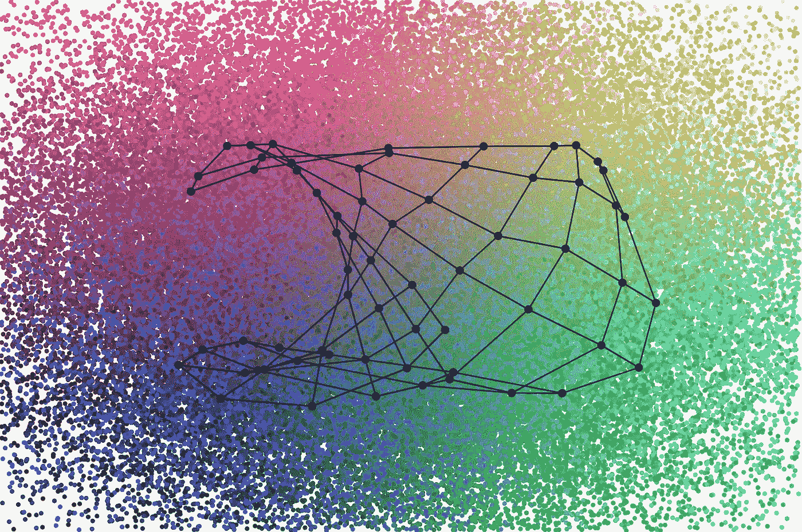
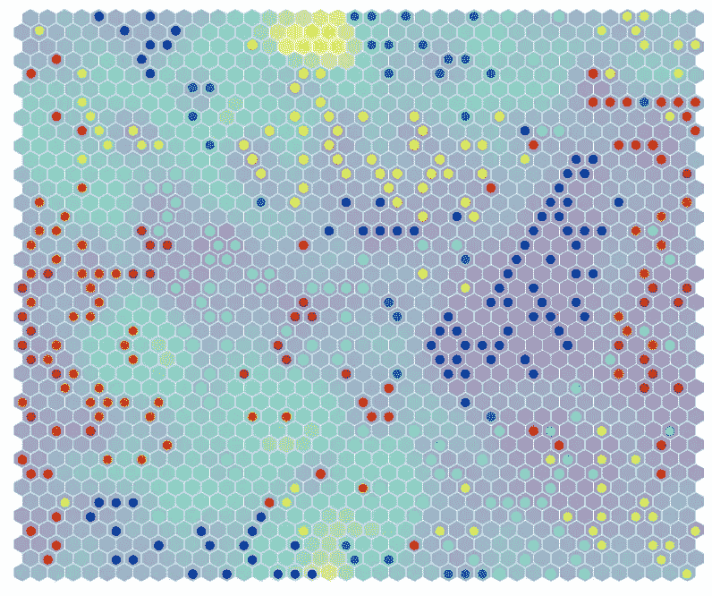
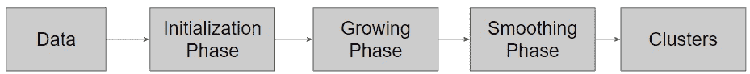
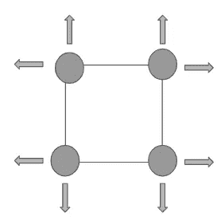
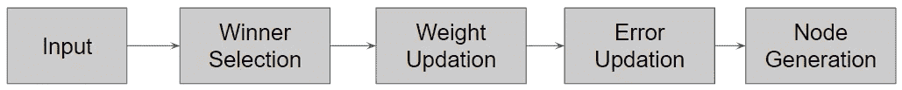
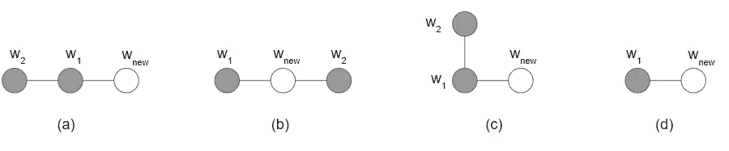

# 不断增长的自组织地图

> 原文：<https://medium.datadriveninvestor.com/growing-self-organizing-maps-2d69b6374398?source=collection_archive---------9----------------------->

## 无监督聚类

Clusters: Photo by George Eliot in brainyquote

当我们看到一个复杂的问题时，我们总是试图理解问题并解决它们。**如何理解问题？我们可以将问题分解成更小的块。那么，理解和解决它们就容易了。另一个大问题是处理大数据。数据可能是复杂的或高维的。很难提取数据集背后的信息或隐藏模式。**

## **集群解决了这个问题吗？**

问题是找不到隐藏在数据中的任何模式。那么，**会有什么问题呢？**它是关于在所有其他模式中找到一个有用的模式。无监督学习在这里发挥作用。我们可以使用无监督学习进行聚类。无监督学习自动发现数据的隐藏模式。我们可以使用无监督学习来探索数据，检测异常值，并从数据中提取信息。无监督聚类有穷举算法。

# **自组织成簇**

Self-Organizing: Photo by Sai Ram in codespeedy

我们可以使用无监督学习算法来识别模式和提取信息。因此，自组织将适用于群集过程。这里，主要思想是从未标记的数据中找到分组。如果我们不知道数据模式，那么我们可以使用聚类概念。因此，我们可以使用数据挖掘中的聚类方法来发现不可预见的和有趣的模式。聚类将有助于我们在处理高维复杂数据之前，对数据有一个清晰的初步了解。

因此，分析数据的最佳工具是聚类算法。聚类可以在数据挖掘过程之前使用。无监督聚类有许多方法？**我们可以使用 SOM 算法进行聚类吗？**

## **用于聚类的 SOM**

Self Organizing Map — Photo by Nima Pasha in Pinterest

**什么是自组织地图(SOM)？它是如何聚集的？**SOM 算法将高维数据集映射成低维，特别是二维或三维映射。因此，我们可以在 2D 或三维地图中可视化集群，并提取一些有用的信息。

您可以在这里访问示例代码库[来尝试使用 SOM 进行集群。此外，您可以在此](https://colab.research.google.com/drive/12G38G81z_VvlDmUIdHIOZM1QWJ0krDvn?usp=sharing)下载 Kaggle 数据集[。您可以尝试代码库来获得下面的集群输出。](https://drive.google.com/drive/folders/18APGD-NG2lySrNsh1oTaug6W2RfBdBCX?usp=sharing)

SOM Clustering : Photo by Author generated for an experiment

## SOM 对我们的目的来说足够了吗？

在继续之前，我们必须再三考虑 SOM 是否足够。如果不是，SOM 缺少什么？

> “已经从理论上证明，SOM 在其原始形式下不提供完全的拓扑保持，并且过去一些研究人员已经试图克服这种限制。”

但是在很多情况下，我们使用 SOM 将高维空间转换成 2D 地图。那么，为什么 SOM 不适合我们呢？主要问题是我们必须定义节点的数量和网格的大小。这是使用 SOM 的一大障碍。我们能预测适合我们应用的网格尺寸吗？不，我们不能。将会有其他大小的网格来提供更好的聚类。尝试所有网格大小和节点数量都有问题。有可能用不同的网格大小运行几次吗？用户不知道数据的结构。因此，他们不能确保他们获得的集群是正确的。**如果我们无法预测网络规模，会有什么解决方案？如何自动获取网格大小？**因此，解决方案是必须在训练阶段检测网格大小。节点必须根据训练自动增长。我们需要一个不断增长的自组织地图吗？是的。

# **GSOM 快速介绍**

不断增长的自组织映射是 SOM 的扩展版本。GSOM 的关键因素是它能控制节点网络的增长。该算法定义了一个 s **pread 因子(SF)** 用于控制层次聚类。我们可以通过修改 SF 从高层次或低(更精细)层次来可视化集群。我们可以根据自己的需求来可视化这些集群。通过一个小的分布因子，我们可以在更高的层次上创建集群来理解数据。然后，我们可以增加扩展因子来从数据中提取重要信息。

> 如果有一种机制可以首先观察最重要的聚类，然后，一旦数据分析师对整个数据集有了一些概念，就可以进一步展开映射并获得更精细的聚类，这将是非常有利的

**我们为什么要控制 GSOM 的增长？**

当我们处理大数据时，可视化来自多个层次级别的数据是有利的。然后我们可以选择一些集群，对它们进行深入分析。我们必须知道这些数据是如何传播的，以便将来进行分析，因为我们可能需要它来进行进一步的实验。因此，我们必须保持一个地图传播的措施。该算法有一个称为*的参数，一个扩展因子(SF)* 来决定扩展的级别。它可以取从 0 到 1 的值，其中该因子与数据无关。

# **GSOM 算法**

GSOM Algorithm : Recreated by Author

## 初始阶段

Initial network by Damminda et al.

该算法从初始化具有四个节点的网络开始。然后，网络会根据参数和数据不断增长。节点用随机权重初始化。并且根据用户需求定义增长阈值。**什么是成长阈值(GT)？**GT 帮助决定是否需要创建一个新节点。 *SF* 帮助计算 *GT* 。我们可以在下面的部分中讨论这一点。

## 生长阶段

Growing phase : Recreated by Author

设节点 ***i*** 的权重为 W(i)，输入向量为 x，当给网络一个新的输入时，算法会识别出一个**最佳匹配单元**(胜者)。**如何选择胜出节点？**通过计算给定输入和网络中所有节点之间的欧几里德距离，确定胜出(最佳匹配单元——BU)节点。

= >距离= |X — W(i)|

距离最小的节点是获胜者(BU)。

获胜者节点的误差值(BU 和给定输入之间的差值)定义如下:

= >误差(BU) = |X-W(BU)|

E(t)和 E(t+1) —节点在时间 t 和 t+1 的误差。

=> E(t+1) = E(t) + |X- W(BU)|

在误差计算之后，算法必须决定一个新的节点是否到网络。定义了误差距离，以保证现有节点网络是否足够。**是怎么做到的？**该算法在每次迭代中不断将误差值加到获胜者节点上。现在新的参数来了:最大误差值 **H_error** 。

**H_error** 指向所有节点的最大误差。每次选择胜出节点(BU)时(错误更新后)，**H _ Error = Error(BU)**if E(BU)>H _ Error。

如果 H_error > DT，算法生成一个新节点。

***节点生成***

一个节点将有四个紧邻的空间。它们可能是空的，也可能不是。该算法选择一个节点(n)进行增长，并在空的邻居位置生成新节点。但是一些节点可能是虚拟的。该算法将在接下来的迭代中移除伪节点。

**新节点如何初始化权重？**现有网络更新。所以我们必须考虑分配权重。必须基于已经增长的网络来分配权重。

Initializing weights for new nodes by Damminda et al.

该算法考虑了四个类别下的权重初始化(上图)。(a)和(b)经常发生。

**案例(a&c)**

如果 W2>W1: W new = W1-(W2-W1)

如果 W1>W2: W new = W1+(W1-W2)

**案例(b):**

W new = (W1+W2)/2

**案例(d):**

新节点只有一个较旧的相邻节点。这种情况将发生在网络的初始阶段或者当虚拟节点被移除时。

W new = (r1+r2)/2，其中 r1 和 r2 是权重的上限和下限。如果 W new 不在 r1 和 r2 之间，它将属于 case ( **d** )。

我们必须调整邻域节点的权重吗？是的，我们必须这样做。必须更新权重向量。类似于 SOM，自适应的量(学习率-LR)将在迭代中以指数方式减少。Wj(k)和 Wj(k+1)是更新权重之前和之后的节点的权重。X(k)是输入向量。N(k+1)是获胜者节点的 k 个相邻节点。

如果 j∈N(k+1)= > Wj(k+1)= Wj(k)+LR(k)*(X(k)-Wj(k))

else => Wj(K+1) = Wj(k)

## 平滑阶段

当没有更多节点要生成时，平滑阶段开始运行。该算法具有平滑阶段，以平滑在最后阶段或迭代中增长的节点的总误差。甚至平滑阶段的初始 LR 也低于生长阶段。多次给定输入数据以收敛误差值。在平滑阶段没有新的节点生成。

# GSOM 的主要特征

*   当我们对数据集一无所知时，我们可以使用 GSOM。
*   GSOM 代表了数据中的聚类和分组，它可能对数据分析人员有用。
*   为表示数据而生成的节点数量略少于 SOM 网络。
*   在 SOM 中，新节点被赋予随机的权值，而 GSOM 根据训练好的网络来分配权值。
*   GSOM 用四个节点初始化。它通过在初始阶段使用几个节点来减少处理时间。

**参考文献**

1.  阿拉哈库恩，d；哈尔加姆格公司；斯里尼瓦桑，B. (2000 年)。*用于知识发现的具有受控增长的动态自组织地图。*
2.  托沃，科霍宁。*自组织地图*。第 30 卷。施普林格科学&商业媒体，2012 年。

**访问专家视图—** [**订阅 DDI 英特尔**](https://datadriveninvestor.com/ddi-intel)