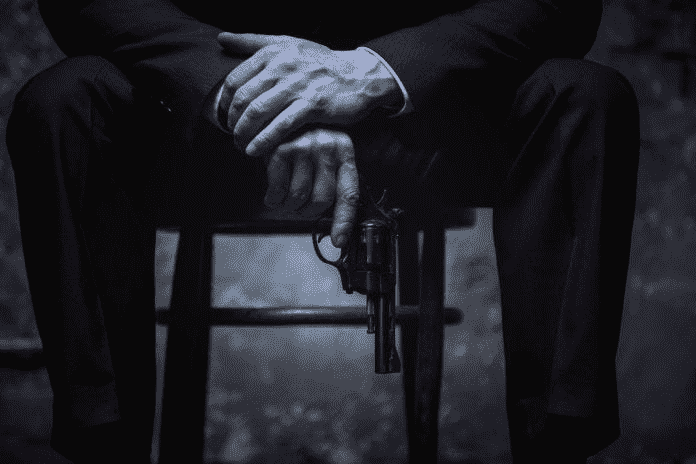
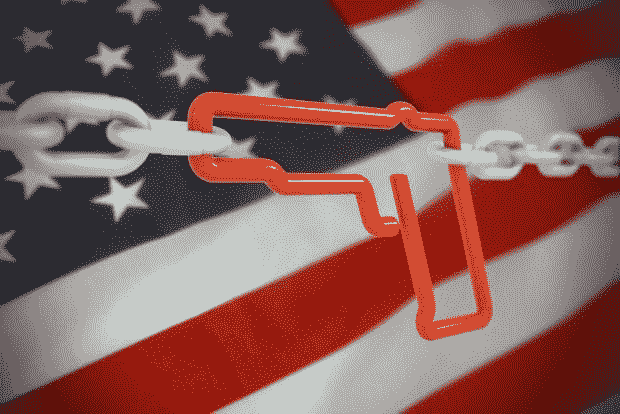
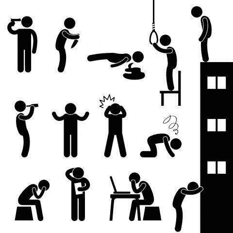
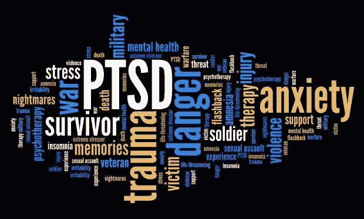
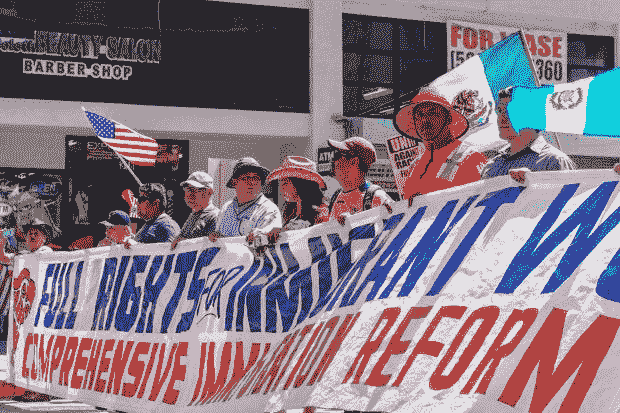
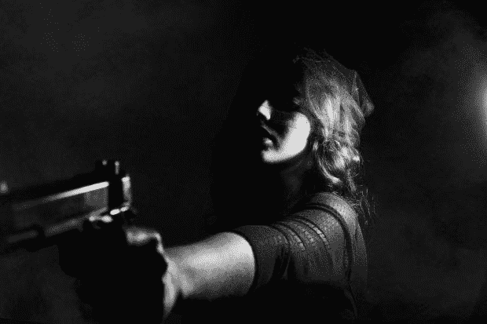

# 政治辞令之外的枪支暴力或混乱

> 原文：<https://medium.datadriveninvestor.com/gun-violence-or-pandemonium-beyond-political-rhetoric-f646ed8d5b1?source=collection_archive---------10----------------------->

Gun Violence

联合国暴力是我们时尚媒体中众多流行词汇之一。这个词的使用跨越了政治界限和公共对话。更近一点的是被下属用掉了它的内在语境，“暴力”的确——使它更引人注目的是这个词；枪，作为暴力本身就是一种表现，尽管它的含义格外打击了现代社会的好奇心。喧嚣一直威胁着社会灵长类动物，并因其智力发展水平而在激烈程度和范围上有所增加。因此，人类的生存占据了暴力等级的最高位置。有趣的是，这并不一定意味着一个给定社会的集中度最终会使公民倾向于更具侵略性。

V 暴力是指使用身体力量伤害、伤害、虐待、破坏或摧毁另一种存在。虽然对真正的暴力有许多定义，但这是一个有明显争议的问题。[世界卫生组织(世卫组织)](https://en.wikipedia.org/wiki/Violence)将暴力定义为“对自己、他人、群体或社区故意使用威胁或真实的身体力量或权力，导致或极有可能导致伤害、死亡、心理伤害、发育不良或剥夺。世卫组织将暴力分为三大类:自我导向型、人际关系型和集体力量型。它旨在将自我施加的暴力与另一个人或一小群人对个人施加的暴力，以及国家、有组织的政治派别、民兵和恐怖组织等更大群体施加的暴力区分开来。每个部门被进一步细分，以再现更多不同类型的暴力，包括身体暴力、性暴力、心理-情感暴力。它甚至还可以分为工具性(反应性)和敌对性。

 [## 保护主义、政治和经济动荡|数据驱动的投资者

### 美国股市昨日出现 400 多点的大幅反转，为未来的事情发出了警告信号。市场…

www.datadriveninvestor.com](https://www.datadriveninvestor.com/2018/06/28/protectionism-politics-economic-turmoil/) 

虽然暴力骚乱是人类遗传倾向的一部分，然而，它主要是通过我们文明和教派的崛起来纠正的。

US flag

与枪支有关的暴力是暴力，唯一的区别是使用工具；枪或火器。涉枪袭击银行对特定社区的社会、政治、道德和法律地位的犯罪行为。如果确定为刑事暴力，则被称为使用致命武器的杀人攻击，或自杀、自杀未遂，这取决于司法管辖。非刑事形式的虐待可能是意外、非故意伤害和死亡，刑事过失除外。枪支暴力统计的其他方式是军事或准军事活动。

# 暴力的诱因

暴力行为的沉淀很多，但都有一个共同的概念，即动机和冲动控制之间的差异。根据一项研究，研究人员交叉参考了瑞典全国登记处 30 年的数据，以评估 35，000 名被诊断为精神分裂症的患者、30，000 名双相情感障碍患者和 2，763，000 名未受影响的对照组在特定情况下一周内犯下恶性犯罪的概率。触发因素被发现暴露于暴力、父母丧亲、自残、创伤性脑损伤、意外伤害或物质中毒。精神分裂症组的发病率最高，其次是双相情感障碍，最后是对照组。在考虑到遗传和环境因素(如社会经济地位、经常搬家和单身)的分析中，与其他永恒因素相比，所有这些因素都表明在刺激后的一周内发生残忍犯罪的可能性很高。29 世纪的动物行为学家认为攻击和暴力是对身体内部活动或直觉的反应。最新的理论得到了弗洛伊德精神分析学家的支持，他们发现攻击是天生毁灭倾向的衍生物。社会化方面也实现为潜在贡献者。后者不仅是生物发展的触发因素，也为认知行为的获得提供了背景。随便；混乱的倾向据说写在一个人的基因档案上，它通过与他人的关系永久塑造。情境因素，包括内在的和社会化的磨难，塑造了个人对特定混乱的倾向。这也是假设，情境动机可以屈从于暴力和高度严重的态度。几乎任何令人厌恶的环境都会引发暴力。即使是非暴力的个人，当他们陷入暴力人群的诱惑时，也会转变成邪恶的行为。[群体暴力](https://law.jrank.org/pages/2292/Violence-causes-violence.html)似乎让人们觉得自己对自己的行为不那么负责，表现出他们永远不会独自行动的行为方式。经常暴露在暴力环境中的儿童经常经历一些与作为混乱替罪羊的儿童相同的迹象和永久影响，包括创伤后应激障碍(PTSD)。被剥夺了和平童年的儿童可能会在未来几年遭受情感和身体上的影响，甚至留下终身的创伤。

工作场所暴力是另一个现代问题，因为它可能伴随着犯罪意图，而犯罪者与目标机构没有任何关系。伴随的主要动机只能是盗窃。工作场所暴力可能涉及顾客/ [客户](https://www.datadriveninvestor.com/glossary/client/)，工人对工人，家庭暴力和意识形态。这通常是压力环境的结果，如员工短缺、患者发病率增加(如果是医疗保健)、接触暴力个人以及缺乏强有力的工作场所暴力预防政策。

Violence

# 暴力和枪支暴力的统计数据

在全球范围内，已知暴力导致 2013 年约 128 万人死亡，高于 1990 年的 113 万人。在 2013 年的死亡人数中，大约 842，000 人与自杀有关，405，000 人与人际暴力有关，31，000 人与集体暴力或战争和法律干预有关。在非洲，每 10 万人中，每年约有 60.9 人死于暴力。

[**相关文章:AI 的未来是善还是恶？**](https://www.datadriveninvestor.com/2018/12/12/will-the-future-of-ai-be-good-or-evil/)

根据 GunPolicy.org 的数据，全球有 8.75 亿支民间控制的枪支在流通，占枪支总数的 75%。这些枪支中有一半(48%)在美国，美国是世界上枪支拥有率最高的国家。2013 年，涉枪入侵导致 18 万人死亡，高于 1990 年的 12.8 万人。2013 年仍有 47，000 起与枪支相关的意外死亡。

与枪支有关的暴力程度在不同的地理区域、国家，甚至是省内都有很大的差异。据报告，使用枪支的恶性伤亡率从新加坡和日本的每 100，000 人中 0.03 和 0.04 人到洪都拉斯和委内瑞拉的每 100，000 人中 59 和 67 人不等。统计证据表明，世界上死于枪支的人比例最高的是低收入的南美和中美国家，如洪都拉斯、委内瑞拉、哥伦比亚、萨尔瓦多、危地马拉和牙买加。另一方面，美国的枪支暴力比率在全球排名第 11 位。到目前为止，它是任何重要或高度发达国家中最大的，其枪支杀人率是其同龄人的 25 倍，非故意枪支死亡率是其 6 倍，枪支自杀率是其 8 倍，总体枪支死亡率是其他高收入国家平均水平的 10 倍。如果我们希望了解问题并相应地找到解决办法，就必须认识到暴力是如何、为什么、由谁、由谁和针对谁实施的。为了实现这一目标，我们还必须认识到暴力心理。

Psychology

# 暴力心理学和枪支暴力

从政治游行中的暴力，恐怖主义，以及令人震惊的工作场所枪击事件让我们感到震惊，而这是不应该的。理解电池的传统方法实际上已经过时了。我们需要在[大脑功能的层面上理解暴力，就像所有人类行为](https://www.apa.org/monitor/2012/04/rejection)一样，它是由大脑控制的。从日复一日的公路暴怒，到家庭暴力，再到自杀式爆炸，敌意和攻击性的生物学是暴力行为的根源。至于暴力的原因；数据显示，凶手更有可能是你认识的人，而不是陌生人。致命的自杀是仅次于意外伤害的第二大意外伤害，是我们最常看到的由年轻一代之手造成的呕吐。暴力中最关键的因素不是病理学、心理学或政治学；取而代之的是生物学。感到被忽视是暴力的原因。研究人员发现了令人震惊的证据，表明被禁止的痛苦与身体遭受的痛苦没有太大区别。

# 社会排斥

school

拒绝对一个人的心理健康和制度有道德影响。放弃社交会对情绪、认知甚至身体健康产生疯狂的影响。被排斥的人会变得好斗。2003 年，Leary 和他的同事分析了 15 个校园枪击者的案例，发现除了两人之外，其他人都遭受了社会排斥。

# 言论自由

言论自由是一个有争议的话题，因为特定类型的言论不会自动受到美国宪法第一修正案的保护。相关数据、历史和程序表明，在民主国家，对言论自由的有力保护比暴力冲突更有利于促进社会共识。

# 感觉代表不足

感觉[代表性不足也显示](http://thesis.honors.olemiss.edu/595/1/Abstract.pdf)助长了暴力。与采用更全面选举制度的国家相比，采用更严格选举制度的国家发生国内恐怖主义的可能性大大增加。它代表了西欧民主国家中少数派别的明显代表性不足与这些国家遭受的家庭恐怖主义的相关程度之间的相关性。

# 权利和暴力

自大狂的我！我！我！与自恋相关的态度是一种权利感，它很容易被误认为是正常的行为，甚至是健康的行为。毕竟，我们的父母和社会不总是告诉我们“我们是独一无二的”、“我们是特别的”、“我们是第一名”吗？但在现实中，拥有权利感是一种自我欣赏的破坏性模式，因为它有利于伤害他人，间接威胁到继续犯罪的人。也就是说，权利的概念是通过假设犯罪者是宏观世界的中心来确定和认可的。如果宇宙不满足他们的需求和野心，所有的地狱将挣脱束缚。

# 将巩固确立为暴力的诱因

关于整合如何组织集体力量的一个最具历史意义的例子是二战前，当戈林断言共产主义者策划了一场全国范围的政变来推翻魏玛共和国时，德国纳粹党利用恐怖气氛来达到他们的目的。这种歇斯底里的延续促使民众反对马克思主义，这是纳粹的主要敌人之一。起义几天后暴力开始，兴登堡签署了保护德国人民的紧急法令。这种合并的做法在人类历史上并不是独一无二的，因为总是以这样或那样的方式作为帮派、反叛者、黑手党、游击队、民兵等存在。然而，所有人都有共同的特征，仇恨、愤怒，无论是理性的还是不理性的，都是由共同构建的个人流行态度所催化的。我们可以注意到的一些催化剂的例子是爱国行为的游戏化、流行的言论和形象。

[**相关文章:下一次大衰退即将来临，原因如下**](https://www.datadriveninvestor.com/2019/12/30/the-next-great-recession-is-near-and-heres-why/)

# 民粹主义和暴力

民粹主义引发了对当代理想化民主的尴尬怀疑。它经常是宇宙文明邪恶表现的例证。无意的，但它是一个反射器，通过它民主可以思考自己。比如，2008 年肯尼亚的种族灭绝是选举后危机期间民粹主义、民族主义正常化的一个分支。或者是菲律宾强人民粹主义运动的兴起，在全球背景下导致了当地的暴力事件。更进一步，这位民粹主义总理最近将印度的军事组织合法化，并有针对性地攻击宗教少数派。

# 政府角色和暴力

人们普遍认为，政府和政治家当选是为了保护他们的公民。乍一看，似乎也是这样，但不幸的是，政治有其阴暗的一面。政治暴力是民众或政府为了达到政治目的而制造的动乱。一个国家经常对其他国家使用政治暴力作为对非国家参与者的战争，特别是警察暴行、反叛乱和种族灭绝，或者它可以描述为非国家演员反对英联邦叛乱的政治动机的动乱，因此是暴乱。政治混乱也可以指向其他非国家活动人士。事实上，代表一个政权的不作为被认为是政治暴力的一个方面，拒绝改善饥荒或拒绝向其势力范围内政治上可识别的派别提供援助。如果政府和公众之间存在权力不平衡，政治暴力经常会变成异步冲突，其中任何一方都不能直接攻击另一方，而是较弱的对手依靠恐怖主义和游击战等计划，这些计划通常包括袭击平民和非战斗受害者，这些受害者仅被视为敌对联盟的代理人，特别是随着民粹主义的扩张。这些少数群体独立地得出结论，他们国家的政策永远不会满足他们的需求，因此推测暴力不仅是正当的，而且是符合他们政治理想的必要条件。此外，世界各地的许多政府认为他们需要在禁令中使用暴力来阻止其群众屈服。在其他时候，政府利用杠杆来维护其领土免受外国入侵或其他武力威胁，并迫使其他政府或推翻殖民地。

Firearm shooting

# 携带武器和暴力的权利

世界上没有太多的州在宪法上维护其选民携带武器的权利。在美国，宪法保护个人持有和携带武器的权利。第二修正案(修正案二)被批准为权利法案的一部分。在 2008 年哥伦比亚特区诉 Heller 案中，最高法院第一次确认了个人在家中自卫的权利，同时强调这一权利不是无条件的，因此并不排除具体的长期禁运的存在，如禁止重罪犯和精神病患者拥有枪支或限制携带危险和不寻常的武器。州和地方政府被限制在与联邦政府相似的范围内，不能侵犯这种自由。第二项修正案在某种程度上是基于它的对等法规；英国普通法最终受到了爵士 1689 年《英国权利法案》的影响，他将持枪权描述为一项辅助权利，支持自卫和抵抗胁迫的自然特权，以及与捍卫国家多样性相一致的公民义务。

 [## 纵向和横向知识说明了前概念在人才阶段的体现

### 任何灵长类动物最与生俱来却又最有益的特质之一就是保持竞争力。对…的看法

www.linkedin.com](https://www.linkedin.com/pulse/vertical-horizontal-knowledge-illustrative-embodiment-tabriz-m-d-/) 

诸如哥伦拜恩、桑迪胡克、弗吉尼亚理工大学和拉斯维加斯等暴力事件是美国暴力的一些词汇，这些词汇已经成为公民相信这种程度的暴力不是简单的零星事件的普遍理由，因此呼吁从根本上解决问题。在自由持枪和完全取缔之间，有许多解决方案，多数是出于政治和经济动机。在一些不太受政治驱动的解决方案中，人们可以找到这样的解决方案:购买火器应该像购买汽车一样；通过枪支法，肯定会减少枪支暴力；医生可以协助遏制枪支暴力；对智能枪技术的投资是必不可少的；消除对枪支暴力研究的赞助限制；结束对枪支工业的法律保护。

许多研究支持某种形式的枪支限制和一系列法规或策略来管理平民枪支的制造、销售、转让、拥有、改装或使用。监管枪支使用的司法管辖区通常只对特定种类的枪支发放许可证。他们还禁止将被授予武器许可的个人群体。在包括美国在内的一些国家，枪支监管可能在联邦一级或地方州一级进行管理。但是，全面禁止枪支会让枪支远离街头，甚至减少犯罪吗？还是仅仅将犯罪行为的种类从一个领域和少数群体转移到另一个领域和少数群体？还是拯救人口众多而抛弃少数？

我不相信我们可以怀疑这样一个事实，即从蹒跚学步的孩子手中拿走刀将使孩子免受伤害，或者从边缘型人格障碍患者手中拿走枪支将有助于保持社会安全，但这是否意味着减少暴力的解决方案必须以打破政府和共和国之间的社会政治立场为代价才是正确的做法？

[**相关文章:沟通不畅和欺负油门加大压力**](https://www.datadriveninvestor.com/2019/05/31/bad-communication-and-bullying-throttle-up-stress/)

有压倒性的证据表明，守法公民手中的枪支加强了对公民的保护。大规模枪支禁运导致禁酒悲剧的重演，禁酒在 20 世纪 20 年代催生了国家权力的巨大提升和对《权利法案》的严重违反，导致了另一场针对数百万决心拥有一项至关重要财产的美国人的国内战争。另一方面，武器在坏人手中威胁着每一个人。负责任的枪支政策侧重于阻止危险的人，而不是试图侵犯受尊敬的个人的宪法特权。对枪支销售的背景调查可以通过纳入更多关于精神失常者的记录来改进，这些人认为他们对自己或他人构成了真正的威胁。将全国范围内的枪支限制扩大到个人之间的私人州内销售以及朋友和家人之间的枪支借贷，这在宪法上是有争议的，并且可能带来没有实际利益的限制。如果不对所有枪支进行登记，这种制度是无效的。枪支所有者有理由抵制枪支注册，因为它促进了美国和其他国家的枪支拨款。人们一直认为，断言流行枪支被贴上入侵武器的标签是错误的，因此，声称流行杂志容量大是不准确的。禁止常规枪支及其弹夹剥夺了诚实的替罪羊们可能最适合保护他们的武器。它还规定，遏制大规模枪击事件的最有效途径是扩大获得精神治疗的机会，消除正当自卫和保护他人的障碍。反对派以 1987 年英国枪支立法为例来捍卫他们的立场，声称这项禁令减少了大规模谋杀。但是，英国在某些方面比美国更安全，在更多方面也更危险。英国的凶杀率在美国每 10 万人中有 1 到 2 人之间波动。截至 2011 年，凶杀率为 4.7。

homicide

# 真正的问题是

无论手段如何，暴力都是错误的，但不幸的是，这是人类的道路。很多时候，走捷径快速解决问题是很方便的，比如禁止；尽管如此，它们几乎总是代表着一种激进的措施，使得这种决策的长期后果更具破坏性，因此代价更高！例如导致禁令的恶性循环，侵犯个人自由，减轻公众对一套不灵活的条例的依赖，促进黑市交易，并使更多犯罪行为的先决条件多样化。

不幸的是，目前针对公众的可怕的侵略行为正反映在拥有枪支和精神失常上，在这方面，问题实际上已经超出了言词的范围。它仅仅是一个延续了几个世纪的行政概念的产物，这个行政概念试图用一个威胁美国政府的问题来团结公民支持它的野心；这就是它在民族爱国主义(联邦制)的民粹主义理念下团结所有人的能力。这是一个完全无法团结人们的概念，因为美国人口过于多样化，数量太大，结构中有无数的少数民族。由于白人多元化的概念基本上已经过时，受到次要关注的挫折感正在成为暴力的一个方面，特别是在政府和媒体凭借爱国口号对社会进行洗脑的情况下。

# 解决办法

任何问题的解决方案，包括侮辱和枪支暴力，逻辑上总是取决于环境的背景。例如，黑人社区中的暴力永远不同于白人至上主义者犯下的罪行。前者通常不会像白人那样进行大规模枪击。相反，一个精神错乱的民族的逻辑更容易在帮派或叛乱的背景下形成，目的是获得个人荣誉或安全利益。枪支暴力的解决方案就在问题的根源之内，因为砍掉垂死之树的树枝无助于解开困境。识别、治疗和预防触发因素对于恢复公共避难所至关重要。消除一种致命武器最终会被另一种武器取代，同时培育一个违禁商品的非法黑市。负责任的法律与负责任地使用枪支同样重要。适度但严格的问责制，以及透明度，是顺应这一航程所必需的。尊重个人权利并承认他们的立场，无论他们的教条和形象如何，对于减少沮丧和暴力也至关重要。

承认基层内部的相似性和差异性；给他们读；无论多么难以忍受，倾听是打破仇恨、暴力、犯罪和禁止的恶性循环的基础。无论多么糟糕的作曲家，真理总是占上风，因为听取他们的意见将有助于防止暴力，并帮助公民做出正确的选择。

*原载于 2020 年 1 月 6 日*[*【https://www.datadriveninvestor.com】*](https://www.datadriveninvestor.com/2020/01/06/gun-violence-or-pandemonium-beyond-political-rhetoric/)*。*

 [## 乌克兰:政治、商业和企业封建主义

### 世界政治格局在不断变化。几个世纪以来，交战规则已经从…

www.linkedin.com](https://www.linkedin.com/pulse/ukraine-politics-business-corporate-feudalism-adam-tabriz-m-d-/)