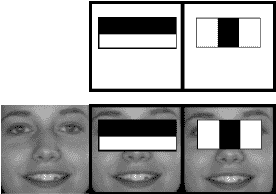
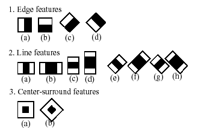
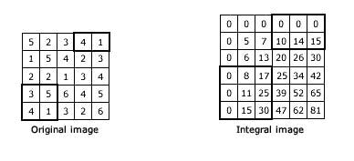
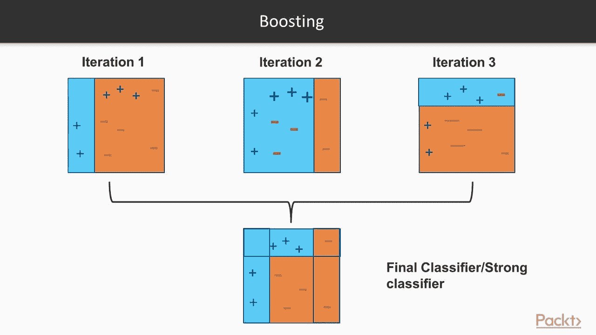
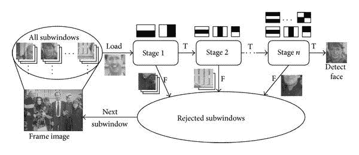
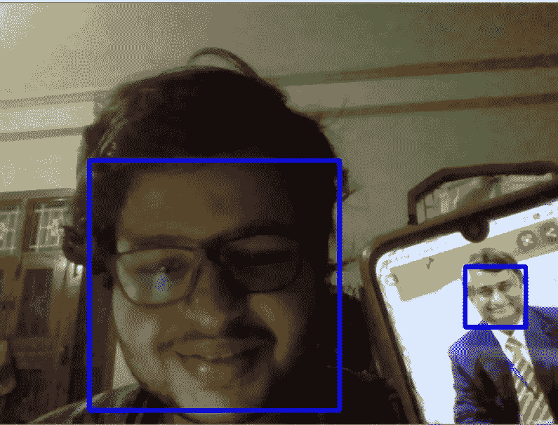

# 哈尔级联分类器

> 原文：<https://medium.datadriveninvestor.com/haar-cascade-classifiers-237c9193746b?source=collection_archive---------1----------------------->

在项目中学习和实现哈尔级联分类器…

# Viola Jones 算法

Working of Classifiers

Viola-Jones 对象检测框架是一种用于对象检测的机器学习方法，由 Paul Viola 和 Micheal Jones 在 2001 年提出。这个框架可以被训练来检测几乎任何对象，但这主要解决实时人脸检测的问题。这个算法有四个步骤。

## 1.哈尔特征选择

对象被分类在非常简单的特征上，作为编码特定领域知识的特征，并且操作比像素系统快得多。该功能类似于 haar 过滤器，因此得名“Haar”。这些特征的一个例子是 2-矩形特征，其被定义为矩形内部区域的像素总和的差，其可以是原始图像内的任何位置和比例。这里还使用了 3 矩形和 4 矩形特征。

Haar Features

## 2.整体图像表示

积分图像中任意一点的值是该点上方和左侧所有像素的总和。可以在图像的一次通过中有效地计算积分图像。

## 3.Adaboost 训练

对于 24×24 像素的窗口，可能有大约 162，336 个可能的特征，评估这些特征是非常昂贵的。因此，使用 AdaBoost 算法来训练仅具有最佳特征的分类器。

Image by Packt

## 4.级联分类器体系结构

级联分类器指的是以连续顺序排列的几个分类器的串联。它会做出大量的小决定，比如它是不是目标。级联分类器的结构是退化决策树。

Architecture

# 履行

# 应用

尽管深度学习(RCNN，YOLO 等)的到来，这种方法仍然在许多人脸和物体检测的应用中使用，因为这是非常简单而强大的。