# HackerRank 分析了来自 10 万多名开发人员和招聘经理的数据——以下是我的发现

> 原文：<https://medium.datadriveninvestor.com/hacker-rank-analyzed-data-from-100k-developers-and-hiring-managers-here-is-what-i-found-a374b98e937e?source=collection_archive---------1----------------------->

## 来自 100，000 多名开发人员和招聘经理的出色分析结果

Pic by [Franki Chamaki](https://unsplash.com/@franki) from Unsplash

我喜欢数据。句号。

像每天一样(在开始我的办公室工作之前的 30 分钟阅读仪式)，我正在浏览一些伟大的数据科学和机器学习文章，以使自己跟上最新的趋势/信息，我发现了由 [HackerRank](https://www.hackerrank.com/) 做的一项伟大的调查。

 [## 黑客地球调查了来自 76 个国家的 16000 名开发者——以下是我的发现

### 惊人的洞察力…

medium.com](https://medium.com/datadriveninvestor/hacker-earth-surveyed-16000-developers-from-76-countries-heres-what-i-found-dbd5d7c422b0) 

在这篇文章中，我将讲述 2020 年开发者社区的趋势。让我们开始吧！

 [## Stack Overflow 分析了来自 60，000 多名软件开发人员的数据，包括他们的工作时间、语言…

### 以下是他们的发现…

medium.com](https://medium.com/datadriveninvestor/stack-overflow-analyzed-data-from-60-000-software-developers-hours-they-work-languages-they-476ac6ca0197) 

# 其他一些最好的系列—

> [**30 天的机器学习 Ops**](https://medium.com/coders-mojo/day-1-of-30-days-of-machine-learning-ops-7c299e4b09be?sk=4ab48350a5c359fc157109e48b1d738f)
> 
> [**30 天自然语言处理系列**](https://medium.com/coders-mojo/quick-recap-30-days-of-natural-language-processing-nlp-with-projects-series-ceb674e3c09b?sk=ca09b27b3d5867f23ab4dc367b6c0c32)
> 
> [**30 天数据工程与项目系列**](https://medium.com/coders-mojo/day-1-of-30-days-of-data-engineering-894822fcb128?sk=76ba558bfe2d9f85cbe741e505295531)
> 
> [**数据科学与机器学习研究(论文)简体**](https://medium.com/coders-mojo/day-1-data-science-and-ml-research-papers-simplified-a68b00a3b1c4?sk=56136229ff738bd734f19d2b6953f78c) ******
> 
> [**60 天数据科学与 ML 系列带项目**](https://medium.com/coders-mojo/day-1-day-60-quick-recap-of-60-days-of-data-science-and-ml-6fc021643d1?sk=4e75e043b7630a9f963562ebac94e129)
> 
> [**100 天:你的数据科学与机器学习学位系列与项目**](https://medium.com/coders-mojo/100-days-your-data-science-and-ml-degree-part-3-c621ecfdf711?sk=1a8c7b0c204d73432d56b7d1a3a26474)
> 
> [**你应该知道的 23 个数据科学技巧**](https://ai.plainenglish.io/23-data-science-techniques-you-should-know-61bc2c9d1b3a?sk=1680c36193eb22198974c9008d62a33c)
> 
> [**科技面试系列—编码问题精选清单**](https://medium.com/coders-mojo/mega-post-tech-interview-the-only-list-of-questions-you-need-to-practice-ee349ea197bb?sk=fac3614684daff4b50a70c0a71e4d528)
> 
> [**完成系统设计与最热门问题系列**](https://medium.com/coders-mojo/system-design-made-easy-quick-recap-of-complete-system-design-34af7e3aedfb?sk=bdd6a19edc1f3ce4a5064923f5b68721)
> 
> [**完成数据可视化及预处理系列与项目**](https://medium.com/coders-mojo/complete-data-preprocessing-and-data-visualization-with-projects-mega-compilation-part-2-41584ef0920e?sk=842390da51689b8d43148c3980570db0)
> 
> [**完整的 Python 系列与项目**](https://medium.com/coders-mojo/complete-python-and-projects-mega-compilation-7ec8f7adfe71?sk=ee0ecf43f23c6dd44dd35d984b3e5df4)
> 
> [**完成高级 Python 系列与项目**](https://medium.com/coders-mojo/complete-advanced-python-with-projects-mega-compilation-part-6-729c1826032b?sk=7faffe20f8039fa57099f7a372b6d665)
> 
> [**Kaggle 最会教你的笔记本**](https://medium.com/coders-mojo/my-list-of-kaggle-best-notebooks-topic-wise-data-science-and-machine-learning-part-2-84772863e9ae?sk=5ed02e419854a6c11add3ddc1e52947f)
> 
> [**Git 开发者指南**](/the-complete-developers-guide-to-git-6a23125996e1?sk=e30479bbe713930ea93018e1a46d9185)
> 
> [**打赏 Github Repos**](https://medium.com/coders-mojo/6-exceptional-github-repos-for-all-developers-part-1-21e8fa04e150?sk=9140b249af6fe73d45717185fad48962) **—第一部分**
> 
> [**打赏 Github Repos**](https://medium.com/coders-mojo/6-exceptional-github-repos-for-all-developers-part-2-3eec9a68c31c?sk=8e31d0eb7eb1d2d0bbbcecaa66bd4e7e) **—第二部**
> 
> [**所有数据科学和机器学习资源**](/best-resources-for-data-science-and-machine-learning-full-list-5ceb9a2791bf?sk=cf85b2cef95560c58509877a794577ff)
> 
> [**210 机器学习项目**](/210-machine-learning-projects-with-source-code-that-you-can-build-today-721b035649e0?sk=da5f593572a0261a6314afad99a0356c)

## 科技时事通讯—

> 如果你感兴趣，你可以加入我的时事通讯，通过它我向超过 30，000 名读者发送技术面试技巧，技术，模式，黑客——软件开发，ML，数据科学，创业公司和技术项目。可以订阅 **Tech Brew :**

 [## 点火器

### 数据科学，人工智能，人工智能和更多…点击阅读由 Naina Chaturvedi 撰写的 Ignito，子堆栈出版物。推出 7 个月…

naina0405.substack.com](https://naina0405.substack.com/) 

## Github —

 [## 编码器-world 04-概述

### 此时您不能执行该操作。您已使用另一个标签页或窗口登录。您已在另一个选项卡中注销，或者…

github.com](https://github.com/Coder-World04) 

# 哪个角色受欢迎？

结果表明，与认为全栈开发人员更重要的小公司(初创公司)相比，大公司更有可能想要雇用专家。

 [## 在几秒钟内读取和处理大型数据集—第 1 部分

### 在几秒钟内处理十亿行..

naina0412.medium.com](https://naina0412.medium.com/read-and-process-large-datasets-in-seconds-part-1-1ce12ed95c71) 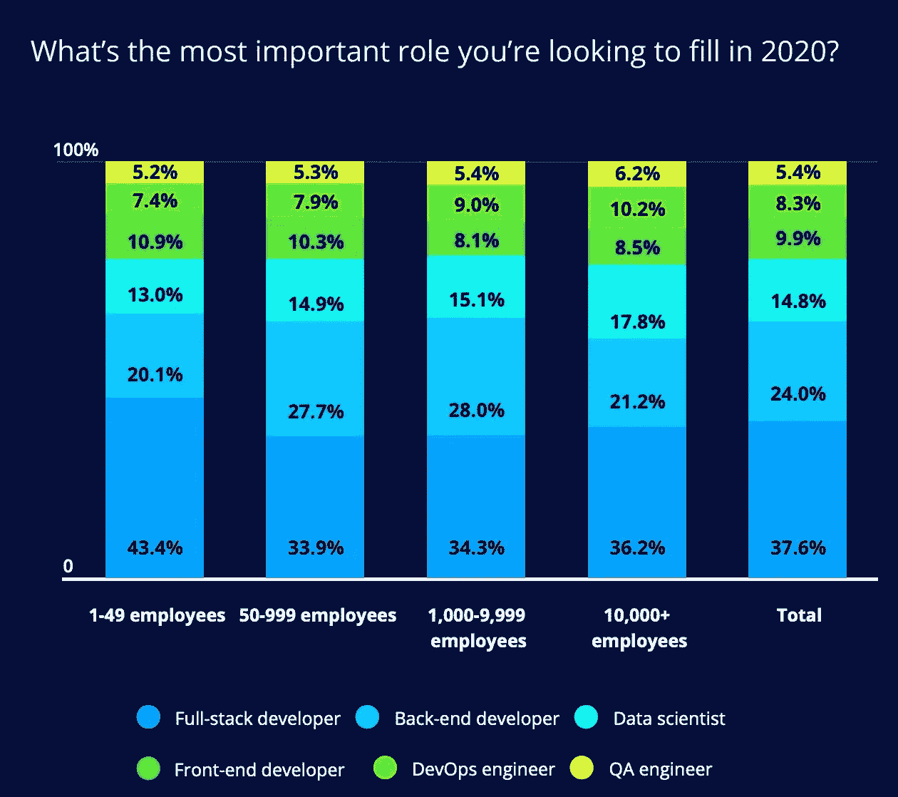

Pic credits : HackerRank

优先级如下所述:

*   全栈开发人员
*   后端开发人员
*   前端开发人员
*   DevOps 工程

 [## Python 中的统计简介—第 1 部分

### 统计很容易…真的吗？

medium.datadriveninvestor.com](/introduction-to-statistics-in-python-part-1-14e69ef05abe) 

*   数据科学家
*   质量保证工程师

 [## 10 个“硅谷”的俏皮话/双关语是如此有趣、贴切且与技术世界相关

### 虽然听起来很搞笑…

naina0412.medium.com](https://naina0412.medium.com/10-silicon-valley-liners-puns-that-are-so-funny-apt-relatable-to-the-tech-world-a2ee797f7949) 

# 雇主最看重的编程语言技能是什么？

在全球范围内，JavaScript 是最受欢迎的，其次是 Python 和 Java。另一方面，Java 是亚太地区最受欢迎的编程语言。在 AMER 地区可以看到的一个重要趋势是，经理们是语言不可知论者，也就是说，他们并不真正关心你懂什么语言/用什么语言编码。

 [## 编写高效的 Python 代码—第 1 部分

### Python 是科技界最流行、使用最广泛的编程语言之一。

naina0412.medium.com](https://naina0412.medium.com/writing-efficient-python-code-part-1-e02763632080) 

事实上，如果你精通一门编程语言，那么如果需要的话，你可以很容易地在工作中学习第二门编程语言。

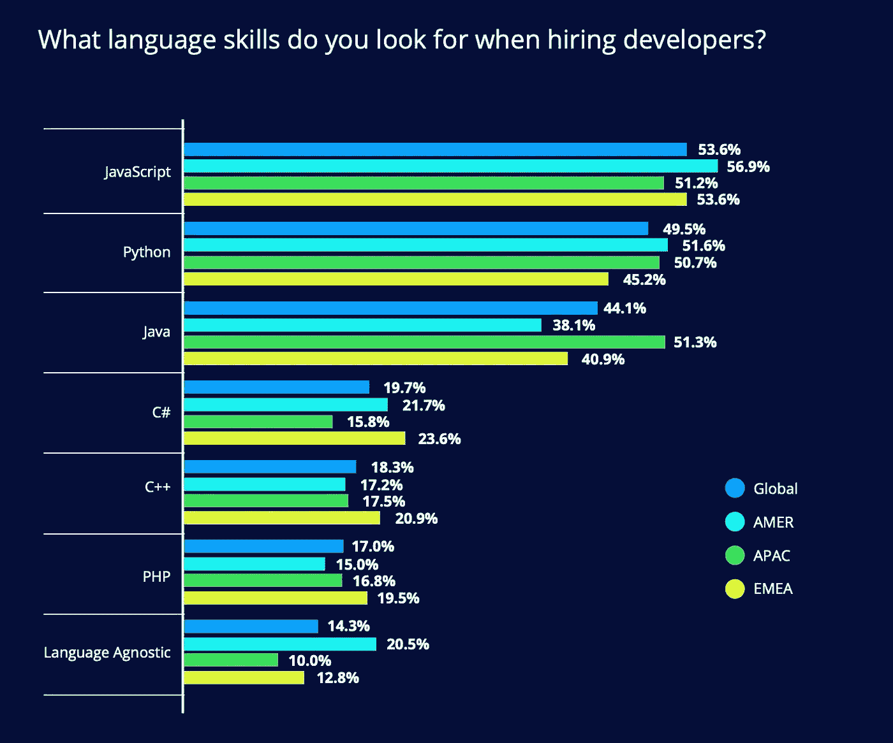

Pic credits : HackerRank

 [## SlashData 调查了 159 个国家的 17000 多名开发人员，分析结果如下…

### 惊人的洞察力…

naina0412.medium.com](https://naina0412.medium.com/slashdata-surveyed-more-than-17000-developers-in-159-countries-heres-what-the-analysis-says-d25484a42051) 

# 最受欢迎的技能开发者对学习感兴趣

这并不奇怪，因为 Go 是开发者接下来最想学习的编程语言。

 [## 编写高效的 Python 代码—第 2 部分

### 使用这些技巧和技术…

naina0412.medium.com](https://naina0412.medium.com/writing-efficient-python-code-part-2-4bf876712677) 

Go 是一种开源编程语言，可以轻松构建简单、可靠、高效的软件。更重要的是，它为编写高度并行编程提供了大量的特性。

 [## 编程恐怖和幽默第 3 部分

### 继续笑，因为太搞笑了…

naina0412.medium.com](https://naina0412.medium.com/programming-horror-and-humor-part-3-a0bdea3f56f4) 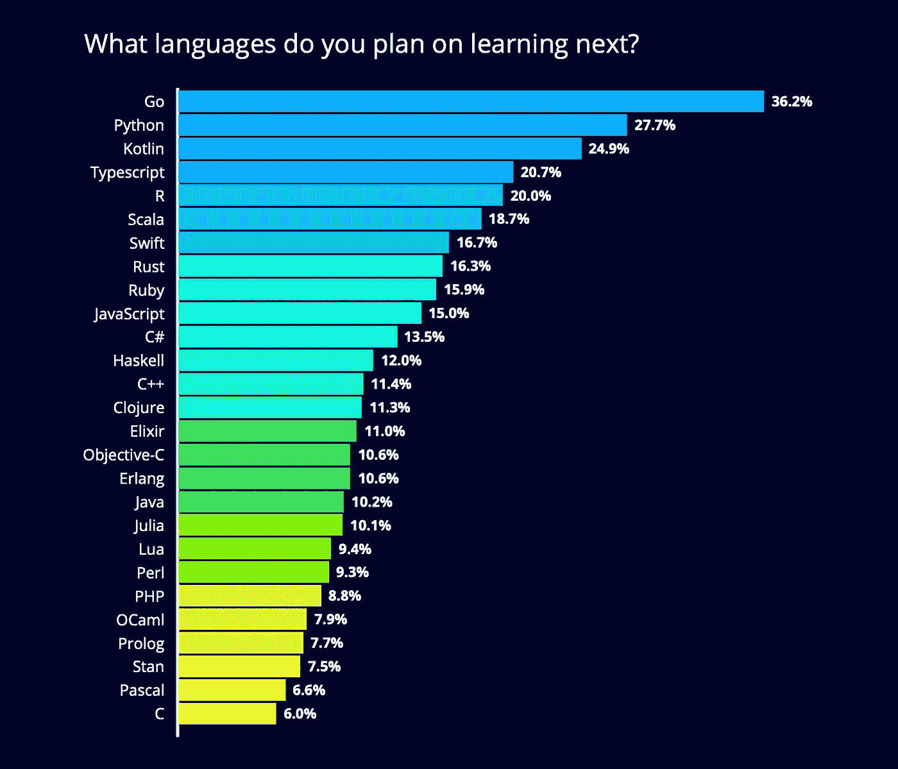

Pic credits : HackerRank

 [## 【假期提醒】:你可以完成的前 5 名免费数据科学、AI & ML 课程

### 令人惊叹的课程…

naina0412.medium.com](https://naina0412.medium.com/holidays-alert-top-5-free-data-science-ai-ml-courses-you-can-finish-8067ecff7c1d) 

# 从编码训练营招聘

大约 33%的招聘经理认为，编程训练营为你学习编程语言打下了良好的基础，让你成为一名优秀的招聘候选人。而 40%的招聘经理对新兵训练营的候选人漠不关心。

 [## 如果编程语言是《权力的游戏》中的角色会怎样

### 最后一个很搞笑…

naina0412.medium.com](https://naina0412.medium.com/what-if-programming-languages-were-game-of-thrones-characters-ffc2c3018841) 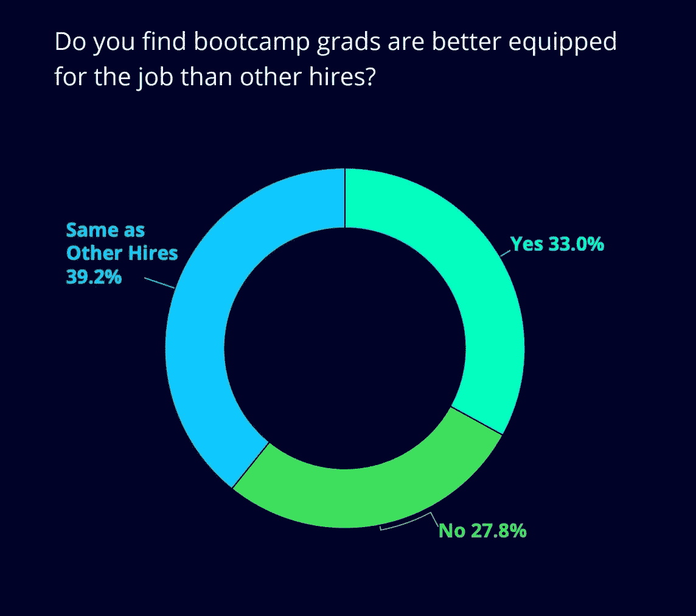

Pic credits : HackerRank

 [## 使用 Python、OpenCV 和 NumPy 分析视频

### 通过代码实现…

naina0412.medium.com](https://naina0412.medium.com/analyzing-video-using-python-opencv-and-numpy-5471cab200c4) 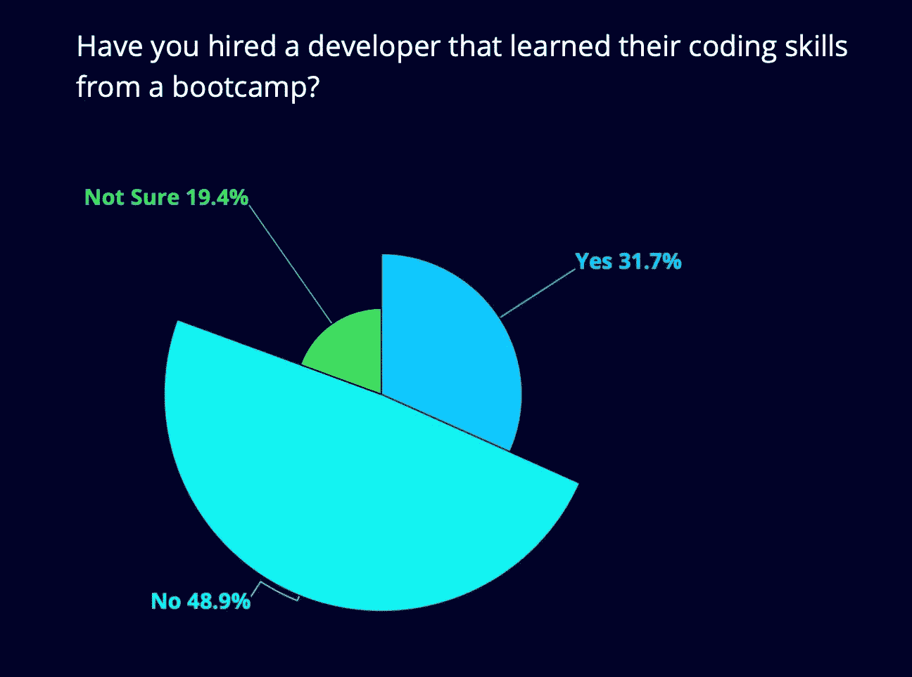

Pic credits : HackerRank

# 职业发展

作为一名软件工程师，我非常关心自己职业生涯的下一步。虽然我们喜欢促销，但同样重要的是扩展技术工具箱和专业知识。大多数开发人员希望晋升到技术职位，即技术领导，而不是管理职位。

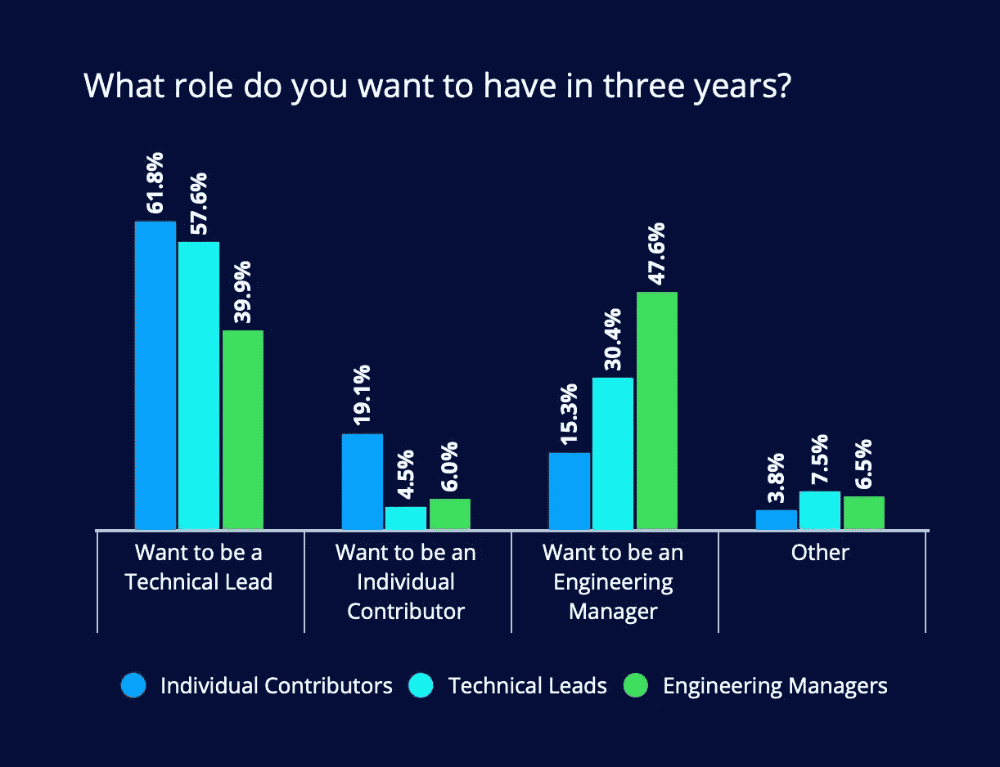

Pic credits : HackerRank

# 教育资格

和世界上一些最好的程序员一起工作过，他们从来没有去追求任何学位，都是自学的，

我必须说你不需要一个学位就能找到一份软件工程师的工作。然而，可以肯定的是，一个出色的学位和出色的 GPA 会成为你闪亮的盔甲，帮助你在简历中脱颖而出。

调查结果显示，在小公司工作的开发人员中，32%没有本科学历。在大公司，9%到 19%的开发人员没有任何学位。这让我觉得你的实际工作经验比你的学位和奖金更重要——你可以省下一大笔钱(作为大学学费)。

所以，如果你还没有开始做，就开始做吧！

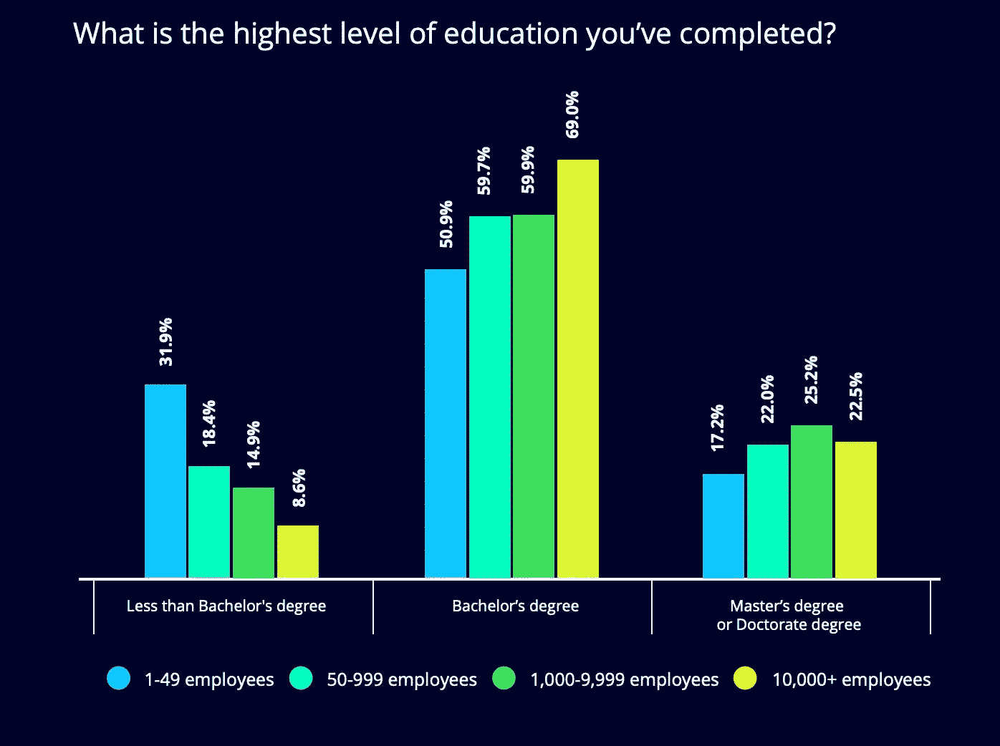

Pic credits : HackerRank

# 金钱至关重要

不出所料，旧金山以 14.8 万美元的平均年薪高居榜首，其次是西雅图、洛杉矶、波士顿和纽约。根据调查的 100，000+开发人员，平均年薪为 54，000 美元。

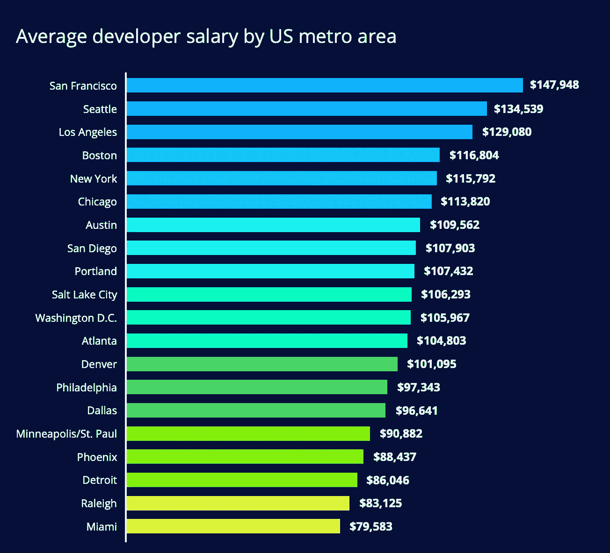

Pic credits : HackerRank

# 最著名的语言是什么？

JavaScript 再次占据首位，随后是 Java、C 和 Python。

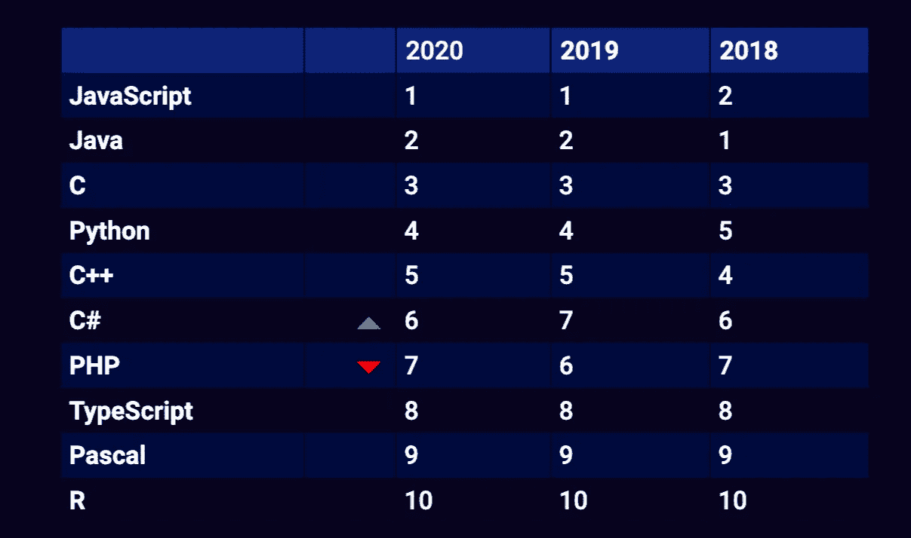

Pic credits : HackerRank

# 最著名的框架是什么？

AngularJS 保持其受欢迎程度，并连续三年位居榜首。自 2018 年以来，Vue.js 正在获得每年上升一位的势头。

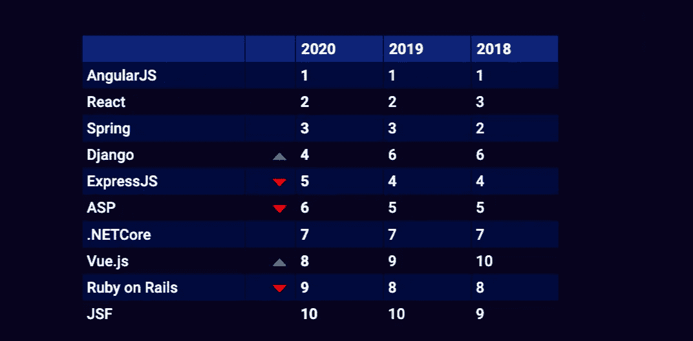

Pic credits : HackerRank

# 基于已知的语言，薪水会增加吗？

Perl 开发人员的年薪比开发人员的平均年薪高 54%,紧随其后的是 Scala 和 Go。它还取决于职位的资历级别，因为基于语言专业知识，高级开发人员比初级开发人员挣得多。

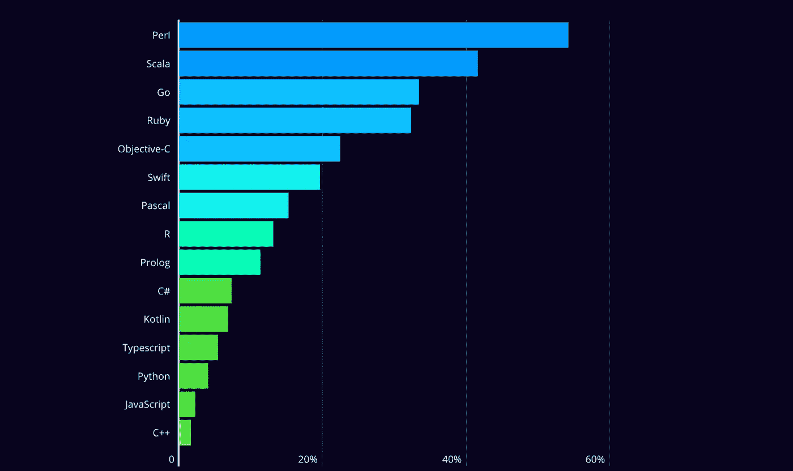

Pic credits : HackerRank

# 薪资增长是否基于已知的框架？

Backbone.js 占据榜首，因为它向你支付的薪酬最高，其次是可可(+35%)、RoR (+30%)和 Spark (+29.4%)。

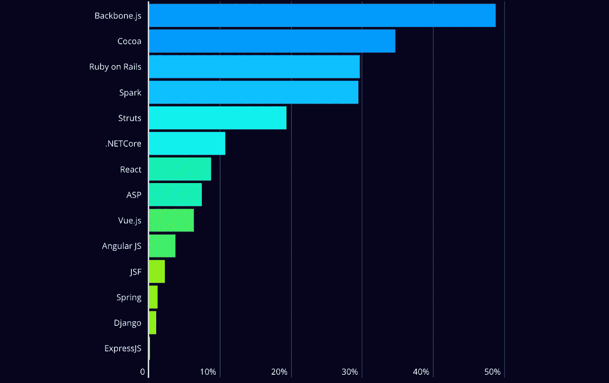

Pic credits : HackerRank

# 按国家分列的薪金

正如所料，美国支付给开发人员的薪酬最高(平均薪酬为 109，168 美元)，其次是澳大利亚(平均薪酬为 88，539 美元)和加拿大(平均薪酬为 72，772 美元)。

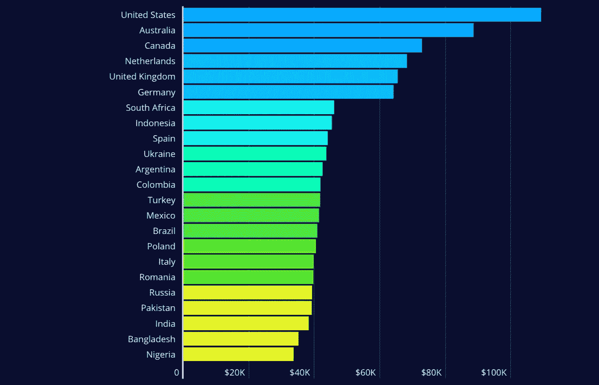

Pic credits : HackerRank

**参考和来源:**

 [## 黑客银行

### HackerRank 是面向招聘开发人员的市场领先的技术评估和远程面试解决方案。学习如何…

www.hackerrank.com](https://www.hackerrank.com/) 

感谢阅读。继续学习:)

# 想看程序员幽默？

 [## 编程幽默第 2 部分

### 继续笑，因为太搞笑了…

medium.com](https://medium.com/datadriveninvestor/programming-humor-part-2-f92cf5a26f2b)  [## 史上最搞笑的代码注释

### 程序员幽默:是的，实际上是程序员写的！

medium.com](https://medium.com/datadriveninvestor/the-most-hilarious-code-comments-ever-bae3cb1030b5)  [## 编码原罪:令人捧腹的开发者自白

### “白板”是如何被嘲笑的

medium.com](https://medium.com/datadriveninvestor/coding-sins-hilarious-developer-confessions-f55eb342454e)  [## 10 个让你着迷的诙谐编程笑话

### 这些太搞笑了…

medium.com](https://medium.com/datadriveninvestor/10-witty-programming-jokes-that-will-make-you-go-rofl-a53fbfb91943) 

# 推荐文章-

 [## Python 迭代器、生成器和装饰器变得简单

### 快速实施指南

medium.com](https://medium.com/python-in-plain-english/python-iterators-generators-and-decorators-made-easy-659cae26054f)  [## 你应该知道的 23 种数据科学技术！

### 使用这些技巧来节省你的宝贵时间

medium.com](https://medium.com/ai-in-plain-english/23-data-science-techniques-you-should-know-61bc2c9d1b3a)  [## 编码原罪:令人捧腹的开发者自白

### “白板”是如何被嘲笑的

medium.com](https://medium.com/datadriveninvestor/coding-sins-hilarious-developer-confessions-f55eb342454e)  [## 面向数据科学家的 5 项酷炫先进熊猫技术

### 使用这些技巧…

medium.com](https://medium.com/datadriveninvestor/5-cool-advanced-pandas-techniques-for-data-scientists-c5a59ae0625d)  [## Stack Overflow 分析了来自 60，000 多名软件开发人员的数据，包括他们的工作时间、语言…

### 以下是他们的发现…

medium.com](https://medium.com/datadriveninvestor/stack-overflow-analyzed-data-from-60-000-software-developers-hours-they-work-languages-they-476ac6ca0197)  [## 高级 Python 变得简单—第 4 部分

### 使用这些技巧和技术…

medium.com](https://medium.com/datadriveninvestor/advanced-python-made-easy-part-4-a4996ba9fe19)  [## 高级 Python 变得简单—第 1 部分

### 使用这些技巧和技术…

medium.com](https://medium.com/datadriveninvestor/advanced-python-made-easy-part-1-ce1e2f17431e) 

## 访问专家视图— [订阅 DDI 英特尔](https://datadriveninvestor.com/ddi-intel)