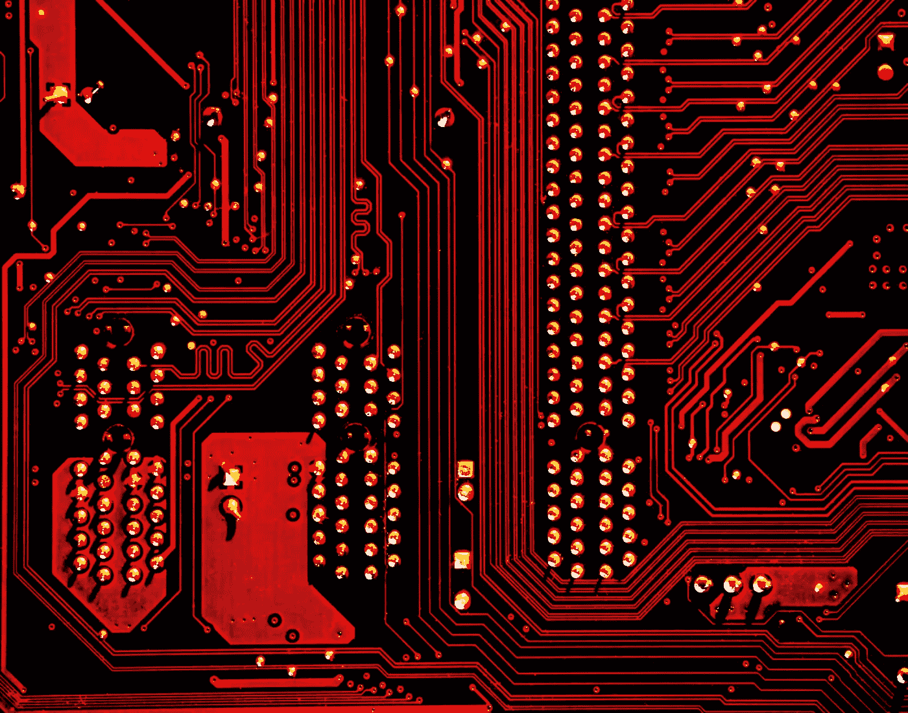

# 用人工智能和 GPT-3 黑客人类

> 原文：<https://medium.datadriveninvestor.com/hacking-humans-with-ai-and-gpt-3-9540062cc042?source=collection_archive---------1----------------------->

## 对语言和感知、人工智能和未来的探究。

Photo by [Joel Naren](https://unsplash.com/@joeljnaren?utm_source=unsplash&utm_medium=referral&utm_content=creditCopyText) on [Unsplash](https://unsplash.com/s/photos/language?utm_source=unsplash&utm_medium=referral&utm_content=creditCopyText)

语言是一种错综复杂的东西。它是丰富多彩的，多样的，强大的，以至于它支配着我们的思维，有时支配着我们的行动。如果你还没有听说，有一种新技术叫做 GPT-3，这是一种 OpenAI 开发的工具，它实际上可以访问网络上的所有知识，并且可以以一种简化的方式向你提供这些知识，只需点击一个按钮。那么，我们如何更好地理解人工智能算法是如何工作的，它如何改变我们的生活，最重要的是，它教会了我们关于语言的什么，以及我们人类是如何思考和操作的。

 [## 人工智能在你眼皮底下出奇的聪明|数据驱动的投资者

### 如果你在社交媒体上，但人工智能听起来令人生畏，不要害怕。你对人工智能的了解可能比…

www.datadriveninvestor.com](https://www.datadriveninvestor.com/2020/08/14/ai-is-surprisingly-smart-right-under-your-nose/) 

## 人工智能和 GPT-3

我会跟你直说。我对 GPT-3 的看法不是技术性的，所以这篇关于人工智能如何工作的概述首先是从非 IT 的角度出发的。人工智能是我们人类很长一段时间以来努力达到的目标，正如它经常发生的那样，进步是在各种各样的大小步骤中不断实现的。今天，人工智能公司如 [Zoox](https://zoox.com/) 和 [Ascent](https://ascent.ai/en/) 制造比我们看得更远、想得更快的汽车自动驾驶仪，如 [Tempus](https://www.tempus.com/) 的公司旨在根据世界上最大的临床数据以个性化的医疗保健来颠覆医疗保健，如 [Vicarious](https://www.vicarious.com/) 的公司开发像我们一样学习和思考的软件，而其他公司如 [OpenAi](https://openai.com/) 开发基于文字的人工智能工具，这些工具可以在几秒钟内处理如此多的信息，以至于一个普通人需要 1000 次生命

> 但后者真的是这样操作的吗？

是也不是。计算机不是人类，因此计算机的思维方式与我们的大脑有很大不同。也许，启动一个过度智能的人工智能的主要困难在于，我们作为人类只能基于我们如何思考和编辑思想来开发它，而这反过来又是有限的。现在请记住这个想法，因为我们将在启示时刻回到这个问题上来！

由于计算机有自己的语言(阅读意味着相互理解)，强调它们消费信息的方式与我们人类完全不同是正确的。我们的大脑利用神经网络，而计算机(被我们)预先编码来处理二进制数据。这反过来意味着，当 OpenAI 的 GPT-3 回答你的问题时，它不会遵循人类会遵循的逻辑或思路。

Photo by [Michael Dziedzic](https://unsplash.com/@lazycreekimages?utm_source=unsplash&utm_medium=referral&utm_content=creditCopyText) on [Unsplash](https://unsplash.com/s/photos/ai?utm_source=unsplash&utm_medium=referral&utm_content=creditCopyText)

相反，一个软件或人工智能单元可以学习并遵循一套规则，这套规则将决定它如何将我们可以理解的单词组合在一起。同样，它不会像我们一样思考或造词，而是首先通过交叉检查输入数据(在 GPT-3 的情况下，它是一个问题/命令)来比较如何将它们放在一起，然后用反映其内部知识库发现的答案来回应。OpenAi 的 GPT-3 的后者是迄今为止我们放在网上的每一条数据，包括维基百科帖子、新闻文章、博客、评论，你能想到的……如果你问一个特定的问题，人工智能将首先识别答案是什么，然后将其打包成一个漂亮的句子，由它知道可以搭配的单词组成。

> 作为一个要点，与其说它是最聪明的有意识的人造人，不如说它是一个知道如何很好地将单词组合在一起的代码，并且可以访问一个巨大的数据库，这个数据库是我们人类自互联网起源以来收集的。

现在，这真的取决于你选择的视角，但公平地说，将单词组合在一起并清楚理解我们所说的话和意思的能力，对于人和人工智能之间的交互来说，本身就是一种进步或破坏。最重要的是，它也是我们人类的关键，它实际上创造了一种新的方式，让我们说一个对我们来说陌生的系统，可以理解我们运行的语言，就像 it 开发人员一样，例如，知道如何用各种编程语言创建和运行软件。

## 语言是我们思考的关键

大纲很简单，通过创造和编程计算机，我们现在可以看到我们自己的语言的价值，使它变得有形，并确定这样一个事实，即我们使用的语言也是一种媒介，可以在我们使用语言应用的规则之外被理解，并可以作为解除我们和我们思维方式的关键。现在，不要忘乎所以地认为我们都在劫难逃，认为“危险的”人工智能即将接管世界，不！这仅仅是对语言和我们对语言的感知的一种不同的观点或看法，因为最终我们创造了计算机，留在我们的精神边界内，这现在也成为我们如何操作的一面镜子。

> 原谅一个轻微的跑题，但总而言之，这决定了我们思考的深度，鉴于这种深度是有限的，黑客攻击人类成为一件切实的事情。

虽然乍一看，似乎所有的语言都是交流的工具，但实际上，语言对我们的影响要大得多。例如，一个人用西班牙语思考和形成想法的方式不同于一个说英语的人如何进行同样的练习。结果是，如果你会说多种语言，你的思维会变得更加灵活，在解决任务和一般思维时更加流畅，给你额外的优势。

## 人工智能的未来

OpenAi 成功地教会了 GPT-3 人类交流背后的钥匙，并给了它使用这些钥匙作为工具的灵活性。这是一个我们现在也可以使用的工具，它让我们对未来有所了解。

可以肯定地说，但是所有涉及文字的东西现在都有了实质性的进步。想想文本写作、论文、书籍、博客、公告，所有这些都可以通过 GPT-3 完成。我们已经在[新闻](https://www.businessinsider.com/fake-ai-generated-gpt3-blog-hacker-news-2020-8)中看到了这样的例子，这突显了人工智能创建的帖子如何成为在线出版物中阅读量最大的文章。在某种程度上，这意味着引人入胜的小说、非小说类书籍和信息丰富的教科书可以在几秒钟内大量创作出来，如果 GPT-3 获得正确的知识(意味着它获得正确和真实的信息)，这不一定是一件坏事。

> 这个世界是否会被人工智能文字淹没，现在说还为时过早，但在那种情况下，人类写的书可能只会成为一种新奇。

编程和创建软件也将发生变化，因为今天你只需在 GPT-3 中键入“让我做一个做这个做那个的软件”，它就会为你做，比一个 it 班的优等生做得更好。因此，唯一合乎逻辑的假设是，编程将经历重心向深度人工智能开发的转移，从创造当今就业机会的各种编程。

另一个很好的例子是，它可以帮助律师阅读大量的书面文本，为他们重新打包成一张 A4 纸，进行推理并强调遗漏的内容，因为它可以访问与此事相关的法律。医生和其他任何涉及大量书面知识和决策的职业也是如此。

总而言之，我们可以自信地说，人工智能是一个增长的未来。如上所述，它首先让我们更好地了解我们人类是如何运作的，这对我们中的一些人来说可能会导致渐进的变化和自我发展，也许会释放我们更多的能力。

> 你的视野越灵活，思维越好。

根据行业的不同，我们仍然处于人工智能发展的早期，无法取代人类，但这种变化迫在眉睫，我们必须做好准备。然而，我们不应该把它看作是一种危险或威胁，而应该把它看作是改善我们生活的一种工具，一种改善我们思维和解决问题的工具。最后但并非最不重要的一点是，现在非常明显的一点是，它可能是我们有史以来创造的最好的工具，而解码人类并不像最初看起来那么困难。

**访问专家视图—** [**订阅 DDI 英特尔**](https://datadriveninvestor.com/ddi-intel)