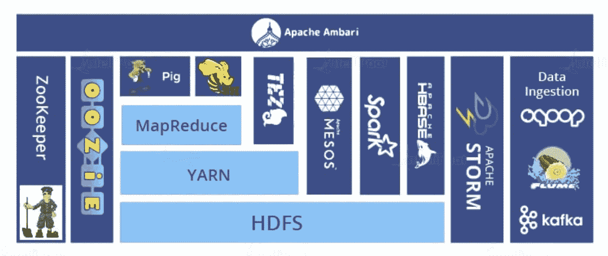

# Hadoop 生态系统

> 原文：<https://medium.datadriveninvestor.com/hadoop-ecosystem-cebb03315b69?source=collection_archive---------6----------------------->

在说 Hadoop 之前，我觉得应该先说一下大数据。大数据是一个术语，用于描述无法用传统方法高效存储或处理的超大型数据集。

Hadoop 是一个开源框架，用于高效解决大数据问题。Hadoop 允许使用简单的编程模型跨计算机集群分布式处理大型数据集。

Hadoop 生态系统是提供各种服务解决大数据问题的平台或套件。它包括 Apache 项目和各种商业工具和解决方案。

在这篇博客中，我将介绍 Hadoop 生态系统的所有组件。

## HDFS(Hadoop 分布式文件系统)

HDFS 是 Hadoop 生态系统的主要组成部分。HDFS 允许您在计算机集群上存储大型数据集。大数据问题中的数据集太大，无法存储在单台计算机上，HDFS 将把数据集存储在多台计算机上，而不是一台。HDFS 还保留了数据的冗余副本。因此，如果其中一台计算机出错，HDFS 可以恢复数据。HDFS 维护集群和硬件之间的所有协调。

## YARN(又一个资源谈判者)

顾名思义，YARN 就是帮助管理集群资源的人。它为 Hadoop 系统执行调度和资源分配。它决定谁来运行任务，什么时候和什么节点可用于额外的工作，以及哪些节点不可用于这样做。纱线由三个主要部分组成。

*   ***资源管理器*** 为系统中的应用分配资源
*   ***节点管理器*** 处理每台机器的 CPU、内存、带宽等资源的分配，稍后，确认资源管理器。
*   ***应用管理器*** 作为资源管理器和节点管理器之间的接口，根据两者的要求进行协商。

## MapReduce

MapReduce 是一种编程模型，允许您跨整个集群处理数据。它基本上由 Mappers 和 Reducers 组成，它们是你可能编写的不同脚本，或者是你在编写 MapReduce 程序时可能使用的不同函数。MapReduce 使用了两个函数。

*   ***【Map()***对数据进行排序和过滤，从而将它们组织成组。Map 生成一个基于键值对的结果，该结果稍后由 Reduce()方法处理。
*   ***Reduce()*** 将 Map()生成的输出作为输入，并将那些元组组合成一个更小的元组集。

## 阿帕奇猪

Apache Pig 是一种位于 MapReduce 之上的高级脚本语言。如果您不想编写 Java 或 Python MapReduce 代码，并且更熟悉具有 SQL 风格语法的脚本语言，那么 Pig 是您的选择。它是一个非常高级的编程 API，允许您编写简单的脚本。您可以获得复杂的答案，而无需在过程中实际编写 Java 或 Python 代码。

## 阿帕奇蜂房

Hive 解决了类似 pig 的问题，但它更像 SQL。Hive 是一种获取 SQL 查询并使文件系统中的分布式数据看起来像 SQL 数据库的方法。借助 SQL 方法论和接口，HIVE 执行大型数据集的读写。它是高度可扩展的，因为它允许实时处理和批处理。

## 梅索斯

Mesos 是纱线的替代品。梅索斯也和纱一样是资源谈判者。Mesos 和 YARN 的主要区别在于它们的调度器。在 Mesos 中，当一个作业进来时，一个作业请求被发送到 Mesos 主机，Mesos 所做的是确定可用的资源，并作出回应。这些提议可以被接受或拒绝。

## 阿帕奇火花

Spark 主要是一个实时数据处理引擎，开发它是为了提供比 MapReduce 更快、更易用的分析。Spark 速度极快，正在积极开发中。这是一项非常强大的技术，因为它使用内存中的数据处理。

## Tez

Tez 使用了一些与 Spark 相同的技术。它告诉您 MapReduce 做了什么，因为它为执行查询生成了一个更优的计划。当与 Hive 结合使用时，Tez 有助于提高 Hive 的性能。

## Apache HBase

Hbase 是一个 NoSQL 数据库，它支持所有类型的数据，因此能够处理 Hadoop 数据库的任何事情。它可以公开存储在集群中的数据，这些数据可能会被 Spark 或 MapReduce 以某种方式转换。它提供了一种非常快速的方式向其他系统公开这些结果。

## 阿帕奇风暴

Apache Storm 是一种处理流数据的方式。因此，如果你有来自传感器或博客的流数据，你可以使用 Storm 实时处理它。处理数据不再是批处理的事情；当数据进来时，你可以实时更新你的机器学习模型或将数据转换到数据库中。

## 驭象者

Oozie 是在集群上调度作业的一种方式。因此，如果您有一项任务需要在您的 Hadoop 集群上执行，涉及不同的步骤，可能涉及不同的系统，Oozie 是将所有这些事情一起调度到可以按某种顺序运行的作业中的方法。

## 动物园管理员

ZooKeeper 基本上是一种协调集群中所有事物的技术。它用于跟踪正常运行的节点和停机的节点。这是一种非常可靠的方式来跟踪集群中不同应用程序可以使用的共享状态。

## 数据摄取

数据接收是将数据从各种来源传输到存储介质，组织可以在其中访问、使用和分析数据。Hadoop 中的数据接收系统如下:

*   **Sqoop** : Sqoop 是一个用于在关系数据库服务器和 Hadoop 之间传输数据的工具。Sqoop 用于从各种关系数据库导入数据，如 Oracle 到 Hadoop HDFS、MySQL 等。并从 HDFS 导出到关系数据库。
*   **Flume** : Flume 是一个用于聚集、收集和移动大量日志数据的服务。Flume 有一个基于数据流的灵活简单的架构。它的体系结构是健壮的和容错的，具有可靠的和恢复的机制。
*   **Kafka** : Kafka 也是一款开源的流数据处理软件，解决了与 Flume 类似的问题。它用于构建实时数据管道和流应用程序，从而降低复杂性。它具有水平可伸缩性和容错性。Kafka 旨在提供一个统一的低延迟平台来处理实时数据馈送。

## 阿帕奇·安巴里

Apache Ambari 位于一切之上，并为您提供集群的视图。它是一个开源管理工具，负责跟踪应用程序并保持其状态。它可以让您直观地看到集群上运行了什么，使用了什么系统，以及使用了多少资源。它可以被认为是一种管理工具。