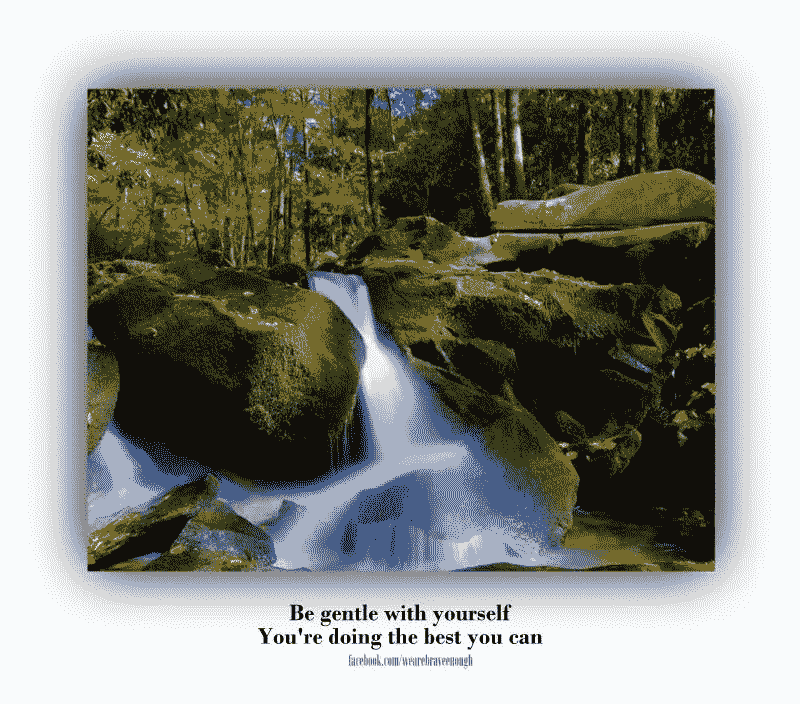

# 小心轻放

> 原文：<https://medium.datadriveninvestor.com/handle-with-care-c3808d845e11?source=collection_archive---------34----------------------->

有时生活就像一首乡村和西部歌曲
你醒来，想知道今天会出什么问题
很难想象有人能理解
我们都经历过艰难的时刻
当感觉一切都分崩离析的时候
当很难看到任何事情好的一面的时候
当感觉无法前进的时候
当生活似乎永远没有意义的时候
当很难相信你会再次快乐起来

生活是一次旅行
你现在所在的地方并不是你的最终目的地
每一次旅行都有起起落落
坎坷不平的道路和一帆风顺的道路
虽然这可能是陈词滥调，但也是事实
没有人会到达我们认为我们会到达的地方

你开始计划朝一个方向前进
有一个岔路口
接下来，你走了一个弯路
哦哦不……
死胡同
我怎么没发现呢

我们可以从挑战中学习，继续前进
变得比我们想象的更快乐
但前提是我们继续前进
“勇往直前，永不回头。”
从逆境走向明星

**访问专家视图—** [**订阅 DDI 英特尔**](https://datadriveninvestor.com/ddi-intel)