# 用基本分类器模型处理不平衡数据

> 原文：<https://medium.datadriveninvestor.com/handling-imbalanced-data-with-basic-classifier-models-5ce3d61874f1?source=collection_archive---------1----------------------->

## 阐述您的问题如何帮助您克服不平衡数据带来的挑战。


Photo by [Fidel Fernando](https://unsplash.com/@fifernando?utm_source=unsplash&utm_medium=referral&utm_content=creditCopyText) on [Unsplash](https://unsplash.com/s/photos/scale?utm_source=unsplash&utm_medium=referral&utm_content=creditCopyText)

术语*“不平衡数据”*通常适用于目标变量的不同值在数据中没有被同等表示的情况。从技术上讲，大多数数据在某种程度上是不平衡的，这没什么，但目标变量组中的显著差异会使分类器模型不可靠。一个经典的例子是信用卡欺诈，其中大多数观察是合法的交易，但它是我们想要准确预测的一小部分欺诈。

在这篇博文中，我们将模拟一些不平衡的数据，手动检查最佳分类，然后使用逻辑回归和决策树模型分析我们可以在多大程度上接近最佳阈值。为了实现这一目标，我们将看看一些流行的选择，如过采样方法和超参数优化。

[](https://www.datadriveninvestor.com/2019/02/07/8-skills-you-need-to-become-a-data-scientist/) [## 成为数据科学家所需的 8 项技能|数据驱动型投资者

### 数字吓不倒你？没有什么比一张漂亮的 excel 表更令人满意的了？你会说几种语言…

www.datadriveninvestor.com](https://www.datadriveninvestor.com/2019/02/07/8-skills-you-need-to-become-a-data-scientist/) 

这个项目的底层 Python 代码可以在我的 [GitHub](https://github.com/MatePocs/imbalanced_classifier) 上找到，如果你对编码细节感兴趣，请查看。

有几个概念我们会用到，但不会详细解释:逻辑回归、决策树、GridSearchCV、K-Fold 验证。如果你已经熟悉了这些概念，这肯定会有所帮助。这篇文章的重点是不平衡数据带来的挑战，以及我们如何应对它们。

## 到底是什么问题？

在我们进一步探索之前，我认为澄清我们对不平衡数据的悲伤是很重要的。我相当经常看到对不平衡数据问题的介绍是这样开始的:*“如果你的目标变量只有 1%是'是'，而其余 99%的值都是'否'，那么如果你使用一个模型，天真地把一切都归类为'否'，那它就有 99%的准确率。”*这当然是真的，但这本身不是问题。我认为在这一点上，我们有点混淆了两个不同的问题:

*   准确度本身不是分类器整体性能的准确(没有双关语的意思)度量；
*   基于某种度量，问题的基线模型可能已经非常有效了。

为了恰当地提出我们的问题，我将考虑两个不同的潜在问题:

*   我们确实只对准确性感兴趣，但是不相等的大小使得我们的分类器难以优化；
*   我们希望对具有较低代表性的组赋予较高的相对重要性，例如，即使只有 1%的数据属于“是”类别，我们仍然希望准确预测其中的 50%，代价是整体准确性。

这两种不同的预期结果需要不同的策略来有效解决，在开始使用任何方法之前，确定我们想要解决哪一个是很重要的。

## 几个重要术语

下面的描述是针对一个二元分类器问题(意味着你的目标变量有两个值)，这是我们将要分析的问题类型。

*   *混淆矩阵*:一个 2x2 矩阵，包含模型做出的真阳性、真阴性、假阳性和假阴性预测的数量。4 个元素的总和就是观察值的总数。排列不标准，在 scikit-learn 中，左上为真阴性，右下为真阳性，左下为假阴性，右上为假阳性。我们将使用 scikit-learn 方法。
*   *真正(TP) /真负(TN)* :实际值为正/负，模型正确预测为正/负的观测值。
*   *假阳性(FP) /假阴性(FN)* :实际值为负/正，但模型错误预测为正/负的观察值。
*   *准确性得分*:我们以前使用过这个术语，这是因为分类器模型度量定义正是您所期望的:正确预测值的比率。公式:
    (*TP*+*TN*)/(*TP*+*TN*+*FP*+*FN*)
*   *平衡准确度得分*:阴性和阳性观察值的正确预测比率的平均值。这个度量标准不利于在正确预测两个可能的目标值中的一个上投入太多的相对努力。公式:
    [*TP*/(*TP*+*FN*)+*TN*/(*TN*+*FP*)]/2

你可以从混淆矩阵的元素中推断出许多其他的分类器分数，更多信息请参见维基百科[页面。](https://en.wikipedia.org/wiki/Evaluation_of_binary_classifiers)

当解决上述两个不同的问题时，我们将最大化第一个问题的`accuracy_score`,第二个问题的`balanced_accuracy_score`。

## 数据

我们将使用两个模拟数据集。两者都由 1000 个“否”和 100 个“是”目标变量组成，称为`y`，以及一个连续的特征，我们将简称为`X`。

在`Data_1`中，`X_no`值(属于`no`观察值的 1000 个`X`值)是从 N(5，1)分布(期望值为 5，方差为 1 的正态分布)中随机生成的，而`X_yes`值来自 N(7，1)分布。

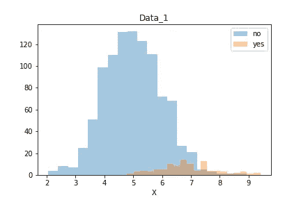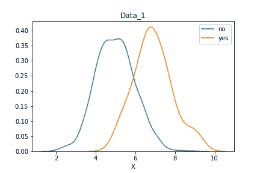

如图表所示，在`Data_1`中，`yes`观测值位于右侧，大多与`no`观测值重叠。通过查看图表，我们可以说，在 7.5 以上的一切都应归类为`yes`，而在`no`以下的一切到`accuracy_score`时都可能接近最佳值。

在`Data_2`中，我们从相同的`X_no`值开始，但是通过选择 N(5，1/2)作为`X_yes`的分布，将`yes`观察值推到更大组的中间。然后，我们通过计算`X`值与 5 的绝对差值来转换对称数据，因此我们最终得到如下分布:

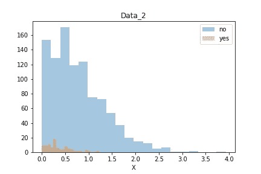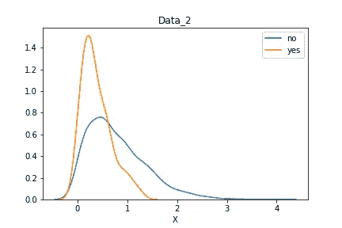

对于`Data_2`，挑战将是正确预测任何`yes`值，因为目标变量为`no`的概率在我们仅有的特征`X`的任何给定范围内都较高。

## 关于测试的一句话

请注意，我们不会使用验证数据，我们的目标是观察我们如何根据训练数据拟合分类器。在真实的场景中，您最终将在验证集上度量模型的性能。对于这个模拟思维实验，我认为没有必要，我们更感兴趣的是模型如何工作，以及如何处理不平衡的数据集。我们将在以后的模型选择中使用交叉验证，但不会进行独立测试。

## 手动计算

在本节中，我们将手动计算最佳的`X`来分割数据，具体取决于我们是否希望最大化精度和平衡精度。我们称这些模型为最优模型，我们的理解是，如果我们想根据一个`X`值将数据分成两组，它们就是最优模型。有人可能会说，鉴于数据结构的简单性，一个更复杂的分类器可能会过度拟合。

所以我们只看具有一个规则的分类器，观察值将被分类，不管它们是在所选`X`的左边还是右边。这样做很简单，我们需要遍历 1100 个可能的`X`值，计算每次拆分的 TP、TN、FP、FN 值的数量，然后我们可以计算`accuracy_score`和`balanced_accuracy_score`。一旦我们有了列表，我们只需选择使分数最大化的阈值。

对于`Data_1`，这是两个分数作为`X`的函数的样子，最大值用虚线突出显示:

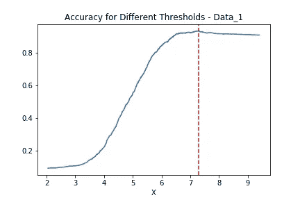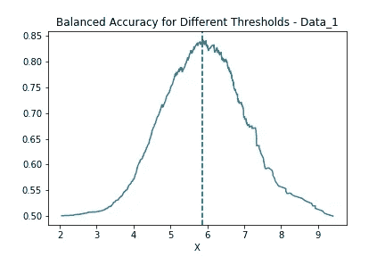

通过选择 7.30 作为我们的阈值可以获得最大的准确性，因此最佳分类器将这样工作:如果 X ≤ 7.30，预测`no`，否则，预测`yes`。这导致 0.935 `accuracy_score`。另一方面，如果我们想要最大化平衡精度，我们应该选择 5.87 作为阈值，这将导致 0.843 `balanced_accuracy_score`。

我们还可以在直方图和分布上绘制最佳精度和平衡精度阈值:

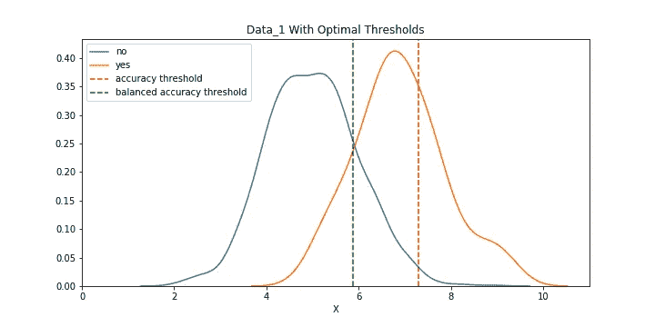

接下来，我们对`Data_2`重复同样的分析。作为阈值函数的`accuracy_score`和`balanced_accuracy_score`:

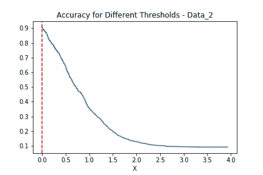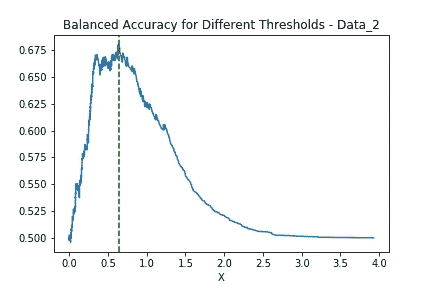

我们可以通过选择 0 作为阈值来获得最高的精度。这实质上意味着一切都被归类为否，这是我们能得到的最好的`accuracy_score`，0.908。在这个分类器的混淆矩阵中，我们将有 1000 个 TP 值(所有的`yes`观察值)和 100 个 FP 值(所有的`no`观察值)。我们通过选择 0.64 作为阈值来优化平衡精度，从而得到 0.681 `balanced_accuracy_score`。请注意，阈值选择的工作方式不同，对于 Data_2，我们将预测某个阈值下的观测值是`yes`。这是因为对于较低的`X`值，`yes`总体的相对概率较高。

我们还可以在直方图和分布上绘制最佳精度和平衡精度阈值:

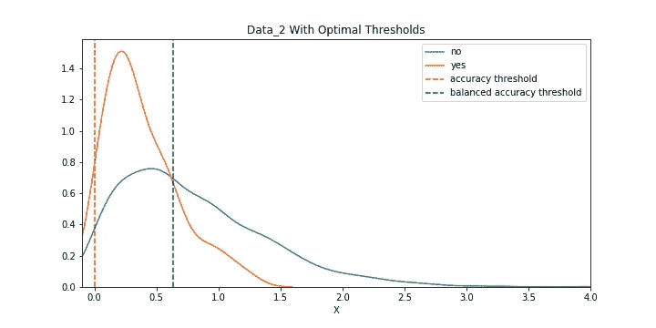

正如我们所见，在`Data_2`中，不可能将`accuracy_score`提高到琐碎分类之外，琐碎分类预测一切都在`no`类别中，而不管`X`特性的值。

现在我们有了最佳选择，在下面的部分中，我们将看看是否可以使用逻辑回归或决策树分类器来接近它们。

## 逻辑回归

我们终于开始构建一个实际的分类器模型了！

拟合 scikit-learn 的基本`LogisticRegression`模型非常简单:

```
from sklearn.linear_model import LogisticRegressionlogreg = LogisticRegression()
logreg.fit(X, y)
```

其中`X`是你的特征(在我们的例子中是一维连续变量)，`y`是你的目标变量。这之后你就有了一个`logreg`对象，有一堆机会。您可以使用`coef_`和`intercept_`属性来获取模型的参数。您可以使用`predict`方法创建一个预测变量数组，如下所示:

```
y_prediction = logreg.predict(X)
```

现在，这些都是非常基本的，如果你正在阅读如何处理不平衡的数据，你可能已经知道了。在本节中，我们将使用另外两个概念:

*   `predict_proba`是一个返回两列二维数组的方法，第一列包含估计的观察概率`no`，第二列包含观察概率`yes`(因此每行两个数之和等于 1)。
*   `class_weight`是`LogisticRegression`对象的可选参数，默认值为`None`。如果我们想改变这一点，我们可以像传递字典一样传递它:`class_weight = {0:1, 1:3}`，它对`1`的权重是对`0`的权重的 3 倍(我们将很快讨论这意味着什么)，或者我们可以通过传递`class_weight = 'balanced'`使它自动与数据中可能结果的相对差异成比例。我想你可以看到我们的进展——我们将使用`class_weight`参数来抵消数据不平衡的影响。

现在，让我们看看如果我们绘制两个逻辑回归模型的结果会发生什么。先标绘`Data_1`:

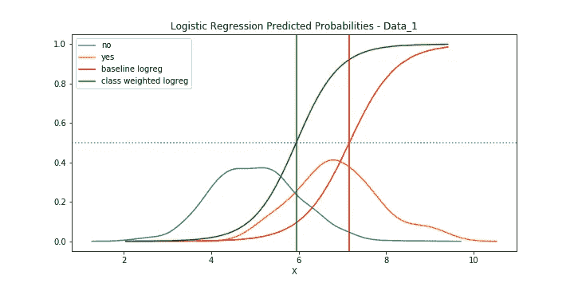

蓝色虚线表示 0.5 的概率。红色曲线是在所有参数保持默认的情况下，在基线中观察值为`yes`的估计概率，绿色曲线是针对我们将`class_weight`更改为`'balanced'`的模型。垂直线表示阈值，阈值以上的`X`值在相应的模型中被归类为`yes`。`baseline`模型将观察值分类为`yes`的`X`阈值是 7.157，对应的`accuracy_score`是 0.929(最优是 0.935)，而`class_weight`模型得到的阈值是 5.943，`balanced_accuracy_score`是 0.837(最优是 0.843)。正如我们可以看到的,`LogisticRegression`结果非常接近我们之前计算的最佳阈值，即使它们并不完全匹配，但该模型如何在没有任何调整的情况下成功应对这一点令人印象深刻。

`Data_2`的图表相同:

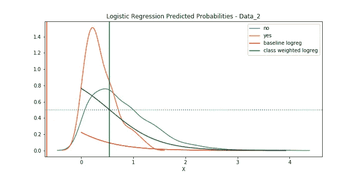

乍一看，这看起来相当糟糕。红线实际上是正确的，并导致与最佳阈值完全相同的`accuracy_score`。这似乎是一个非常琐碎的问题，最大限度地提高这种偏斜分布的准确性，所以从现在开始，我们将专注于平衡的准确性。我们用`class_weight`模型得到的`X`阈值是 0.546，对应的 balanced_accuracy_score 是 0.662(最优值是 0.681)。`Data_2`与最优值的差异比`Data_1`大得多。

我们现在要稍微绕一下路，然后我们再用更多的模型回到逻辑回归，我们将看一个比较模型性能和最优性能的表格。

## 计算垂直线

如果您想知道如何使用(二进制)逻辑回归模型准确计算上图中分配给 0.5 概率的阈值，输出可以如下所示:

`p = 1 / (1 + exp(-z))`，

其中`p`是观测值为正的估计概率，`z`是类似于线性回归的公式，

`z = intercept + sum (coefficient * corresponding feature)`。

由此，在我们的一维示例中，我们得到以下公式来计算给定`p`概率的`X`值:

`X = — [log (1 / p — 1) + intercept] / coefficient`

我们使用这个函数来计算默认的`predict`函数将使用的精确阈值。

## 逻辑回归的其他考虑因素

请注意，运行`predict`方法是一个`LogisticRegression`模型的基线预测，使用它，一个估计为正的概率超过 50%的观察将被分类为正，其余的为负。但是你也可以调整阈值，比如说你想真正确定`yes`预测是正确的，并且想只将那些`yes`概率超过 90%的观察结果归类为`yes`，你可以保存这些概率并进行一个更可控的预测，就像这样:

```
y_prob_prediction = logreg.predict_proba(X)
probability_threshold = 0.9
y_prediction = (y_prob_prediction[:,1] > probability_threshold) * 1
```

在我们的模拟示例中，像这样选择阈值相当于手动优化。概率是`X`的单调递增/递减函数，我们可以选择我们想要使用的阈值，从`LogisticRegression`模型中计算相应的概率，并将其用作`probability_threshold`。这将使问题变得琐碎而无意义，因此在将来，我们只使用`predict`函数，因为我们希望看到不同的模型在没有任何外部指导的情况下能够多接近最佳阈值。然而，在现实生活中，这是值得一看的

`LogisticRegression`也有许多可以调整的超参数，如`penalty`(确定是否应用 L1 或 L2 正则化方法)或`C`(惩罚参数)。这些可以进一步分析，但它们不会显著改变我们的结果。我们只打算在后面的决策树中进行超参数优化。

## 取样方法

到目前为止，我们已经尝试在一个`LogisticRegression`模型中使用 class_weights 来抵消这种不平衡。当最大化`balanced_score_accuracy`时，它对`Data_1`非常有效，对`Data_2`也相对有效。在这一节中，我们将看看一个非常流行的解决不平衡数据的方法:抽样方法。采样方法是我们可以应用于不平衡数据的人工校正，以提高分类器模型的性能。

最直接的可能是欠采样。为了对你的数据进行欠采样，你从多数类别中随机选取观察值，直到你得到一个平衡的数据。在我们的例子中，这意味着我们随机选择 100 个`y`为`no`的观察值，将其添加到`yes`的 100 个观察值中，并在这 200 个观察值上拟合模型。

我们可以使用 scikit-learn 中的`resample`方法:

```
from sklearn.utils import resampledata = np.concatenate((X, y.reshape(-1,1)), axis = 1)
data_yes = data[data[:,1]==1]
data_no = data[data[:,1]==0]data_no_undersampled = resample(
    data_no, replace = True, n_samples = len(data_yes))
```

然后从`data_no_undersampled`我们可以生成一个新的`X`和`y`来适应任何模型。欠采样的一个缺点是我们在这个过程中丢失了有价值的数据:在我们的例子中，我们简单地丢弃了 90%的`no`观察值！

与随机欠采样相反的是随机过采样，即从少数类别中随机采样多于原始大小的样本。在我们的例子中，我们将从 100 个可用的观察值中随机挑选`yes`个观察值，直到我们得到 1000 个观察值的数据。是的，这意味着相同的观察结果会在数据中出现多次，平均 10 次。可以使用与上述相同的重采样方法进行编码:

```
data_yes_oversampled = resample(
    data_yes, replace = True, n_samples = len(data_no))
```

随机过采样的一个缺点是容易导致过拟合。通过这种方法，我们增加了数据中每个观察值的数量。想象一个决策树，其中我们将单个叶子应该包含的最小观察值限制为 10，我们仍然可以得到本质上适合原始数据的单个观察值的叶子。这并不是一个很好的概括。

随机过采样的另一个缺点是，通过使用`class_weight`参数，我们很容易得到基本相同的结果。我测试了通过重复每一个`yes`观察 10 次，我们是否得到了与`class_weight`方法完全相同的结果，是的，我们得到了！

作为替代，我们可以使用更复杂的过采样方法，SMOTE(合成少数过采样技术)。该方法为我们想要过采样的类别创建合成的新观测值。我们可以使用不平衡学习库中的`smote`方法:

```
from imblearn.over_sampling import SMOTEsmote = SMOTE()
X_smote, y_smote = smote.fit_sample(X, y)
```

在我们的一维示例中，它将简单地填充属于`yes`观测的`X`特征之间的空白，本质上创建了一个更平滑的分布。在我们最初的`Data_1`中，yes 类别的前两个`X`数字是:

```
[4.78686675, 5.13065935]
```

SMOTE 在这两点之间生成了以下数字序列:

```
[4.81446713, 4.82864615, 4.85628325, 4.94624546, 5.00124146, 5.02037642, 5.04086545, 5.12494108]
```

让我们看看这些采样方法在`Data_1`上是如何工作的:

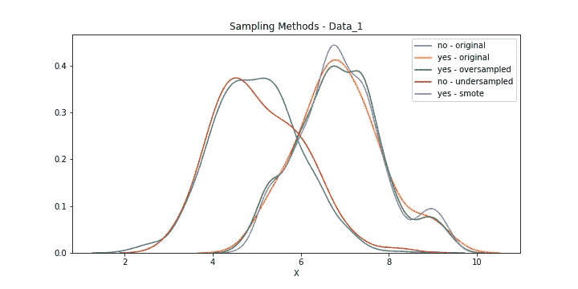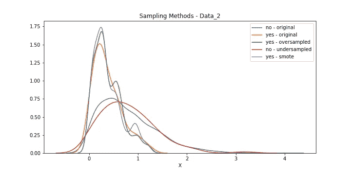

有趣的是我们如何得到新的随机曲线，而原来的分布是非常平滑的。在看这些图表之前，我假设我们从抽样方法中得到的分布会更接近原始分布。

由于我们讨论了随机过采样的缺点，以及如何应用`class_weight`方法会产生类似的结果，我们不打算使用随机过采样。我们未来使用的 4 种模式:

*   基线；
*   `class_weight`设置为`‘balanced’`；
*   随机欠采样；
*   击打。

我们已经讨论了`LogisticRegression`模型的前两个，在下一节中继续讨论其他的。

请注意[不平衡学习](https://imbalanced-learn.readthedocs.io/en/stable/api.html)有许多不同的过采样和欠采样方法。我最初考虑使用一种更复杂的欠采样方法，但是随机欠采样工作得很好，结果是 SMOTE 方法的自然对立面。

还有一点需要注意:您应该只将这些采样方法应用于您的训练数据！您可以根据修改后的训练数据来改进您的分类器，但是性能应该总是在未调整的测试数据上进行测试。在我们的模拟示例中，没有单独的测试数据，但是我们仍然要在原始的、未调整的数据上测量分类器的性能。

## 使用抽样方法回归逻辑回归

在本节中，我们将使用通过运行默认模型创建的新欠采样和过采样数据返回到`LogisticRegression`模型。我们将使用新创建的`(X_undersampled, y_undersampled)`和`(X_smote, y_smote)`对，而不是在原始的`(X, y)`值上安装相同的 LogisticRegression 对象。

在拟合模型时，我们还可以使用`undersampled`和`smote`数据绘制两种分布的逻辑回归概率图:

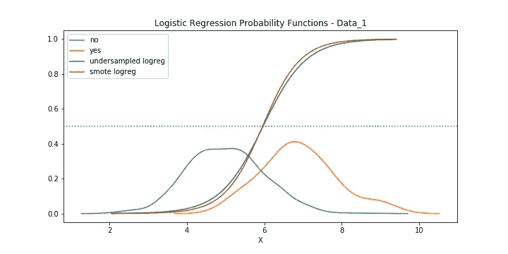

我们可以看到概率和阈值(`X`曲线与 0.5 概率虚线相交的值)彼此非常接近。有趣的是，`undersampled`方法产生了略高的`balanced_accuracy_score`，我们将在下一节中看到所有`LogisticRegression`模型的性能比较。

`Data_2`怎么样？绘制概率图:

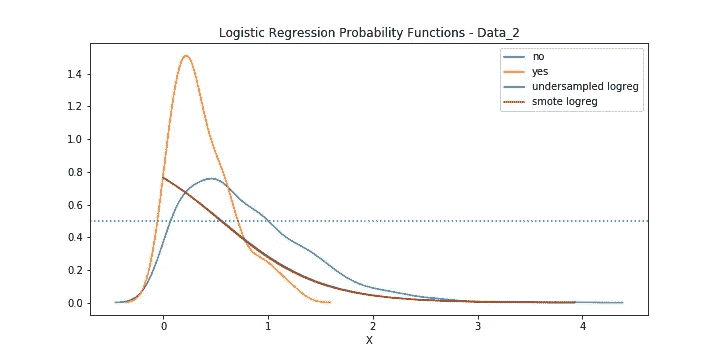

我们可以再次看到，两条曲线和阈值非常接近，几乎看不到绿线。同样，`undersampled`方法产生的`balanced_accuracy_score`略高于`smote`方法。

## 逻辑回归性能总结

让我们将模型与最佳模型进行比较。我们将分别讨论旨在改进`accuracy_score`和`balanced_accuracy_score`的模型。对于`Data_2`，我们不是通过`accuracy_score`来比较模型，正如我们所讨论的，这是一个微不足道的问题。

`Data_1`，`accuracy_score`:

```
**Model             ConfusionMatrix        Threshold      Accuracy**optimal           [993,  7               7.3007         0.9345
                   65,   35]logreg_baseline   [986,  14              7.1566         0.9291
                   64,   36]
```

正如我们所见，基线`LogisticRegression`模型比最优模型表现稍差，尤其是对于`no`观测。它设置了一个较低的阈值，这意味着多 1 个观察值将被正确地识别为`yes`，但是应该是`no`的多 7 个观察值被预测为`yes` (与最优模型相比)。

`Data_1`、`balanced_accuracy_score`:

```
**Model             ConfusionMatrix        Threshold      Bal.Acc.**optimal           [815,  185             5.8716         0.8425
                   13,   87]logr_classweight  [834,  166             5.9429         0.8370
                   16,   84]logr_undersampl   [841,  159             5.9653         0.8405
                   16,   84]logr_smote.       [835,  165             5.9523         0.8375
                   16,   84]
```

`Data_2`、`balanced_accuracy_score`:

```
**Model             ConfusionMatrix        Threshold      Bal.Acc.**optimal           [511,  489             0.6364         0.6805
                   15,   85]logr_classweight  [583,  417             0.5460         0.6615  26,   74]logr_undersampl   [575,  425             0.5600         0.6675
                   24,   76]logr_smote.       [581,  419             0.5482         0.6655
                   25,   75]
```

对于这两个问题，表现的顺序是:`optimal`、`logr_undersampl`、`logr_smote`、`logr_classweight`。差别并不大，正如我们之前讨论的，我们只是简单地使用了`LogisticRegression`模型的`predict`功能。

## 决策图表

在本节中，我们将查看决策树，并使用我们之前对逻辑回归模型使用的 4 种不同方法来查看我们与最佳阈值的接近程度:

*   基线；
*   `class_weight`设置为`‘balanced’`；
*   随机欠采样；
*   击打。

我们的方法与`LogisticRegression`类似，拟合决策树非常简单:

```
from sklearn.linear_model import DecisionTreeClassifierdtc = DecisionTreeClassifier()
dtc.fit(X, y)
```

一旦你拟合了一个模型，你可以用下面的命令来可视化这个树:

```
from IPython.display import Image
import pydotplusdot_data = export_graphviz(dtc, out_file=None,   
           class_names=np.unique(y).astype('str'), 
           filled=True, rounded=True, special_characters=True)graph = pydotplus.graph_from_dot_data(dot_data)Image(graph.create_png())
```

现在，如果你尝试运行这个模型，你会得到一个巨大的完全过度拟合的树。决策树的问题是，除非你明确地告诉他们停止，否则他们不会停止，如果他们有一个连续的变量，他们将基本上创建一个完美的匹配，但不可用的分类器。通过传递可选参数`max_depth`，您可以限制树的切割次数。在`Data_1`上运行带有`max_depth = 1`的模型，我们得到以下树:

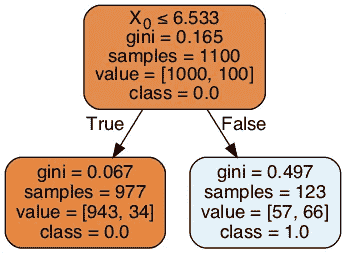

决策树对 X= 6.533 处的数据进行拆分，将它上面的一切归类为`yes`，下面的一切归类为`no`。如果我们把`class_weight`改成`'balanced'`会怎么样？我们得到下面的树:

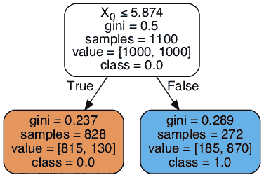

从这些简单的树中，还可以读出混淆矩阵，比如在第二个中，有 815 个`no`值和 130 / 10 = 13 个`yes`值预测为`no`，有 185 个`no`和 87 个`yes`值预测为`yes`。

我们可以从树中的每个节点读取许多其他信息，最重要的是`gini`分数。在继续之前，让我们先看看这个`gini`分数意味着什么，以及如何选择分割阈值。

## 关于标准的一句话

决策树使用贪婪算法来分割数据，基于两个可能得分的平均改善:`gini`和`entropy`(至少那些是`sklearn` `DecisionTreeClassifier`类中可用的两个)。当你实例化一个决策树时，你可以使用可选的`criterion`参数传递它们，缺省值是`gini`。基尼系数和熵都是衡量一组观察值“有序”程度的指标:如果大部分观察值属于某个特定的目标变量，则比观察值均匀分布在不同的目标变量中更有序。(你可以查看相应的维基百科页面，了解更多关于基尼系数和熵系数的基础数学知识。)

当决策树比较不同的数据分离时，它会计算子节点中这些分数的平均改善，并根据分离后分配给它们的样本总数进行加权。我们可以计算这个平均值作为阈值的函数，并绘制它们:

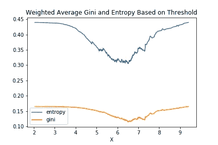

两条线的形状相似，它们的最小值恰好在同一个`X`。如果我们用`entropy`而不是`gini`运行基线`DecisionTreeClassifier`，我们会得到完全相同的分割(我测试过)。自然，人们不能说两个标准分数将总是导致相同的分割，但是对于这个例子，我很乐意使用默认的分数:`gini`。

现在，有趣的是`gini`并没有最大化精度或平衡精度！在下图中，我们绘制了三条曲线`accuracy_score`、`balanced_accuracy_score`和`gini`，作为`X`阈值的函数，并突出显示了它们在`Data_1`的最大值/最小值。

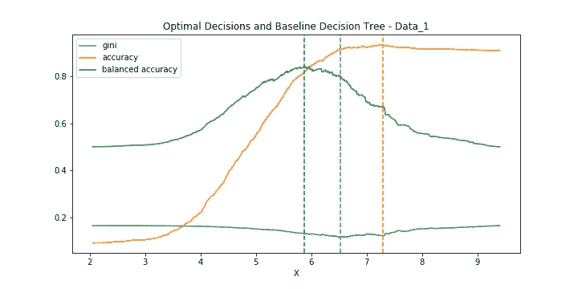

我发现非常有趣的是，单一分割选择的阈值大致介于最佳精度/平衡精度分割之间。

因此，如果我们想最大限度地提高准确性，我们不能把自己限制在一个水平上，但如果我们只是让树生长，它会大量过度适应。为了平衡这两个选项，我们将不得不使用超参数优化。

## 超参数优化

我们将使用 scikit-learn 的`GridSearchCV`来优化`DecisionTree`的超参数。首先，我们需要定义一个想要检查的参数字典，如下所示:

```
param_grid = {
    'max_depth': [1,2,3,4,5, 10, 20],
    'min_samples_leaf': [1,2,3,4,5, 10, 20],
    'class_weight': [{0:1, 1: 1}, {0:1, 1: 10}]
    }
```

这是我们要调整的三个参数，我们可以使用其他参数，但这些参数可能是最简单的。`GridSearchCV`将运行 7*7*2 = 28 种类型的树，如果我们考虑我们将使用的三重交叉验证，总共 28 * 3 = 84 棵树。然后，它将比较在不同类型的树上获得的分数(准确度或平衡准确度),并返回最佳估计器参数。

在你实例化了一个`dtc` `DecisionTreeClassifier`对象之后，就像我们上面做的那样，你可以在`GridSearchCV`中把它作为一个参数传递。你可以使用所有的`sklearn`模型，但是对于这个例子，我们坚持使用`DecisionTree`的。我们将使用三重交叉验证来避免过度拟合，我们希望最终得到一个正确分离数据的树。

这种方法的有趣之处在于，我们无法告诉`DecisionTree`哪个阈值是理想的阈值。我们将最终得到一个`best_estimator_`，它将拥有最好的超参数，但是最终的模型将是一个简单的`DecisionTree`对象。

运行`GridSearchCV`类似于运行分类器模型(在下面的例子中，我们针对`accuracy`进行了优化):

```
from sklearn.model_selection import GridSearchCVgscv_dt = GridSearchCV(estimator = dtc, param_grid = param_grid,     
          scoring = 'accuracy', cv = 3)gscv_dt.fit(X, y)
```

## 使用超参数优化返回决策树

我们将返回决策树，使用`GridSearchCV`找到最佳参数。使用 GridSearchCV，我们在技术上可以有 6 个模型:针对 3 个数据、基线、`undersampled`和`smote`的精度优化/平衡精度。除此之外，为`accuracy_score`优化`undersampled`和`smote`可能没有用，但是我们可以检查一下。

一旦我们拟合了一个`GridSearchCV`模型，我们可以使用`best_estimator_`属性重新创建选定的最佳模型:

```
dtc = DecisionTreeClassifier(
      max_depth = gscv_dt.best_estimator_.max_depth,
      min_samples_leaf = gscv_dt.best_estimator_.min_samples_leaf,
      class_weight = gscv_dt.best_estimator_.class_weight)
```

先分析一下`Data_1`。

首先，我们考虑未调整的基线数据。如果我们对`accuracy_score`进行优化，我们会得到这个决策树:

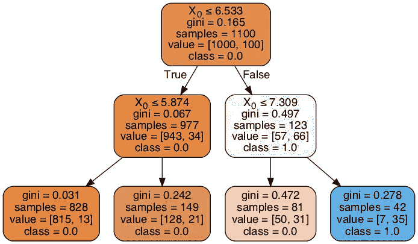

好消息，树居然找到了最优分裂！人们可以从唯一的蓝色节点中扣除这一点，我们有 7 个假阳性和 35 个真阳性，这符合最优解。

从树上，我们可以看到

*   即使不改变预测，树也会继续分裂；
*   我们从 6.533 开始，与我们的第一个基线示例一样。

如果我们想对`balanced_accuracy`进行优化，会发生什么呢？唯一的区别是我们在上面的`GridSearchCV`对象中将`accuracy`改为`balanced_accuracy`。结果非常有趣，原来我们在第一个中尝试的第一个基线模型是平衡精度的最佳模型！在 5.874 分开的那个。(稍后我们将提供一个汇总表，其中总结了决策树模型的性能指标。)

接下来，看看取样方法，`undersampled`第一。结果再一次非常有趣，我们得到了完全相同的树，不管我们是优化了精确度还是平衡了精确度！

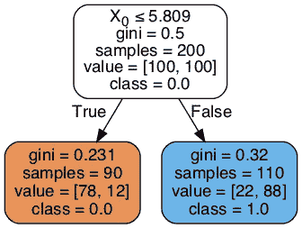

这可能是因为样本是均匀的，数据是完全平衡的。

接下来，`Data_1`使用`smote`方法，与`undersampled`相同的行为，我们得到完全相同的树，不管我们想要优化精度还是平衡精度。然而，树本身看起来就不那么令人愉快了:

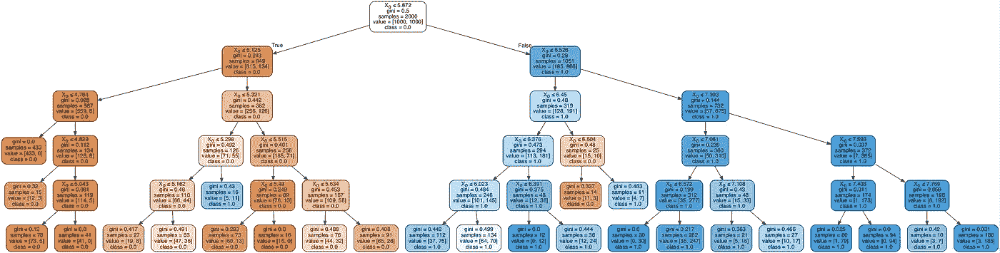

有趣的是，它在左侧(橙色边上孤独的蓝色框)发现了被预测为`yes`的项目，反之亦然，在右侧(蓝色边上的橙色框)发现了被预测为`no`的项目。我们知道这可能是过度拟合的迹象，即使我们使用交叉验证，这也很容易发生。请注意，即使这是一个真实的案例，并且我们有一个测试数据，过度拟合问题也是一样的，因为我们是从拟合训练数据开始的！

现在来看看`Data_2`。

与所有其他模型一样，优化基线数据以获得准确的结果——我们无法真正构建一个分类器，我们必须将一切归类为`no`。相关的问题是:我们可以优化平衡的准确性吗？是的，事实证明，`class_weight`参数也使决策树成为可能:

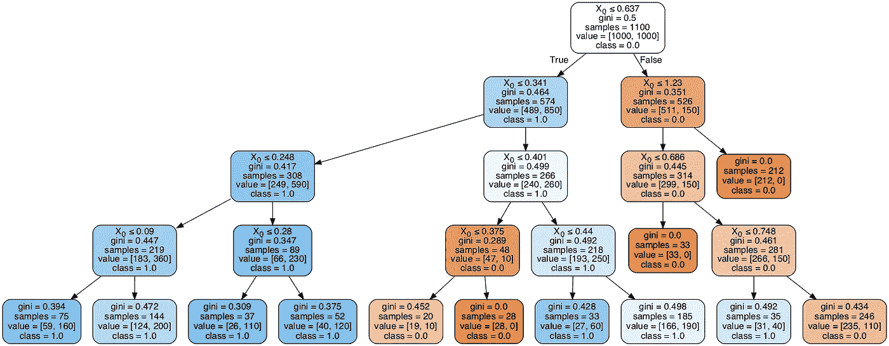

与`Data_1`类似，为`accuracy_score`或`balanced_accuracy`优化`Data_2`的`undersampled`和`smote`版本，结果得到完全相同的树。他们也表现出过度合身的迹象。我不打算在这里包括所有的图表，请参考我的 [GitHub](https://github.com/MatePocs/imbalanced_classifier) 存储库以了解那些细节，并参考下一节的性能总结。

## 决策树性能摘要

让我们将模型与最佳模型进行比较。我们将遵循与逻辑回归总结相似的结构。对于`Data_1`和`Data_2`，我们有 6 个不同的决策树模型，但我们只检查`Data_1`的基准决策树，因为其他模型没有针对准确性进行适当的优化。

`Data_1`，`accuracy_score`:

```
**Model             ConfusionMatrix        Threshold      Accuracy**optimal           [993,  7               7.3007         0.9345
                   65,   35]dtree_baseline    [993,  7               7.309          0.9345
                   65,   35]
```

`baseline`决策树模型找到了数据的最佳分割。

`Data_1`，`balanced_accuracy_score`:

```
**Model             ConfusionMatrix        Threshold      Bal.Acc.**optimal           [815,  185             5.8716         0.8425
                   13,   87]dtree_baseline    [815,  185             5.874          0.8425
                   13,   87]dtree_undersampl  [797,  203             5.809          0.8385
                   12,   88]dtree_smote       [821,  179             n/a            0.8505
                   12,   88]
```

`baseline`决策树模型再一次找到了最优分割。`Undersampled`表现不佳，`smote`导致了更高的`balanced_accuracy_score`，但代价是过度拟合。

`Data_2`，`balanced_accuracy_score`:

```
**Model             ConfusionMatrix        Threshold      Bal.Acc.**optimal           [511,  489             0.6364         0.6805
                   15,   85]dtree_baseline    [527,  473             n/a            0.7035
                   12,   88]dtree_undersampl  [555,  445             n/a            0.6925
                   17,   83]dtree_smote.      [669,  331             n/a            0.7095
                   25,   75]
```

有趣的结果是，从技术上讲，所有三个决策树模型都有更高的`balanced_accuracy_score`，但它们是以过度拟合为代价实现的。我们不能限制他们去寻找最优阈值。

请再次注意，对单独的测试数据进行测试将是分析过度拟合的正确方法，但我认为在我们的情况下没有必要这样做。我们分析的主要结果是，我们不能总是将决策树修剪成简单的最优分裂。

## 结果摘要

我们多少暗示了几次，但是没有阐明最重要的假设是他们各自组中的基线模型在准确性方面表现良好，而其他三个模型(`class_weight`、`undersampled`、`smote`)在平衡准确性方面表现良好。

我经常看到这样的例子，用户有不平衡的数据，并开始应用采样方法，即使目标是最大限度地提高准确性。因此，接下来的转折是:让我们看看每个模型如何通过`Data_1`中的两个性能指标来表现彼此，其中两个都是有效的问题！

在下表中，两个`optimal_`模型是我们手动计算的简单分割。`logreg_`和`dtree_`型号都有四种不同的版本:

*   `_acc`，为精度优化的基线(主要通过不使用`class_weight`)；
*   `_bal_acc`，为平衡精度进行基线优化(主要通过使用`class_weight`)；
*   `undersampled`，两组中只有一个这种类型的模型，对于`LogisticRegression`，我们只对相同的数据拟合一种类型的模型，对于`DecisionTree`，无论我们是针对`accuracy_score`还是`balanced_accuracy_score`进行优化，最优超参数都是相同的；
*   `smote`，每个模型组一行，原因与上述`undersampled`相同。

讨论完之后，让我们来看看`Data_1`的汇总表:

```
**Model               Threshold         Accuracy        Bal.Acc.**
optimal_acc            7.3007           **0.9345**          0.6715
optimal_bacc           5.8716           0.8200          **0.8425**
logreg_acc             7.1566           0.9291          0.6730
logreg_bal_acc         5.9429           0.8345          0.8370
logreg_undersampl      5.9653           0.8409          0.8405
logreg_smote           5.9523           0.8355          0.8375
dtree_acc              7.3090           **0.9345**          0.6715
dtree_bal_acc          5.8740           0.8200          **0.8425**
dtree_undersampl       5.8090           0.8045          0.8385
dtree_smote               n/a           0.8264          0.8505
```

对于准确性问题和平衡准确性问题，我认为单一决策树的结果是最稳健的。他们使用单个`X`值将数据分成两组，就像我们的最佳手动模型一样。大多数模型表现稍差，但没有一个模型在其擅长的类别中有明显的糟糕表现。`smote`模型在技术上实现了更好的平衡精度，但代价是过度拟合。

对于`Data_2`，如前所述，测量精度并不真正相关，但我们仍然可以为良好的测量创建汇总表:

```
**Model               Threshold         Bal.Acc.**
optimal_bacc           0.6364           0.6805
logreg_bal_acc         0.5460           0.6615
logreg_undersampl      0.5560           0.6675
logreg_smote           0.5482           0.6655
dtree_bal_acc             n/a           0.7035
dtree_undersampl          n/a           0.6925
dtree_smote               n/a           0.7095
```

结果比预期的`Data_1`更糟，`Data_2`是一个更棘手的问题。逻辑回归模型表现相对较好，平衡精度略低于最佳手动模型。决策树模型具有更高的平衡精度，但以过度拟合为代价，而不是基于一个阈值来分离数据，它们识别出`yes`观察值随机出现的口袋。

## 结论

我想强调的第一点是，不要从这个练习或任何一个练习中得出长期的结论，这只是一个随机的例子。主要的收获是你可以用来抵消数据不平衡的可用方法，以及预先阐明问题的重要性。

话虽如此，我认为同样重要的是要注意，你不能简单地通过盲目应用`smote`抽样方法来解决每个问题，因为这是最奇特的方法，原因如下:

*   这会导致过度拟合，尤其是决策树。
*   如果您想最大限度地提高准确性，您可能会考虑坚持使用根据原始数据训练的更简单的模型。在`Data_1`的情况下，决策树设法将观察结果分成两组，就像我们手动做的那样。

我从这个练习中吸取的另一个教训是，有时一个极度不平衡的数据可能意味着你根本无法处理它。在`Data_2`的例子中，我们根本无法建立一个好的精度分类器来击败天真的基线模型。

这就结束了我们对不平衡数据分类器的分析。我很喜欢整理这些信息，希望你会觉得有用！