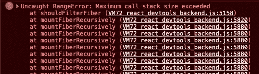
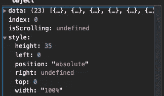
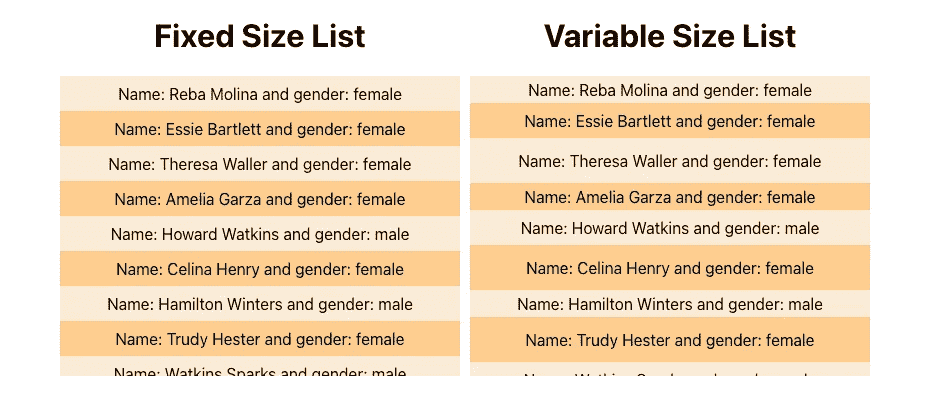

# 用反应窗口处理列表

> 原文：<https://medium.datadriveninvestor.com/handling-lists-with-react-window-79c68a73c55a?source=collection_archive---------0----------------------->


*加载大列表智能方式*

最近，我接到了处理大量数据的任务。任何给定时间点的最低记录数都在 50 万左右。通常，后端人员会通过在 API 中添加分页来帮助我们，但这一次我是独立完成的(而且我没有大声创建自己的后端)。

为了展示当我们尝试遍历一个大型数据数组时会发生什么:



when looping through a huge list of data

在渲染庞大的列表时，一个好的做法是使用**窗口/虚拟化**。

> **T5【开窗】T6**

只呈现 DOM 元素的过程称为窗口操作，DOM 元素是在 DOM 上可见的列表的一部分。这有助于提高性能，因为 React 需要呈现更少的 DOM 元素。

在我的例子中，我有一个 23 项的列表，但是如果我们检查呈现的元素数量，它比列表中的项目少。


windowing helps render items which are visible

在使用*开窗*之前，你首先要问的是**是否需要**？

我之所以强调**必需**，是因为首先，您添加了一个新的依赖项。其次，初始负载的性能得到了提升，但是您需要这样的性能吗？

例如，如果您正在开发一个仪表板应用程序，其中您有多个*KPI*，许多*变更*和*计算*正在发生，这将是有意义的；根据需要需要减少*互动*时间。另一方面，如果数据较少，并且可以一次性加载，那么呈现列表会更有意义。这是因为 react-window 的初始加载时间可能更短，但 react 需要重新呈现列表，而第二个用例的初始加载时间可能会慢 100 毫秒，但会呈现整个列表。

> 反应窗口

让我们安装库:

```
npm i react-window
```

* *注:react-window 是*[*react-virtualized*](https://www.npmjs.com/package/react-virtualized)的精简版

[react-window](https://react-window.now.sh/) 提供了四种类型的组件:FixedSizeList、VariableSizeList、FixedSizeGrid 和 VariableSizeGrid。对于我的例子，我将使用 FixedSizeList，VariableSizeList。

让我们看看一些基本的道具，你可以通过:

*   **高度&宽度**:设置列表容器的大小
*   **itemData** :你要渲染的数据
*   **itemCount** :数据数组上的长度
*   **className** :用于任何定制样式
*   **itemSize** :唯一的区别是在 VariableSizeList 中，itemSize 可以变化，我们通过一个回调来计算大小(返回类型是一个数字)。
*   **子**:两个 *FixedSizeList，VariableSizeList* 都使用渲染道具，并传递所需道具。正如你在下面的例子中看到的， ***行*** 使用道具来呈现列表项。道具包括项目*索引*，*样式*包含要渲染的项目的尺寸和坐标。如果定义了**项目数据**，则*数据*属性包含数据列表。



props accessible in the child component

让我们看看应用组件:

输出:



我希望这有助于您理解不同的库如何帮助提高性能。

你可以在这里找到 git repo。