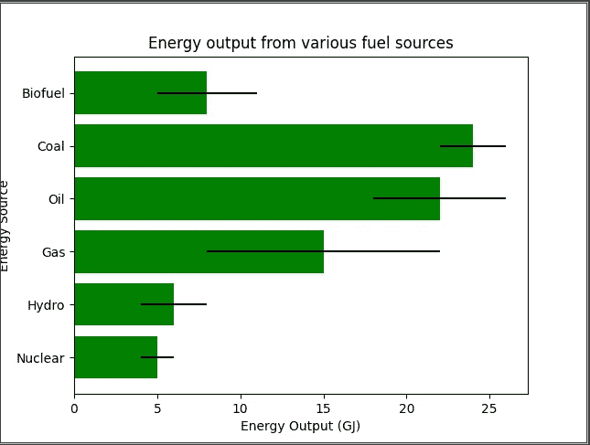

# 用 Python 可视化数据的实践

> 原文：<https://medium.datadriveninvestor.com/hands-on-visualizing-data-in-python-a3465d0ee3c4?source=collection_archive---------7----------------------->

## 今天我学会了

## 在处理大数据项目时，我们不能只考虑数据本身，因为数据量非常大。这就是可视化数据如此重要的原因。

Photo by [fabio](https://unsplash.com/@fabioha?utm_source=unsplash&utm_medium=referral&utm_content=creditCopyText) on [Unsplash](https://unsplash.com/s/photos/big-data?utm_source=unsplash&utm_medium=referral&utm_content=creditCopyText)

有很多可视化数据的工具。在这篇文章中，我们将关注 Python 环境下的工具，因为 Python 中支持的很多库都是针对数据科学的。下面是我们如何用 matplotlib，pandas 和 numpy 实现一些常见的图表/图示/绘图。

# 柱形图

这张是我认为最简单的图表。我们甚至在小学学过。它很容易构建，也很容易理解。柱形图沿水平(X)轴包含数据标签，垂直(Y)轴(也称为图表的左侧)显示测量的指标或值。Y 轴通常从 0 开始，一直到您跟踪的最大测量值。您可以使用柱形图来跟踪每月销售额、每个登录页面的收入或类似的数据。一致的颜色有助于保持对数据本身的关注，尽管您可以引入强调色来强调重要的数据点或跟踪随时间的变化。

Sample for population

如何在 matplotlib 中绘制它的代码片段

# 条形图

虽然柱形图限制了您的标签和比较空间，但您通常可以以同样的方式使用条形图和柱形图。如果您有以下情况，最好坚持使用条形图:

*   使用更长的标签
*   显示负数
*   比较 10 个或更多项目

Bar chart

我们如何在 matplotlib 中实现:

# 堆积条形图

你正在比较许多不同的项目吗？您是否希望跟踪每个数据集本身的单独增长，以及作为一个整体的组的增长？为了揭示这种部分对整体的关系，您将创建一个堆积条形图。

下面是我们如何用 matplotlib 和 pandas 实现它:

# 带有多个 X 的条形图

要在同一个图表中包含多个 X 值，我们可以减小条形的宽度，然后将指数放在离 y 轴一个条形宽度的地方。

Multiple X chart

使用 matlabplot 和 numpy 的示例代码:

# 线图

这是另一种可以立即识别的标准图表类型。折线图旨在揭示一段时间内发生的趋势、进展或变化。因此，当您的数据集是连续的而不是充满开始和停止时，它工作得最好。

 [## 用 Python |数据驱动投资者进行股票价格时间序列预测简介

### 在这个简单的教程中，我们将看看如何将时间序列模型应用于股票价格。更具体地说，一个…

www.datadriveninvestor.com](https://www.datadriveninvestor.com/2020/07/07/introduction-to-time-series-forecasting-of-stock-prices-with-python/) 

像柱形图一样，折线图上的数据标签在 X 轴上，而测量值在 Y 轴上。

确保使用实线，避免绘制超过四条线，因为超过四条线会分散注意力。您应该规划足够的空间，使您的线条大约是 Y 轴高度的 2/3。

Line Plot

代码片段

Line graph

# 双轴图表

这种布局允许您显示不同变量之间的关系(或缺乏关系),并且在处理如下三个数据集时效果最佳:

*   一组连续数据
*   按类别分组的两个数据集

Dual axis chart

代码片段

# 散点图

散点图是可视化两组数据之间关系的正确选择。

Scatter Plot

代码示例:

# 结论

我们刚刚看了不少图表。每种类型都适用于特定用例，因此在应用于探索您的数据时，请明智地选择。

# 参考

 [## 简化数据可视化的 10 大类型

### 研究表明，我们每天都会产生 2.5 万亿字节的数据。您有哪些类型的数据可视化…

boostlabs.com](https://boostlabs.com/10-types-of-data-visualization-tools/)  [## Matplotlib 中的条形图

### 条形图用于显示与分类数据相关的值。然而，plt.bar 函数接受一个…

benalexkeen.com](https://benalexkeen.com/bar-charts-in-matplotlib/)  [## 拯救一只熊猫。系列直方图绘制到文件

### 感谢贡献一个堆栈溢出的答案！请务必回答问题。提供详细信息并分享…

stackoverflow.com](https://stackoverflow.com/questions/18992086/save-a-pandas-series-histogram-plot-to-file)  [## 带有排序值的熊猫堆积条形图

### 我的目标是创建一个多级数据框架的堆叠条形图。数据框架看起来像这样:导入熊猫作为 pd…

stackoverflow.com](https://stackoverflow.com/questions/40745875/pandas-stacked-bar-chart-with-sorted-values) 

**进入专家视角—** [**订阅 DDI 英特尔**](https://datadriveninvestor.com/ddi-intel)