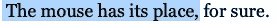
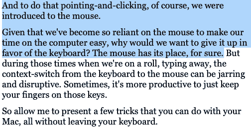
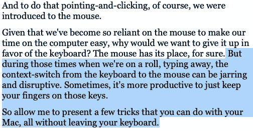

# 为您的 Mac 提供便捷的命令…无需使用鼠标

> 原文：<https://medium.datadriveninvestor.com/handy-commands-for-your-mac-without-using-your-mouse-8e87fdb09fe2?source=collection_archive---------1----------------------->

## 甚至 Mac 用户也可以和他们的键盘成为朋友

Photo by [Moritz Kindler](https://unsplash.com/@moritz_photography?utm_source=medium&utm_medium=referral) on [Unsplash](https://unsplash.com?utm_source=medium&utm_medium=referral)

很久以前，苹果公司通过推出麦金塔电脑革新了个人电脑，而麦金塔电脑又推出了图形用户界面，或称 *GUI。*好吧，好吧，确实是[施乐 PARC](https://en.wikipedia.org/wiki/History_of_the_graphical_user_interface#Xerox_PARC) 发明了 GUI，[苹果的 Lisa](https://en.wikipedia.org/wiki/Apple_Lisa) 先于 Mac。但是不可否认的是，麦金塔将大部分世界引入了图形用户界面。我们现在可以简单地点击屏幕上的图标来完成工作，而不是记忆和从键盘上输入晦涩难懂的命令。

当然，为了实现这一点，我们接触到了鼠标。

鉴于我们已经变得如此依赖鼠标来使我们在电脑上的时间变得容易，为什么我们要放弃它而选择键盘呢？毫无疑问，老鼠有它的位置。但是当我们在滚动打字时，从键盘到鼠标或触控板的环境切换可能会产生不和谐和破坏性的影响。有时候，把手指放在那些键上会更有效率。

因此，请允许我向您展示一些无需离开键盘就能在 Mac 上使用的技巧。毫无疑问，你已经知道一些了；希望你在这个过程中能学到更多。

## 我们将使用的惯例

首先，让我们回顾一下本文中使用的组合键的约定。许多组合键都包含“修饰”键，在 Mac 上是:

*   ***命令*键。钥匙上既有*命令*字样，也有⌘符号。我们将把这个键称为“⌘".”**
*   **控制*键*键**(上面印有*控制*字样。)我们将这个键称为“*控制*”。
*   **T21 选项钥匙**(上面印有*选项*字样。)我们将这个键称为“*选项*”。
*   ***换挡*键**(上面印有*换挡*字样。)我们将这个键称为“ *shift* ”。
*   **功能键**(上面印有 *fn* )。我们将这个键称为“ *fn* ”。

这些键本身很少做任何事情(这就是为什么它们被称为“修饰符”)。相反，您通常会按住这些键中的一个或多个，然后按下另一个键来执行某些操作。我们将使用加号(+)来表示按住修饰键和其他键的组合。

我们将使用印在钥匙上的符号来指代任何其他钥匙，如果是字母或数字，则用斜体表示。因此“E”键将被称为*E*；左箭头键，◀；tab 键为 *tab 键*等。

举个例子，我们大多数人都知道，要复制一个选中的文本块，我们可以按⌘ + *C* ，粘贴复制的文本，⌘ + *V* 。

# 卷起

不断让我们移动鼠标的事情之一是滚动。特别是如果我们正在处理一个长文档，我们需要使用鼠标快速滚动到下一页，对吗？

不对。只需使用功能键配合上/下箭头:
*fn* + ▲将滚动到上一页， *fn* + ▼带我们到下一页。

请注意，这种行为在技术上是特定于应用程序的，但是几乎所有的应用程序都符合它。此外，许多其他应用程序也提供了以下功能: *fn* + ◀︎滚动到页面/文档的开头，以及 *fn* +滚动到结尾。然而，在这两种情况下，光标都停留在原来的位置。这让我们进入下一部分:

# 跳过你的光标

您可能知道可以使用键盘的左右箭头键(▭，◀).)将光标一次移动一格但是有时候你需要跳到一行的开头，或者跳到末尾。没有必要为这个抓你的鼠标。只需按住 command 键(⌘)并按下◀键跳到行首，或者按下⌘+\\\\\\\\\\"跳到行尾。

Start with your cursor here

⌘ + ◀ jumps it to here

and ⌘ + ▶ jumps it to here

您也可以轻松地跳到文档的开头或结尾。再次按下⌘和向上箭头键(⌘ +▲)跳到文档的开头，或⌘ + ▼跳到结尾。老实说，这比用你的鼠标简单多了！

Start with your cursor here

⌘ +▲ jumps it to here

and ⌘ +▼ jumps it to here

如果你喜欢将光标从一个单词跳到另一个单词，你也可以选择这个选项:选项*键。*

*   ◀ ︎will 把你的光标跳到前一个单词的开头，而
*   *option+*将光标跳到下一个单词的末尾。

跳段怎么样？你现在可能已经猜到了:

*   *选项* + ▲将带您到上一段的开头，而
*   *选项* + ▼会让你跳到后面一个的底部。

最后，也许您只想将光标移到文档的中心。*控制*+*L*(“L”为 midd**Le？)会那样做的。**

# 选择文本块

我们使用鼠标最常见的事情之一是选择文本块。在大多数情况下，使用键盘甚至更容易。

要突出显示一小块文本，请确保光标位于该块的开头(或结尾)，必要时使用箭头键。然后按住 *shift* 并使用左箭头开始选择光标左侧的字符，或使用右箭头选择右侧的字符。

如果您想选择光标左侧一行中的所有字符，该怎么办？就用⌘ + *shift +* ◀︎.你猜对了:⌘+*shift*+▎将选择光标右侧的所有字符。组合两个组合键(按⌘ + *shift +* ◀︎，然后按⌘+*shift*+▽)选择整行。

Again, start with your cursor here

⌘ + *shift +* ◀︎ selects this text, whereas…

⌘ + *shift +* ▶ selects this text, and…

⌘ + *shift +* ◀︎, followed by ⌘ + *shift +* ▶, selects this text

也许您想选择光标上方的整个文档。简单。就用⌘ + *shift +* ▲。想要选择光标下方的整个文档吗？⌘ + *shift +* ▼。想要选择整个文档吗？把那两个组合起来就行了:按⌘ + *shift +* ▲，再按⌘ + *shift +* ▼。

Start with your cursor here

⌘ + *shift +* ▲ will select this part of your document

while ⌘ + *shift +* ▼ will select this part

and ⌘ + *shift +* ▲, followed by ⌘ + *shift +* ▼, will select your entire document

让我们将*选项*键添加到文本选择组合中。正如您从上一节中所猜测的，您可以执行以下操作:

*   *选项* + *shift* + ◀︎选择之前的所有单词
*   *选项* + *shift* +【选择整个后续单词
*   *选项* + *shift* +▲选择整个前面的段落
*   *选项* + *shift* +▼选择整个后续段落

# 修改文本

## 删除

按 delete 键将删除光标左侧的字符，当然。如果要删除右边的字符呢？只需使用 *fn* + *删除*。

接下来，如果您想删除光标左侧的整行，该怎么办？⌘ + *删除*就可以了。反过来，奇怪的不一致的*控件+ K* 将删除右边的整行。

另外，⌘ + *删除*还会将你在 Finder 中选择的任何项目(如文件或文件夹)发送到回收站……无需使用*文件* → *移至回收站*菜单项。

## 编辑

我们都知道剪切、复制和粘贴文本可以分别通过⌘ *+ X* 、⌘ *+ C* 和⌘ *+ V* 来完成。此外，⌘ *+ Z* 将允许我们撤销更改，而添加 shift(*shift+*⌘*+z*)将允许我们撤销该撤销(也称为重做)。

这里还有一个你可能不知道的: *command* + *T* 交换光标两边的两个字符。这是非常方便的，如果你，例如，典型的拼写古怪古怪。

# 粘贴和匹配样式

我不知道我怎么花了这么长时间才揭开这块宝石。我不记得有多少次我从一个文档中选择了一些风格化的文本并粘贴到另一个文档中，只是为了修改我粘贴的文本的字体、字体大小、颜色、粗细等。来匹配我的目标文本的风格。

No more of this

不会了。只需使用 Mac 上几乎任何文本编辑应用程序都有的粘贴和匹配样式功能。一个问题是，键盘命令在不同的应用程序中可能略有不同。对于大多数第三方来说，简单来说就是⌘+*shift*+*v*；然而，在许多苹果程序中，它是稍微复杂一些的⌘ + *换挡* + *选项* + *V* (不幸的是，这可能需要两只手才能做对)。

# 特殊字符

如今，我们打字时不仅仅使用字母和数字。首先，我们倾向于使用表情符号来给我们的信件添加个性(amirite？😉)而我个人更喜欢用一个很好的老式箭头符号(→)来代替像->这样的字符组合。

但是寻找特殊的角色是一件痛苦的事情，不是吗？不一定。当你打字时，你决定要添加表情符号或非标准字形，只需按下*控制键* + ⌘ + *空格键*。然后你会看到苹果的表情符号和符号选择器。

*control* + ⌘ + *spacebar brought this chooser up*

从那里你可以选择你正在寻找的特殊字符。但是不要换你的鼠标！如果您没有看到您要查找的内容，只需开始键入描述(例如，“箭头”)。选择器中的选项将缩小到匹配的选项。一旦您看到您要查找的内容，使用箭头键导航到它，并按下 *return* 将其插入到您的文档中。

## 重音字符

使用键盘输入重音字符甚至更容易。例如，假设您想写一篇关于 pia Coladas 的文章，并且您想确保使用适当的带波浪符号(~)的。只需按住 *n* 键；很快，会出现一个选择器，显示字母 *n* 的所有可用变体。每个变体都有一个与之相关的数字。只需按下与所需数字相关的键(在我们的例子中，要选择*-*，我们需要按下 *1* 键)。

这也适用于许多其他字母/字符。例如，通过按住 *e* ，我可以选择:è、é、ê、è、和，而按住 *s* 则可以选择。此外，按住 shift 键将调出重音字符的大写版本。

# 在窗口之间切换

大多数用户都知道，你可以通过按下⌘ + *tab* 在 Mac 上打开的应用程序之间切换。如果你不知道，你可以通过按⌘ + *键*在你的 Mac 上切换打开的应用程序。这将弹出一个提示，显示打开的应用程序。按住⌘键并重复按下*键*将在应用程序间循环(按住 *shift* 键将在另一个方向循环)。一旦你想要的应用程序被选中，只需放开⌘键。

您还可以在当前应用程序中打开的窗口之间切换。通过按住⌘键并按下带有反勾(`)和波浪号(~)符号的键，可以以类似的方式完成此操作。同样，按住 *shift* 键的同时，会向相反的方向循环。当你找到你要找的窗口时，只需松开⌘键。

# 前进后退

许多应用程序都有从一个上下文转移到另一个上下文的概念。例如，网络浏览器允许你从一个页面转到另一个页面。像 Slack 这样的聊天应用可以让你在不同的线程之间移动。其他应用程序可能允许您打开多个文档并在它们之间遍历。

有时候，你想倒退，遍历你的步骤。比如我有一次在 Slack 上看一个线程，然后就跳到了另一个。不久之后，我需要引用第一个线程中的一个评论，但是……*是哪个线程*？我大声哀叹道，Slack 应该提供一种返回到您刚刚离开的线程的方法。一位同事无意中听到我的话，问道:“你检查过它是否提供了这样做的方法吗？”嗯，我检查了一下，果然，在*历史*菜单下有一个*后退* (⌘ + [)和*前进* (⌘ + ])命令。

事实证明，这些组合键在具有“后退”和“前进”概念的应用程序中很常见。在您的网页浏览器中尝试⌘ + [组合键，但不是现在！😉—你可能会发现自己跳到了之前访问过的网页。然后，⌘ + ]会带你回来。

# 截屏

您也可以使用键盘在您的系统上开始截图。现在，当你截屏的时候，你最终需要使用你的鼠标，所以把这个技巧当作一个奖励。尽管如此，使用简单的键盘命令启动屏幕截图还是很方便的。

实际上，您可以使用几种不同的组合键:

*   **⌘ + *shift* + 3** 将会对你的整个屏幕进行即时截图。它会——有点莫名其妙——把它保存到你的桌面上。
*   **⌘ + *shift* + 4** 将为你提供一个特殊的光标，你可以拖动(是的，用你的鼠标)来捕捉你的屏幕的一部分。它会——同样莫名其妙地——将屏幕截图保存到你的桌面上。
*   **⌘ + *shift* + 5** 会调出截图 app，提供了很多不同的截图选项，在截图之前添加延迟，保存截图。这个选项肯定需要使用鼠标。

# 摘要

让我们总结一下我们在这里讨论过的键盘命令。

## 卷动

*   ***+▲**:滚动到上一页*
*   ****fn*****+▲**:滚动到下一页*
*   ****fn*****+◀︎**:滚动到文档开头(取决于应用程序)*
*   ****fn*****+**:滚动到文档末尾(取决于应用)*

## *导航/选择文本*

*当浏览文本时，左/右/上/下箭头键当然是至关重要的。与箭头键结合使用，修饰符的操作方式如下:*

*   ***⌘** (命令)允许你长距离跳跃*
*   ****选项*** 允许你跳更小的距离*
*   *添加 ***shift*** 会高亮显示您的文本*

*因此，我们的文本导航/选择组合键是:*

*   ***⌘ + ◀** :跳到一行的开头*
*   ***⌘+**:跳转到一行的末尾*
*   ***⌘ +▲** :跳转到文档的开头*
*   ***⌘ +▼** :跳转到文档末尾*
*   ****选项+* ◀** :跳转到前面的单词*
*   ****选项+***:跳转到后续*
*   ****选项+* ▲** :跳到上一段*
*   ****option +* ▼** :跳转到后续段落*
*   ***⌘ + *shift +* ◀︎** :选择光标左侧的一行*
*   ***⌘+*shift+***:选择光标右侧的线*
*   ***⌘ + *shift +* ◀︎** ，然后**⌘+*shift+***:选择整行*
*   ***+*+*▲**:选择光标上方的文档*
*   ***⌘ + *shift +* ▼** :选择光标下方的文档*
*   ***⌘ + *shift +* ▲然后⌘ + *shift +* ▼** :选择整篇文档*
*   ****选项* + *shift* + ◀︎** :选择前面的全部单词*
*   ****选项*+*shift*+**:选择整个后续单词*
*   ****选项* + *移位* +▲** :选择前面的整个段落*
*   ****选项* + *shift* +▼** :选择整个后续段落*

*别忘了我们古怪的光标跳跃命令:*

*   ****控制* + *L*** :光标在文档内居中*

## *删除和编辑文本*

*   ****fn* + *删除*** :删除光标左侧的字符*
*   ***⌘ + *删除*** :删除光标左侧的一行*
*   ****control + K*** :删除光标右侧的行*
*   ****命令* + *T*** :交换光标两侧的字符*

## *粘贴和匹配样式*

*这在不同的应用之间略有不同，但通常是:*

*   ***⌘ + *shift* + *选项* + *V*** :在大多数苹果应用中的粘贴和匹配样式*
*   ***⌘+*shift*+*v***:大多数第三方应用中的粘贴匹配样式*

## *特殊字符*

*   ****控制* + ⌘ + *空格键*** :拉起表情符号/特殊字符选择器，键入搜索，*返回*选择*
*   *按住( ***a*** ， ***e*** ， ***i*** ， ***o*** ， ***u*** ， ***y*** ， ***n****

## *切换窗口*

*   ***⌘ + tab** :在打开的应用程序间循环*
*   ***⌘ + ~** :在当前应用程序打开的窗口间循环*

## *向后和向前*

*这些组合键最终是依赖于应用程序的，但是在具有在文档之间来回移动概念的应用程序中相当常见。*

*   *⌘+[:回去*
*   ***⌘+】**:前进*

## *截屏*

*   ***⌘ + *shift* + 3** :对你的整个屏幕进行即时截图*
*   ***⌘ + *shift* + 4** :拖动并捕捉屏幕的一部分*
*   ***⌘ + *shift* + 5** :调出截图 app*

*觉得这个故事有用？想多读点？只需[在这里订阅](https://dt-23597.medium.com/subscribe)就可以将我的最新故事直接发送到你的收件箱。*

*你也可以支持我和我的写作——并获得无限数量的故事——通过今天[成为媒体会员](https://dt-23597.medium.com/membership)。*