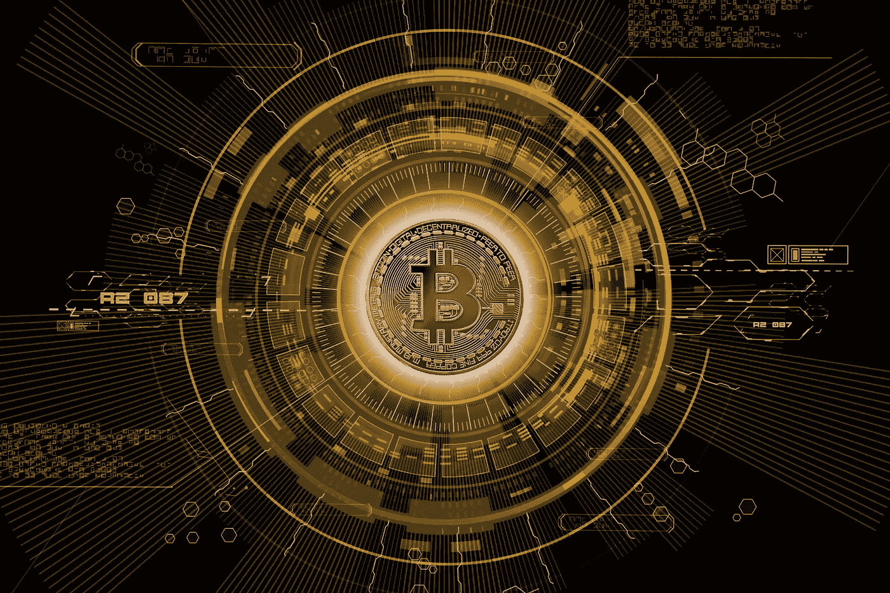
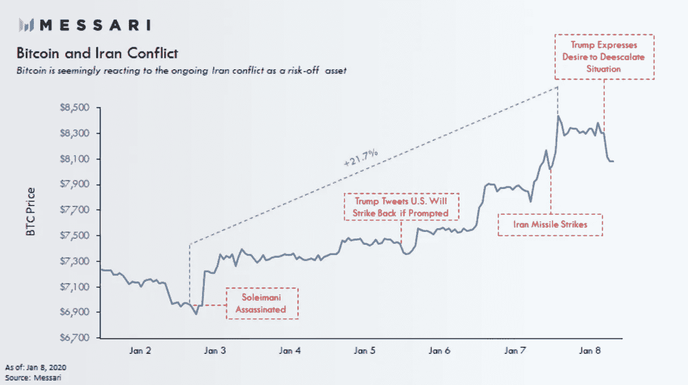
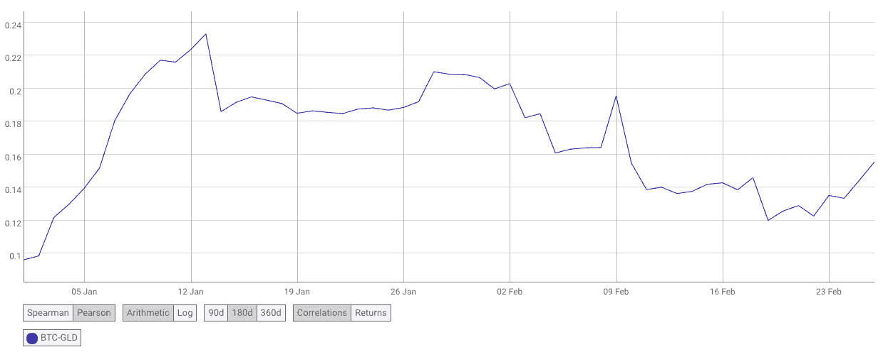

# 黄金已经数字化了吗？比特币炼金术

> 原文：<https://medium.datadriveninvestor.com/has-gold-gone-digital-the-bitcoin-alchemy-bb996011ff7b?source=collection_archive---------2----------------------->

*Image:* [*Pete Linforth*](https://pixabay.com/photos/bitcoin-blockchain-crypto-3132574/)

新十年的开始为未来的行业带来了许多希望和积极的因素——机构对该领域的兴趣增加，监管更加明确，世界上第一个 CBDCs 的推出，以及即将到来的价格反弹，这将使 2017 年看起来微不足道。但当你在今年的第三天醒来，看到 Twitter 上的#WWIII 标签趋势时，我和许多人一样，怀疑世界是否会真正对这种乐观做出回应。

然而，在这场混乱中，全球对比特币与黄金相关性这一热门话题的兴趣再次燃起，只是这一次的热情更高了。已经有很多人——包括我自己——写过比特币在政治或经济动荡时期的避险行为。在众多案例中，最能说明问题的是去年中美之间激烈的经济战争期间硬币的价格走势。然而，1 月份的新事件似乎突然盖过了所有其他事件——美国、伊朗紧张局势和少将卡西姆·索莱马尼(Qasem Soleimani)的死亡。

除非你一直生活在岩石下，否则你很可能听说过 1 月初美国无人机在巴格达国际机场附近意外袭击的消息，这次袭击炸死了伊朗第二大人物，加剧了全世界对中东另一场战争的担忧。有了美国和伊朗的参与，谁知道这离核毁灭会有多近。当时，全世界似乎都在屏住呼吸，等待伊朗对袭击的回应。谢天谢地，现在差不多是 3 月了，我们都可以松一口气了，因为我们知道中东国家的反应并没有导致紧张局势升级。迫在眉睫的战争威胁在我们心中已经变得模糊了。

然而，正如人们所料，在紧张时期，GLD 的价格立即做出反应，在 1 月 7 日达到 1571 美元的峰值——这对于过去一千年来世界上最成熟的避险资产来说并不奇怪。但在加密和非加密社区中，特别值得注意的是比特币表现出类似的模式，因为它在同一周飙升了 20%以上，攀升至新高，突破了持续振荡数周的 7K 美元区间。利用这一事件，网络上突然充斥着展示比特币与黄金相关性的推文、文章和研究，声称这种资产的价值储存质量证明了所谓的“数字黄金”。

现在，随着时间和距离的推移，炒作已经结束，但问题仍然存在——黄金真的数字化了吗？

那么，让我们来看看:

尽管之前的价格波动可能暗示了这一点，但要让比特币真正被视为与黄金相近的数字替代品，它不仅需要在动荡时期表现出避险行为，还需要证明它是一种真正的价值储存手段。

按照他们的定义,“避风港”资产是指投资者在市场不确定或动荡时期会选择购买并持有的资产，因为在这种情况下，它的价值预计会升值，这实际上是一种风险较低的投资。就黄金这种实物商品而言，由于其供应和价值不能受到政府政策和决定的操纵，而且长期以来一直保持其价值，因此它是投资者对冲市场低迷的首选。当市场下跌的事件发生时，其价格会随着需求的增加而上涨。

顺便提一下，我觉得黄金被选为货币使用的默认元素的故事很有趣。为了合适，一个元素必须满足四个品质。首先，由于明显的不切实际的原因，它不可能是气体。当看一个周期表时，会去掉很多元素。第二，它不能是腐蚀性或反应性的，(例如铁或锂)，排除了另外 38 种可能性。第三，出于同样明显的原因，我不能有放射性，这就消除了桌子上整整两行。第四，它必须足够稀有才能有价值，但又不至于稀有到无法找到的程度，这样就有了 5 种元素:铑、钯、铂、银和金。前两个发现于 19 世纪，对早期文明来说太晚了。铂的熔点很高，只有现代熔炉才能达到，这使得早期的使用不切实际，只剩下银和金。两者都曾被用作货币，但银很容易失去光泽，黄金成为最佳和唯一的选择。]

正如美国-伊朗紧张局势所表明的那样，比特币表现出了一种类似避风港的模式，加密研究公司 Messari 在上述期间的比特币价格走势图也说明了这一点。但那一周不仅交易量上升，谷歌趋势还记录了“比特币伊朗”搜索量的增长，特别是在 1 月 4 日和 1 月 8 日，这两天分别是美国打击和伊朗报复的第二天。

*Source:* [*Messari*](https://medium.com/u/7cf93d3c3400?source=post_page-----bb996011ff7b--------------------------------)

然而，如前所述，要真正被视为黄金的可行替代品，比特币必须被明确地接受为一种良好的价值储存手段，被定义为一种随着时间推移保持其价值而不贬值的资产，从而在未来保持购买力。然而，尽管硬币的强烈支持者——我也是——在其短暂的历史中表现出的波动性使其成为一个具有挑战性的支持论点。

此外，虽然在 1 月初观察到这两种资产之间的相关性越来越大，但过去一周的市场趋势进一步质疑我们目前是否能就该主题得出任何明确的结论。随着新冠肺炎病毒蔓延加剧造成的混乱，市场已经开始感受到病毒爆发的全部后果，并开始下跌。与此同时，当 GLD 价格上涨时，BTC 价格反而下跌，拖累了加密市场，其价值在几天内从 10K 美元下跌到 8.8K 美元，损失了 12%。因此，尽管观察 CoinMetrics 的 BTC/GLD 图表表明今年早些时候相关性越来越强，但这也表明“数字黄金”的称号可能仍然为时过早。

Source: @CoinMetrics

尽管如此，尽管怀疑论者可能会额外提到全球市值的差异(黄金市值:～8 万亿美元/比特币市值:1610 亿美元)或比特币缺乏潜在的工业用途等问题，但目前的证据让我倾向于这样的结论:尽管比特币尚未完全实现黄金数字化，但它在未来有着不可思议的潜力。市值可能相差很大，但比特币只有 11 年的历史，仅次于黄金的千年。

总体而言，如今数字硬币仍然是一种太年轻的资产——采用率正在上升，但仍远未达到黄金的水平，随着监管的发展、机构兴趣的增加和 CBDCs 的国家级发展，整个行业才刚刚开始成熟。目前，现有的数据太少，无法准确预测比特币在任何特定场景下的价格趋势。即使在经济衰退的情况下——尽管理论上，它的价值会因其来源和设计而上升，但如果没有经验数据的支持，我们真的能声称它是一种价值储存手段吗？尽管如此，社交交易和多资产经纪公司 eToro 在 9 月份进行的一项调查发现，40%的美国千禧一代(出生于 1980-1994 年)会在衰退期间投资加密货币。

从各种情况来看，尽管还不到那个阶段，比特币成为真正的数字黄金的能力正在随着其市场成熟度而增长。全球采用还远未实现，但肯定会走向更大的主流化，这将被证明是硬币地位的一个关键因素。

无论如何，中本聪可能成为历史上第一个成功创造黄金的炼金术士。