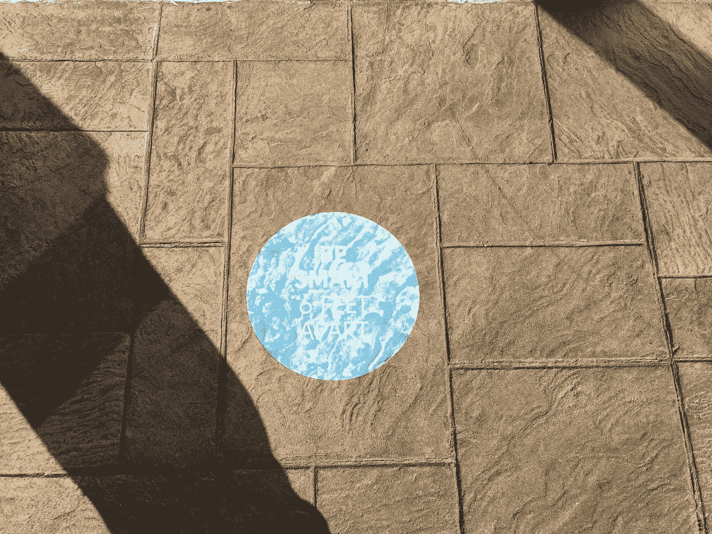
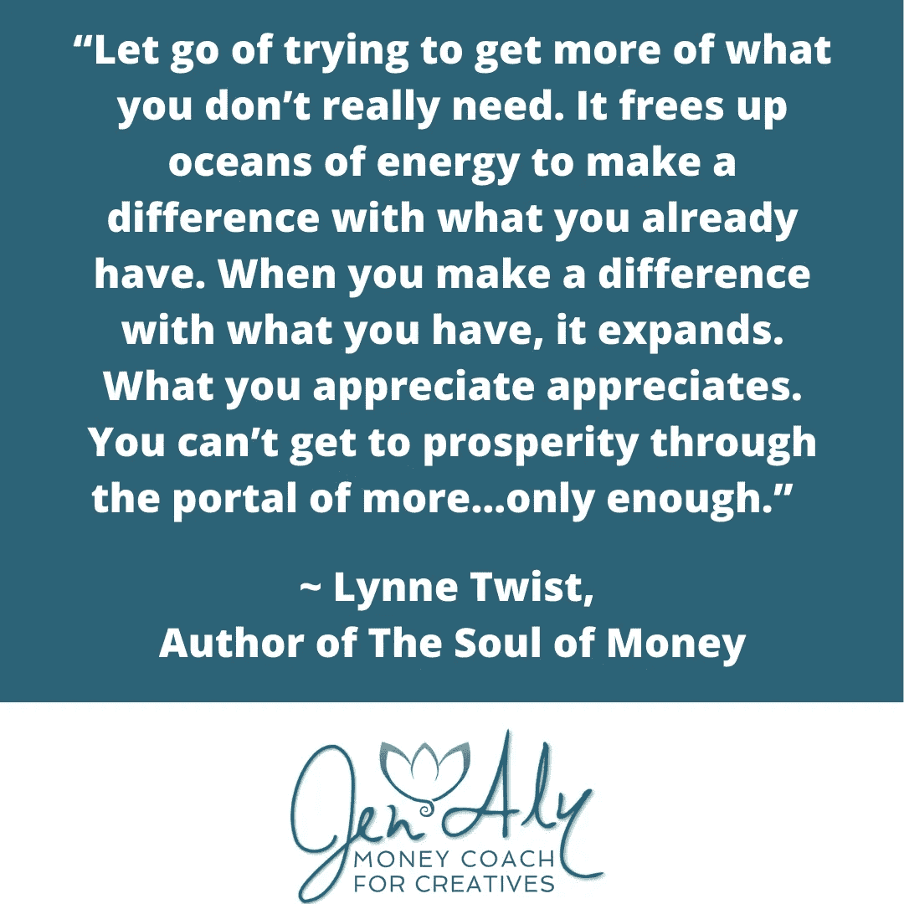

# 疫情劫持了你的金钱思维吗？

> 原文：<https://medium.datadriveninvestor.com/has-the-pandemic-hijacked-your-money-mindset-bec13a8def80?source=collection_archive---------34----------------------->

## 如何回收繁荣的思考

Photo by joel protasio on Unsplash

如果你的金钱心态在过去几个月的疫情中受到了影响，你并不孤单。

不得不围绕一种全世界都在对抗的潜在致命病毒重组你的生活，这并不在我们的任何待办事项清单上，一年后，它正在付出代价。我们仍然没有度过难关。

我们的生活发生了如此多的变化，我无法一一列举，而你正在经历着。

以下是疫情时期影响我们对繁荣思考的几件具体事情。其中许多我们已经适应了，但它们仍然影响着我们的压力水平、感知和情绪能力。(如果您只是想要工具，请随意跳过这一部分。)

Photo by engin akyurt on Unsplash

1.  你的模式和习惯被一种威胁打断，这种威胁似乎在不断演变，而且它们还没有“恢复正常”因此，你的原始大脑和神经系统仍然处于高度警觉状态。“威胁”仍然存在，具体情况不确定。这造成了精神、情感和身体上的压力，而我们却没有通常的应对机制(社交、健身、度假等)。)来应对压力。
2.  与此同时，所有这一切都在发生，你正在经历其他种类的潜在威胁。取决于你的种族、性别、性取向、地域等。，你可能已经感觉到你的权利、安全、健康、生计正受到来自各种角度的威胁，这是基于已经浮出水面的情况和政治气候。表达的政治极性渗透到口罩、疫苗等决策中。
3.  孤立对我们这些群居动物来说是件大事。我们大脑的某些部分认为我们需要在一个“部落”中才能生存。我们只是错过了很多，包括团体聚会，看到别人不戴面具，自由旅行等等。我们的世界变小了，尤其是我们看到的不戴面具的人。
4.  如果你有孩子，这无疑是有压力的。让你的孩子白天呆在家里虚拟学校，或者带着面具送他们去学校，有限的社会交往对每个人来说都是巨大的变化。长期影响也不确定。这篇文章是众多分解对儿童影响的文章之一。
5.  你的工作可能已经改变了。如果你有自己的事业，你可能正在挣扎，或者你必须做出某种改变。即使你有一项业务蒸蒸日上，增长也是有压力的。如果你有一份工作，它可能已经发生了重大变化。如果你失业了，在一个不确定的市场中，这是一个巨大的压力。我们的目标感、财务安全(和金钱心态)、社会生活和日常事务都受到我们工作的影响。
6.  COVID 可能影响了您和/或亲人或社区成员的健康。你可能经历了由于 COVID 和没有通常的访问和仪式选项的损失。
7.  你已经在未知的因素和不断变化的信息下做出了无数的决定，这些决定经常会影响到其他人，有时看起来风险很高。无论是简单到一天中的什么时候去商店，你是否应该拜访你的父母，或者是否要接种疫苗，一切都感觉像是压力。
8.  经济变化包括整个行业的关闭。某些行业正呈指数级增长。数字货币正在发展(无论你是否加入)。缺乏来自政府的一贯支持(至少在美国)以及通过复杂的官僚机构来获得可用的东西，也增加了我们的压力水平。

Photo by Jen Aly

# 稀缺性不仅仅是钱的问题，甚至也不仅仅是金钱心态的问题。这是感觉被切断的结果。

一个健康的金钱心态，或者说繁荣心态来自于感觉联系和安全，而不仅仅是你银行账户里的钱。

繁荣思维不是关于过剩，而是关于足够。稀缺思维来自于对匮乏的感知。

“当你对你所拥有的有所改变时，它就会扩大。你欣赏的欣赏。你无法通过“更多……足够”的入口达到繁荣。”~ Lynne Twist，金钱的灵魂

整个经济学体系**依赖于**其核心的“稀缺性”。

一本经济学教科书是这样定义稀缺性的:“经济学是一门关于在涉及稀缺资源的各种选择中做出选择的科学。”在*的《经济社会的形成》一书中，经济学家罗伯特·海尔布隆纳强调了这一点:“如果没有稀缺……经济学……将不再作为一种社会职业存在。”*

没有稀缺性，经济学就不存在，这个事实很重要。这是我们经济体系基础的一个方面。我们的工作是重新规划我们的思维，发展我们与金钱和财富的关系。

我们处在一种文化中，这种文化让我们相信持续增长、过剩、超大和拥有更多是有史以来最好的事情。因此，我们的文化是不可持续的，剥削性的，并且收入比例越来越不平衡。

我最聪明的部分知道这整个经历是一个重置。这是一个愈合、转变、联系和创新的机会。所以，我们继续前进。

为了获得更多的创造力和韧性，并转变成下一个版本的自己，你必须精心照顾自己和自己的心态，这一点很重要。摆脱匮乏，培养健康的金钱心态或繁荣心态是减轻压力的关键。这里有一些强大的工具可以做到这一点。

# 重获繁荣心态的 5 种方法:

**1-** 要事第一。**照顾好你的神经系统。** **你只能在你的神经系统有能力的范围内成长或扩张。**它已经被征收了很长时间的税，压力层层压在所有其他东西的下面和上面。看看这篇关于为什么你在疫情呆了几个月后感觉很糟糕的文章。做任何简单的，免费的，无价的练习，包括简短的迷走神经练习。

> 你只能在你的神经系统有能力的范围内成长或扩展。

**2-** 培养“足够”的心态。弄清楚你有什么，你需要什么。我们的“需求”不仅仅是我们认为的基本需求，它们在本质上可能是情绪化的。

你现在有足够的钱吗？如果是，那就接受它，让它足够。感受到的时候表达感激。

如果你需要某样东西，问这些问题中的任何一个都会让你有可能:如果我有这个，我会去哪里找它？我能在哪里找到它？谁能帮忙？谁知道去哪里寻求帮助？有没有另一种我还没想到的方法可以得到我需要的东西？

(而如果你是那种只是对自己说“我什么都不需要”的人，再问问自己，听听自己内心的童真。看看她需要什么，想办法给她。)

**3-** 当你从其他人(包括媒体)那里看到/听到稀缺思维，并决定它不一定是你的计划时，请注意。如果你感到匮乏，考虑诸如“我需要什么就来找我”和“我每天都更容易接受”这样的肯定。(这两句都出自托莎·西尔弗的书《这不是你的钱》。在这里找到更多书籍资源。

**4-** 减少“生产力羞耻”

“生产力羞耻”:经常对你能完成的事情设定不切实际的期望，然后当你达不到目标时击败自己的行为乔瑟琳·k·格莱

这看起来更少的压力和更多的自我同情。同情你正在经历的一切。给自己少一点压力。这可能意味着给自己更多的时间来完成一个项目。这可能意味着要求、接受和给予自己更多的支持。在你雇教练之前，读一下这个。软化你与“生产力”的关系，今天做你力所能及的事情。

如果你想更进一步，在一天结束时写下你的成就清单(即使是小的)。我的许多客户发现这个简单的工具特别强大。

**5-** 比平时更频繁地与朋友、熟人和爱人联系。向他人伸出援手，建立联系。

这可能是在群组缩放会议中与你认识的人开始私人聊天…就像你亲自与他们打招呼一样。你可以和同事建立一个每周一次的责任/支持电话。

或者你可以只是和家人视频聊天，而你通常只是聊天。只是比过去更进一步。这对你和他人都有好处。

**培养你的神经系统、金钱心态和人际关系，你将有更多的能力去创造你所拥有的，而不是感觉你没有足够的。**

这是一个强大的基础，它让你对拥有“足够”的压力感觉更少，并更专注于做你需要做的事情来照顾你自己和你周围的人。它让你对可能性持开放态度，让你茁壮成长，而不仅仅是生存。