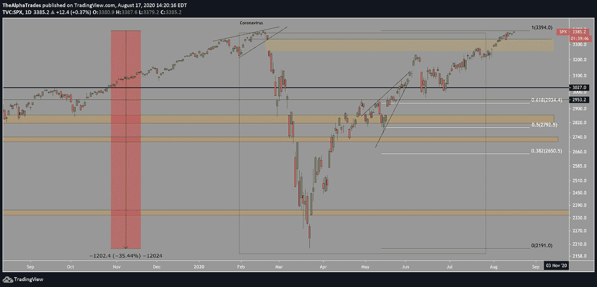
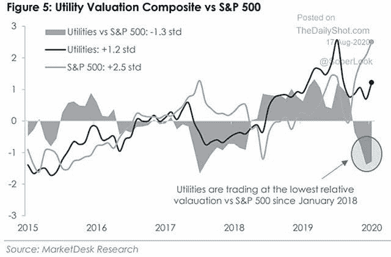
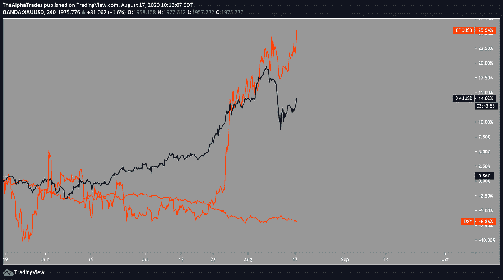
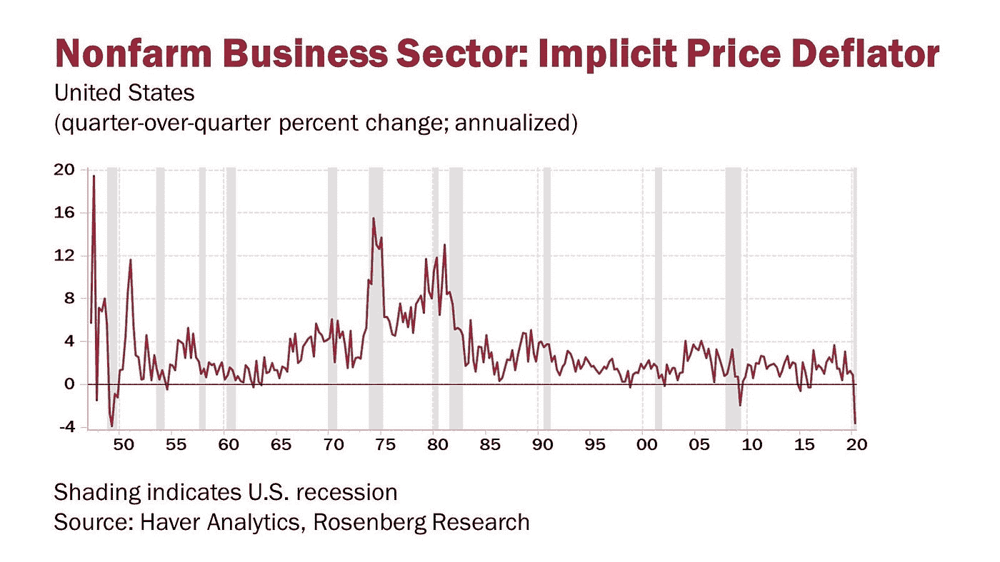
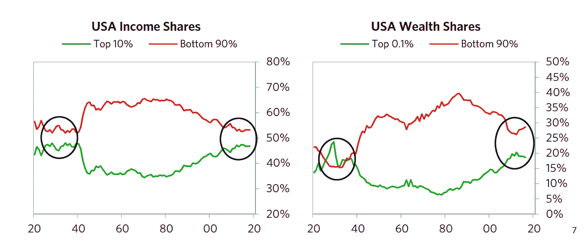

# 我们都放弃的回调终于到来了吗？

> 原文：<https://medium.datadriveninvestor.com/has-the-pullback-we-all-gave-up-on-finally-arrived-56da7e9fa0e0?source=collection_archive---------5----------------------->

## **市场&经济更新| 8 月 18 日|阿尔法交易**

几个月来，随着波动性降至中性，市场的整体情绪一直徘徊在“[贪婪](https://money.cnn.com/data/fear-and-greed/)”的水平。在收复了 3 月份抛售期间的所有失地后，标准普尔指数接近历史高点，并测试了超过三天的阻力。空头可能正在加速罢工，或者换句话说，大规模获利回吐可能最终即将来临。

每个人都在等待一个[周期](https://seekingalpha.com/article/4369260-sharp-market-selloff-looms-amidst-historic-capital-rotation)，从被高估的公司进入被低估的价值部门，但是它什么时候到来呢？

老实说，一个月前，我和其他人一样，怀疑 S&P 今年会创下历史新高，更别说 8 月份了。

更令人惊讶的是，市场仍然由科技主导。与 COVID 之前相比，价值部门的交易水平仍然相对较低。尽管市场情绪发生了变化，但近期技术指标继续指向本周新高的突破。

为了对价值增长和 FAANG 进行一些比较，下面的图表显示了与标准普尔 500 相比，公用事业被大大低估的程度。

Source: MarketDesk Research; [https://www.isabelnet.com/utility-valuation-composite-vs-sp-500/](https://www.google.com/url?q=https://www.isabelnet.com/utility-valuation-composite-vs-sp-500/&sa=D&ust=1597774000153000&usg=AFQjCNEeb7hbqt5EBPwOZAieOel5y-E-SQ)

# 简单地说，这就是我等着看的:

*   股票价格的回落
*   DXY 底部可能在
*   长期:当一种疫苗被批准并大规模分发时，这是一个全面的重大倒退

# 观察名单

我们在这篇文章最后的视频中讨论了这些，但这里有一个总结。

# EverQuote (EVER) —长期持有

**我们的立场:**长期(计划在未来 1-2 年持有)

**推理:**尽管 Q2 业绩良好，包括收入同比增长 41%，但该资产的交易价格非常低。汽车保险公司可以在网上高效经营业务，这是一个很好的理由。也就是说，EverQuote 计划扩展到汽车保险之外。凭借 93%的毛利率和不断扩大的产品生态系统，它有能力度过艰难时期。不仅债务为零，而且他们的现金产出速度还在加快。很少看到一家公司有如此大的优势，交易价格从高点下跌超过 20%。

[**第二种意见**](https://seekingalpha.com/article/4365707-everquote-buy-dip)

# 大数据和人工智能

**我们的位置:**龙

**推理:**尽管在盈利后受到挤压，但 Alteryx 是人工智能和大数据分析领域领先的成长型公司。凭借超过 90%的毛利率，该公司可以轻松产生现金。虽然该股在收益亏损后大幅回调，但似乎他们可以摆脱关于 COVID 或公司资本支出缺陷的暂时挫折。

[**第二意见**](https://seekingalpha.com/article/4369280-alteryx-valuing-ever-changing-growth-story)

# 微软(MSFT)——需要撤资。

**我们的位置:**无，观望

微软正在谈判收购抖音在美国、纽西兰、澳洲、加拿大和英国的业务。因为我们不会马上看到这样一笔交易的风声，所以这家公司将是一个长期的玩法。然而，在介入之前，我们希望看到大型科技股出现调整。只要他们在云产品领域保持主导地位，同时在网络安全等互补领域扩张，MSFT 就值得在每次回调时买入。

[**第二种意见**](https://finance.yahoo.com/news/microsoft-looking-snap-tiktok-uk-085429083.html)

# 尼古拉(NKLA)——炒作

**出局位置:**无，观望

**推理:**这家电动汽车初创公司一直是散户投资者的宠儿，他们投机于特斯拉处于劣势的竞争对手，最近利用了该公司为其电动垃圾车[达成大单的新闻。有理由小心这些被炒作的股票，即使该公司正在做了不起的事情。举个例子，Nikola 迄今为止唯一的收入就是为其创始人建造](https://techcrunch.com/2020/08/10/nikola-stock-surges-on-order-for-2500-electric-garbage-trucks/)[太阳能电池板](https://www.businessinsider.com/nikola-earnings-only-revenue-solar-panels-founder-chairman-trevor-milton-2020-8)。

[**第二种意见**](https://seekingalpha.com/article/4367868-nikola-riding-industry-hype)

# 每日 S&P 生物技术牛 3X 股(布拉)——荣誉奖

**我们的位置:**龙

**推理:**在新冠肺炎疫苗投机的时代，在疫情之前，生物技术是一个强劲的领域，布拉是一个很好的对冲。由于 COVID 和政府的支持，随着资金流入该行业，生物技术公司出现了相当大的增长。不过，这些股票还有很多创新空间。这场危机只是强调了这一点。然而，玩生物技术是有风险的，所以在我们看来，最好的方式是通过交易所交易基金，如 XBI、IBB 或布拉，如果你喜欢波动性的话。

# 对冲赌注——加密和贵金属

黄金和 BTC 在过去的几天里紧紧缠绕在一起。随着 DXY 慢慢失血，这对两种资产都是好兆头。特别是，黄金最近经历了[的大幅抛售](https://markets.businessinsider.com/commodities/news/5-reasons-why-gold-down-not-out-according-to-analysts-2020-8-1029495865#)，但仍有上涨的空间和理由。

Gold vs DXY vs BTC; Source: Alpha Trades

随着总统选举的临近，[对下一个 COVID 刺激方案的不确定性](https://edition.cnn.com/2020/08/11/politics/stimulus-checks-congress-negotiations/index.html)，以及对冲基金[做空](https://www.bloomberg.com/news/articles/2020-08-17/hedge-funds-are-short-on-the-dollar-for-first-time-in-two-years)美元，贵金属和比特币在最近的冷静期后可能会继续上涨。

 [## 后疫情经济中的基本 GTM 变革策略|数据驱动的投资者

### 新冠肺炎以一种新的不可想象的方式开展业务。这个疫情甚至强迫…

www.datadriveninvestor.com](https://www.datadriveninvestor.com/2020/08/11/an-essential-gtm-change-strategies-in-the-post-pandemic-economy/) 

在过去几周多次测试该区域后，比特币已经突破了 12，000 美元的关键阻力。

# 实际通货膨胀

美国的核心通胀率约为 1.6%，低于美联储 2%的目标。此外，下图显示了自 20 世纪 50 年代以来最严重的非农价格通缩，可能是由于对某些消费品的需求崩溃。

Source: Haver Analytics, Rosenberg Research

许多分析师预计，相对于目前领取失业救济金的 3130 万人，消费水平通胀将保持在可控范围内，这是一个抑制工资近期上涨的令人沮丧的因素。

我不认为这是一个好的或中立的统计数字。高工资工人的就业率几乎恢复到 COVID 之前的水平。尽管如此，以同样的标准衡量，低收入工人仍然远远落后。这一差距将在本文中进一步探讨。

Percent Change in Employment; Source: Opportunity Insights

关注消费者价格的官方通胀数据中遗漏的，是我们已经在[教育](https://www.cnbc.com/2019/12/13/cost-of-college-increased-by-more-than-25percent-in-the-last-10-years.html)、[住房](https://www.nytimes.com/2020/07/31/business/housing-market-prices-risk.html)、[医疗](https://www.reuters.com/article/us-usa-economy/us-inflation-firms-on-rising-healthcare-energy-costs-idUSKBN1XN1US)和[股票市场价格](https://www.ccn.com/stock-market-asset-price-inflation/)中目睹的长期通胀。

此外，非农通缩数据只是故事的一部分。我们可能会在普通消费者无论如何都买不起的大件商品上遭遇通货紧缩。另一方面，我们将看到对低收入家庭至关重要的消费品价格上涨。

至于股市，较富裕的个人倾向于持有股票，而底层的公民更关心面包和牛奶的价格。历史表明，无情的印钞有利于股市和有能力投资股票的人。然后他们可以将这些钱投资到房地产上。这种循环推高了社会底层的生活成本。

Bridgewater Associates 对冲基金经理雷伊·达里奥就 2008 年债务危机写道:

> *“各国央行印钱，购买金融资产，把钱放到购买其他金融资产的投资者手里，造成金融资产价格上涨，对经济有帮助，对那些足够富裕拥有金融资产的人特别有利，所以加大了财富差距。”(* [*来源*](https://www.linkedin.com/pulse/big-cycle-united-states-dollar-part-2-ray-dalio/) *)*

今天，您可以看到这种情况以越来越快的速度发展的影响:

Source: Ray Dalio

我们必须记住，虽然一旦疫情成为过去，COVID 造成的大部分损害将会逆转，但经济的某些部分需要数年才能恢复。许多企业，从小型家庭商店到大型特许经营店，都面临着永远无法重新开业的风险。

我们在整个封锁期看到的猖獗的股市投机行为，对于那些买不起 YOLO 特斯拉和亚马逊股票的人来说，很难获得多少好处。

# 意见

## 美元哪儿也不会去。

随着头条新闻宣称中国和俄罗斯将放弃美元，人们可能会得出结论，美元将在美国本土遭遇严重问题。但想想上一次像这样的全球重组事件，世界上大多数债务都是以美元计价的。由于是世界储备纸币的唯一发行者，美国成功地避开了一些严重的金融问题。

讨论超出了本文的范围，但是考虑一下美元是如何构成所有央行外汇储备的 60%的。此外，超过 90%的外汇交易是美元对，全球超过 40%的债务以美元发行。

那里有很多东西要打开，我建议从这里的[开始](https://www.thebalance.com/world-currency-3305931)，还有这里的。雷伊·达里奥也在 LinkedIn 上写了很多关于这个话题的文章。

从这种咆哮中得到的启示是:尽管可能仍有一些负面影响，但我预计随着总统大选的临近，美元将会反弹。

# 结果

现在不是 100%投入的时候。然而，如果你愿意在波动中坚持，长期交易还是有机会的。

这篇文章写得有点乱。你想让我们报道些什么吗？[在 Discord 服务器上给我们留言](https://discord.gg/a97qq2s)。

# 观看表演

这一周，我们深入探讨市场、密码和经济。通过最近的剧集找到你的优势:

[比特币货币的循环如何影响 DeFi |水平，需要长期关注](https://youtu.be/tZ_UKM1Foic)

[莱特币会超过以太坊和比特币吗？](https://youtu.be/qi7qa6-6go0)

*我们从他的文章中推导出你正在阅读的内容:*

[2020 年 8 月 17 日美国股市讨论周](https://youtu.be/aP70JWqRdZc)

订阅阿尔法交易不和谐服务器学习技术分析和如何投资获利。询问 2 天的高级会员试用！

# 放弃

Alpha Trades，LLC 提供的信息不用于制定任何财务决策，也不是购买、持有和/或出售特定证券或金融工具的请求或建议。

访问 Alpha Trades 的完整服务条款:[https://bit.ly/3faVeeV](https://bit.ly/3faVeeV)

**访问专家视图—** [**订阅 DDI 英特尔**](https://datadriveninvestor.com/ddi-intel)