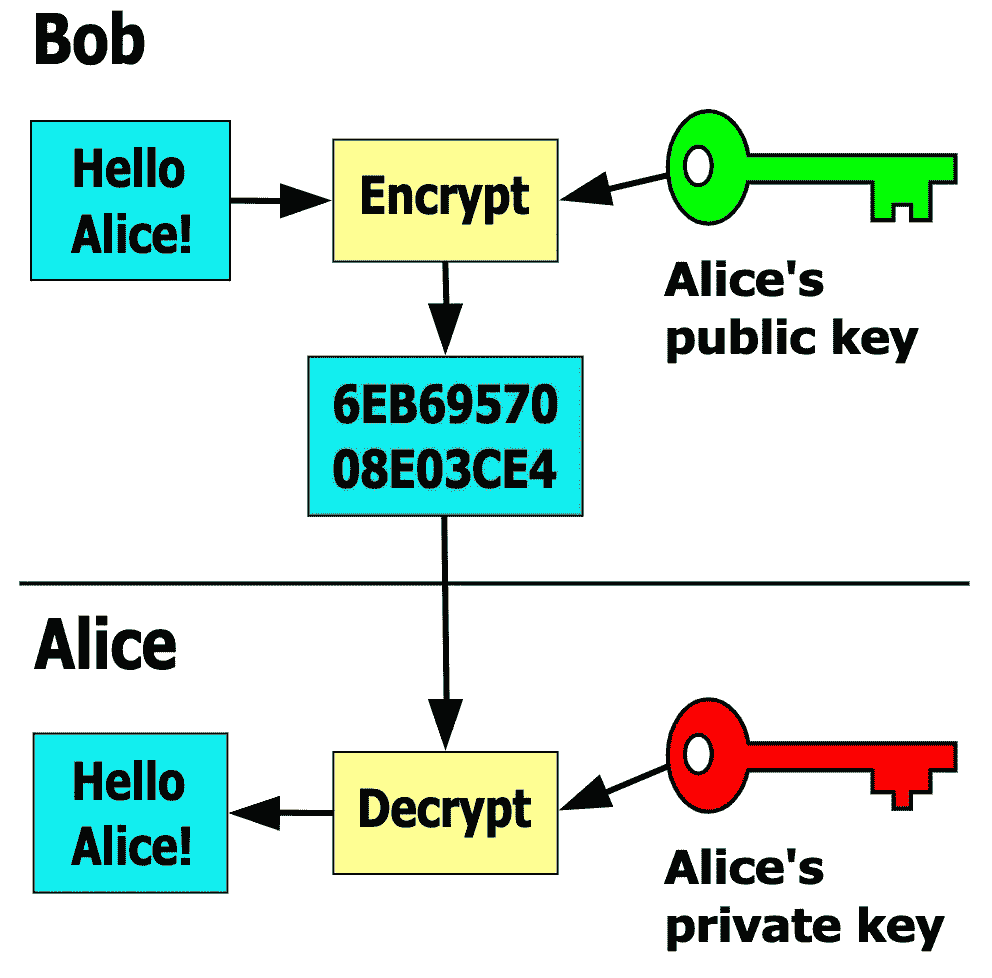
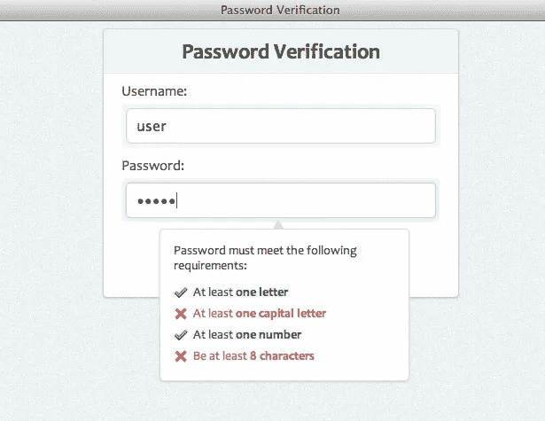
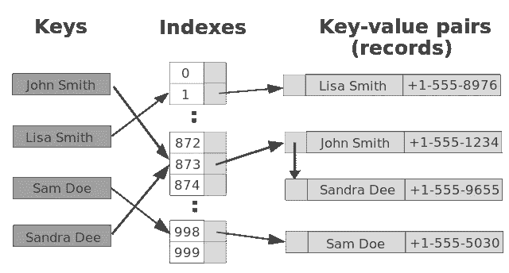
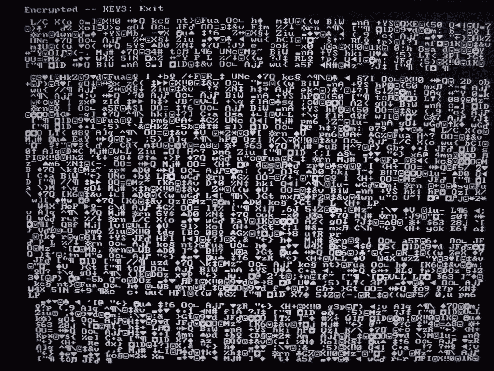

# 哈希函数——一瞥

> 原文：<https://medium.datadriveninvestor.com/hash-functions-a-brief-glimpse-a9a2fbc06e80?source=collection_archive---------10----------------------->

哈希…

土豆煎饼。

不…哈希。

我一直对“hash”这个词的名称和用途很好奇。仅提及名称意味着数据类型存储信息。提到“哈希值”通常是在身份验证的上下文中进行的。

一般来说，哈希函数是一种接受字符串并返回值的函数。

问题是:它们有什么用途，有多少不同种类？

# 加密哈希函数

任何东西的前缀“crypto”听起来都很酷。我最喜欢的小说之一是尼尔·斯蒂芬森(Neil Stephenson)的 *Cryptonomicon，他是一位不回避技术术语的作家，甚至让它听起来很有诗意。以下是简短的一瞥:*

*“即使是 768 位的密钥也需要大量的资源来破解。增加一位，使其长度为 769 位，并且可能的密钥数量加倍，问题变得困难得多。一个 770 位的密钥要困难得多，等等。通过使用 768 位密钥，至少在未来几年内，兰迪和阿维可以对世界上几乎所有的实体保密他们的通信。一个 1024 位的密钥将非常难以破解。”*

令人惊讶的是，在学习了更多关于哈希函数的知识后，这段文字变得多么有影响力。这些算法将任意大小的数据(通常称为“消息”)映射到固定大小的“位数组”。

位数组被称为“哈希值”、“哈希”或“消息摘要”该算法本身被称为“单向函数”，是“实际上不可行的逆转。”你明白我的意思吗？来自 *Cryptonomicon* 的那一段就像花朵一样开放了！

显然，这一切都是以安全和保护应用程序免受各种攻击的名义进行的。真正找到产生给定散列的消息的唯一方法是从字面上搜索所有不同的可能输入，这些输入将产生攻击者以某种方式得到的“消息摘要”。更难的是，编写哈希函数时通常会考虑以下属性:

## 主要属性

1.  确定性:相同的消息总是产生相同的哈希值。
2.  速度:对于任何给定的消息，可以快速计算出哈希值。
3.  不可行:从给定的哈希值生成消息是不可行的。
4.  冲突不可行:找到两个具有相同哈希值的不同消息的可能性很小。

# 应用程序

散列函数有如此多的用途——其中许多并不是显而易见的。以下是几个例子:

## 完整

哈希函数通常用于验证消息和文件的完整性。流程是这样的:

1.  写下你的信息
2.  在发送消息之前计算哈希值。
3.  接收方:接收消息后计算哈希值。
4.  发送方和接收方现在比较各自的哈希值。如果值不同，则意味着消息或文件已经以某种方式被篡改。

这显然对许多场景都有影响，从软件开发到电子邮件到政治调度到合同等等。一些组织甚至在他们的网站上发布重要文档的哈希摘要，以便任何人都可以验证他们从网站上获得的信息是预期的。这被称为“信任链”——很好的例子是点对点的共享网站、论坛和像 Adobe 这样的大公司等。

以下是政府机构和公司使用的一些哈希函数，用于计算哈希摘要以发布到他们的网站上:

*   [MD5](https://en.wikipedia.org/wiki/MD5)
*   [SHA-1](https://en.wikipedia.org/wiki/SHA-1)
*   [SHA-2](https://en.wikipedia.org/wiki/SHA-2)

[Git 和 Linux](http://manpages.ubuntu.com/manpages/xenial/man1/sha1sum.1.html) 实际上是通过一个名为 [sha1sum](https://en.wikipedia.org/wiki/Sha1sum) 的程序，利用哈希函数来唯一识别各种类型的内容。

## 数字签名

这是现代世界的一部分，让现在活着如此有意义。数字签名可以使用哈希函数生成，而哈希函数比手写签名更难以伪造。

## [非对称密钥加密](https://en.wikipedia.org/wiki/Public-key_cryptography)

数字签名的一个重要方面是“非对称密钥加密”的实现这就是关于兰迪和阿维的段落开始变得更加理解的地方。生成了两个密钥，一个公钥和一个私钥。

1.  发送方使用公钥加密消息。
2.  接收者使用私钥解密消息

使用的名称是不对称的，因为发送方用于加密的密钥不同于接收消息后用于解密的密钥。

## 密码验证

这一点很明显，但是快速的解释总是有利的。应用程序通常会要求您确认刚刚键入的密码，以帮助您确保选择了一个容易记住的密码。应用程序获取两个密码字段的条目，并通过哈希函数运行它们，然后比较结果哈希值。如果它们匹配，那么你已经成功地确认了你的密码。

## 工作证明

一些散列函数被编写成有目的地占用计算机的资源来计算散列值。一旦价值被计算、呈现和确认，请求者将得到服务或软件的回报。最受欢迎的例子是加密货币:

*   比特币:工作证明解锁采矿奖励
*   HashCash:工作证明解锁“善意”令牌

## 哈希表查找

您甚至可以使用哈希函数和加密哈希函数在哈希表中查找数据。哈希表的好处是能够用标识值的键存储数据，反之亦然。这里不需要深入讨论，但这是一个很重要的常用用法。

# 有启发作用的

这些功能的使用范围是惊人的。更令人惊讶的是，正如在 *Cryptonomicon，*中所描述的，70 多年前，一组组专业“计算机”(他们唯一的工作就是计算/求解/做数学)需要数月甚至数年来加密/解密代码。只要想想我们的电脑已经走了多远，甚至我们的手机也有多强大:它们能够为像短信这样的日常事物运行端到端加密。

# 资源:

*   https://en.wikipedia.org/wiki/Cryptographic_hash_function
*   【https://en.wikipedia.org/wiki/Hash_function 
*   https://blog . bradfieldcs . com/an-introduction-to-hashing-in-the-era of-machine-learning-6039394549 B0
*   [https://en . Wikipedia . org/wiki/Hash _ function #:~:text = The % 20 term % 20% 22 Hash % 22% 20 offers % 20a，data % 20 to % 20 derive % 20 thes % 20 output。](https://en.wikipedia.org/wiki/Hash_function#:~:text=The%20term%20%22hash%22%20offers%20a,data%20to%20derive%20their%20output.)
*   [http://www.digitizationguidelines.gov/term.php?term =校验和](http://www.digitizationguidelines.gov/term.php?term=md5checksum)
*   [https://en.wikipedia.org/wiki/Cryptonomicon](https://en.wikipedia.org/wiki/Cryptonomicon)