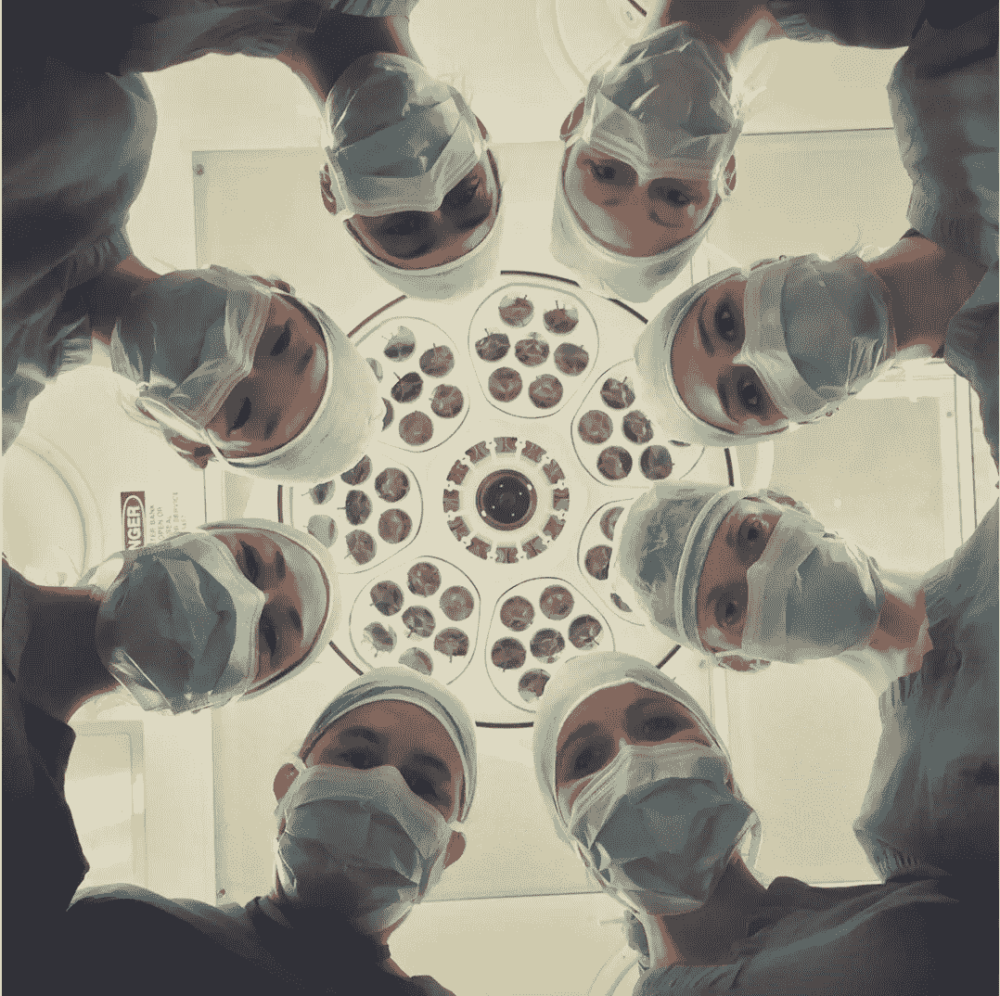

# 孟加拉国医生真的找到了治愈冠状病毒的方法吗？

> 原文：<https://medium.datadriveninvestor.com/have-bangladesh-doctors-actually-found-the-cure-to-coronavirus-cceebb9dafe2?source=collection_archive---------15----------------------->

忘了 remdesivir 吧…有一种新药声称能在 4 天内治愈 19 名患者。他们真的找到解药了吗？

Unplash @nci

## COVID19 患者的百分之百恢复率

据说，来自孟加拉国的一个医疗小组发现了迄今为止治疗和治愈冠状病毒患者的最有效方法。这支医生队伍中有一些全国最杰出的医生，他们不知疲倦地工作，抗击病毒，拯救生命。

他们在 60 名患者身上使用了两种药物组合，帮助 **100%的患者在 4 天内康复。没有副作用。**

> 4 天，100%的患者完全康复。

这次复苏简直是一个奇迹。

临床医生声称使用了一种叫做伊维菌素的抗原生动物药物和一种叫做强力霉素的单一剂量抗生素的组合。

这有助于在 3 天内将症状减轻 50%,并且到第四天，患者已经完全康复。

该团队表示，他们仅将这些药物用于感染冠状病毒且测试呈阳性的呼吸系统疾病患者。在重复测试中，服用该药物的这些患者在 4 天内康复并且测试为阴性。

## 这对我们意味着什么？

让我们面对现实吧，这并不是第一次声称可以治愈 COVID19。在过去的 2-3 个月里，各国一直在争夺个人防护装备包、口罩、检测包，最常见的是 ***谁先拿到药品？***

从羟氯喹的竞标开始，当时法国的一项非决定性研究声称这种药物将是疫情的治愈方法。随之而来的是各国争夺这种药物的剩余储备，而迄今为止的大多数研究和试验都无法证明这种药物的用途。

然后是雷地昔韦，有研究支持其有效性，然而，大多数国家特别是美国没有足够的储备来帮助所有患者。

虽然我们可能怀疑这两种药物的有效性。

PTI 最近对医生的采访消除了我们的大部分担忧，他们表示他们正在发布数据，并使其对全球科学界可用和有用。

这些数据的公布将是其价值的最终证明。

> 在那之前祈祷吧。让我们希望这两种药物是世界上对抗冠状病毒的下一个武器。

参考

[http://www . pti news . com/news/11483391 _ 发现-有效-药物-联合-治愈-Bangladeshi-doctors.html-新冠肺炎-患者？UTM _ campaign = full article&UTM _ medium = referral&UTM _ source = in shorts](http://www.ptinews.com/news/11483391_Found-effective-drug-combination-to-cure-COVID-19-patients--Bangladeshi-doctors.html?utm_campaign=fullarticle&utm_medium=referral&utm_source=inshorts)