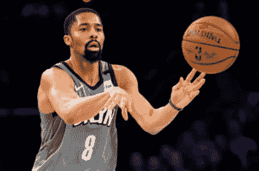

# NBA 球员通过数字化赞助合同扰乱运动队和球员开创了先例吗？

> 原文：<https://medium.datadriveninvestor.com/have-nba-player-set-a-president-to-disrupt-sports-teams-and-players-by-digitising-sponsorship-47c5b79ada07?source=collection_archive---------20----------------------->

**如何在体育明星的支持下赚取超过当前利率三倍的利息**

Source: USA Today

美国国家篮球队(NBA)球员斯宾塞·丁翁迪将发行 3 年期债券，利率为 4.95%，这可能成为一个里程碑式的事件。相比之下， [2 年期美国国债的当前利率为 1.56%](https://ycharts.com/indicators/2_year_treasury_rate) 。丁威迪已经“锁定”在与 NBA 的斗争中(NBA 威胁要禁止他进入 NBA 联盟)，因为它不希望他推出 1350 万美元的债券，这将由他的三年 3400 万美元的合同提供支持。这位 26 岁的加州人目前仅被估计为价值 50 万至 200 万美元的正在寻求部分出售他与篮网队(他目前的篮球队，未来三年内)的合同，并将 1350 万美元“收入囊中”。他必须每年向债券持有人偿还 4.95%的利息，并在三年后归还他们的资本。然而，他有 3400 万美元的合同收入来偿还他对债券持有人的债务。Dinwiddie 说:“我正在尝试定义一个新的资产类别，并开始使用它。

因此，虽然这项投资并不适合丁威迪的所有粉丝，但它开创了一个有趣的先例，不仅是对 NBA 球员，而是对全球所有的体育专业人士。不仅仅是运动个人希望使用区块链，团队也在释放其潜力。NBA 萨克拉门托国王队将推出一个体育纪念品拍卖平台，为拍卖物品建立一个安全的数据库。第一个项目是一个球员的衬衫(收益将捐给飓风道林的受害者)，中标者将获得服装，权威认证，[加上一个包含历史和未来记录的数字令牌。](https://www.theblockcrypto.com/post/53129/nbas-sacramento-kings-partner-with-consensys-to-launch-sports-gear-auctions-on-ethereum?utm_source=newsletter&utm_medium=email&utm_campaign=2020-01-15)*“我们已经将区块链技术整合到我们跨多个平台的业务中，包括我们的奖励计划，现在我们的球迷将有机会使用一种创新的基于区块链的解决方案安全地实时购买真实的游戏磨损商品*，”萨克拉门托国王队首席技术官瑞安·蒙托亚在一份声明中说。

 [## 2019 年十大区块链课程|数据驱动的投资者

### 渴望在区块链发展吗？你想知道区块链是如何工作的，但不知道在哪里？或者就是太多了…

www.datadriveninvestor.com](https://www.datadriveninvestor.com/2019/03/08/top-10-blockchain-courses/) 

[Hogan Lovells 的合伙人](https://www.law.com/legaltechnews/2020/01/23/lawyers-dont-think-nba-players-blockchain-contract-is-a-regulatory-risk/?kw=Lawyers%20Don%27t%20Think%20NBA%20Player%27s%20Blockchain%20Contract%20Is%20a%20Regulatory%20Risk&utm_source=email&utm_medium=enl&utm_campaign=afternoonupdate&utm_content=20200123&utm_term=ltn&slreturn=20200024110511)和美国区块链技术实践负责人 Ted Mlynar 对 Dinwiddie 正在做的事情发表了评论“*名气稍纵即逝，这使得职业运动员能够更快地利用这一点，……如果你只有五分钟的名气，最好提前拿钱*

这种创新债券背后的公司是[证券化](https://www.googleadservices.com/pagead/aclk?sa=L&ai=DChcSEwj7we3Or4DnAhUZ4O0KHTJ0CHoYABAAGgJkZw&ohost=www.google.com&cid=CAESQeD2ch5zpVTYp36fIbFMOvK1NvmKX7GnK1xzDcL6DXO78nk88TOuMiOUIa4qMfthkdNR4R41Vt2pVnHRkTwmpuEV&sig=AOD64_3W-VaZ43i5biF2KNhPDW2HplAs_Q&q=&ved=2ahUKEwj13ubOr4DnAhXUSBUIHTOqBFYQ0Qx6BAgTEAE&adurl=&bg=!LC-lLzdYci_SoI5kEy8CAAAAM1IAAAACCgBL0pjYP0sVdQLBw9msDpiz1Ft5UMMw-NgPkAca38E0YY9AEY3LvbQ-2HUSJSxCaXfUgojQCh5Fz9j5yvgl5lYE9ju0HsscNCPpKaFjmQDesUpkwh9O5YEFoPaMse7N5W3B38qK_AetMVfTKI8wKm6dn1vmQ1wmXk0f8g9xvQ7G7wWXDieIqHAomRJvW6i8RlsYG-QUOWrGaMlHP-qPhkb51b5x33JMjKznOSQ4YtSMuru5vSYj-zkqxZh76J4BQQ5Ufweb-8TqWA005dxqLVpXsuLulZI_jnF_wDVrMH9xMVl_lrfAe0GCrzFlbsS1UtJOyPWXAm2MHQFB6D7MZCD14UDrK_31w6yxCAphJkQw25CIJDjW7FmQhBErY_hXweaV1L0XDoHZiKt3H-AZ)，它也在寻求发行新的数字[证券，为世界象棋](https://www.cnbc.com/2019/11/22/world-chess-sells-digital-tokens-as-it-launches-hybrid-ipo.html)筹集资金，世界象棋是一家媒体和在线游戏公司，此前拥有世界象棋锦标赛的转播权。一旦世界象棋公司在伦敦另类投资市场(AIM)上市，数字证券将允许投资者转换成股票，希望在 2020 年下半年。这两种数字证券都是数字资产能够为投资者创造的新型投资机会的诱人证据，因为我们越来越多地看到社会从模拟纸质系统和产品转向数字在线产品。

虽然 Dinwiddie 证券资产被包装成债务工具，但一个体育运动员(甚至整个球队)没有理由不提供股票证券。这将向球迷提供球员/球队的财务状况，即他们赢得的比赛越多，他们获得的媒体权利和奖金就越大。这笔收入的 1%可以作为股息支付给投资者。这种类型的安全令牌已经讨论了一段时间，ConsensSys 发表了一系列文章，研究[区块链将如何改善体育产业。](https://media.consensys.net/blockchain-in-sports-fractionalized-fan-ownership-and-athlete-crowdfunding-4aa246886f9)事实上，拳击冠军[曼尼·帕奎奥在 2019 年 11 月推出了他的 PAC](https://cryptopotato.com/manny-pacquiao-to-launch-his-celebrity-pac-token-on-gcox-ieo-platform/) 令牌，在新加坡交易所交易 [GCOX](https://gcox.com/exchange/PAC_BTC) 。

无论是债券还是股票，这类证券的一个关键优势是，它们应该与更传统的债券或股票市场不相关。因此，如果市场出现回调，它们可能是分散投资组合的好方法。另一个有趣的方面是，体育迷(其中许多人不是股市的自然投资者)可以在他们关注的球员和球队中持有少量股份。这些粉丝通常充满热情，在某些情况下，他们对偶像的了解程度不亚于传统的股票分析师对他们所关注的股票的了解程度，并对是买、卖还是持有有自己的看法。关于证券化资产如何成为资本市场民主化的一个好方法，已经有过很多争论，那么这难道只是另一个例子吗？问题是，这种证券会有多受欢迎？你所需要做的只是发现下一批精英运动员，根据[Forbs.com 的说法，他们的收入为 2500 万美元](https://www.forbes.com/athletes/#6604d32355ae) +例如体育英雄，如莱昂内尔·梅西、克里斯蒂安·罗纳尔多、罗杰·费德勒、勒布朗·詹姆斯和劳埃德·梅威瑟，不一而足！

如需观看来自丁威迪的 2 分钟 YouTube 视频，请点击[此处](https://www.youtube.com/watch?__s=3dkxj4t6ksmmjbmnatvv&v=wgC2IbmHcFg&feature=youtu.be&t=315&app=desktop):