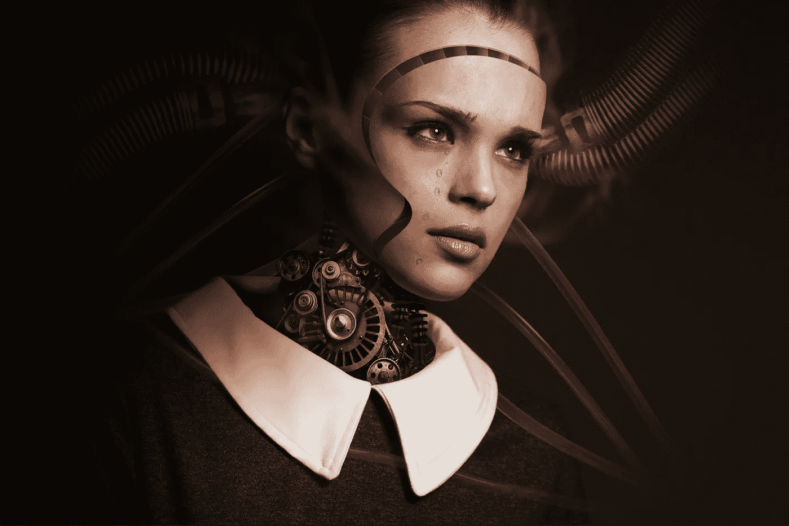
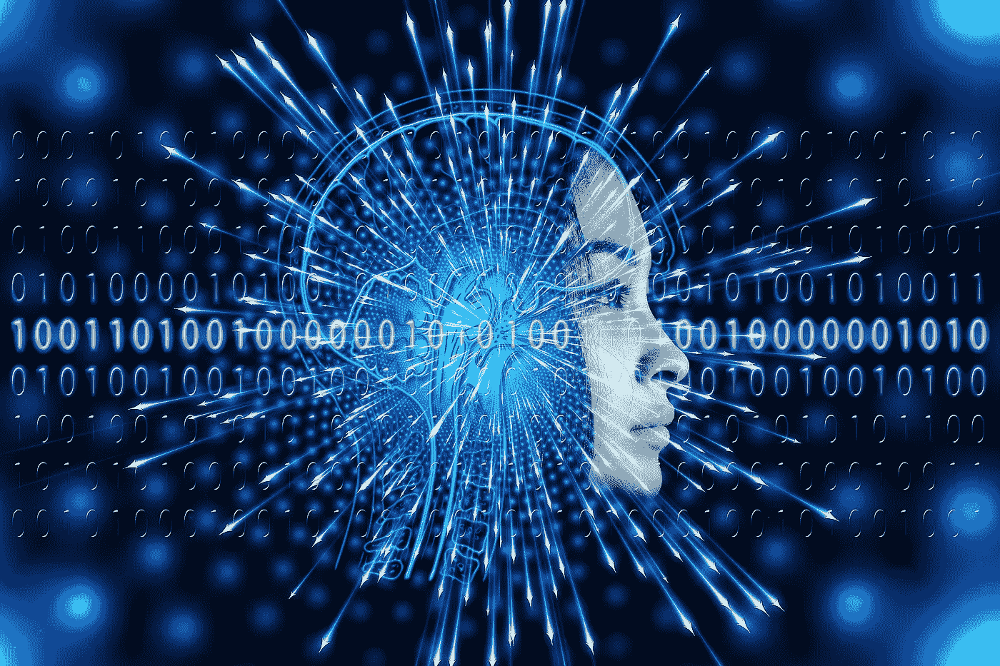
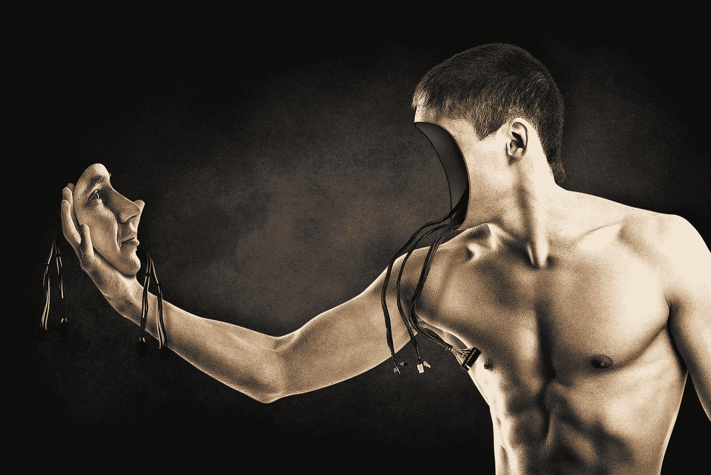

# 机器人已经接管世界了吗？

> 原文：<https://medium.datadriveninvestor.com/have-robots-taken-over-the-world-7d1d365fffa1?source=collection_archive---------12----------------------->

## 现代人工智能技术已经逐渐融入多种思维模式和专业技能，人工智能机器人产品也逐渐广泛应用于日常生活中

Image by [Comfreak](https://pixabay.com/users/comfreak-51581/?utm_source=link-attribution&utm_medium=referral&utm_campaign=image&utm_content=3010309) from [Pixabay](https://pixabay.com/?utm_source=link-attribution&utm_medium=referral&utm_campaign=image&utm_content=3010309)

# **简介**

2017 年，日本名古屋举办了一年一度的 RoboCup。来自 40 多个国家和地区的 400 多支人机战队在机器人足球等 5 项比赛中展开激烈角逐。中国“优必选”机器人与清华大学队在技术挑战赛中获得亚军，距离机器人足球队战胜人类世界杯冠军仅一步之遥。看完这场高智能的 RoboCup，与会者无不感叹:“机器人成为人类的时代已经到来！”

# **分析机器人与人类的差异**

人类和机器的根本区别在于生命力和智慧。人具有自组织的功能，具有独立生存和发展的能力，是具有理性和意志的智慧动物。人类的智慧主要表现在适应性和果断性上。

机器人是人类制造的工具，可以帮助人们从事某些活动。发明机器人的目的是降低人类的劳动强度，提高工作效率，或者从事不适合人类的高风险活动，而不是让它们与人类对抗。

# 机器人的机械部分**没有**像**像人类一样**多才多艺

正在进行的机器学习已经发展成为人工智能，对我们的日常工作和生活产生了重大影响，但是机器人并不能学习一切。机器人由人类操纵，行动笨拙。他们只能重复做一件事。

**对于这些动作**，除了制造业的特殊机械臂，机器人远不如人类灵敏。机器人本质上是由人制造的机器。它没有自组织功能，没有理性和意志。机械性和刚性是一台机器最大的特点。机器人再先进，也永远摆脱不了人类的控制。

# **机器人大脑没有人脑快**

机械“大脑”是机器人的核心，一般由计算机或单片机系统控制。机器人的大脑是一个集成电路，具有信息处理和发出指令的功能，控制着机器人的正常运行。

机器人按智能程度可分为通用机器人和智能机器人。通常，机器人的大脑根据预编程的序列工作，使用终端限位开关、制动器、闩锁板和序列器来控制机器人的活动。

> 智能机器人的大脑神经元之间有许多高效的网络

***感官机器人***

***互动机器人***

***自立机器人***

**传感机器人**利用和处理传感器信息，实现控制和操作。

**交互式机器人**利用计算机系统进行人机对话，实现对机器人的控制。交互式机器人具有一定的决策能力、交互能力、与外界的信息交换能力以及学习和模仿能力。

**自立式机器人**不需要人工干预，可以在各种环境下自动完成预定任务。智能机器人的智能体现在它能主动响应外界环境的变化，改变自身的运动规律。

这个“自适应”过程主要是通过深度学习来实现的，其动机是建立和刺激人脑进行分析和学习的神经。

该网络模仿人脑机制来识别图像、声音和文本等数据。机器人大脑深度学习和自主学习的过程，就是不断提高其神经网络效率的过程。

> 无论是通用机器人还是智能机器人，其智能部分都只是通过简单的 0 和 1 的算法来实现

与人脑相比，它在某些方面有相当大的劣势，比如避障。几乎所有无人驾驶和自动驾驶 R&D 团队都在苦苦思考避障算法，避障算法的应用在无人机等很多领域都有广泛应用。

**避障算法**是整个无人驾驶和自动驾驶行业的障碍，因为它决定了最后 1%的安全性，而现有的 VFH 避障算法和 DWA 避障算法只能算是非常原始的起点，根本不能满足实际需求。

[https://gph.is/1QIlLS1](https://gph.is/1QIlLS1)

# **量子计算机领域的突破——太多的不确定性和复杂性**

此前有人认为，机器人的突破需要量子计算机领域的突破，但量子计算机的实用性较差。

这是因为，一方面，虽然 Grover 搜索算法、量子化学模拟算法等新的量子算法不断出现，但数量远非传统算法可比。

**量子算法设计**难度大，真正的量子计算难以实现，不确定性太多。另一方面，制造量子位需要极其恶劣的环境条件。

为了利用超导振荡电路的量子基态，超导量子位需要保持在 273.13 摄氏度的温度。

离子阱量子比特需要利用射频电磁场在一个小空间内捕获单个或几个离子。这样的环境本身就充满了太多的复杂性。

即使在如此恶劣的环境下，量子位的制造或运行也会存在各种干扰和误差，导致寿命极短，运行可靠性低。

当今世界上最好的超导量子比特的寿命只有 200 左右，不到 1 ms，其操作错误率约为 0.1%。离子阱寿命略长，但也是秒级，所以量子位极其脆弱。

# **神经网络没有突破**

近年来，人工智能研究中最有效的系统被认为是神经网络。但是神经网络是“黑匣子”。

虽然训练好的神经网络可以对数据进行分类，但设计者知道但不知道为什么。视觉数据方面，自动化实验确定的数据特征使得升级后的网络有所反应，但文本处理系统并不透明。

为了解释神经网络的决定，CSAIL 的研究人员将网络分为两个模块。第一个模块提取训练数据中的文本片段，文本片段判断其长度和连贯性，然后传递给第二个模块进行预测和分类。

# **机器人局部智能突破的启示**

2017 年，阿尔法狗对阵国际象棋大师柯洁。最终阿尔法狗 3:0 获胜再次震惊棋迷。全世界的棋手只能接受人类已经无法在棋盘上战胜人工智能的事实。

**阿尔法狗**让全球更多棋迷前所未有地了解智能机器人的“深奥与神秘”。看人类下棋，可以体会他们在游戏中的心理和情绪波动。

在观看阿尔法狗的棋局时，人们只能弄清楚它对当前棋局的判断是紧张还是稳定。它感觉不到它的“情绪”起伏和它的下一个意图。围观者只能觉得阿尔法狗的棋步是它冷。

> 阿尔法狗之所以能在人机博弈中胜出

就是它有独特的能力，像园丁一样“prun”和化妆象棋，以便花木长得更好。这种“剪枝”的思维方式是为了消除一些不必要的搜索和计算，简化复杂的问题。

它的每一步看起来都像一盘“臭棋”，但结果却是一盘恐怖而神秘的棋局。这就是阿尔法狗的高智商。

阿尔法狗之所以能够在双方边界已经确定的地方补局，排除了变化的可能，就是不再考虑这里的应对，从而减少了计算量。

这种遵循最基本的围棋规则和计算方法，经过比较，筛选出下一步棋，以至于阿尔法狗经常让人类棋手“看不懂”它的棋局

> **2017 年 10 月 18 日，DeepMind 团队公布了阿尔法狗的最强版本，代号 AlphaGo Zero**

哪能“无师自通”。新一代 AlphaGo Zero 不依赖任何人类的棋谱，不参考人类的任何先验知识，完全依靠自我增强的学习和理解能力，短短三天就能控制对方 490 万盘棋。

AlphaGo Zero 的棋艺增长远超阿尔法狗，以 100:0 完胜后者。此前，阿尔法狗在打败人类之前，已经花了几个月的时间向人类学习了 3000 万种国际象棋游戏。

这种突破性的技术进化是人工智能技术进步的重要能量来源。如果人工智能继续以这种模式进化，其局限性将会大大降低。

*在未来，完全独立的超级人工智能机器人的出现似乎在人类意料之中。*

[https://gph.is/2jgjspK](https://gph.is/2jgjspK)

# **机器人 Teo 弹琴时情感实现的启示**

意大利机器人 Teo 有 19 个手指，可以弹奏任何旋律或歌曲，演奏速度比任何人类钢琴家都快。它会打鼓唱歌。它还可以随着听者的互动生成语音识别和面部表情。

> **Teo 的演奏技巧震惊了国际钢琴大师郎朗**

人工智能学习钢琴演奏技巧并不难，速度也能轻松超越人类。如果你说下围棋只需要冰冷的数学思维，但弹钢琴展现的是人类的情感。

**在 Teo** 面前，情感不再是人类的专利。可以想象，随着人工智能的发展，如果机器人完全掌握了人类情感的大数据，能够解读和表达人类的情感，机器人成为艺术家或许并不奇怪。

 [## 机器学习和人工智能如何改变电子商务的面貌？|数据驱动…

### 电子商务开发公司，现在，整合先进的客户体验到一个新的水平…

www.datadriveninvestor.com](https://www.datadriveninvestor.com/2020/11/19/how-machine-learning-and-artificial-intelligence-changing-the-face-of-ecommerce/) 

# **港科大**成功的语言和意义维护过程**的启示**

2017 年，美团外卖与 [HKUST](https://hkust.edu.hk/) 讯飞联合推出“智能语音助手”人工智能产品，基于丰富的大数据和多项人工智能技术，让骑手使用最自然的送餐流程。

语音交互完成接单、汇报等操作。不再需要手动操作手机。同时，系统会根据骑行者的骑行状态自动唤起交通安全提示，减少安全隐患，保障骑行者的生命安全。

**近年来**，语音识别系统(InterReco)发展迅速。汉语语音大段识别率达到 90%以上，应用领域语义理解准确率达到 85%以上。已成功应用于主流电信、金融、能源、交通、政府等领域。行业。 [MIUI](https://en.miui.com/) 语音助手可以提供 20 种语音命令操作。

可以快速打开应用，只需记住应用的名称，告诉语音助手打开一个应用。通过语音读取银行卡号既方便又安全。它还可以通过语音控制听在线音乐，询问天气，给别人发送某人的联系方式，这些都可以用一句话直接轻松完成。

# **神经网络技术的应用**

在日本国立科学博物馆，一个新的机器人 Alter 比其他“同事”更先进，因为它是一个嵌入神经网络的机器人。

这种神经网络机器人可以通过传感器感知周围的事物，按照自己的意愿做动作。Alter 最先进的部分是内置的“中枢模式发生器”(CPG)，安装有 Izhikevich 神经元，由 42 个气动执行器驱动。

CPG 允许机器人拥有自主和有意识的运动模式，通过内置的传感器来监控周围的物体、温度、湿度或声音来形成特定的动作。

这种机器人不仅需要更智能的 AI，还需要更接近人类的神经网络，以对周围的环境和事物做出适当的反应。因此，随着机械神经网络技术的突破，机器人可以像人类一样用语言交流和互动。

Image by [Gerd Altmann](https://pixabay.com/users/geralt-9301/?utm_source=link-attribution&utm_medium=referral&utm_campaign=image&utm_content=5744621) from [Pixabay](https://pixabay.com/?utm_source=link-attribution&utm_medium=referral&utm_campaign=image&utm_content=5744621)

# **末梢神经有记忆功能吗？**

人脑是一个复杂的神经网络，由大约 140 亿个神经元组成。神经元是神经系统的基本单位，也是记忆的基本单位。

它是由树突、细胞体和轴突组成的细胞。外部刺激产生的信息以生物电位的形式在神经元之间单向传播。一个神经元的轴突释放递质将化学信号传递给下一个神经元的树突，然后转化为电信号传递给神经元。

它的轴突然后被转换成化学信号，并传递给下一个神经元。轴突末端突触的形成和加强以及下一个神经元的树突连接产生记忆。

> 出色地完成任务

智能机器人必须具有一些与任务相关的重要记忆功能。目前，人类大脑的记忆原理已经被完全破译。很快，具有人类思维方式的机器人就可以在此基础上开发出来。

他们能独立思考，懂得交往，甚至有感悟，有意义。这些机器人模仿或超越了人类的智能，在记忆和存储的某些方面将远远超越人类。

# **训练神经的记忆功能**

布朗大学计算机科学教授特里克斯成功测试了机器人记忆能力的数据。她建立了一个机器学习模型，使机器人能够自动学习操纵物体，并依靠生成的样本数据来训练机器人的记忆能力。

> **她认为“机器人能产生记忆”是先决条件**

如果你把一个陌生的场景放在机器人面前，机器人基本上是记不住这些东西的，因为它的思维没有这个场景的信息，我也没有受过这个场景的训练。

Trix 构建的机器学习模型允许机器人从错误中学习，经过反复尝试，它可以成功记住这个场景。在反复试验的过程中，可以生成一系列关于该场景的图片信息库。

> 特里克斯的计划预示着一天机器人可以获得更准确的记忆能力

**近几年**自动驾驶汽车等机器学习的应用技术和图像识别的应用技术发展很快，因为这些领域有大量的样本数据可以用来训练这些机器记忆模型。

**机器人记忆滞后的主要原因**

就是样本数据少，神经网络无法训练。神经网络是由几个简单且高度互连的处理元件组成的计算机系统，它可以通过对外部输入的动态响应来处理信息。它主要是通过处理大量的市场数据，来记忆了解不同情况的能力。

从这个意义上说，人类和机器人没有本质区别。如果把人看成是生化机器，蛋白质机器，那么机器人其实就是金属或者其他材料的机器。

**现代神经生理学和脑**科学认为，人的情绪来源于激素，记忆来源于神经细胞的网络结构。

大脑微观结构的任何变化都可能引发人类思维的变化。计算机还可以模仿生物的神经系统，计算机“神经系统”也可以对刺激做出反应，根据外界信息的变化调整自己的工作模式。

因此，具有分布式存储、并行处理、自学习、自组织、非线性映射等优势的神经网络与其他方法相结合，取长补短，最终使机器人能够像人类一样拥有独立的思想、记忆和创造力。

[https://gph.is/16Fqptl](https://gph.is/16Fqptl)

# **大脑中的节点——中央处理器功能**

机器人需要观察六个方向，倾听四面八方，离不开强大的大脑——高性能中央处理器和高效的算法。

机器人是综合运用机械与精密机械、微电子与计算机、自动控制与驱动、传感器与信息处理、人工智能等多个学科最新研究成果的复杂机电一体化设备。

**要整合这些成果**要真正形成认知、感觉和动作的能力，使机器人能够理解和应对现实世界，并准确完成操作任务，其搭载的计算平台需要满足多种要求，包括感知和控制能力、计算能力、功耗控制、易用性。

使用由 GPU、FPGA 等智能引擎以及其他协处理器和 CPU 组成的异构中央处理器来提高计算性能已经成为机器人发展的热点。

**异构计算**作为一种特殊的并行计算方法，可以根据计算子系统的结构特点，将不同的计算任务分配给各个计算子系统。

体现了传统架构在提升计算性能、能效比、实时保障优势等方面所不具备的，在各种计算需求较大的场合继续得到应用。

这种比 CPU 高出十几倍的定位频率，使得机器人能够拥有双倍的移动速度而不会“迷失”。

有了这样一个智能大脑，机器人将会变得更加耳聪目明、腿快、手稳，融入我们的日常生活，为人类提供更好的服务。

# **广泛使用区块链技术**

区块链技术简称 BT，也称为分布式账本技术。它是一种基于技术的互联网数据库，可以是分散的、开放的和透明的，这样每个人都可以参与数据库记录。

> **面对人工智能和区块链技术**

这是在扰乱世界，智能机器将改变一切——机器人和自动化技术导致体力劳动者受到重创。

很快，我们将生活在中国“数据驱动”的世界中“机器对机器”的交流中，人们的经验和投资不再那么重要，越来越多的机器人在相互交流和交易。

*司机将被无人驾驶取代*

*超市不会见收银员*

*餐厅可以智能点餐*

*自动信用卡结账等*

大数据分析用于预测房屋价值、改善交通流量、分析医疗图像和处理保险索赔。机器人在各个地方随处可见。

**在区块链技术**和智能合约的背景下，数字革命的创新周期更短，创新步伐更快。

由此带来的社会变革的速度和规模，让人难以理解和适应，但同时，也会有更多。许多新的工作机会可以通过互联网更快地分配工作，可以提供更多与公众建立直接关系的机会，可以直接向公众分享内容，并且无需“中间人”或“代理人”的报酬就可以获得这些内容。

在即将到来的数字世界中，最重要的将是最“人性化”的技能。无论机器人有多“聪明”，“人性化”的技能是最难训练的，也是最难复制的。

# **广域集成智能突破**

“智能广域机器人”是基于电力混合控制论。其主要目的是将所有不满足和不满意的状态归类为事件，控制系统恢复正常运行。

随着更高电压交流输电线路的建设，中国电网的互联程度不断提高。然而，大规模新型可再生能源发电基地的接入，电动汽车和基于负荷的微电网等新客户的出现，以及由电力微电网和分布式电源组成的新电网的调度和运行，对中国智能电网来说是安全可靠的。

**运行中面临的主要问题**

中国科学院院士、清华大学教授卢强认为，整个大规模电力系统的控制就像一个智能机器人。这种具有多指标自寻优运行能力的电网是电网智能机器人的最高形式。

**智能广域融合**就是测量电网在某一时刻是否处于最优状态，是否自动调节，整个大电力系统像智能机器人一样被控制。

要真正实现智能战争，必须在建立智能电网基础测量设施和动态 SCADA 系统的基础上，实现机器智能和人类智能的结合。

Image by [Comfreak](https://pixabay.com/users/comfreak-51581/?utm_source=link-attribution&utm_medium=referral&utm_campaign=image&utm_content=845847) from [Pixabay](https://pixabay.com/?utm_source=link-attribution&utm_medium=referral&utm_campaign=image&utm_content=845847)

# **实现机器人训练的进化**

“计算机科学之父”艾伦·图灵在 60 多年前就提出了著名的“图灵测试”预言。

到 2000 年，人类可以用 10 GB 的计算机设备做一个 5 分钟的问答，30%的成年人拥有人工智能。这一预言已经成为现实。

2014 年 6 月 7 日，艾伦·图灵逝世 60 周年，在英国皇家学会举办的“2014 图灵测试”大会上，聊天程序“尤金·古斯”特曼首次通过图灵测试，仅比图灵的预测稍晚。

对未来的设想是，在智能商人生命的最后时刻，将他们的大脑冷冻起来，然后利用人工智能和纳米技术来存储重要数据，通过“个性化芯片”将他们的数据编码到机器人芯片和传感器中，然后克隆纳米技术，让死人“复活”，人造身体的功能将由人类的思想脑电波控制，机器人将使用“原始”智能商人的谈话风格、行为模式、思维过程和人类的功能来从事各种社会活动。

# **结论**

人类赋予机器人高水平的智商，机器人与人类的差距越来越小。

在未来，机器人将能够完成人类能够完成的所有任务——从事日常服务、工业制造、医疗、科研、救灾，甚至战斗活动。

当人工智能(AI)技术植入计算机、物联网设备、云计算平台，未来 30 年，机器人不仅在数量上超过人类，其智能水平也将超过人类。

智商最终会达到 10000，而天才爱因斯坦的智商只有 200 左右。电影《我和机器人》勾勒了 2035 年我们将和智能机器人一起生活的美好场景。世界机器人世界杯协会预测，到 2050 年，机器人足球队将击败人类世界杯冠军，“加冕”为王者。

对此，有机器人专家认为，“以目前的技术发展速度，机器人超越人类不是神话。人脑由数百亿个神经元组成，以区域节点的形式分布。

*机器人通过感知网络节点的设计实现思维活动。当机器人的每个节点都超越了单个人，机器人成为“人类”的时代才真正到来。*

## 获得专家视图— [订阅 DDI 英特尔](https://datadriveninvestor.com/ddi-intel)