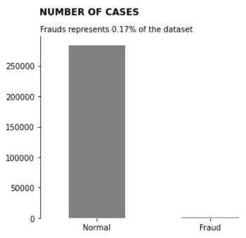
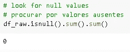
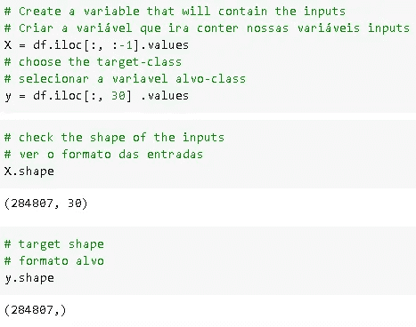
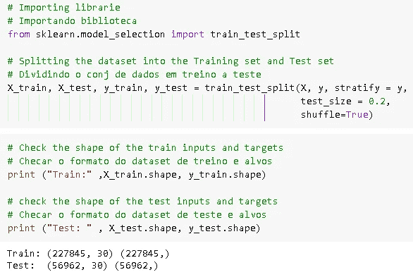
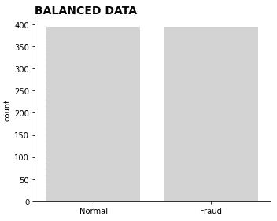
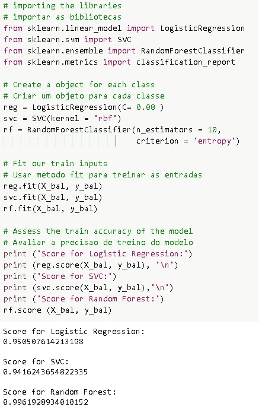
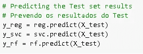
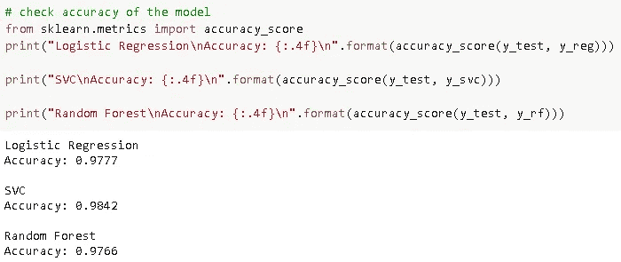
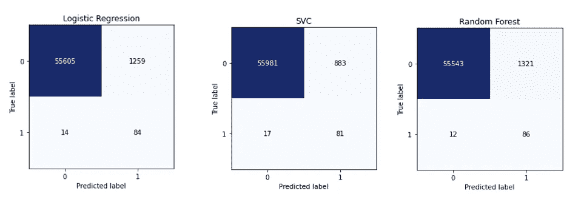
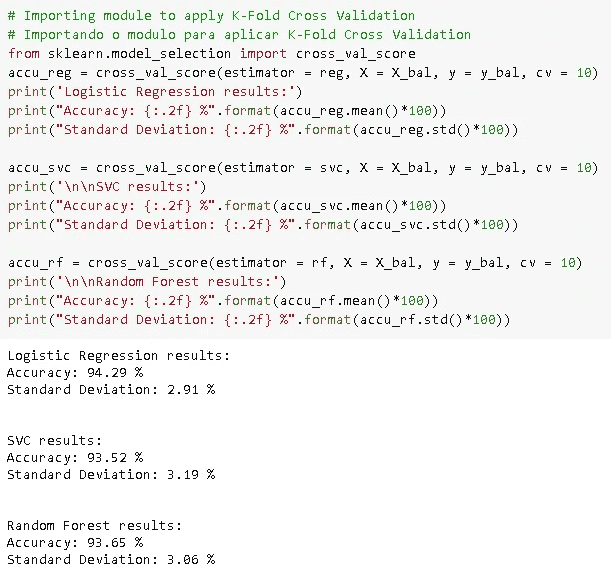

# 你的信用卡有过问题吗？

> 原文：<https://medium.datadriveninvestor.com/have-you-ever-had-problems-with-your-credit-card-afe3a65fcd97?source=collection_archive---------10----------------------->

> 查看我的 Github 中的完整分析[这里](https://bit.ly/3cslZJy)。这个项目来自 DSNP 课程，你可以在这里查看[。](https://sigmoidal.ai/curso-online-data-science-na-pratica/)

在这个项目中，我们将解决信用卡欺诈问题，这是银行和 fintech 等金融机构的主要问题之一。

仅在巴西，去年就有大约 1210 万人遭受了某种形式的金融欺诈。在过去的 12 个月里，金融诈骗每年造成的损失超过了 18 亿雷亚尔。

在这些欺诈中，涉及信用卡的欺诈关系重大，因为如果不被发现，消费者和金融机构都会遭受巨大损失。

另一个要考虑的因素是误报的数量，即当你试图购买时，你的卡被预防性地阻止了——这可能会导致压力和尴尬。

出于所有这些原因，通过人工智能进行欺诈检测的投资每年都在增长，这代表着*数据科学*的巨大机遇。

 [## 将定义 2020 年就业前景的五大数据科学和机器学习趋势|数据驱动…

### 数据科学和 ML 是 2019 年最受关注的趋势之一，毫无疑问，它们将继续发展…

www.datadriveninvestor.com](https://www.datadriveninvestor.com/2020/02/19/five-data-science-and-machine-learning-trends-that-will-define-job-prospects-in-2020/) 

有了大量的数据作为历史基础，一个比以前的算法稍微好一点的机器学习算法已经节省了数百万雷亚尔。这就是挑战，不断改进算法的使用，以抑制或防止欺诈性交易。

> 因此，我们将创建三个机器学习模型来检测这些欺诈行为，并查看它们在这些数据中的表现。

# 我们数据的快速概览

这个项目中使用的数据已经由一些欧洲信用卡公司提供。*数据集*代表两天内发生的金融交易，其中 492 起欺诈被归类为近 29 万笔交易。

如你所见，这是一个极其不平衡的数据集，其中欺诈仅占总数的 0.17%。

另一个有趣的细节是*的特性*都是数字的，并没有被显示出来(由于隐私和安全问题)。因此，列的名称由[V1，V2，V3…，V28]表示。

[在原始数据页](https://www.kaggle.com/mlg-ulb/creditcardfraud)上，还报告了变量经历了被称为主成分分析(PCA)的变换。

PCA 允许降低维数，同时保持最大可能的信息量。为了实现这一点，算法找到了一组新的资源——所谓的**组件**。

这些分量小于或等于原始变量。在这个项目中，通过 PCA 转换发现的组件是柱子本身[V1，V2，V3…，V28]。

我们还可以看到，在这个数据集中没有好的空值，这意味着不需要进行数据集清理。

# 这是我们分析的总结

*   虽然我们有超过 28.4 万个条目，但只有 0.17%是欺诈性的，这使得我们的数据集不平衡。
*   `Time`和`Amount`变量保持其原始值，需要经过**缩放**过程。
*   数据集中没有空值或缺失值。
*   由于 PCA 对**缩放**很敏感，因此假设原始特征是标准化的。

> 查看我的 Github 中的完整分析[这里](https://bit.ly/3cslZJy)。

# 机器学习

在我们对数据进行标准化之后，这意味着我们有相似数量级的所有输入，我们必须定义我们的目标和特征。

## 目标和功能

因为我们想发现一笔交易是正常的还是欺诈的，我们的目标变量是 T2，我们称之为 y。所以所有其他变量都是我们的特征，我们称之为 x

## 分割数据集

现在，我们将在训练和测试中分割数据集，我们几乎已经完成了…再走几步，我们就要创建我们的机器模型了。

## 平衡数据

在创建机器学习模型之前，我们必须处理不平衡的数据。有很多方法可以处理。我用了一个简单但有效的方法，效果很好。这项技术在`imblearn`库中被称为`under-sampling`。

这就是我们的数据。流程:

# 概括我们迄今为止的步骤…

*   *我们了解我们的业务问题，*
*   *我们做了一个快速的数据概述，发现了一个不平衡的数据集，*
*   *将各列标准化为具有相似的量值，*
*   *我们选择我们的目标变量，也就是类*
*   *将数据分为训练和测试，以及*
*   平衡我们的数据。

# 构建我们的模型

最后，我们到了这个过程中有趣的部分，我们将测试一些机器学习模型，以比较它们在这个数据集中的性能。我们将创建 3 个机器学习模型，看看它们的表现如何。这些是选择的型号:

*   ***逻辑回归，***
*   ***SVC，和***
*   ***随机森林。***

最后，我们将看到每一个都在这个数据集中表现得更好。下面是如何使用的过程和每个模型的分数。

**上面我们可以从我们的平衡训练集中看到我们的分数，其中** `**Logistic Regression**` **和** `**SVC**` **模型分别获得大约 95%和 94%的分数，而** `**Random Forest**` **获得 99%的分数，但是让我们看看预测是如何进行的...**

**根据测试集进行预测后，这些是 ou 模型的准确性，SVC 模型的性能稍好，下面我们将看到我们的混淆矩阵，以直观显示预测情况。**

# 混淆矩阵

这是我们的 3 个混淆矩阵，我们注意到结果非常相似，但有一些有趣的分析引起了我的注意:

*   *SVC 模型预测的* `*fraud*` *错误次数(883 次)比其他模型少，在这种情况下，更少的客户生气，他们的信用卡没有被冻结。*
*   *另一方面，* `*normal*` *模型预测出的交易错误次数更多，17 次反对，14 次来自逻辑回归，12 次来自随机森林，比其他模型多，让更多的顾客气愤没有把欺诈性交易检测出来。*

让我们记住这一点:我们的数据集仅来自一个 `***TWO-DAY***` ***时期，在该时期，492 起欺诈被归类为近 29 万笔交易。***

所以，现在看起来这并不意味着什么，但如果我们开始考虑一周、一月、一年、节假日的所有交易，如黑色星期五、T42 圣诞节，在这些节日里，礼品购物广泛增长，受伤害的顾客数量会显著增加。

# 应用 k 倍交叉验证

为了评估我们的机器学习模型对看不见的数据的技能，我们将使用称为交叉验证的统计模型。下面我们可以看到结果:

# 结论

在所有这些步骤之后，我们最终完成了这个项目，并且在应用 K-Fold 交叉验证之后，我们可以看到，最终，**逻辑回归**模型给了我们更好的结果，具有更好的准确性和更小的标准偏差。

为了获得更好的结果，最好是获得更多的数据，并测试我们的模型，看看它的表现如何。我们还可以使用一种叫做网格搜索的技术来改变参数，为我们的模型找到最佳的调整。

这里的想法只是比较模型，看看哪个在这个数据中表现更好。

谢谢，希望你喜欢。

通过 [Linkedin](https://www.linkedin.com/in/glaucio-drumond-1734a018b/) 联系我或者查看我的 [Github](https://bit.ly/3cslZJy)