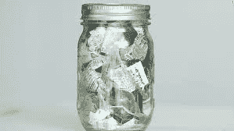
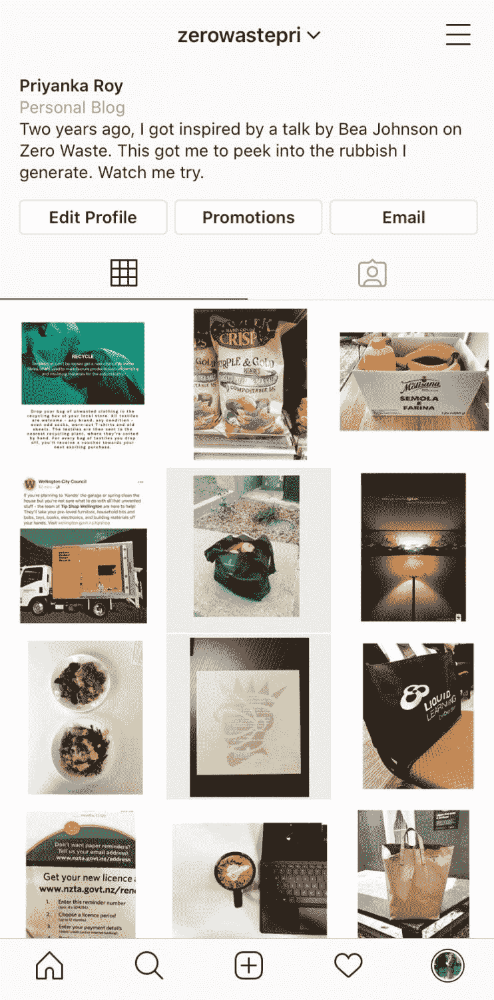

# 你最近检查过你的垃圾吗？

> 原文：<https://medium.datadriveninvestor.com/have-you-looked-into-your-trash-lately-8a8668c95816?source=collection_archive---------24----------------------->

平均每人每天产生超过 4.4 磅的垃圾。在这个消费主义日益增长的世界里，很难控制你产生的垃圾。然而，越来越多的人已经掌握或正在向零废物生活方式迈进，一步一个脚印。

两年前，有一个这样的人真正激励了我，他就是加州的居民 Bea Johnson。Bea 与她的丈夫和两个孩子住在一起，过去十年来一直过着零废物的生活。你会认为她一定过着非常不同的生活方式，但她和我们任何人都一样。一个有家庭，有工作，有一些爱好的人。

然而，值得注意的是，她家所有的垃圾目前都放在这个大小的罐子里。

令人惊讶不是吗？它包含什么？

里面有一些塑料标签，一些贴纸，绝缘胶带，一个空笔芯，硅胶包——你明白了(她无法真正摆脱的东西！)

那么，她是如何管理这种零浪费的生活方式的呢？“零浪费”中的零让它听起来很吓人，很难实现。这并不难，就像按照她的五个 R 食谱那样简单，按照这个特定的顺序。

***1。拒绝你不需要的东西。***

**2*。减少你确实需要的东西。***

***3。通过使用 reusables 进行重用。***

***4。以上三条做不到的时候回收。***

***5。腐烂剩下的。***

有很多 R，让我给你解释一下。

**1。拒绝——直接说不**

*   拒绝来自会议、交易会和派对的免费赠品。每次你拿走一个，你就创造了制造更多的需求。你真的需要另一支“免费”的钢笔或一件 t 恤吗？
*   对一次性塑料说不——例如，塑料叉子、塑料玻璃和塑料盘子。
*   拒绝垃圾邮件。这不仅是浪费资源，也是浪费时间。注册领取更少。

**2。减少你确实需要的东西**

*   减少家里的东西，捐给当地的旧货店。这样你可以减轻你的负担，让那些想买二手货的人可以得到宝贵的资源。当你的东西越来越少的时候，你往往会更好地照顾它们！
*   减少购物次数，保留购物清单。尽量不要买包装好的商品。你带回家的越少，你需要处理的垃圾就越少。

 [## 5 个可以拯救环境的潜在区块链用例|数据驱动的投资者

### 区块链技术已经成为创新和颠覆的代名词。而医疗保健等几个行业…

www.datadriveninvestor.com](https://www.datadriveninvestor.com/2020/03/06/5-potential-blockchain-use-cases-that-can-save-the-environment/) 

**3。重复使用**

*   将一次性用品换成可重复使用的。例如，开始使用手帕、可再装的瓶子、购物袋、餐巾布等。
*   避免杂货店购物的浪费:带可重复使用的手提包、布袋和罐子去商店和农贸市场。

**4。回收**

*   了解你所在城市的回收政策和地点——但是把回收当作最后的手段。你是先拒绝了，还是先降低了，还是先重用了？质疑你购买的需求和生命周期。
*   主要买散装的或二手的，但是如果你必须买新的，选择玻璃、金属或纸板。避免塑料。

**5。腐烂**

*   找一个适合你家的堆肥系统，了解它能消化什么。把你家厨房的垃圾桶变成一个大堆肥箱。

上面提到的五个 R 方法仅仅是让你意识到你所产生的浪费的工具和指南。你可以选择尽量少或尽量多的尝试。这里的想法是意识到并监控你扔进垃圾桶的东西，因为你监控的任何东西都一定会改善。

想象一下这种生活方式的好处:你省钱了，需要管理的东西更少了，吃得更好了，感觉更好了，而且有时间去收集瞬间，而不是东西！

相信我，这并不容易。*便利是零浪费的杀手。试着觉得有点不方便，让自己负责*。这是我让自己负责任的方法:

所以，亲爱的读者们，我的问题是——今天你不会把什么扔进垃圾桶？

## 访问专家视图— [订阅 DDI 英特尔](https://datadriveninvestor.com/ddi-intel)