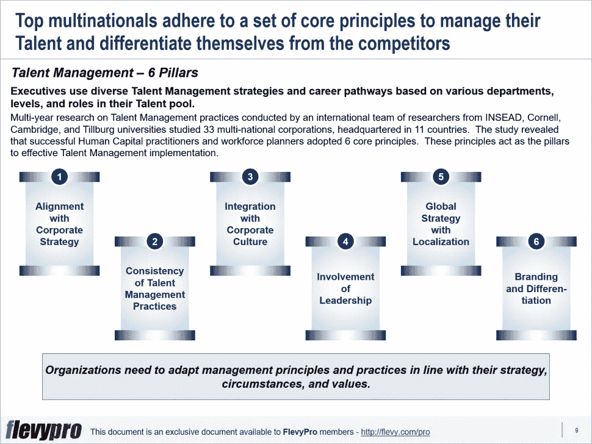

# 在保持稳定的人才渠道方面存在问题？运用人才管理的 6 大支柱来掌握艺术

> 原文：<https://medium.datadriveninvestor.com/having-problems-maintaining-a-stable-talent-pipeline-2e04c0963a16?source=collection_archive---------25----------------------->

世界各地的企业都面临着选择、配备员工、发展、补偿、激励和保持关键人才的问题。即使对大型跨国公司来说，建立一个可持续的人才管道也是相当费力的。

从某处复制最佳实践并单独应用它们不足以让组织建立人才管道并获得竞争优势。这需要克服与这个数字时代相关的艰巨挑战，包括:

*   适应全球市场不断变化的动态
*   应对不同地区不同客户群的期望
*   管理关键人才的偏好
*   获取新技术
*   建立新的能力
*   通过精简运营和[改进流程](https://flevy.com/browse/stream/process-improvement)实现[卓越运营](https://flevy.com/operational-excellence)
*   探索新市场
*   设计吸引、选择、发展、评估和奖励顶尖人才的策略。

发展人才管理实践有助于组织培养和留住人才市场上的人才。麦肯锡公司在 1997 年首次使用该术语，它涉及通过活动，即吸引、选择、发展、评估、奖励和保留关键人员，来规划和管理战略人力资本。

管理人员根据其人才库中的不同部门、级别和角色，使用不同的人才管理策略和职业发展途径。来自 INSEAD 大学、康乃尔大学、剑桥大学和蒂尔堡大学的国际研究团队对人才管理实践进行了多年研究，研究了总部位于 11 个国家的 33 家跨国公司。研究表明，成功的人力资本从业者和劳动力规划者采用了 6 个核心原则。这些原则是实施有效人才管理的 [6 大支柱](https://flevy.com/browse/flevypro/6-pillars-of-talent-management-5271):

1.  **与公司战略保持一致**
2.  **人才管理实践的一致性**
3.  **与企业文化的融合**
4.  **领导层的参与**
5.  **本地化的全球战略**
6.  **品牌和差异化**

现在，让我们详细讨论前 3 个支柱。

# 与公司战略保持一致

将人才管理与公司战略相结合势在必行，因为对未来人才的需求取决于公司的长期战略。公司战略应该指导完成组织目标所需人才的识别，因为是合适的人才推动关键的战略计划，而不是战略规划。

例如，通用电气公司的人才管理实践在实施他们的战略计划方面提供了巨大的帮助。该组织将其人才管理系统视为最有效的执行工具，并将 TM 流程整合到其战略规划流程中。为了保持其创新领导者的形象，通用电气在年度战略规划会议上将技术技能作为优先事项。在通用电气的年度战略规划会议上，各个业务部门阐述了他们的业务和人力资本目标。大量时间花在审查其[创新](https://flevy.com/browse/stream/innovation)管道、工程职能的结构和人才需求上。为了实现这一愿景，通用电气在高级管理层中提拔了比竞争对手更多的工程师。

# 人才管理实践的一致性

人才管理实践必须相互一致和同步。至关重要的是，不仅要投资于推进关键人才的职业发展，还要投资于授权、补偿和留住他们的流程。人力资本从业者利用各种工具来确保人才管理实践的一致性，包括人力资源满意度调查和关于 TM 实践实施的定性和定量数据。

例如，西门子的成功基于对其子公司的系统、流程和关键绩效指标的持续监控。人力资本管理的每一个要素都是相互关联、不断评估的，并与报酬挂钩。从每年招聘毕业生，到他们的定位，到指导和发展，到[绩效评估和管理](https://flevy.com/browse/stream/performance-management)，以及薪酬和福利。

# 与企业文化的融合

全球知名组织认为企业文化与愿景和使命同等重要。这些公司非常重视其核心价值观和行为标准，并通过辅导和指导在员工中推广。他们努力将其融入到招聘、领导力发展、绩效管理、薪酬和奖励流程/计划中。以至于他们认为文化适应性是他们招聘过程中的一个关键因素——因为性格特征和心态比技术技能更难培养——并严格评估申请人的行为和价值观。

例如，在其他领先的公司中，IBM 在选择和提拔人员时特别强调价值观。为了确保价值观的一致性，公司定期组织价值观集会和员工健康指数调查。这些会议鼓励就价值观和[组织文化](https://flevy.com/browse/stream/culture)及其在员工中的重要性进行公开交流和辩论。

有兴趣了解更多关于人才管理的其他支柱、各种 TM 方法吗？你可以在[Flevy documents market place](https://flevy.com/browse)上[这里下载关于 **6 大人才管理支柱**](https://flevy.com/browse/flevypro/6-pillars-of-talent-management-5271)的可编辑幻灯片。

## 你在这个框架中找到价值了吗？

您可以从 [FlevyPro 库](https://flevy.com/pro/library)下载关于这个和数百个类似业务框架的深入介绍。 [FlevyPro](https://flevy.com/pro) 受到 1000 名管理顾问和企业高管的信任和使用。有些人不得不说:

> “我的 FlevyPro 订阅为我提供了当今市场上最受欢迎的框架和平台。它们不仅增加了我现有的咨询和辅导产品和服务，还让我跟上了最新的趋势，为我的实践激发了新产品和服务，并以其他解决方案的一小部分时间和金钱教育了我。我强烈推荐 FlevyPro 给任何认真对待成功的顾问。”

–战略商业建筑师事务所创始人比尔·布兰森

> “作为一家利基战略咨询公司，Flevy 和 FlevyPro 框架和文件是一个持续的参考，有助于我们为客户构建我们的调查结果和建议，并提高他们的清晰度、力度和视觉效果。对我们来说，这是增加我们影响力和价值的宝贵资源。”

–Cynertia Consulting 的咨询区域经理 David Coloma

> “作为一个小企业主，FlevyPro 提供的资源材料已被证明是非常宝贵的。根据我们的项目事件和客户要求按需搜索材料的能力对我来说很棒，并证明对我的客户非常有益。重要的是，能够针对特定目的轻松编辑和定制材料有助于我们进行演示、知识共享和工具包开发，这是整个计划宣传材料的一部分。虽然 FlevyPro 包含任何咨询、项目或交付公司都必须拥有的资源材料，但它是小公司或独立顾问工具箱中必不可少的一部分。”

–变革战略(英国)董事总经理迈克尔·达夫

> “作为一名独立的成长顾问，FlevyPro 对我来说是一个很好的资源，可以访问大量的演示知识库来支持我与客户的合作。就投资回报而言，我从下载的第一个演示文稿中获得的价值是我订阅费用的好几倍！这些资料的质量让我能够打出超出自己体重的水平，这就像是用很小一部分开销就能获得四大咨询公司的资源一样。”

–Roderick Cameron，SGFE 有限公司的创始合伙人

> “我每个月都会浏览几次 FlevyPro，寻找与我面临的工作挑战相关的演示文稿(我是一名顾问)。当主题需要时，我会进一步探索，并从 Flevy 市场购买。在所有场合，我都阅读它们，分析它们。我采纳与我的工作最相关和最适用的想法；当然，所有这些都转化为我和我的客户的利益。"

量子 SFE 公司首席执行官奥马尔·埃尔南·蒙特斯·帕拉

在 [**领导力、辅导和个人成长**](https://app.ddichat.com/category/leadership-coaching-and-personal-growth) **:** 中安排一次对话

 [## 专家-领导力、教练和个人成长- DDIChat

### DDIChat 允许个人和企业直接与主题专家交流。它使咨询变得快速…

app.ddichat.com](https://app.ddichat.com/category/leadership-coaching-and-personal-growth) 

在这里申请成为 DDIChat 专家[。
与 DDI 合作:](https://app.ddichat.com/expertsignup)[https://datadriveninvestor.com/collaborate](https://datadriveninvestor.com/collaborate)
点击此处订阅 DDIntel [。](https://ddintel.datadriveninvestor.com/)