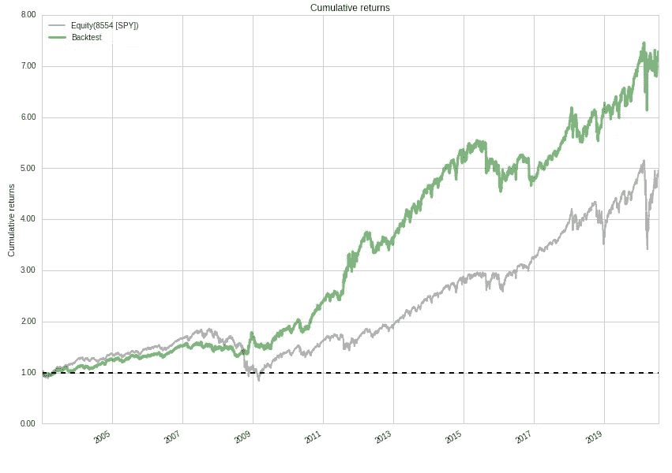

# HCA 趋势跟踪算法

> 原文：<https://medium.datadriveninvestor.com/hca-trend-following-algorithm-7fac984043ff?source=collection_archive---------12----------------------->

Dual Momentum

Hot Chili Analytics 是一个新的量化回溯测试和实时交易平台，基于 Zipline(由 Quantopian 团队开发)，并由 Alan Coppola 等人进一步改编用于实时交易。

对于新手来说，算法仅仅是一套规则。如果你喜欢的话，一个食谱，但是一个可以用代码描述并与计算机交流的食谱。

量化投资者和交易者想出一个主意(最好是基于现实世界的命题——比如经济或金融趋势),然后通过对过去的数据运行规则，看看这个主意在过去会如何发展。

一旦他们对系统的合理性感到满意，并有可能在未来获利，他们将使用相同的软件，根据系统的规则在他们的经纪人处进行交易。

HCA 趋势跟踪算法是为 Zipline 编写的代码，提供给 HCA 平台的订户。用户可以使用该算法进行回溯测试和交易。如果他们认为适合他们的需要。

趋势是金融市场的既定事实，尽管它们存在的原因一直有争议。

趋势是随着新闻或观点的改变而出现的，投资者通过买入或卖出某种工具来做出反应。并非所有投资者都同时行动，随着价格开始上涨或下跌，市场中的其他参与者也会注意到并加入进来。因此趋势出现了。

趋势跟踪系统的目标是捕捉上升趋势或下降趋势的中间部分，然后跟踪市场，直到趋势反转。技术指标用来判断趋势何时开始，何时结束。

艾迪·墨菲主演的电影《交易场所》抓住了流行的想象力。它基于一个真实的生活场景，理查德·丹尼斯和威廉·埃克哈特找来一群没有经验的人，教他们如何跟踪商品市场的趋势。

商品交易顾问实际上已经飞了很多年。约翰·W·亨利赚了一大笔钱，足以买下红袜棒球队。据说丹尼斯在巅峰时期赚了 8000 万美元。比尔·邓恩因其对期货市场趋势的“反野马”态度而出名。数十名追随者和崇拜者跳上了乐队马车。

迈克尔·科维尔写了相关的书，并根据他对顶级趋势跟踪者的采访，出售交易课程。他本人不是交易者。商品分析师杰克·斯夸格的畅销书《市场奇才》称赞了艾德·塞科塔的趋势跟踪技术，之后他成了英雄。

加里·安东纳奇提出了一个他称之为“双动力”的策略，根据哪一个处于最强劲的上升趋势，在债券和股票之间切换。

趋势跟踪有用吗？是的，当趋势有足够的强度和持续时间，可以产生足够的利润来弥补许多拉锯式的损失时，潜在的趋势交易会在震荡的横盘市场中持续进出。

它还会继续工作吗？这要由你来判断。HCA 不提供建议——它只是为投资者和交易者提供一个测试他们想法的平台，然后根据他们的选择进行实时交易。

有关 HCA 和 HCA 趋势跟踪系统的更多信息，请访问我们的[网站。](https://www.hotchilianalytics.com/resources)

**HCA 趋势跟踪算法允许你探索市场时机系统，在用户定义的回顾期内使用简单的动量计算。**