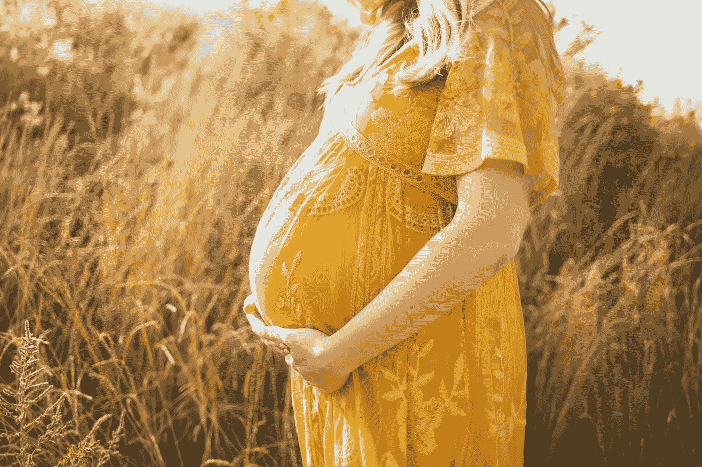

# 健康:怀孕期间的 5 个健康习惯和科技的作用

> 原文：<https://medium.datadriveninvestor.com/health-5-health-habits-role-of-technology-during-pregnancy-cbf3ebfe5955?source=collection_archive---------23----------------------->

ncluPhoto by [Kelly Sikkema](https://unsplash.com/@kellysikkema?utm_source=unsplash&utm_medium=referral&utm_content=creditCopyText) on [Unsplash](https://unsplash.com/s/photos/pregnant?utm_source=unsplash&utm_medium=referral&utm_content=creditCopyText)

## 怀孕期间，你如何保持健康、有弹性和心理健康？人们很容易忘记一些简单的习惯和技术，这些习惯和技术可以帮助我们建立强健的身体和宝宝各方面的健康。

我给你五个习惯吧。我认为你应该在怀孕期间融入你的生活，以改善你的精力和整体健康。

# 1.包括不同的全食物饮食

Picture from Unsplash

在怀孕期间照顾你的女性健康是必须的。你现在吃的是两个人的。如果你想辐射健康，你必须为此做些什么。在你的饮食中包含必需的食物，这必须成为你的第二天性。

Brocolli 是维生素 K 和 C 的良好来源，叶酸的良好来源，还提供钾和纤维。维生素 C——制造胶原蛋白，胶原蛋白形成身体组织和骨骼，帮助伤口愈合。维生素 C 是一种强大的抗氧化剂，保护身体免受 T2 自由基的伤害。

*蓝莓*——蓝莓中的纤维、钾、叶酸、维生素 C、维生素 B6 和植物营养素有助于心脏健康。蓝莓中不含胆固醇，对心脏也有好处。纤维含量有助于降低血液中胆固醇的总量，并降低患心脏病的风险。

*姜黄* —姜黄，尤其是其最活跃的化合物姜黄素(怀孕期间低剂量)具有许多经科学证明的健康益处，例如预防心脏病、阿尔茨海默氏症和癌症的潜力。它是一种有效的抗炎和抗氧化物质，还可能有助于改善抑郁症和关节炎的症状。

牛油果——牛油果非常有营养。

*   它们比香蕉含有更多的钾
*   鳄梨富含有益心脏健康的单不饱和脂肪酸
*   鳄梨富含纤维
*   吃鳄梨可以降低胆固醇和甘油三酯的水平

鲑鱼富含有益心脏健康的ω-3 脂肪酸，是一种低热量蛋白质来源，饱和脂肪含量也很低。T2 美国心脏协会建议每周或两次至少吃两份 3.5 盎司的高脂肪鱼，如鲑鱼。怀孕期间，你不想一周吃两次像三文鱼这样的油性鱼类已经足够了。

Picture from Unsplash

*   富含 omega-3 脂肪酸
*   丰富的蛋白质来源
*   富含 B 族维生素
*   钾的良好来源
*   富含硒
*   可能降低患心脏病的风险
*   可能有益于体重控制

Picture from Unsplash

# 2.杀死消极的想法(蚂蚁)

正如我常说的，拥有一个怀孕战士的心态始于调节你的思维，尤其是理解你所想的[想法](https://www.amenclinics.com/blog/number-one-habit-develop-order-feel-positive/)。这是一个非常简单的过程。你只需要花时间反思你的生活观点和每天的心情。你必须每天做一个[主动](https://www.youtube.com/watch?v=ksB0IXhM-Vc)的姿势和方法。

你的荷尔蒙和情绪时好时坏，没关系。不要自责。

**积极思考的健康益处**

*   寿命延长
*   成功怀孕和分娩
*   更低的抑郁率
*   怀孕期间痛苦程度较低
*   对普通感冒有更高的抵抗力
*   更好的心理和身体健康
*   为您和您的宝宝提供更好的心血管健康，降低死于心血管疾病的风险

Picture from Unsplash

# 3.锻炼

是的，对于那些不喜欢运动的人，我得到了一个坏消息和一个好消息——你可以在[怀孕](https://bengreenfieldfitness.com/podcast/fitness-podcasts/episode-141-what-is-a-good-pregnancy-exercise-routine/)期间包括运动，但要小心，听从你的身体。

*坏消息*——不锻炼会对你的寿命和健康产生严重后果。你不需要举重，但要定期运动，以减少患老年痴呆症、癌症和其他危及生命的疾病的几率。运动比不运动痛苦少。你必须克服短期的不适，才能获得长期的利益。

更重要的是，一些研究表明，锻炼可能会让你的宝宝更聪明。

> “如果你不积极运动，你会在很多方面增加健康风险。冠心病、中风、高血压、呼吸困难、身体松弛、精力不足、关节僵硬、骨质疏松、姿势不佳、超重。”—英国广播公司

*好消息* —你可以从每天早晚散步 10 分钟开始。随着你体重的增加，你可能会移动得更慢，但还是要做。一旦你[习惯了](https://medlineplus.gov/benefitsofexercise.html)，你可以增加一些缓慢的阻力训练。

**怀孕期间锻炼对健康有什么好处？**

*   帮助你控制体重
*   降低患心脏病的风险
*   帮助你的身体控制血糖和胰岛素水平
*   帮助你戒烟(如果你是，现在你不应该吸烟)
*   改善你的心理健康和情绪
*   随着年龄的增长，帮助你保持敏锐的思维、学习和判断能力

Picture from Unsplash

# 4.当心

正念对我们的幸福、压力和整体生活满意度有深远的好处。仅仅偶尔做一次是不够的，你必须每天都做。很多年前我整合了正念，直到今天，我的生活变得更加平静、集中和专注。

> “正念的好处是广为人知的。对从大学生到海军陆战队员等各种主题的研究发现，这种锻炼可以减轻压力，提高幸福感。……新的 [*研究*](https://greatergood.berkeley.edu/article/item/evidence_mounts_that_mindfulness_breeds_resilience) *来自印度的观点给了一个不全面的答案:正念孕育韧性”*

**正念的好处是:**

*   获得更好的睡眠(是的，怀孕期间也是如此)
*   降低你的压力水平
*   减少孤独感和情绪波动
*   消除暂时的负面情绪
*   提高注意力
*   更好地控制疼痛和痉挛
*   帮助预防抑郁症复发

Picture from Unsplash

# 5.有目标

人类生活的核心之一是进步，能够在个人发展方面实现飞跃。如果没有明确的目标，你将一事无成，无论是当你外出交际和与人交往时，还是当你想要建立自己梦想的生活时。

> “你的怀孕没有什么不同！利用这段时间让自己振作起来”——菲特-巴德

为远大目标设计你的[指标](https://www.youtube.com/watch?v=54aFTZ9POw4)。制定每日、每周、每月和每年的目标。

在你的登月梦想后面加上一个巨大的为什么。

有目标的真正好处是进步，不管是有抱负的目标还是愚蠢的目标。这是为了让你变得更好，让你和你的家庭有一个更大更光明的财务前景。当你想象什么会让你快乐时，你开始更清楚地看到你想做什么和拥有什么。

# 哑巴代表什么？

也许是时候为[愚蠢的](https://www.youtube.com/playlist?list=PLA8JloQoDKUeJlQFiDAXkXGDte_4zHLm1)目标替换掉你的聪明了。

梦想和命运驱动

(U)振奋人心的目标

(M)方法和路线图——一个明确的计划，帮助你有各种设想

(B)行为驱动——为贯彻始终而设置的触发器

# 怎么搞清楚什么目标？

1.  想清楚自己想要什么。如果你的目标太模糊，很可能你永远也不会抽出时间[去实现它们。](https://work.chron.com/set-aspirational-goals-28824.html)
2.  将它分解
3.  具体点
4.  追踪

> *“一旦你掌握了这些习惯，你就会开始以不同的方式、更深刻的方式、带着更多的* [*激情*](https://medium.com/@Melichar/series-way-of-a-turtle-85a376f79318) *”来看待这个世界— Fit-budd*

关于大自然母亲如何能在之前和期间提供帮助的完整指南，请访问[此处](https://bengreenfieldfitness.com/podcast/nutrition-podcasts/the-mama-natural-week-by-week-guide-to-pregnancy-and-childbirth/)！

Picture from Unsplash

# 科技让怀孕变得更聪明——来自维珍的文章

## 从阵痛到暮光症，许多孕妇觉得当她们成为父母后需要更多的支持。考虑那些可能需要虚拟社区的孕妇是一个快速的想法。

甚至在 15 年前，健康专家的检查、可信的怀孕圣经和轶事建议是指导的极限。尽管如此，如今，只要准父母需要，应用程序就能把支持直接带到他们的指尖。

有追踪婴儿尺寸的应用程序，计算踢腿次数的应用程序，检查婴儿心跳的应用程序，以及指导准妈妈如何食用某些安全食物的应用程序。

到目前为止，很有用。毕竟，预先警告是预先武装。无论是第一次怀孕还是第五次怀孕，指导方针一直在变，每个婴儿的怀孕感觉都不一样。因此，只需轻轻一扫就能获得相关信息或许并不是什么坏事。将于 5 月 17 日回归伯明翰国家展览中心的《婴儿秀》的导演佐伊·邦瑟肯定是这样认为的。

> “应用程序可以提供信息、安慰、支持，以及成为俱乐部一员的感觉，”她说。“以前我们会从家人和朋友那里获得更多，而现在我们更加依赖应用程序。”

即使是最不复杂的怀孕也会引发问题，伊丽莎白·赫顿是 [Kicks Count](https://www.kickscount.org.uk/) 的首席执行官，这是一款帮助父母熟悉婴儿运动的应用程序，她发现人们渴望得到安慰。

> 她解释说:“对胎动的意识和报告婴儿运动规律的变化已经被证明可以减少死产。”。“然而，我们注意到，市场上所有的踢计数应用程序都将计数提升到 10。没有一个应用程序可以让妈妈们了解她们的规律。那时，我们决定需要开发自己的产品。”

从用户的反馈来看，她确信该应用程序提供的信息会让家长放心，而不是让家长负担不必要的数据。

“我们都是为了给妈妈们知识和信心，”她说。“以前，妈妈们被告知，在怀孕后期，婴儿活动较少，会‘跑出房间’，这是不正确的，可能会延误他们就医。

*Image by Kevin Moore*

> “如果我们能提高对运动重要性的足够认识，我们就能消除疑虑，让他们有信心寻求医疗救助。我们宁愿母亲在不必要的时候寻求帮助，也不愿在必要的时候不寻求帮助。”

虽然这可能对一些人有帮助，但对另一些人来说，除了助产士的预约和来自所有人的善意建议之外，大量的信息可能会让他们不知所措。

“如果怀孕的风险很低，那么一个应用程序可能会很有用，”T4 哈雷街生育诊所主任吉塔·文卡特博士说。

> “然而，如果怀孕有并发症，例如先兆子痫或子宫内生长受限，那么应用程序可能会提供不正确的信息或引起进一步的担忧。
> 
> “如果这个人有焦虑倾向，那么一个应用程序可能会让情况变得更糟。”

然而，其他人看到了口袋里有支持的好处。

“应用程序让父母和每个人的生活都变得更轻松，”积极生育公司的创始人西沃恩·米勒说，该公司刚刚推出了世界上第一个催眠婴儿应用程序芙蕾雅。

> “它们可以是记录事情的简单方法，从婴儿的踢腿，到你的月经什么时候来，以及你花了多少钱。不幸的是，我不知道有任何缓解孕吐的应用程序。”

即使没有阻止孕吐的应用程序，技术仍然可以为准父母带来一线曙光。

Photo by [🇸🇮 Janko Ferlič](https://unsplash.com/@itfeelslikefilm?utm_source=unsplash&utm_medium=referral&utm_content=creditCopyText) on [Unsplash](/s/photos/pregnancy?utm_source=unsplash&utm_medium=referral&utm_content=creditCopyText)

“当你在恶心或极度疲劳的海洋中挣扎时，怀孕追踪器应用程序可以成为怀孕的一个小乐趣，” [MadeForMums](https://www.madeformums.com/) 的编辑主任苏西·布恩说。

“这是一种跟踪宝宝发育的有趣方式，所有这些都可以在你的手机上使用，有些还提供很好的触摸功能，例如凹凸图像跟踪器和每周婴儿手和脚的尺寸。”

然而也有缺点。

“它们是否让生活变得更容易还没有定论——因为它们还是其他需要花费时间的事情，无论是为凹凸照片找到完美的姿势还是输入里程碑数据，”Susie 补充道。"但是投入时间，回报是值得的."

虽然许多都是跟踪变化的简单方法，但在把建议当成事实之前，还是值得注意的。

*Image from MadeForMums*

“没有两次怀孕是一样的，”苏西解释道。

> “怀孕应用程序只能代表平均水平，而不是个人体验——谁的怀孕率是平均水平？如果你的症状似乎与追踪器不同步，我们知道这可能会导致不必要的焦虑——特别是在怀孕的前几周，怀孕症状变化很大，似乎从来没有遵循教科书的规则。”

市场上有大量的怀孕应用程序，找到一个有可靠信息来源的可以确保可靠的建议。

“应用程序是给妈妈们获取信息的好方法；然而，由于应用程序市场不受监管，妈妈们很难区分好的和坏的应用程序，”伊丽莎白说。

“让英国国民医疗服务体系批准踢腿次数是我们向妈妈们保证我们的应用程序已经过测试，建议是准确的一个很好的方式。”

但是，任何应用程序，无论多么有用，都无法弥补了解你和你的病史的健康专家的建议。

Photo by [Anna Pritchard](https://unsplash.com/@annaelise?utm_source=unsplash&utm_medium=referral&utm_content=creditCopyText) on [Unsplash](/s/photos/pregnancy?utm_source=unsplash&utm_medium=referral&utm_content=creditCopyText)

“一个应用程序不能代替医疗建议，”吉塔博士解释道。

“它只提供补充和支持信息。如果你有任何担心，你应该总是与医疗保健专业人员交谈，特别是如果你注意到怀孕期间的任何变化，如胎儿活动减少。”

有些应用程序是完全应该避免的。

“有问题的应用是那些承诺过多的应用，”Mumsnet T1 的创始人贾斯汀·罗伯茨说。“让你的手机准确监测婴儿心跳的技术根本不存在，任何声称可以提供扫描的东西都是一厢情愿的想法。”

记住这一点，像对待怀孕一样对待应用程序:所有的都是不同的，需要不同的——量身定制的——支持。

“我们从妈妈网上的讨论中得知，让一位准妈妈放心的东西很可能会让另一位妈妈焦虑不安，”贾丝汀补充道。

“最终，这都是为人父母的良好训练:平衡你的本能和焦虑，偶尔寻求专家的帮助，享受小事，并希望最终一切都会好起来。”

*Image by Geoff Pugh*

**专家推荐的应用:**

*   Mumsnet 的创始人贾斯汀·罗伯茨说:“Mumsnet 的怀孕应用程序使用了从成千上万其他父母的现实生活经验中得出的建议。这是你复习过的最难的科目的一点点信息，它可以帮助父母在孩子出生前就感受到与他们的联系。”
*   婴儿展的导演佐伊·邦瑟补充道:“Bounty 有每日文章和有趣的事实，美丽的 3D 图像，关于当地生育选择的信息和建议等等。其他我们喜欢的有《艾玛日记》、《怀孕+》、《期待什么》和《焕发养育》。此外，任何有助于记忆骨盆底运动的应用程序，如凯格尔教练 PFM 或英国国民医疗服务体系 Squeezy 应用程序，都受到好评。”
*   积极生育公司的创始人西沃恩·米勒说:“我推荐我们的应用程序，芙蕾雅。世界上第一个催眠婴儿友好的浪涌(收缩)计时器和虚拟出生伙伴。它会用简单的呼吸技巧和视觉化来指导你度过每一次高潮。”
*   MadeForMums 的编辑总监苏西·布恩(Susie Boone)说:“我们喜欢富有想象力的应用程序，如婴儿故事应用程序，这是一个照片编辑应用程序，有许多精彩的图形，可以跟踪你的隆起和婴儿的里程碑。虽然这是一个美国应用程序，但我们 MFM 的妈妈们最喜欢的怀孕应用程序是 Ovia。"