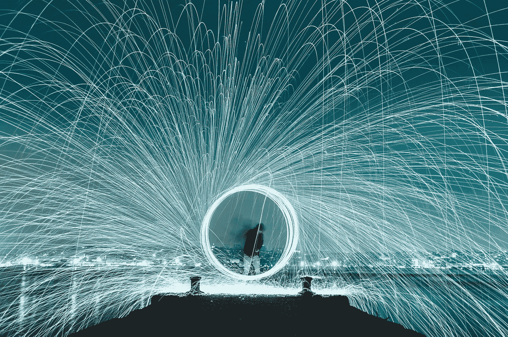
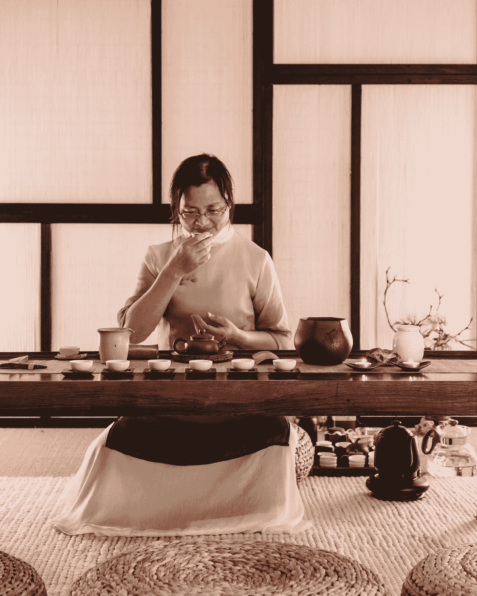
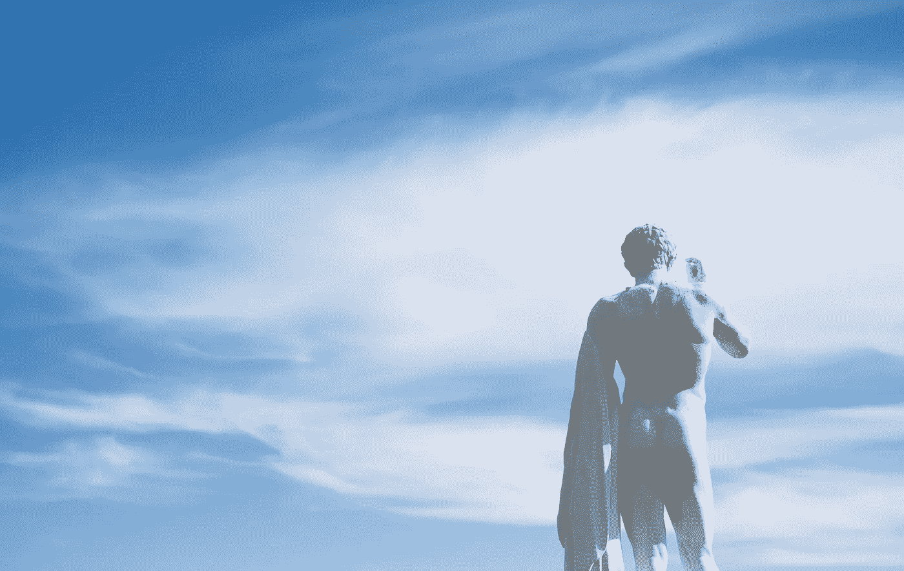
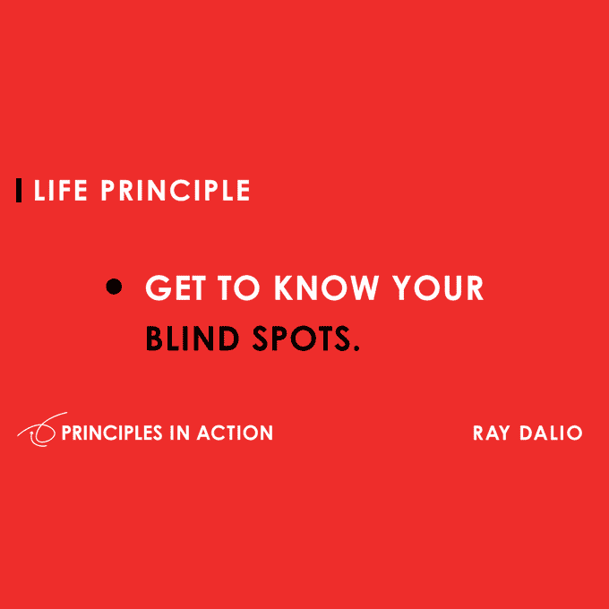
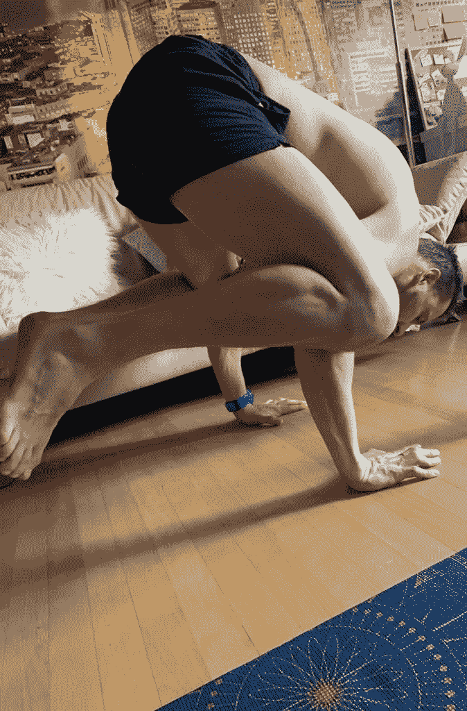

# 健康:成为持续的最佳表现者

> 原文：<https://medium.datadriveninvestor.com/health-being-a-consistent-peak-performer-d4faf9eeaf5a?source=collection_archive---------12----------------------->

Picture from Unsplash

## 我们中的许多人都在努力保持一贯的表现。通常我们的恐惧、焦虑、愤怒或其他感觉会妨碍我们，它会破坏我们的注意力和能力，使我们无法集中注意力，甚至做得更好。当关键时刻到来时，我们往往会失败。我们折起来逃跑。那么，什么是巅峰性能呢？

我选择将这篇文章归入健康类，我通常会在心态类下输入。然而，我相信我们在健康、饮食、生活方式和健身习惯上投入得越多，我们就能达到最佳表现，并以更高的一致性达到这种高度专注的水平。

当我们开始反复表现出色时，我们的健康也会变得更好，因为我们必须首先投资于我们的身体，才能进入这种心流状态。知道了你会更开心；现在，是该充电的时候了，而不是仅仅为了心流状态再去努力推动。

如果你不认真对待健康的生活方式，从长远来看，你会徒劳无功。

> “最佳表现是一种状态，也称为最佳体验，即最佳运作和流动的区域。它指的是一个人把所有东西放在一起的时刻，当他们进入状态，当一切都在流动，当他们取得非凡的表现时。—大脑执行中枢

# 认识你自己

我相信，在高风险环境中，让你表现出色和平庸的最重要的事情是:而是你能多好地管理自己的情绪。说起来容易做起来难。你需要利用身体给你的所有反馈，同时有勇气邀请不确定的感觉(愤怒、焦虑、对一杯茶的恐惧)。

Picture from Unsplash

这与我们在家庭、学校和商业环境中所做的和所受的教育是相违背的。我们试图抑制这些情绪，而不是利用它们来更好地了解自己，并利用这些来激发我们巅峰表现的时刻。

*想象一下，你在一场高赌注的锦标赛中，你的对手使用了不被允许的肮脏手段，但裁判没有看到。你是做什么的？你会生气吗，或者你会利用这一刻更加专注？*

毕竟迈克尔·乔丹不是和他的对手说过垃圾话吗？当他的对手抓住它的时候，那就是他在比赛中表现出色的时候。

## 了解你自己的历史

[古希腊](https://en.wikipedia.org/wiki/Ancient_Greece) [警句](https://en.wikipedia.org/wiki/Aphorism)“认识你自己”(希腊语:γνῶθι σεαυτόν，音译:*gnthi seauton*；还有… σαυτόν *… sauton* 与ε缩写)，是德尔菲的格言之一，根据希腊作家 Pausanias 的说法，它被刻在德尔菲阿波罗神庙的 pronaos(前院)上。

Picture from Unsplash

古希腊剧作家埃斯库罗斯在他的戏剧 [*普罗米修斯被束缚*](https://en.wikipedia.org/wiki/Prometheus_Bound) *中使用了“认识你自己”这句格言。这个关于神话序列的游戏将这句格言置于希腊神话的背景中。*

在这部戏剧中，半神普罗米修斯首先抨击奥林匹斯山诸神，反对他认为被奥林匹斯山诸神之王宙斯束缚在悬崖边是不公平的。半神俄刻阿诺斯来到普罗米修斯身边与他讲道理，并告诫他应该“认识你自己”

在这种情况下，俄刻阿诺斯告诉普罗米修斯，他应该更清楚地知道，而不是说决定他命运的人的坏话，因此，也许他应该更清楚地知道自己在“伟大的秩序”中的位置

## 了解你自己

对于一些无聊的人来说，这是个有趣的话题。既然你认为你已经在自己身边很久了。从我自己的经历来看，可悲的事实是，我们经常被我们的观点误导，事情应该是怎样的，而不是现实是怎样的。

我们太快地得出结论，忘记了回顾、思考和反思。

> “我们经常以‘老样子，老样子’的模式运行。正如贾森·席尔瓦所说的，“看到的，做了的”。"

这是大胆的，打破我们的思维和理解，你必须投身于未知。一旦我们这么做了，我们自己就不会再有争斗了。

> “多年来，当我感到恐惧时，我试图把它赶走。但是如果，我把恐惧的能量引导到更有创造力的地方，而不是用战斗来摆脱它，会怎么样？”—菲特巴德

想象一下，如果你几年前就做出这样的决定，你会走多远。也许，有一天早上你醒来时充满自信，那太好了。你愿意进入高风险环境。但是如果你醒来时疲惫、悲伤、没有动力怎么办？

你可以采取简单的方法，只是等待另一天再次感到自信。不幸的是，现在情况并非如此。当你挥动魔杖时，世界不会停止转动。

Picture from Unsplash

当你感到没有动力、疲倦或悲伤的时候，你会占优势。当你不得不为刚打电话请病假的同事准备一份演示文稿，或者不得不在 500 人面前演讲时，你会怎么做？答案很简单！你必须变得超级兴奋，像运动员一样达到最佳表现。

## 峰值性能高级视图

*拿* [*鸟瞰图*](https://warriorsway.com/how-to-structure-your-day-for-peak-performance/) *:* 当我想象在我的问题之上飞翔时，事情往往更容易处理和解决。审视你的生活，从财务到工作、激情和人际关系的不同领域。你在哪里，你想去哪里？

*从忙碌到控制:*忙碌让你无法了解自己。我认为这种感觉来自于我的一天充满了忙碌，让我们感到压力。更糟糕的是，它让我们关注错误的事情:忙碌而不是最重要的事情。蒂姆·费里斯说:“我认为有这种感觉的不只是我们。”。

*安排你的一天:*如何安排你的一天以达到最佳表现。乔希·怀茨金是个迷人的人。他是国际象棋和武术的世界冠军。我特别喜欢他的书《学习的艺术》。Josh 向 Tim 强调了在最重要的事情上积极主动的必要性，这样我们就不会成为忙碌的牺牲品。

Picture from Unsplash

## 最佳性能就在此时此地。

而是找到适合你的东西。对一个人来说什么是区域对另一个人来说是不同的。与我们的竞争对手相比，给我们优势的共同线索是我们如何控制自己的思想和行动。

磨练你的艺术:如果你试图控制其他东西，它会误导你。接受你无法控制的事情。你能控制的是你的表现，你已经准备好进入下一个阶段了。然而，你需要营养、敏锐的思维、在别人放弃时练习同样动作的战士的技能。

拥抱失败，发现你的盲点:在你感到虚弱和不舒服的情况下暴露自己。如果你在你的人际关系中挣扎多年，你可能会重复同样的错误。你需要一个大师，就像象棋选手必须指出你的弱点，指导你，与你平起平坐，告诉你哪里错了。

你需要分析你的游戏，情况，花时间思考问题的核心是什么。现在到了关键的部分。下次你再去的时候，你必须用不同的方法。

从你的错误中学习；不要重复“老样子，老样子。”如果你没有取得进步，还在奋斗，你很可能在重复同样的错误。你想快速找到正确的答案，并立即去追寻。

> “当你思想封闭，在你有盲点的领域形成观点时，这可能是致命的。所以，花些时间记录下你因为看不到别人看到的东西而不断做出错误决定的情况。”—雷伊·达里奥

Principles, Ray Dalio

让我们这个时代的思想家给我们提出他的宝贵意见吧。

> “精神错乱的定义是一遍又一遍地做同样的事情，却期待不同的结果。这些话通常归功于这位备受赞誉的天才。”[人名]阿尔伯特·爱因斯坦(犹太裔理论物理学家)

*设计你进入巅峰状态的方式:*你的表现很可能取决于触发因素的设置。

a.锻炼/散步

b.呼吸

c.冥想或祈祷

d.听音乐

e.阅读一些有启发性的东西

Picture by [Kate White](https://www.instagram.com/katewhite0404/)

这些或其他的触发因素可以帮助你在平静时进入正确的状态，同时保持激光聚焦，超越自己和他人。你必须找到那些为你工作的人。

所以，出去测试一下这个。一次又一次地寻求成为一名优秀的表演者。回来告诉我，你过得怎么样。:-)