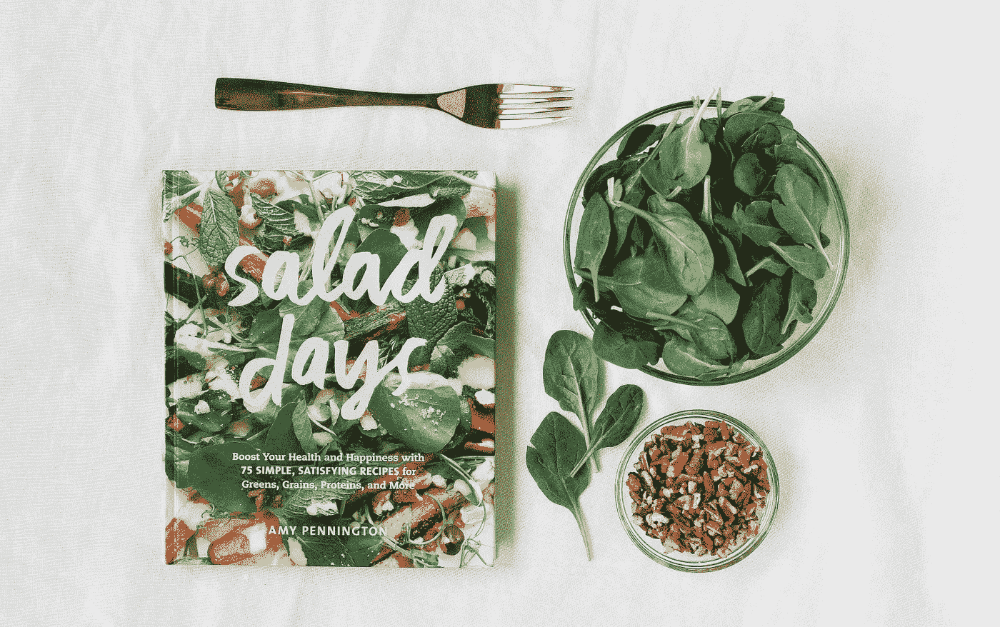
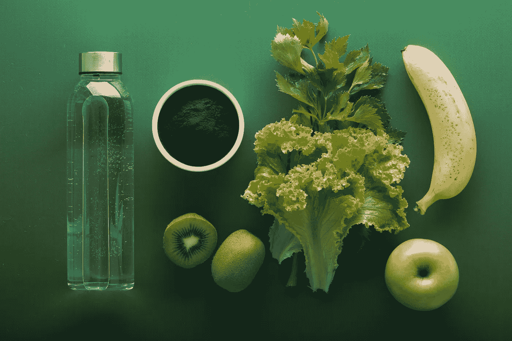
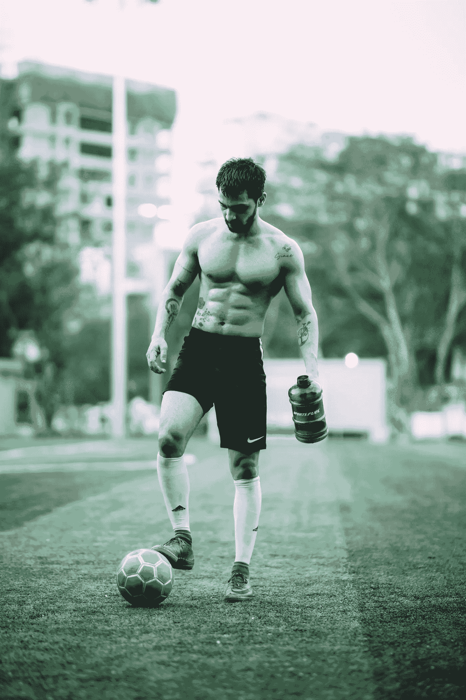
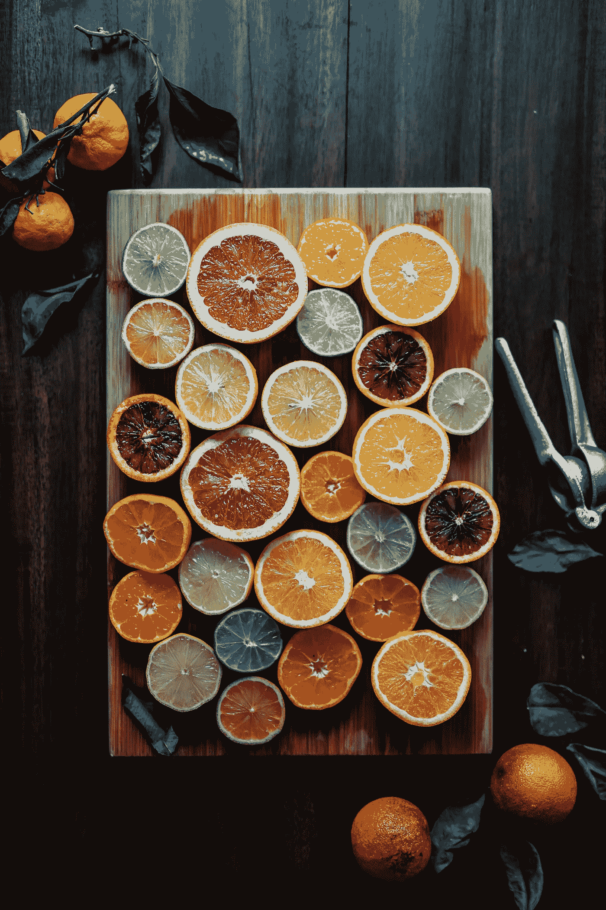

# 健康:益生菌的力量和了解你的肠道(第三部分)

> 原文：<https://medium.datadriveninvestor.com/health-the-power-of-probiotics-and-understanding-your-gut-part-3-3f224c62f2be?source=collection_archive---------24----------------------->

Picture From Unsplash

## 所以，现在你意识到最佳功能的内脏是胜利的一半。因此，问题是，你如何创造这样一个环境，繁殖和不断改善你的消化能力？

用健康的生活方式+益生菌改善肠道细菌。科学家们正在努力解决这些和其他问题，因为我们可以精确地指出肠道出了什么问题。对我们来说，从零开始建立一个微生物组更加困难。但是不要绝望，我们可以纠正很多错误。

在这篇文章中，我想扩展益生菌以外的范围，并确保给你工具和武器，帮助你建立一个强大的肠道机器。

长寿的关键是逆转或至少减缓衰老，并开始更多地了解你的身体。

# 平衡你的胰岛素水平

第一个层次是平衡你的身体如何使用糖、蛋白质和脂肪。每次你吃碳水化合物，糖果，巧克力。你的胰腺需要将胰岛素关入血液以平衡峰值。蛋白质和脂肪也是如此，然而最显著的峰值往往是糖。

在我健美的日子里，每六周，当我不再看到我的六块腹肌时，是时候让我的身体经历一个我称之为“重置”的过程了。

Picture from Unsplash

## 重置

当你把碳水化合物的数量减少到 30 克，消耗大约 60 克脂肪(来自橄榄油、椰子油、核桃等的健康脂肪),这是一个过程。)并连续四天每天摄入 95g 蛋白质。

 [## 在医疗保健中使用人工智能的伦理|数据驱动的投资者

### 人工智能(AI)正被应用于任何管理大量数据的行业，并且在一个…

www.datadriveninvestor.com](https://www.datadriveninvestor.com/2020/03/21/the-ethics-of-using-ai-in-healthcare/) 

这个过程将帮助你的身体从我称之为“能量罐”的容器中补充糖原(能量)大约在第 3 天或第 4 天，当糖原储槽变空时，你应该会感觉到一种转变，身体现在不得不去脂肪储存能量。

根据身体脂肪的数量，找出你属于哪种 T2 健康类型。根据结果，保持重置 7–30 天。每周一到两次，将碳水化合物补充到 200 克，降低蛋白质和脂肪含量。

> 这一过程有助于你保持更持久的能量水平，平衡胰岛素，因为你更依赖脂肪，不会在几个小时后产生糖分高峰和崩溃。—菲特巴德

*平衡你的胰岛素:*这可能感觉有点奇怪，但如果你坚持下去，神奇的事情就会发生。你不仅会减掉脂肪，还会重置你的胰岛素。下一次你把碳水化合物放进嘴里，胰岛素不会激增，碳水化合物更容易被输送到肌肉而不是脂肪储存处。

*改善你的肠道菌群:*小肠容纳了大部分细菌。也许，你患有小肠细菌过度生长( [SIBO](https://drruscio.com/best-diet-sibo/) )。你可能会全身发痒，出现湿疹皮疹，酵母菌过度生长。当你减少碳水化合物 1-2 周，这将有助于稳定肠道，因为你饿死了碳水化合物的细菌。所以，偶尔这样做可以帮助平衡细菌。

*训练你的* [*棕色脂肪*](https://www.discovermagazine.com/health/whats-the-difference-between-white-fat-and-brown-fat) *，减掉白色腹部脂肪:*洗冷水澡，喝绿茶。保持简单。当你早上醒来的时候，不要吃早餐。不要打破你的[快速](https://medium.com/datadriveninvestor/health-the-power-of-probiotics-and-understanding-your-gut-part-2-a4293f8c4b18)直到午餐，就像著名的金刚狼当你进行短时间的高间隔运动，然后是冷水淋浴和绿茶。你已经获得了冠军队伍的资格！

Picture from Unsplash

从我们来自新英格兰的朋友那里了解更多关于棕色脂肪的知识，医学。拥有更多棕色脂肪，也意味着你可以看到你的腹肌。腹部脂肪越少，你就越瘦，精力越充沛，睾丸激素越多，快乐的荷尔蒙越多。

根据 Healthline 的说法，以下是平衡胰岛素的其他方法:

1.  遵循低碳水化合物饮食。在三种宏量营养素——碳水化合物、蛋白质和脂肪——中，碳水化合物提高血糖和胰岛素水平的幅度最大
2.  拿苹果醋来说
3.  手表部分尺寸
4.  避免各种形式的糖
5.  定期锻炼
6.  在食物和饮料中加入肉桂
7.  远离精制碳水化合物
8.  避免久坐的行为

接下来的[部分](https://drruscio.com/red-light-therapy-part-ii/)摘自 Ruscio 博士对 Ari Whitten 的采访。

# 建立你体内的抗氧化防御系统

建立你的防御体系是关键。你想投资让你的身体和肠道更强壮、更快、更健康。从长远来看，这是确保你的身体为 COVID 等病毒、细菌暴露和其他病原体做好准备的唯一方法。

让我们深入研究红外线疗法。

## 红光疗法的研究

**画:**耶。所以，我会试着很快地介绍一下。有超过 5000 项关于红色和近红外的研究，这被称为光生物调节。照片意味着光。生物是你的生物学。而调制就是变化或调节。所以，用光来改变你的生物学。

> “有 5000 项研究涉及各种不同的问题，从皮肤抗衰老、伤口愈合、糖尿病患者糖尿病溃疡的修复、脂肪减少、头发再生、消除脂肪团、腱炎、关节炎，到将其用作化疗副作用患者的治疗方法。”阿里·惠滕博士

最广为人知的副作用之一是所谓的口腔粘膜炎，这是口腔粘膜(口腔内层)的炎症。红光和近红外光疗法，有数百项研究表明，对于经历化疗副作用的人来说，这是最好的治疗方法之一，如果不是唯一最好的治疗方法的话。

甲状腺功能减退是另一个大问题。骨愈合，免疫功能，脑功能。所以，提高认知能力，对抗抑郁。有关于帕金森症和老年痴呆症的研究。有关于女性和男性生育能力的研究，增强精子活力和增加精子数量。慢性疼痛和关节健康。睡觉。我可以在这里继续。

让我再提一个。对于几种不同的结果来说，它与锻炼也非常匹配。一些研究着眼于实际表现，如力量和耐力表现，以及红光和近红外光疗法如何增强这些表现。

但它也可能与那些对竞争或表现不感兴趣的人更相关，但那些想要实际利益的人，如更多的脂肪损失，或更多的肌肉增长，更多的力量增长，更多的锻炼收益。

Picture from Unsplash

几项研究表明，这些组合与锻炼配合得非常好，放大了你通常从训练中获得的所有好处。因此，胰岛素敏感性的提高、脂肪减少、肌肉增加、恢复速度的提高与运动成绩的提高是同步的。

围绕这一点有一大堆有趣的研究。所以，我会说，皮肤抗衰老，脂肪减少，肌肉增加，改善恢复，愈合损伤，这些是人们使用它的一些大的方面，也与你的观众有关，如果你有甲状腺功能减退，改善甲状腺功能。

现在，事实证明，建立体内抗氧化防御系统的最好方法之一就是建立体内抗氧化防御系统。

这是至关重要的事情，当谈到对压力的恢复力，对压力的抵抗力，以及对压力源和衰老及相关疾病引起的细胞损伤的抵抗力时，这是你能做的最重要的事情之一。

Picture from Unsplash

最好的方法之一，实际上，到目前为止最好的方法，是通过，非常违反直觉的，压力。这是通过产生自由基的活性氧来实现的。刺激体内抗氧化系统变得更强。

# 氧化应激对组织修复和再生的益处

# 关键要点

**机制**

*   **刺激线粒体** —线粒体有光感受器，红光可以被线粒体用来制造能量
*   **Hormesis**——帮助身体更好地产生抗氧化剂的健康压力建立了你体内的抗氧化防御系统。(抗易碎性概念)。
*   **逆行信号** —线粒体通过逆行信号影响基因表达

Picture from Unsplash

# 下一步？

所以，现在你有了。如果你正处于起点，我建议你在生物优化剂的帮助下为接下来的 90 天重新调整你的肠胃。这需要投资、意志和纪律。因此，过了这段时间，你会感觉好很多。相信我！

然而，不要忘记，上述所有的战术和战略都是必不可少的。

如果你手头拮据，你可以选择使用 [P3OM](https://bioptimizers.co.uk/?wpam_id=7) 益生菌。这也是一个很好的开始。

—

是时候对你超强的消化能力说是，对不健康的生活方式说不了！你和我在一起吗？

Picture from Unsplash

# 健康:益生菌的力量和了解你的肠道(第三部分)

## 所以，现在你意识到最佳功能的内脏是胜利的一半。因此，问题是，你如何创造这样一个环境，繁殖和不断改善你的消化能力？

用健康的生活方式+益生菌改善肠道细菌。科学家们正在努力解决这些和其他问题，因为我们可以精确地指出肠道出了什么问题。对我们来说，从零开始建立一个微生物组更加困难。但是不要绝望，我们能够改正很多错误。

在这篇文章中，我想扩展益生菌以外的范围，并确保给你工具和武器，帮助你建立一个强大的肠道机器。

长寿的关键是逆转或至少减缓衰老，并开始更多地了解你的身体。

# 平衡你的胰岛素水平

第一个层次是平衡你的身体如何使用糖、蛋白质和脂肪。每次你吃碳水化合物，糖果，巧克力。你的胰腺需要将胰岛素关入血液以平衡峰值。蛋白质和脂肪也是如此，然而最显著的峰值往往是糖。

在我健美的日子里，每六周，当我不再看到我的六块腹肌时，是时候让我的身体经历一个我称之为“重置”的过程了。

Picture from Unsplash

## 重置

当你把碳水化合物的数量减少到 30 克，消耗大约 60 克脂肪(来自橄榄油、椰子油、核桃等的健康脂肪),这是一个过程。)并连续四天每天摄入 95g 蛋白质。

这个过程将帮助你的身体从我称之为“能量罐”的容器中补充糖原(能量)大约在第 3 天或第 4 天，当糖原储槽变空时，你应该会感觉到一种转变，身体现在不得不去脂肪储存能量。

根据身体脂肪的数量，找出你属于哪种 T2 健康类型。根据结果，保持重置 7–30 天。每周一到两次，将碳水化合物补充到 200 克，降低蛋白质和脂肪含量。

> 这一过程有助于你保持更持久的能量水平，平衡胰岛素，因为你更依赖脂肪，不会在几个小时后产生糖分高峰和崩溃。—菲特巴德

*平衡你的胰岛素:*这可能感觉有点奇怪，但如果你坚持下去，神奇的事情就会发生。你不仅会减掉脂肪，还会重置你的胰岛素。下一次你把碳水化合物放进嘴里，胰岛素不会激增，碳水化合物更容易被输送到肌肉而不是脂肪储存处。

改善你的肠道菌群:小肠容纳了大部分细菌。也许，你患有小肠细菌过度生长( [SIBO](https://drruscio.com/best-diet-sibo/) )。你可能会全身发痒，出现湿疹皮疹，酵母菌过度生长。当你减少碳水化合物 1-2 周，这将有助于稳定肠道，因为你饿死了碳水化合物的细菌。所以，偶尔这样做可以帮助平衡细菌。

*训练你的* [*棕色脂肪*](https://www.discovermagazine.com/health/whats-the-difference-between-white-fat-and-brown-fat) *，减掉白色肚腩:*洗冷水澡，喝绿茶。保持简单。当你早上醒来的时候，不要吃早餐。不要打破你的[快速](https://medium.com/datadriveninvestor/health-the-power-of-probiotics-and-understanding-your-gut-part-2-a4293f8c4b18)直到午餐，就像著名的金刚狼当你进行短时间的高间隔运动，然后是冷水淋浴和绿茶。你已经获得了冠军队伍的资格！

Picture from Unsplash

从我们来自新英格兰的朋友那里了解更多关于棕色脂肪的知识。拥有更多棕色脂肪，也意味着你可以看到你的腹肌。腹部脂肪越少，你就越瘦，精力越充沛，睾丸激素越多，快乐的 T2 荷尔蒙越多。

根据 Healthline 的说法，以下是平衡胰岛素的其他方法:

1.  遵循低碳水化合物饮食。在三种宏量营养素——碳水化合物、蛋白质和脂肪——中，碳水化合物提高血糖和胰岛素水平的作用最大
2.  拿苹果醋来说
3.  手表部分尺寸
4.  避免各种形式的糖
5.  定期锻炼
6.  在食物和饮料中加入肉桂
7.  远离精制碳水化合物
8.  避免久坐的行为

接下来的[部分](https://drruscio.com/red-light-therapy-part-ii/)摘自 Ruscio 博士对 Ari Whitten 的采访。

# 建立你体内的抗氧化防御系统

建立你的防御体系是关键。你想投资让你的身体和肠道更强壮、更快、更健康。从长远来看，这是确保你的身体为 COVID 等病毒、细菌暴露和其他病原体做好准备的唯一方法。

让我们深入研究红外线疗法。

## 红光疗法的研究

**抽签:**耶。所以，我会试着很快地介绍一下。有超过 5000 项关于红色和近红外的研究，这被称为光生物调节。照片意味着光。生物是你的生物学。而调制就是变化或调节。所以，用光来改变你的生物学。

> “有 5000 项研究涉及各种不同的问题，从皮肤抗衰老、伤口愈合、糖尿病患者糖尿病溃疡的修复、脂肪减少、头发再生、消除脂肪团、腱炎、关节炎，到将其用作化疗副作用患者的治疗方法。”阿里·惠滕博士

最广为人知的副作用之一是所谓的口腔粘膜炎，这是口腔粘膜(口腔内层)的炎症。红光和近红外光疗法，有数百项研究表明，对于经历化疗副作用的人来说，这是最好的治疗方法之一，如果不是唯一最好的治疗方法的话。

甲状腺功能减退是另一个大问题。骨愈合，免疫功能，脑功能。所以，提高认知能力，对抗抑郁。有关于帕金森症和老年痴呆症的研究。有关于女性和男性生育能力的研究，增强精子活力和增加精子数量。慢性疼痛和关节健康。睡觉。我可以在这里继续。

让我再提一个。对于几种不同的结果来说，它与锻炼也非常匹配。一些研究着眼于实际表现，如力量和耐力表现，以及红光和近红外光疗法如何增强这些表现。

但它也可能与那些对竞争或表现不感兴趣的人更相关，但那些想要实际利益的人，如更多的脂肪损失，或更多的肌肉增长，更多的力量增长，更多的锻炼收益。

Picture from Unsplash

几项研究表明，这些组合与锻炼配合得非常好，放大了你通常从训练中获得的所有好处。因此，胰岛素敏感性的提高、脂肪减少、肌肉增加、恢复速度的提高与运动成绩的提高是同步的。

围绕这一点有一大堆有趣的研究。所以，我会说，皮肤抗衰老，脂肪减少，肌肉增加，改善恢复，愈合损伤，这些是人们使用它的一些大的方面，也与你的观众有关，如果你有甲状腺功能减退，改善甲状腺功能。

现在，事实证明，建立体内抗氧化防御系统的最好方法之一就是建立体内抗氧化防御系统。

这是至关重要的事情，当谈到对压力的恢复力，对压力的抵抗力，以及对压力源和衰老及相关疾病引起的细胞损伤的抵抗力时，这是你能做的最重要的事情之一。

Picture from Unsplash

最好的方法之一，实际上，到目前为止最好的方法，是通过，非常违反直觉的，压力。这是通过产生自由基的活性氧来实现的。刺激体内抗氧化系统变得更强。

# 氧化应激对组织修复和再生的益处

# 关键要点

**机制**

*   **刺激线粒体** —线粒体有光感受器，红光可以被线粒体用来制造能量
*   **Hormesis**——帮助身体更好地产生抗氧化剂的健康压力建立了你体内的抗氧化防御系统。(抗易碎性概念)。
*   **逆行信号** —线粒体通过逆行信号影响基因表达

Picture from Unsplash

# 下一步？

所以，现在你有了。如果你在起点。我建议你在接下来的 90 天里，在生物优化剂的帮助下，重新调整你的肠胃。这将花费你的钱，但你可以定义，你会感觉更好。

然而，不要忘记，上述所有的战术和战略都是必不可少的。

如果你手头拮据，你可以选择服用 [P3OM](https://bioptimizers.co.uk/?wpam_id=7) 益生菌。这是一个很好的开始。

—

是时候对你超强的消化能力说是，对不健康的生活方式说不了！你和我在一起吗？

Picture from Unsplash