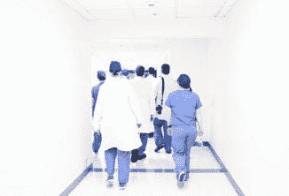
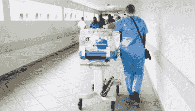

# 医疗保健需要医生独立

> 原文：<https://medium.datadriveninvestor.com/healthcare-needs-physician-independence-b7c77d68a172?source=collection_archive---------7----------------------->

#HCWB

从表面上看，医学职业的根本因素是它深深植根于人类的亲密生活中。这是一种与人的生活直接相关的礼仪。这是私人和神圣的任何人在这样的服务调查。为了完成这一任务，医生必须在病人的个人空间里认识到他们的每一条医嘱，并在客观和主观推理的结合点上做出让步。

因此，为了符合他们各自的职责，医生期望有足够的灵活性和信心。基于这一规定，它同样是合理的，但渴望说，为了完成任务，病人和医生必须积累独立于第三方的力量。这也是公平的陈述；临床专业的亲密合作氛围会被认为是对一种策略的反作用，在这种策略中，医疗实践的日常旅程通过巩固的官僚协议存在。这对于医疗实践的临床要素是有效的，并且与患者如何在特定的时间和地点与给定的医生互动的后勤、业务和从属关系有关。

最终，可以合理地认为一个可扩展的医疗实践推断出一个独立的医疗实践。例如，居住在农村城镇的人们可能比居住在城市社区的同龄人有更明显的优先权。

尽管有压倒性的智慧说明为什么独立医疗实践的生存对得不到充分服务的人口的主权至关重要，但我们还是瞥见了企业对医疗实践的超越。几十年来，独立医生被剥夺了培训机会，远离服务水平低下的城市，但几乎没有任何有价值的东西来替代。

独立的医疗保健利益相关者可以为那些拥有富裕选择的人维持高质量和有价值的医疗服务，这一点是不可或缺的，因为他们是向更好的医疗保健转变的驱动力。

# 这一过程的进一步集中化很难解决问题

相反，很少有人错误地认为，通过医疗辅助设备的权威再分配，集中管理、使用标准协议和运营公司化最终会以更低的成本为服务不足的社会(如农村地区)提供高质量的医疗服务。但是很明显，最近的历史证明了事实并非如此！

事实上，[根据发表在](https://www.medicaleconomics.com/news/employed-physicians-outnumber-independent-physicians-first-time-ever)医学经济学杂志上的一份报告，最新可获得的数据显示，2018 年，47.4%的美国医生担任职员。相比之下，45.9%的人是独立执业者。

根据美国医学协会(AMA)的数据，2018 年普遍有 6.7%的医生作为独立承包商工作，自 2012 年以来转移了 7%。基于不同的报告，独立的医生们已经开始回归，尤其是在美国中西部和南部的一些州。然而，尽管过度的热情集中在振兴私人医疗实践上，农村地区仍然在为企业医疗灾难的后果而悲伤。

例如，T [aylor Walker，一个住在内布拉斯加州偏远小镇 Arthur 的 25 岁居民](https://www.npr.org/sections/health-shots/2019/05/21/725118232/the-struggle-to-hire-and-keep-doctors-in-rural-areas-means-patients-go-without-c)，带着她年幼的儿子和孕妇，回想起她最近一次怀孕时的可怕疼痛。她记得在北普拉特看产科医生时没能去看医生。泰勒不得不进行一次四小时的往返尝试，这意味着放弃在当地酒吧和烧烤店的一天有偿工作。通常，她记得到达她预定的就诊地点时，才意识到另一个医生正在值班，而她的医生甚至不在。这使得她不得不走不同的路去见她的主治医生。

泰勒面临的特殊挑战并不是她一个人独有的，因为美国和世界各地的许多人都与她的医疗冒险有着千丝万缕的联系。今天，[农村医院和诊所正以惊人的速度关闭](https://www.ruralhealthweb.org/blogs/ruralhealthvoices/february-2019/rural-hospital-closures-rise-to-ninety-seven)，2019 年激增 98%。这种情况与国家或州的经济地位没有什么关系。然而，在像美国这样一个进步的国家里，看到对农村居民的极大侮辱是令人十分不安的。最大的挑战之一是寻找一位欣赏农村选民并认识到他们的牛仔心理的医生。

# 千禧一代和医疗保健

千禧年的医生们经常不能理解一个牛仔怎么能带着疼痛坚持那么久，并且直到他想要的时候才寻求医生的关注。有一场剧变影响了美国农村，也影响了整个医疗体系。随着婴儿潮时期出生的医生走向退休，独立诊所正在关闭。在医学院的最后一年，只有 1%的医生表示他们有兴趣生活在人口少于 10，000 的社区，只有 2%的医生希望生活在 25，000 或更少的城镇。

国家农村健康协会的报告显示，在农村地区，患者与初级保健医生的比例是每 10 万人中有 39.8 人，而在城市地区，这一比例是每 10 万人中有 53.3 人。仅占全国医生队伍 15%的家庭医生提供了农村地区 42%的医疗服务。这场危机对农村地区的影响似乎越来越大。

发表在 2019 年 5 月出版的《新英格兰医学杂志》上的一篇透视文章讨论了乡村医生群体的老龄化问题。因此，超过一半的乡村医生年龄在 50 岁或以上，这表明到 2030 年退休将占这些地区医生总数的额外 23%。它假设大多数医生倾向于在他们最初接受培训的地方执业，因为流行倾向于在城市地区与他们各自的医学院和住院医师项目相关的医院工作。

# 重新审视医生的职责

内科医生、开业医生、医生或仅仅是医生是行医的专业人士。他们是通过诊断、预测和治疗身体、精神疾病、伤害和其他痛苦来促进、保护和重建人类健康和幸福的人。

独立医生拥有并因此牢牢控制了他们的全部或大部分职业。因为灵魂主权，自主的医生享有为实践做出关键决定的自由。迄今为止，医疗职业本质上是一种个人努力。因此，成为一名独立医生的特权需要通过经营一家自给自足的外部机构来进行医学实践的能力。

总的来说，今天，医生选择就业而不是独立执业仅仅反映了他们的批判或无能，无法与更大的组织竞争，以维持精益和富有成效的临床实践。随着行政禁令的不断增加和扩大，管理费用保持独立性是一个选择的物质之间的医生倦怠和屈服于一个一刀切的过程。

# 医生在特质上是独立的

如前所述，医生在质量上是独立的生物，因为在这种环境下，他们可以提供高质量的专业护理，让病人满意。医疗实践与医生密切相关，因为它受到对每个人的道德承诺的约束。对于一个真正的医生来说，医疗职业不仅仅是一件苦差事。这是一种终生忠诚的生活方式。医疗保健对每个病人来说也是个人的，因为它是每个人最宝贵的财富。基于给予的理由，病人与他们的医生联系起来；而不是诊所、设施、实体或服务。保持独立实践的活力保持了个人对其基本支持者的重要性。

在美国的农村地区，医生相对短缺，但不是在全国范围内。

# 专业化与农村医生供给

一项研究假设，医生的技能越专业，他们就越不愿意在农村地区定居。在同样程度上，女医生表示特别喜欢城市风格的医疗实践。尽管管理式医疗系统最近已经转变为招募医生在乡村服务，但对于既没有医疗补助也没有传统医疗保险的贫困劳动者来说，他们的医生似乎是一笔稀缺的意外之财。因此，解决乡村医生短缺困境的可能方法是改革医学教育体系。因此，它培养了更多自愿选择在农村行医的医生，同时改写了医疗保险和医疗补助的报销策略，并发展了现有的联邦和州项目。

# 健康维护组织

根据 1999 年发表在《西方医学杂志》上的一篇文章，管理式医疗保健系统对农村医疗保健服务产生了新的影响。尽管如此，她们在农村的主导地位却异常缓慢。1995 年，80%以上的农村县至少有一个保健组织。今天，据说农村公众参加健康维护组织的概率不到 8.6%。管理式医疗不仅是私营部门的一个猛兽，而且在全国范围内，只有大约十分之一的农村医疗补助接受者参加医疗补助 HMO 和预付费计划。

HMO 是一把“双刃剑”正如文章所提出的，一是由于其地理分布，二是未能解决农村医疗服务不足的问题。管理式医疗保健网络有潜力在无法独立支持独立医生的地区，通过施加压力来提供雇用和部署医生的组织工具。但是，管理式医疗保健系统对农村健康的两个潜在不利后果是:失去了省级对医疗保健系统的控制，以及私人管理的医疗保健系统不愿向未投保者提供医疗保健。大多数大型市政机构都支持管理式医疗网络，这些力量对荒芜的农村社区没有什么洞察力或同情心。

通过纵向一体化计划聘用的医生的存在可能意味着社区拥有健康专家。然而，对于既没有医疗补助也没有传统医疗保险的贫困劳动者来说，它们可能只是名义上的用途。管理式医疗保健行业显示出突然涌入的趋势，以及它最终将主导农村地区的程度。尽管如此，如果它能像城市模式一样成功，那就很难预测了。自 1999 年在[西方医学杂志](https://www.ruralhealthinfo.org/news/topics/closures-of-healthcare-facilities-and-services)上发表声明以来，农村医疗保健进一步失控，越来越多的医院和诊所在 2019 年关闭；并且继续这样做下去！

# 独立医生的生存至关重要

医生及其实践的独立性为医疗保健的生存、发展和医疗服务质量扫清了道路，不仅在。农村地区，而且遍及全球。它适应性强，亲密无间，以病人和医生为中心。它是[分权](https://www.datadriveninvestor.com/glossary/decentralization/)的德性，因而容易适应特定的生境。大型系统绝不是这样；从今以后，他们倾向于改变商业模式的可行性，这在像 HMO 网络这样的封闭系统中起着主导作用。

自管理式医疗体系建立以来，农村社区比以往任何时候都更加缺乏高质量的医疗服务。甚至它们向农村社区的扩张也是由滥用政府拨款推动的，如果把重点放在增强贫困人口中基层医生和患者的能力上，这些拨款本可以得到更有效的利用。

像任何其他社区一样，农村地区需要能够与他们交流的医生，如果不是更多的话。农村社区意识到个人感觉和富有同情心的护理的价值，并将支持基于这一原则的医生。

# 企业接管医疗保健

公司的盈利系统将会以一种人文主义的姿态在农村地区消亡。为了让企业系统自我维持，它们必须制定严格的协议。然而，通过获得纳税人的钱和政府的支持，独立医生的机会被剥夺了。[政府对这个问题的不当处理](https://link.medium.com/2QbK8DUiL2)进一步阻碍了医疗界，无论是通过未经证实的授权还是促进庇护[公司勒索](https://link.medium.com/SzvYbgXiL2)医疗[社会站在强大实体一边](https://medium.com/datadriveninvestor/medical-societies-and-their-flop-of-a-century-old-quest-2734c9c90f72)。

医疗保健行业的企业收购正在我们的眼前发生，政客们被引开去安抚选民的不满，而信息却没有通过网络中立传达真实的肖像。州和联邦立法者期望严格监管医疗保健系统。他们预计将引入所有根据相同条例运作的医疗机构。这是他们以尽可能低的成本进行管理的独特方式。他们所选择的道路将导致一个系统，在这个系统中，每个医生都遵守相同的协议，并且所有病人的病历都是集中的。后者直观地参与了一种手段，使庞大的医疗体系变得易于管理和负担得起。为了做到这一点，政府一直在启用管理式医疗系统，作为有效、负担得起的医疗保健服务的有希望的原型。但是，尽管分配医疗系统可能对政府官员来说是最好的，但它却让病人失望了，尤其是那些生活在农村社区的人。

在与企业健康维护组织的接触中，政府不可避免地寻求与相同的实体进行直接谈判。与此同时，他们也在公民福利和企业暴利之间制造了宪法利益冲突。

# 政府的作用

政府的任何努力，无论是通过立法授权的直接方式还是通过补贴公司的间接方式，都应该避免。任何权威约束都必须保持在高水平，并与原则保持一致，并专注于确保公共安全，而不是通过管理式医疗公司医学的便利来利用临床判断。

期望应该维持宏观管理，而不是微观管理医生的临床判断！为了避免政府的偏袒，透明度和投票权应该被视为美德。对任何政府；从短期来看，公司可能看起来高效且具有经济吸引力。然而，他们得出了加强服务不足地区的医疗保健所需的独立实践的支出。

与一些人传达的相反，问题不一定是初级医师短缺。主要的挑战是，很少有医生愿意放弃其他城市机会，也不会因为加班和劳累而受到斥责。

世界；特别是美国，它忽略了一个大规模的阴谋。保险业正在调查谁在哪里工作，如何获得赔偿！[独立医师实践生存](https://medium.com/writers-guild/are-we-really-facing-a-shortage-of-primary-care-physicians-a807680cf3b6)对服务不足的省份至关重要，因为它允许他们获得高质量的医疗服务和保持健康的特权。

# 独立医生的做法需要现代化；这一次用了新的面纱

对乡村医生短缺的认识促使医疗保健倡议鼓励医生在大都市以外的地区执业，比如通过向危机投入资金，找到让医生在乡村社区执业有利可图的方法。它还[制定了医学教育课程的改革，并在农村医疗机构实施了](https://www.medicaleconomics.com/news/dealing-shortage-rural-physicians)住院医师项目。通过这种方式，医生们认为获得了在农村环境中茁壮成长的能力和信心，使得他们在完成他们的项目后更有可能留在该地区。

# 临床课程多元化的理念

使课程多样化以支持农村社区是一个很好的想法。然而，这似乎是过于乐观的推断；与此同时，农村医院被强行关闭，考虑在这些地区开设住院医生项目是不切实际的，因为住院医生项目需要大量的融资和最佳资源。缺乏独立的财政储备，加上医疗案例的数量和多样性不足，正是农村医疗保健今天遭遇困境的原因。当前的系统没有提供足够的住院医师项目的病人案例来指导他们的候选人。

一个完全[的现代实践管理系统](https://medium.com/@Adamtabriz/we-can-keep-rural-health-clinics-from-going-out-of-business-9b72f74416ab)有望在城市地区之外配备体面的医疗保健，这种情况下，小诊所可以获得更大网络可用的相同诀窍和技术提升。

随着世界走向数字化[，非城市地区的诊所需要融入政府管理和更广泛的卫生系统。他们需要能够简化流程和削减开支，而无需雇用额外的顾问和其他员工。如果坚持的话，将会使原来的拨款更加紧张。](https://medium.com/be-unique/we-can-keep-rural-health-clinics-from-going-out-of-business-3a765cba1340)

# 维持农村医疗保健的步骤

实现农村医疗保健的步骤是多方面的，必须从基层开始。因为农村社区保留了健康和保健的独特视角；因此，集中健康信息和整个系统至关重要。

主权共同体的理想运作最好通过该社会在内部和其他地区的合作来实现。与此同时，它将作为政府的[义务而存在](https://medium.com/writers-guild/can-we-ever-bring-transparency-in-healthcare-72fd9e1a5cb1)忍受高层次、透明而精确的问责，以劝阻[经济租金](https://www.datadriveninvestor.com/2019/11/10/economic-rent-the-influential-switch-in-excess-of-talent-and-skill/)。

在缺医少药的省份建立优质医疗服务的过程中，政府不作为的主要障碍是其自上而下的政策。历史上，它们一直致力于为纯商业导向的“一刀切”的企业药物提供避风港。这部分是由许可和认证垄断造成的；从今以后，政府是唯一的和最终的代理人，可以保证这样的条例。它可以潜在地刺激社会人才、经济和健康的个体因素。建立和优化虚拟开放医疗保健市场也是有可能刺激经济和增强支持的战略之一。

# 需要一个自由的医疗保健市场

公民们需要一个自由[和开放的医疗保健市场](https://medium.com/@Adamtabriz/why-we-need-a-free-open-healthcare-marketplace-9227c24267ee)，一个被现代技术所激励的市场，从而将患者、医生和利益相关者无障碍地联系在一起。

优化远程医疗很有意义，但不足以满足患者的期望和医生的需求。现代系统必须致力于建立各种医疗保健技术和服务。那些将同时产生就业机会的项目；激励农村人口为自己的需求和决策做出贡献。这使得赋予选民个性的意义更加重大。

【https://www.datadriveninvestor.com】原载于 2020 年 2 月 2 日**。**

* [## 深度学习游戏化和人工智能作为一种现代学习工具，还是一种代理…

### 在阅读一些关于深度学习和人工智能的最新趋势时，我偶然发现了一个…

medium.comm](https://medium.com/datadriveninvestor/deep-learning-gamification-and-artificial-intelligence-as-a-modern-learning-tool-or-an-agent-of-d853f349c112)*