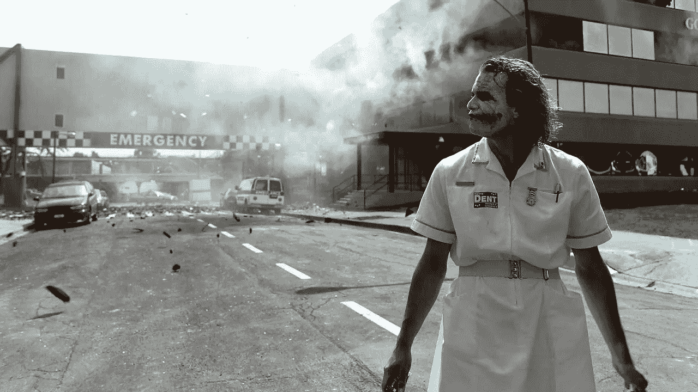
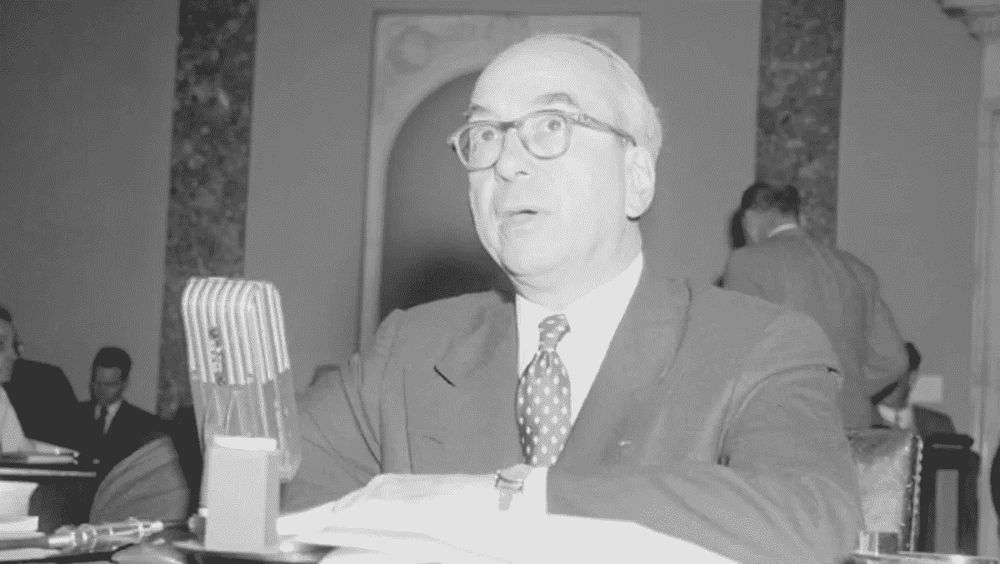
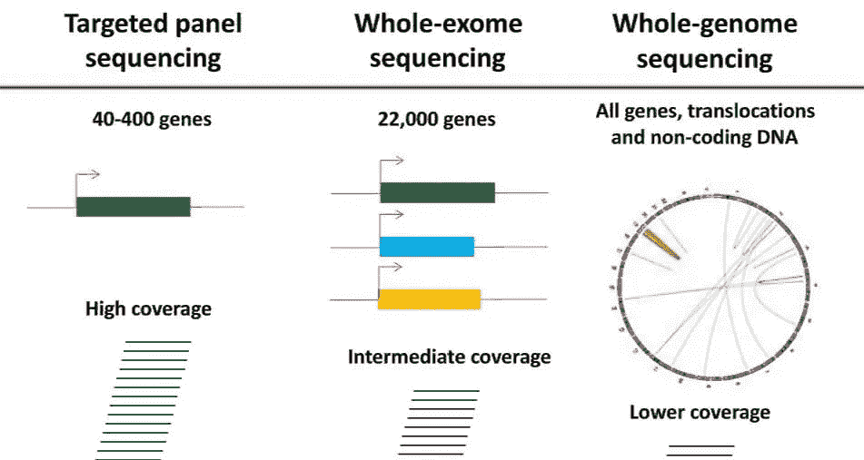
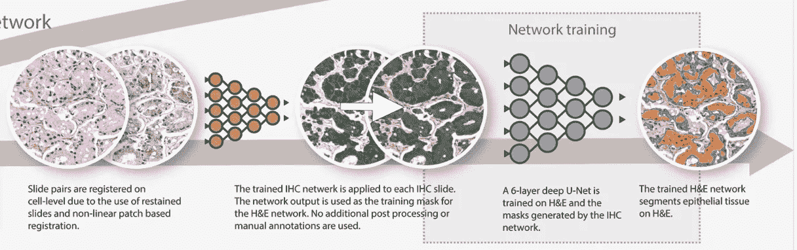
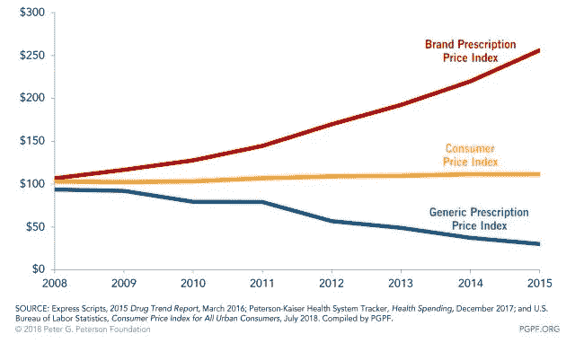

# 医疗保健太便宜，无法计量

> 原文：<https://medium.datadriveninvestor.com/healthcare-too-cheap-to-meter-e3307ebcae3?source=collection_archive---------8----------------------->

“当世界末日来临时，每个人都将独自去购买医疗保险。”Dave“e patient”DeBronkart 在打电话时随口说出了这句话。我不得不询问天启的事。*当系统在其自身的成本和复杂性下崩溃*。我们的对话发生在 COVID 流行病摧毁医院收入并将其推向破产的一个月前。

也许这样就好了！也许我们会发现，我们可以用因为生病而无法出去买 4 美元一杯的咖啡而省下的钱来购买更好的医疗保健。也许当我们在当地的小诊所等待的时候，机器会调制出个性化的癌症治疗方案。也许我们可以通过健身追踪器免费获得一大堆建议。也许医疗保健会便宜到无法计量，或者至少便宜到无法投保。

廉价的医疗保健现在听起来难以置信。医疗保健是我们个人生活中最昂贵的部分之一。它也是美国经济中最昂贵和最复杂的部分。在过去的 60 年里，成本无情地增加，从 GDP 的 5%增加到 18%。医疗保健的供应是严格限量供应的。它以十分钟为增量计量。

“太便宜而无法计量”这句话是 1954 年的一个著名失败，当时原子能委员会的 Lewis Strauss 给了我们一个元素“t *变换的愿景——无限的能量，通过示踪原子研究活细胞工作的能力，即将被揭开的光合作用的秘密——这些以及其他一系列结果都是在短短 15 年内完成的。期望我们的孩子在他们的家里享受便宜到无法计量的电能并不过分。*“实际发生的情况恰恰相反。我们面临着能源危机，一代人沉迷于能源的匮乏，一个被污染的大气层烘烤着的星球。

Lewis Strauss — Great speech. Famous fail on cheap fusion energy

但是我们最终扭转了能源市场。2009 年，计算机网络先驱鲍勃·梅特卡夫(Bob Metcalf)关于“可挥霍的丰富能源”的想法震惊了观众。技术进步使得流经我们网络的比特太便宜而无法计量。也许能源也将如此。自梅特卡夫的沉思以来，仅仅过去了 11 年。可再生能源比旧的能源更便宜，而且价格还在下降。石油交易价格低于零。聚变发电又被提上了日程。

55 years later, Metcalf saw a squanderable abundance of energy, with self-driving bonus

# 那里的医疗保健越来越便宜

同样类型的成本下降也可能发生在医疗保健行业。我正在研究由广谱诊断驱动的自动化建议。这将给每个人一个照顾我们健康的代理人。让我们看看这可能会如何发展。

## 自动化建议

机器可以通读健康记录，并产生建议和提醒。它可以很便宜地做到这一点，因为它只是软件。这个自动化的顾问不能放心地拍拍你，但它在某些事情上比人类医生做得更好。

*   软件和规则受到质量控制并不断改进。
*   它们很全面，而且经常更新。
*   它们可以解释大量、实时和复杂的数据，包括图像、DNA 序列以及传感器和设备流
*   他们总是有空的。他们可以整夜或者一整天关注他们的病人。

我们最终将拥有在分子水平上理解我们的人工智能顾问。他们将是真正关心我们个人健康的个人代理人，他们不会被出售服务的欲望所左右。

我们可以从目前的技术开始。我们有越来越多的规则可以查看标准的 FHIR 健康记录，并提供提醒、跟进、关注风险以及检查药物-药物和药物-基因相互作用中的问题。他们还可以帮助我们选择高质量、低成本且可报销的护理。

## 广谱诊断学

为了提供好的建议，我们需要来自测试和其他诊断的信息。有成千上万种不同的方式来看待血液，或活检，或 DNA，或图像。决定运行哪些测试是复杂的，运行这些测试也是昂贵的。

收集信息将变得更简单、更便宜，因为我们将使用更少的通用诊断工具。例如，我们将使用一个持续一生的“全基因组序列”,取代许多不同的测试各种遗传特征的“面板”。我们将有一个传感器阵列，可以看到许多不同的生物标志物和状况，而不是针对特定生物标志物的许多血液测试。

Hanna Rennert — Validation and Implementation of Whole-Exome Sequencing

这种类型的一个有趣的例子是“数字病理学”。目前诊断乳腺癌的做法是采取活检，并将其发送给病理学家，病理学家在显微镜下观察。如果样本看起来很危险，他们会送去做一些化学测试(IHC)。在数字版本中，病理学家拍摄样本的照片，并将其发送到计算机。在对数百万张图像进行训练后，计算机可以帮助病理学家判断肿瘤有多危险。计算机还可以检测人类看不到的肿瘤特征，这通常需要额外的 IHC 测试。一张图片和一些软件可以代替一系列更昂贵的测试。

From “[Epithelium Segmentation](https://rdcu.be/b5pnz)”, Bulton et al

计算机可以使用类似的技术来检测仅使用手机传感器的情况。他们可以看一张脸的照片，听一个声音(“你今天感觉怎么样？”机器人问)，感觉运动和步态。那项服务是免费的，每天全天。

## 治疗自动化

机器可以以低成本和高产量制造定制的治疗。制造眼镜是一个简单的例子。在美国，一次常规眼科检查通常要花 100 美元，然后花 200 美元买新眼镜。这个过程可以自动化，这样就可以用便宜的机器来测量眼睛。然后，测量机可以向研磨机发送指令，研磨机研磨眼镜的镜片。在这种情况下，自动化和定制制造可以节省几百美元。

对于像癌症这样的复杂问题，回报会大得多。“个性化新抗原疫苗”是一种新的昂贵的癌症治疗方法。理论上，创造这种疗法的机器可以放在一个房间里。一台机器将找到癌症的 DNA 序列，并了解癌症和病人的免疫系统。利用这些信息，不同的机器可以合成刺激免疫系统攻击癌症的分子。

## 免费的药物，如“自由”

随着时间的推移，越来越多的药物将会成为当地药店的便宜货。

美国的药品支出从 1960 年的 27 亿美元上升到 2019 年的 3600 亿美元，全球药品支出接近 1 万亿美元。最近，每种药物的价格上涨导致成本增加。供应商证明这些更高的价格是支付 R&D 花费的一种方式，这给我们带来了奇妙的新疗法。然而，大多数价格上涨都是针对几十年前就付清 R&D 的老药。这些老药的高价是支付复杂性和监管俘获(一个让供应商制定规则的花哨术语)的结果。

解决这些老药价格上涨的方法是放开市场。制药游说力量较弱的国家药品成本要低得多。例如，一种名为“Lantus”的流行现代胰岛素在美国的标价约为 320 美元，在印度为 33 美元。

## 自我支付

沃尔玛现在开设诊所，在那里你可以掏出几张钞票，在没有保险的情况下看医生。他们贴出固定的价格，比如每年体检 30 美元，或者看医生每分钟 1 美元。如果你有信用卡，你可以以类似的价格购买远程健康咨询。

自付费系统比我们在美国的奇怪系统更便宜，可能比单一付费或按人头付费更便宜。他们通过允许顾客购买有价值的商品，并通过剔除有动机提高成本的中间商来降低成本。

这是一个良性循环。当成本下降到很多人选择直接支付的程度时，这将推动成本进一步下降。

我们可以通过努力开发最廉价、最自动化的建议、诊断和治疗方式来取得很大进步。这将建立一个自付的举动。

# 你在家得到的关怀

廉价且自动化的建议将流入医生不在的真空地带。

我们仍然需要人类来照顾生病、受伤和情绪激动的病人。但是，我们现有的医疗保健提供者很少进入家庭。人类临床医生在治疗来到医疗大楼的病人方面做得很好。然而，99%的时候，病人不在医疗大楼里。这就是自动化可以接管并应用持续关注的时候，因为太便宜而无法计量。

我们看到远程护理的快速发展。今年，医生们将许多咨询转变为“远程健康”——电话和视频。像美国政府这样的付费者同意为家庭监控付费。新的廉价和自动化的服务适合这种远程交付渠道。

人类无法监控来自家庭监控的所有信息。他们需要自动代理来实时查看正在发生的事情，并向人类发出问题警报。

# 关心的个人代理

更便宜、更易获得的药物可以为病人和医生服务。患者通常不注意自己的健康，并且对护理选择知之甚少。我们将对软件代理进行编程，使其专注、积极，并能够利用完整的全球建议和服务网络。自动化顾问可以设置诊断。然后，他们可以指出他们的客户应该去哪里和什么时候进行实际护理。

当人类和他们的代理人在何时何地购买医疗保健方面变得聪明时，这将迫使医疗保健行业发生变化。

# 分裂

精明的购物和不断下降的成本可能会迫使该行业变得更加专业化和集中化。

目前，社区卫生保健提供者需要准备好处理病人可能遇到的几乎任何问题。诊断和提供每一项所需的服务都是昂贵的。也是均衡。成百上千个供应商中的每一个都做着大致相同的事情。而且，它降低了质量，因为许多治疗是由没有足够数量和经验来降低成本和质量曲线的提供者处理的。

当客户拥有自己的智能诊断和代理时，他们将知道去哪里治疗。

*   他们将进行比较购物，这将最终对价格施加下行压力。
*   他们会集中精力做生意。他们将确定价格和质量最好的供应商，这些供应商往往是该特定治疗的最大供应商。
*   他们将把这个行业分割成专业化的供应商。

保险公司也会受到影响。如果日常护理变得足够便宜，我们就不需要像现在这样复杂的保险和支付方案。我们将使用“灾难性”健康保险来支付昂贵的亲自治疗费用。

在美国和许多其他国家，医疗保健是一个巨大的行业。如果医疗保健开始变得更便宜，它将推动该行业发生巨大的变化，从而改变整个经济。

理想情况下，我们需要这些服务的频率会降低，因为我们会更健康。