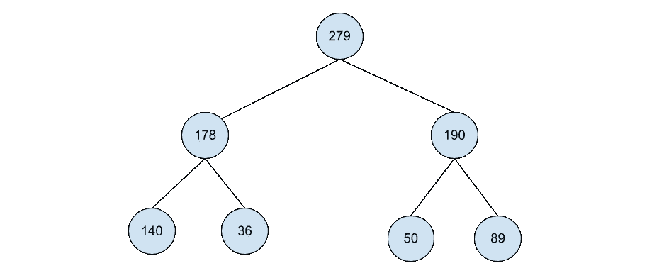
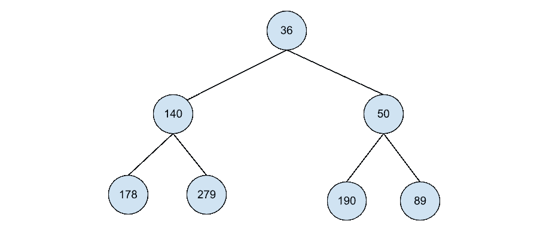

# 很

> 原文：<https://medium.datadriveninvestor.com/heaps-ad564e35a26c?source=collection_archive---------23----------------------->

image by [freeimageslive.co.uk — freefoodphotos](http://www.freeimageslive.co.uk/free_stock_image/chopped-fresh-chives-jpg)

# 什么是堆？

在现实生活中，“堆”实际上是一堆项目。在计算机科学和编程中，堆非常类似，但更具体地说是组织数据。

要理解什么是“堆”，首先要理解什么是“树”。一旦你阅读并理解了什么是“树”,你就会明白堆基本上是一棵规则略有不同的树。

# 定义堆的两种不同方式

无论您如何定义它，堆都是没有顺序的树，根据您使用的堆的类型，规则略有不同。“无顺序”是指没有决定哪个子节点得到什么的底层条件。

**最大堆**:最大堆是指每个父节点大于其子节点的堆。

**最小堆**:最小堆是指每个父节点小于其子节点的堆。

当使用堆时，它们通常不是最大就是最小。然而，还有许多其他类型的堆存在并被用于各种目的。然而，最常见的是二进制堆。

# 二元堆

二进制堆基本上是一棵没有顺序的二叉树。最大和最小二进制堆也是如此，只是每个父堆最多只能有两(2)个子节点。

## 最大二进制堆

最大二进制堆是每个父节点大于其子节点的堆。

## 最小二元堆

最大二进制二进制堆是每个父节点大于其子节点的堆。

# 为什么堆很重要？

计算机科学是你所说的“应用”科学，所以它表明没有什么是真正“只是为了好玩”或纯粹的好奇。任何事情都是有原因的——在编程中理解堆的主要原因是使用它们来实现另一种称为优先级队列的数据结构。

## [优先级队列](https://en.wikipedia.org/wiki/Priority_queue)

优先级队列基本上就是队列，只是优先级队列项可以是“无论什么进来，最大优先级先出去”，而不是“先进先出”

与使用带有排序算法的列表/数组相比，使用堆来实现优先级队列要高效得多(时间复杂度为 O(log n))。

## [图的遍历算法](https://en.wikipedia.org/wiki/Graph_traversal)

图的遍历是搜索、组织等的一个重要部分。，当您有数千个用户帐户或数百个 moth 和其他示例的子种类时，高效地完成它是非常重要的。

与简单的方法相比，堆有助于有效地找到集合的最大值或最小值，并有助于加快所需的时间。媒体撰稿人 Try Khov 在这里有一篇关于它的文章[。欢迎随时查看并鼓掌！](https://trykv.medium.com/algorithms-on-graphs-the-importance-of-heaps-e3e1385ae534)

# 成堆成堆

就像你一开始学习的任何东西一样，从最基本、最常用的概念和实现开始。以此为基础，让你的好奇心逐渐引导你学习更多。您实现的每个数据结构都有无限的可能性。

 [## 堆(数据结构)

### 在计算机科学中，堆是一种专门的基于树的数据结构，本质上是一种几乎完整的树…

en.wikipedia.org](https://en.wikipedia.org/wiki/Heap_%28data_structure%29)  [## 面包先放在树上

### 在树中搜索兄弟姐妹

jmrallen.medium.com](https://jmrallen.medium.com/bread-first-that-tree-988bf71f9279)  [## 堆/优先级队列教程和注释|数据结构|黑客地球

### 堆是一种基于树的数据结构，其中树的所有节点都按照特定的顺序排列。例如，如果…

www.hackerearth.com](https://www.hackerearth.com/practice/data-structures/trees/heapspriority-queues/tutorial/) 

[https://www . codes dope . com/blog/article/Priority-queue-using-heap/#:~:text = Priority % 20 queue % 20 is % 20a % 20 type，first % 20 come % 20 first % 20 serve % 20 basis](https://www.codesdope.com/blog/article/priority-queue-using-heap/#:~:text=Priority%20queue%20is%20a%20type,first%20come%20first%20serve%20basis)。