# 检测心脏病

> 原文：<https://medium.datadriveninvestor.com/heart-disease-machine-learning-9e2c877ea54a?source=collection_archive---------30----------------------->

image: http://www.freepik.com>Designed by Starline / Freepik

在所有之前的分析完成后，如果你没有读过它，你可以在这里阅读，我们终于开始了数据科学有趣的部分，至少对我来说，那就是创建算法来检测病人**是否患有**或**没有**心脏病。

当然，我们将使用从 ***克利夫兰诊所基金会*** 收集的分析中使用的相同数据，以及在[知识库 UCI *机器学习*](https://archive.ics.uci.edu/ml/datasets/heart+Disease) *中可用的数据。*

为了记住我们的数据是如何组织的，这些是我们数据集中的前三行:

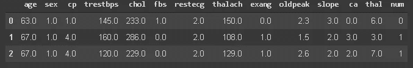

看我们的数据，变量`num`指的是心脏病的诊断:如果是零表示没有心脏病，如果是一表示有心脏病。这正是我们想要发现的，所以我们的变量`num`将是我们的目标，其他变量将是我们的输入。

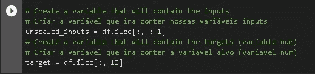

## 数据分割

为了将我们的数据分为训练和测试，我们将使用 scikit-learn 工具来完成这项工作，我们还将在此过程中调整我们的数据，以减少方差，并确保我们的模型保持通用，减少过度拟合。该过程描述如下。默认情况下，我们的模型分为 75%的培训和 25%的测试，但我将改变这一点，并将测试规模设置为 20%和 80%的培训。

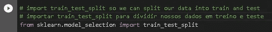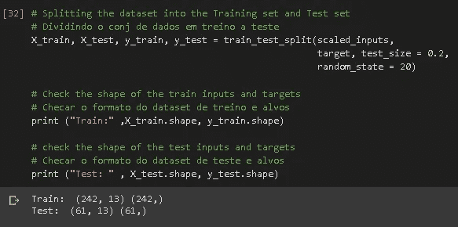

# 逻辑回归

我们将在这个机器学习中使用的统计技术是逻辑回归。这种技术用于通过分类变量来预测一些事情(在我们的例子中是我们的二元变量`num`)。

同样，我们将导入 scikit-learn 工具来为我们处理这项工作。

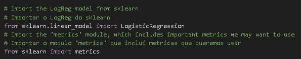

## 训练模型

通过使用 fit()方法的一行代码，我们可以训练我们的机器学习模型，然后检查它的准确性。

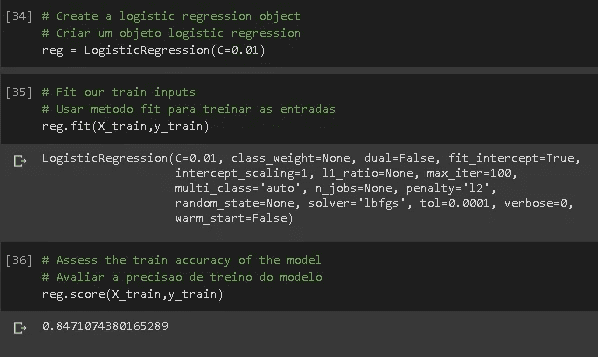

哇，我们的模型有大约 85%的准确率，太棒了！让我们通过计算来复查一下这个准确性…

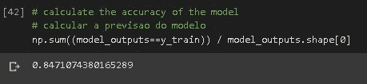

accuracy double-checked

# 测试模型

我们的模型现在已经训练好了，所以我们要测试上面的模型。为了做到这一点，因为我们希望预测患者是否患有心脏病，我们评估了模型的测试准确性。

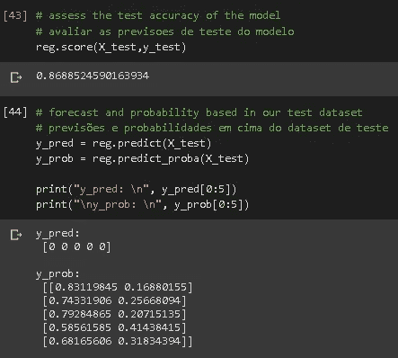

在测试准确性时，我们的模型得分几乎达到 87%

正如你在上面看到的，我们还提取了每个类别的概率。顾名思义，变量 y_pred 是我们的算法所预测的，而 y_prob 是我们的模型预测 0(左数)和 1(右数)的概率

## 混淆矩阵

验证我们算法准确性的一个很好的方法是使用混淆矩阵。对于每一类，它告知实际值和来自我们模型的预测值。

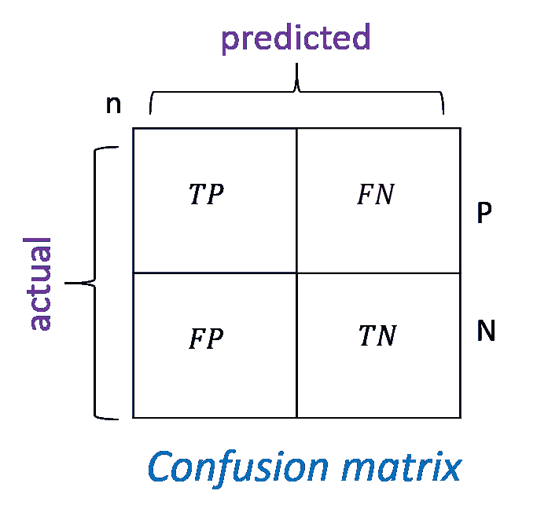

这种方式可以快速识别:

*   **真阳性— TP:** 比如当一个病人有心脏病，而我们的模型将其归类为有血管疾病。
*   **假阳性— FP:** 例如，当患者患有心脏病，而我们的模型分类为没有血管疾病时。
*   **真阴性— TN:** 例如，当患者没有心脏病，而我们的模型将其归类为没有血管疾病时。
*   **假阴性— FN:** 例如，当患者没有心血管疾病，而模型将其归类为有血管疾病时。

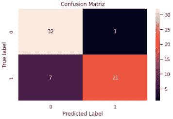

我们还可以打印一份分类报告，如下图所示。

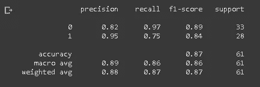

*   **精度:**正面预测的精度。
*   **回忆:**被正确识别的阳性分数。
*   **F1-得分:**是精确度和召回率的加权调和平均值，最好的得分是 1.0，最差的是 0.0

# 结论

这是进行*机器学习*模型*，*的一种方式，我们可以通过多种方式提高我们模型的准确性，例如获取更多数据、特征选择、评估指标等等。

 [## 将定义 2020 年就业前景的五大数据科学和机器学习趋势|数据驱动…

### 数据科学和 ML 是 2019 年最受关注的趋势之一，毫无疑问，它们将继续发展…

www.datadriveninvestor.com](https://www.datadriveninvestor.com/2020/02/19/five-data-science-and-machine-learning-trends-that-will-define-job-prospects-in-2020/) 

我希望你喜欢它！

查看[我的 GitHub 中的完整代码。](https://bit.ly/39hVEMp)