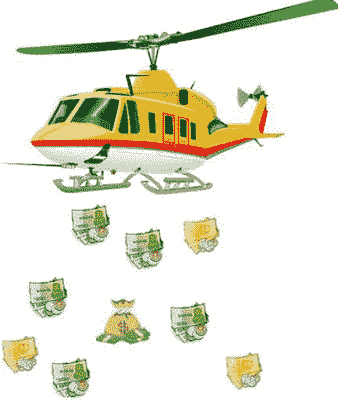
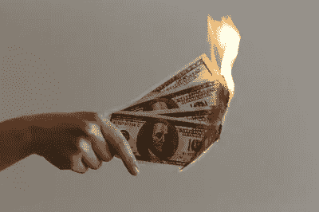
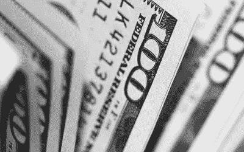
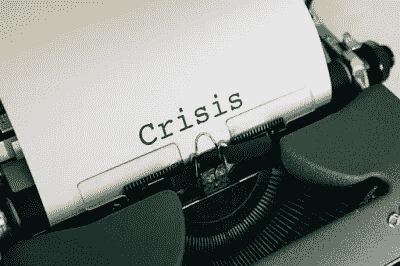
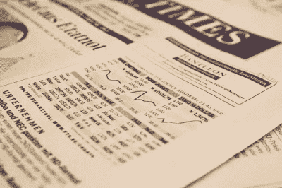

# 直升机撒钱

> 原文：<https://medium.datadriveninvestor.com/helicopter-money-d60b1d6271a7?source=collection_archive---------19----------------------->

## 为什么印度不应该这样做。

奥罗莫病毒已经显示出它对世界经济的影响。各国实施的封锁导致经济活动枯竭。因此，世界正处于衰退之中。为了支持经济，许多国家提出了一揽子救助计划。在这种情况下，货币政策是上升的，即**直升机撒钱**。直升机撒钱是经济学家用来提振一国经济的概念。为了理解直升机撒钱以及它如何帮助经济复苏，让我们先来理解什么是直升机撒钱。

Helicopter-Money-India

诺贝尔经济学奖得主米尔顿·弗里德曼于 1969 年在其研究论文《货币的最优数量》中首次提出了直升机撒钱。这一概念的重点是提高经济中的流动性，通过刺激人们增加支出来应对衰退，从而刺激对产品或服务的需求，进而提高经济产出，帮助经济摆脱衰退。

Helicopter-Money-India

简而言之，政府正试图通过向人们发放免费的钱来刺激经济。这一概念是为了在流动性紧缩的情况下提供帮助。根据这一概念，政府必须印刷更多的钱，必须从直升机上空投(但政府不必空投，可以将这笔钱存入人民银行账户)。这个概念有几个假设。

1.  人们不得不花他们从政府那里得到的钱。人们不应该囤积金钱。如果人们囤积，那么情况不会改变。
2.  政府必须精确计算货币注入的总量。超支会导致通货膨胀，支出不足不会改变这种情况。
3.  政府必须仔细选择直升机撒钱的地区，因为每个地区都有不同的需求。

# 现在让我们理解直升机撒钱是如何帮助经济的。

衰退时期最大的问题是经济陷入流动性紧缩。这是一种公司手中握有现金，而人们却精疲力竭的情况。公司和个人发现很难花钱，经济慢慢走向衰退，在直升机撒钱的帮助下，如果使用得当，经济中消耗的现金可以恢复。在经济衰退时花钱是首要步骤，在直升机撒钱的帮助下，这个目标是可以实现的。

当一个经济体陷入衰退时，企业扩张停止，GDP 随着公共支出收缩。因此，走出衰退恶性循环的一个步骤是增加支出，在直升机撒钱的帮助下，现在更多的钱掌握在政府提供的人手里。人们和企业可以消费，经济将提振走出这种恶性循环。

Helicopter-Money-India

# 在新冠肺炎危机中，我们为什么要考虑直升机撒钱？

据估计，世界经济将因冠状病毒而面临 8 至 9 万亿美元的损失。这个数字是如此迷人，以至于这个数字是印度 GDP 的两倍多，超过了日本和德国的 GDP。油价下跌也对产油国产生了负面影响。(你可以阅读我关于[新冠肺炎&油价下跌](https://onkarjadhavv.blogspot.com/2020/04/covid-19-decreasing-oil-prices.html)的文章)。一些经济体的国内生产总值出现了负增长。各国政府已经宣布将国内生产总值的 30%到 40%作为救助计划。

这些措施是值得赞赏的，并受到许多经济学家的欢迎，但正如我们所知，政策总是滞后的。由于各自政府实施的政策步骤滞后，可能需要数年时间才能显示其影响，但在目前情况下，国家没有太多时间。许多公司和个人抗议封锁。全球许多人迫切需要基本商品和服务。各国不仅应该重新开放经济，还必须提高产出。通常情况下，复苏会以 U 型形态出现，这需要时间。这种类型的复苏很容易需要几个季度或一年的时间。因此，我们需要一项能够产生直接影响的政策。直升机撒钱可以解决当前的危机。

Helicopter-Money-India

# 为什么我们不应该考虑新冠肺炎危机中的直升机撒钱？

即使在这种情况下，我们也不应该考虑直升机撒钱，因为这一步骤很有可能适得其反，损害经济。在每个经济体中，都有一定数量的货币在流通。中央银行必须仔细评估经济中的货币供应。如果一个国家的 GDP 增长了“ *x* %”，这个国家就应该发行“*n”*种货币，反之亦然。这个数字可能因国家而异。

在当前的经济形势下，几乎每个国家的 GDP 都在萎缩，在这种情况下，如果我们增加货币供应量，这将直接违背经济规律。在这一点上，不断增加的货币供应量可能会暂时上调，但最终将陷入流动性陷阱，从长远来看，这将损害经济。过多的货币供应会引发通货膨胀，如果处理不当，会导致恶性通货膨胀。我们有委内瑞拉和津巴布韦的例子，货币供应过剩导致了恶性通货膨胀。

直升机撒钱的一个假设是人们不应该囤积钱，在目前的情况下，可能会有一群人不遵守规则。因此，实施直升机撒钱的概念将面临巨大风险。

Helicopter-Money-India

# 结论-

直升机撒钱是个好主意，但也有风险。按照我的观点，直升机撒钱应该被认为是最后的手段。我完全同意，这场危机是历史上最严重的危机之一，需要努力从危机中恢复过来。直升机撒钱似乎很有吸引力，能带来立竿见影的回报，但从长远来看，这将带来伤害。全球各国政府不应该只关注缺点，而应该着眼于大局。

*原载于 2020 年 6 月 17 日 https://onkarjadhavv.blogspot.com***。**