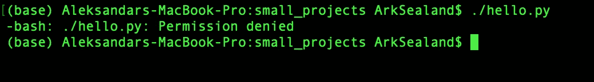
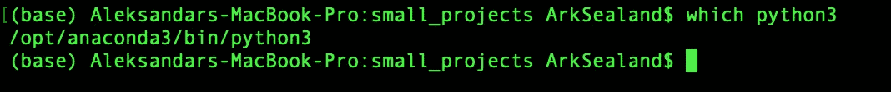
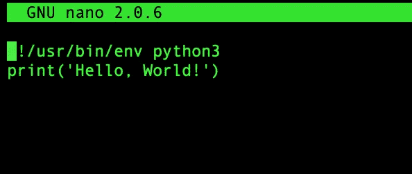
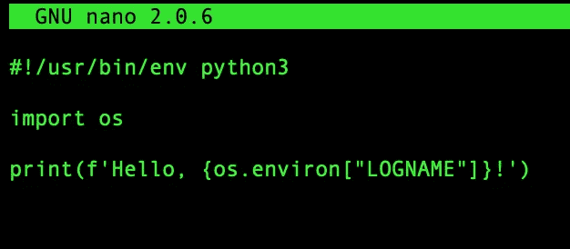

# 用户你好！—可执行文件和您的环境

> 原文：<https://medium.datadriveninvestor.com/hello-user-executables-and-your-environment-bda87cd412d1?source=collection_archive---------13----------------------->


Photo by [Melinda Gimpel](https://unsplash.com/@melindagimpel?utm_source=medium&utm_medium=referral) on [Unsplash](https://unsplash.com?utm_source=medium&utm_medium=referral)

> 我决定适可而止，于是我踏上了了解环境变量的旅程，并获得了更多信息。

我一直对自己在环境变量方面的知识感到不安。$PATH，$HOME，$USER 不时出现。我决定适可而止，于是我踏上了了解环境变量的旅程，并获得了更多信息。

通过阅读本文，您将学习如何用 python 编写小程序，这些程序可以在任何地方从终端命令行执行。最后，我们将创建一个小程序，用以下命令执行:

```
hello
```

并返回“你好，<yourlogname>”</yourlogname>

在此过程中，我们将掌握使程序能够在任何地方执行的关键概念，例如:

*   环境变量
*   “Shebang”或“hash bang”(#！)
*   解释程序
*   小路

并加深我们对一般项目的了解。

这个项目在 Mac OS 上运行，可以移植到其他操作系统上。它假设对终端了解很少，并且只需要基本命令，例如:

```
ls
pwd
cd
```

## 从“你好，世界”开始

以上所有内容都可以在没有任何代码编辑器的情况下完成(我将使用 nano 来编辑代码)，但是您当然可以在自己选择的任何代码编辑器中完成。

首先，我们要创建一个名为 hello.py 的文件。导航到文件目录中您习惯使用的空间并创建文件(您可以使用下面的命令):

```
touch hello.py
```

在代码编辑器中打开文件:

```
nano hello.py
```

告诉文件打印旧的“Hello World”:

```
print('Hello, World!')
```

保存文件(Nano: Ctrl + X，然后按 y 和 enter)

我们可以让 python3 为我们运行这个程序，它会打印出‘你好，世界！’：

```
python3 hello.py
```

python3 解释文件并输出结果。

# 使程序可执行

程序运行，我们可以调用 python3 来运行它，但是如果我们试图直接在系统中运行这个文件，它还不知道如何运行这个程序。即它是不可执行的。



Trying to execute the program using the system itself returns permission denied.

Shebang:

```
#!
```

Shebang 告诉系统运行程序以及如何运行程序。

但首先要评论一句:

> python 中的注释是跟在八叉符号' #'
> #之后的任何东西，因此 Python 不会识别这个句子，它是作为注释存在的。

因此，Shebang '#！'Python 不会将其识别为代码，而是将其识别为注释。相反，Unix 内核加载器系统会识别它，并通过读取 shebang 之后第一行的剩余部分来对它做出反应。然后，它知道要运行什么程序，并将文件名(' hello.py ')作为最后一个参数提供给解释程序。解释器照常运行，将 Shebang 视为注释。感谢凯文·潘科在这个栈溢出[帖子](https://stackoverflow.com/questions/3009192/how-does-the-shebang-work/3009280)。

我们使用 shebang 来嵌入关于程序应该如何执行的信息。具体来说，下面的代码应该嵌入到程序的顶部:

```
#!/usr/bin/env python3
```

上面的代码是在说‘使用 env 程序(环境程序)找到解释器 python 3’。

/usr/bin/env '是环境程序所在的路径。

当我们在终端中使用 python3 命令时，或者上面我们提供给环境程序时，它找到的是哪个 python3？Python3 位于哪里？

在您的终端中尝试:

```
which python3
```



which python3 returns the location/path of the python3 interpreter.

环境变量$PATH 返回目录列表，用“:”冒号分隔。这是 env 程序在被告知查找 python3 时要查看的目录列表。

我们可以使用 [echo 命令](https://en.wikipedia.org/wiki/Echo_(command))运行一个环境变量，比如$PATH:

```
echo $PATH
```

“echo $PATH”可能看起来不怎么样，但它很重要。我们可以添加到这组目录中，这在以后会很有用。

通过在终端中输入以下命令之一，可以获得所有环境变量的列表:

```
env printenv
```

最后，要使文件可执行，我们必须更改其模式以添加可执行权限:

```
chmod +x hello.py
```

这允许我们像前面尝试的那样，直接从命令行通过系统执行文件:

```
./hello.py
```

圆点代表当前目录，/hello.py 指向程序。

在这一节中，我们通过使用 Shebang 行来指示文件可以在哪个解释器上运行，从而使程序成为可执行的。然后，我们使用更改模式命令' chmod' +x 将 hello.py 程序转换为可执行程序。

## 从任何目录执行

一旦我们走出当前的工作目录并试图执行 hello.py，它就不会工作。
让我们把目录向上移一位，试着执行程序:

```
cd .../hello.py
```

嗯，不，那不行，因为我们要求它在当前目录中执行 hello.py，但是我们已经移动了，hello.py 在这里不存在。

当然我们可以从这里告诉它路径，但是我们不想每次需要运行程序的时候都这么做。相反，常见的做法是将我们的程序移动或复制到一个 bin 目录中。

如果您在个人计算机上工作并且拥有访问权限，那么/usr/local/bin 是一个常见的文件

或者

在~/bin 下自己做一个程序的 bin 目录。波浪号键(~)用作 HOME 的符号，与“echo $HOME”同义。

$Home 是另一个环境变量，它链接到您的主目录的确切路径。尝试:

```
echo $HOME
```

要将 hello.py 程序移动到您选择的 bin 目录中，首先，移回包含该程序的目录。使用“移动”命令移动并重命名文件:

```
mv ./hello.py ~/bin/hello
```

在我们可以从任何地方运行我们的程序 hello 之前，我们必须确保它的路径在$PATH 的目录列表中

```
echo $PATH
```

如果没有，我们可以将程序所在的新 bin 目录添加到环境 PATH 变量中:

```
PATH=~/bin:$PATH
```

为了使这个路径添加持久化，您将加载您的终端。在 macOS 上，你可以按照这里的简短说明

现在，我们可以在任何地方执行我们的 hello 程序:

```
hello
```

## 添加天赋

我们快到了！

我很希望这个程序能以一种人性化的方式做出回应。我注意到在用' env '命令获得的环境变量列表中,$LOGNAME 提供了我们的用户名。让我们把它加入到程序中，这样它会返回我们的用户名而不是世界。为此，我们可以使用字符串插值，并向 print 函数提供环境变量$LOGNAME。

我们必须导入 [os 模块](https://docs.python.org/3/library/os.html#file-names-command-line-arguments-and-environment-variables)，这样我们就可以访问这个日志名变量。

在我们的 hello 文件中，当前看起来像这样



The current state of hello file

将以下代码添加到 Shebang 线下方的任意位置:

```
import os
```

然后我们必须将打印内容改为一个 [f 字符串文字](https://docs.python.org/3/reference/lexical_analysis.html#f-strings):

```
print(f'Hello, {}!')
```

os 模块具有可以访问环境变量(如 HOME 和 LOGNAME)的进程参数

在{}中，我们使用操作系统模块链接 LOGNAME env 变量:

```
print(f'Hello, {os.environ["LOGNAME"]}!')
```

所以最终的 hello 程序看起来是这样的:



The final state of the hello program

试试看！


Photo by [Robert V. Ruggiero](https://unsplash.com/@rvrmakes?utm_source=medium&utm_medium=referral) on [Unsplash](https://unsplash.com?utm_source=medium&utm_medium=referral)

# 结论

我们已经编写了一个小程序，它是可执行的，不需要从包含它的目录中执行。它知道使用哪个解释器，并响应 hello。我们还学习了环境变量以及如何将目录添加到$PATH 变量中。另外，你知道所有这些单词的意思！

下一步，用你所学的东西自动化你每天在电脑上做的事情。有很多好的资源可以帮助我们，包括[堆栈溢出](https://stackoverflow.com/)和[官方 python 文档](https://docs.python.org/3/)！

# 来源

1.  [Env](https://en.wikipedia.org/wiki/Env) —维基百科页面
2.  [Shebang](https://en.wikipedia.org/wiki/Shebang_%28Unix%29) —维基百科页面
3.  Kevin Panko 的堆栈溢出回答
4.  [回音](https://en.wikipedia.org/wiki/Echo_(command)) —维基百科页面
5.  [给你的 Bash 添加一个路径](https://www.architectryan.com/2012/10/02/add-to-the-path-on-mac-os-x-mountain-lion/)
6.  [F 字符串文字](https://docs.python.org/3/reference/lexical_analysis.html#f-strings) —用于 Python
7.  [堆栈溢出](https://stackoverflow.com/) —学习和解决问题的绝佳资源
8.  [Python 文档](https://docs.python.org/3/) -学习的好资源！