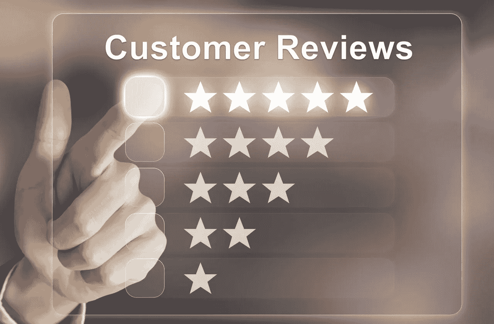

# 帮助顾客在线购买合适的产品

> 原文：<https://medium.datadriveninvestor.com/helping-customers-buy-the-right-product-online-417325e3f0fe?source=collection_archive---------18----------------------->

网上购物过去很少见；然而近年来，网上购物正成为一种常态。网上购物变得越来越受欢迎。

网上购物越来越受欢迎，因为顾客购买产品更方便了。尽管网上购物有很多好处，从方便到产品选择，但是网上购物的一个主要缺点是你不能直接看到产品。

当您在网上购物时，您显然没有能力直接看到产品，因此客户实际上最接近查看产品的是其他客户的产品评论。现在，产品评论实际上并没有发挥应有的作用。每件产品都有如此多的**评论，以至于不可能阅读每一条评论，顾客最多阅读前 10 条评论，然后决定是否购买该产品。所以从本质上来说，顾客使用非常有限的数据点来做决定，这是网上购物的一个缺点。**

 [## 今年值得关注的 5 大人工智能趋势|数据驱动的投资者

### 预计 2019 年人工智能将取得广泛的重大进展。从谷歌搜索到处理复杂的工作，如…

www.datadriveninvestor.com](https://www.datadriveninvestor.com/2019/02/19/artificial-intelligence-trends-to-watch-this-year/) 

然而，如果我告诉你，**我们可以完全摆脱这种劣势。**我们实际上可以减轻这个缺点，并**使网上购物基本上完美。**这可以使用我构建的一个名为 **Review Analyzer 的模型来完成。**

**Review Analyzer** 是我利用**自然语言处理(NLP)构建的一个模型。**例如，该模型获取亚马逊上某产品的所有评论，并分析每一条评论**，然后输出该产品所有正面和负面的文字图。这使得用户也可以看到描述产品的主要正面和负面词汇，还可以从该产品的每一篇评论中看到它的写作频率。**

# 评论分析器的后端

既然我们已经了解了**审查分析器**是做什么的，让我们来了解它实际上是如何工作的。

首先要明白的是，我们使用的是自然语言处理(NLP)，**本质上是人类语言和计算机之间的交互。** NLP 实际上是用在你的日常生活中，；举个例子，当你输入一些东西的时候，拼写检查正在进行，这就是 NLP！NLP 非常酷，对于这个项目，我用它对产品评论进行文本分析。

既然我们理解了什么是 NLP 以及 NLP 的用途，我们就可以深入到技术层面，即模型背后的实际代码。**Review Analyzer 的整个后端分为三个部分，全部用 python 编程。**

1.  **数据准备和输入**

在模型的这一部分，我们首先要找到给定产品的数据。比如我们可以选择 iPhone XR 这样的产品。我们将获得一个数据集，其中包含该产品在亚马逊上出现的所有评论，因为据说顾客在那里购买了该产品。为了找到数据集，你可能不得不查看一些资源，但我使用了 [**谷歌数据集**](https://datasetsearch.research.google.com/) ，我也明确地向你推荐它用于你正在寻找的任何数据集。现在我们有了产品的数据集，我们可以继续模型的核心部分。

2.**大脑+引擎**

这部分是程序的主要部分。在这一部分中，代码首先告诉模型查看评论数据集，对于每个具有两星评级或更低评级的评论，将其分类为差评，如果该评论具有四星评级或更高评级，则将其分类为好评。星级的分类是基于亚马逊上所有的评论都是 5 星的事实。现在这个程序运行两个独立的分析程序，分别对正面和负面的分类评论进行分析。对于每一组正面和负面评论，该模型执行文本分析，并查看正面和负面评论中使用最多的术语。模型的第二部分到此结束。

3.**输出和结果**

这是用户接收结果的部分。用户将收到两个单词的地图，一个用于正面评论，一个用于负面评论，其工作方式是，该单词在正面或负面评论中使用得越频繁，它在 woworldap 上出现得就越大。现在有了这个输出，用户终于能够像去商店一样做出决定，因为他能够了解亚马逊平台上对该产品的每一条评论！

# 后续步骤…

这不是这种模式的终结！在接下来的一个月里，我将致力于把它构建成一个 chrome 扩展，让它对所有的网上购物者更加友好！这种模式将帮助网上购物尽可能接近完美！🛍

# 关键要点:

*   NLP 是一个现在在机器学习领域非常流行的话题。
*   NLP 是人类语言和计算机之间的交互。
*   网上购物有一个很大的缺陷，那就是每一件商品都有太多的评论，以至于不可能阅读每一条评论，顾客最多阅读前 10 条评论，没有给他们足够的数据点来做出购买决定。
*   使用评论分析器，这是一个使用 NLP 的人工智能模型，我们可以摆脱在线购物目前存在的缺陷。
*   下一步是将这个模型实现到 chrome 扩展中，使其更加用户友好。

***如果你喜欢这篇文章:***

*   ***分享给你的网络***
*   ***关注我的***[***LinkedIn***](https://www.linkedin.com/in/krish-chandarana-25a197177/)***，***[***Twitter***](http://twitter.com/krishchandarana)***，以及***[***Medium***](https://medium.com/@krishchandarana)***随时更新我的 AI 进展！***