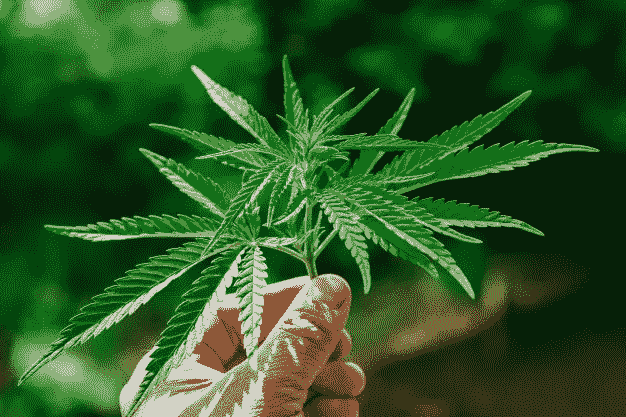

# 大麻:唯一能喂养你、给你房子住并治愈你的植物..

> 原文：<https://medium.datadriveninvestor.com/hemp-the-only-plant-that-can-feed-you-house-you-heals-you-75582f86f12d?source=collection_archive---------14----------------------->

大麻是大麻家族的一部分。大麻的植物学名称是大麻。大麻的好处从头到脚开始。大麻可以降低你患心脏病的风险，大麻籽和油可能有益于皮肤病。大麻籽是植物蛋白的重要来源，所以现在你有了非加工蛋白需求的答案。

大麻不仅用于人类福祉，还用于工业目的，你知道吗？1941 年，亨利·福特推出了一款全大麻制成的汽车，其强度是钢的 10 倍，重量比钢轻 40%。不仅仅是汽车，美国宪法也是写在麻纸上的。

它是食物和纤维的重要来源，可以追溯到古代中国和美索不达米亚。大麻植物的应用从简单的绳子和粗布发展到纸和帆布。大麻使它生长的土壤变得肥沃。大麻有如此深的根，它可以很容易地在许多不同类型的土壤和地形中生长。它甚至能把土壤粘在一起，增加土壤中的微生物含量。一旦这种植物被收获，它的茎和叶富含营养，以至于许多农民把他们不用的东西放回土壤中，这使它恢复活力，并在第二年获得更大的产量。大麻吸收有毒金属。大麻已经证明它可以消除环境中的毒素和放射性物质。

科学家将大麻种植在切尔诺贝利，发现大麻进行植物修复，并比其他任何植物更好地清除土壤中的化学物质。

大麻可以减少碳排放。根据吠陀，大麻是五种神圣植物之一，它也是人类已知的最古老的植物，几个世纪以来一直被栽培用于多种用途，如制绳、造纸、纺织和药用。大麻是一种新型建筑材料。大麻中含有大量的纤维，是制作建筑材料的好选择。在寒冷的国家，大麻也被用作房屋建筑的绝缘材料。

 [## 忘记石油吧，水是未来。数据驱动的投资者

### 我们不会耗尽燃料的替代品。能源行业曾经是投资者的荣耀，无论…

www.datadriveninvestor.com](https://www.datadriveninvestor.com/2018/11/14/forget-about-oil-water-is-the-future/) 

大麻不仅可以取代碳排放的一些原因，大麻可以消除碳排放。大麻的二氧化碳吸收量如此之高，以至于它创造了一种被称为碳封存的过程，这种过程可以捕获排放物。

你知道吗，你甚至可以用大麻制作布料和成品。制作一件棉衬衫需要大约 2700 升水，即一公顷棉花种植需要大约 255515.3 升水，而一公顷大麻种植只需要 114 升水就可以制作 34 件以上的衬衫，因此大麻被称为可持续植物。

大麻在日本和葡萄牙已经使用了几个世纪。大麻在日语中被称为“asa”。大麻含有约 3%的γ-亚油酸(gla)。omega-6 和 omega-3 的独特比例确保你可以食用大麻，而无需与其他富含脂肪的食物平衡。

我希望你喜欢这篇文章。如果你有什么建议，请在评论区告诉我。
快乐学习！