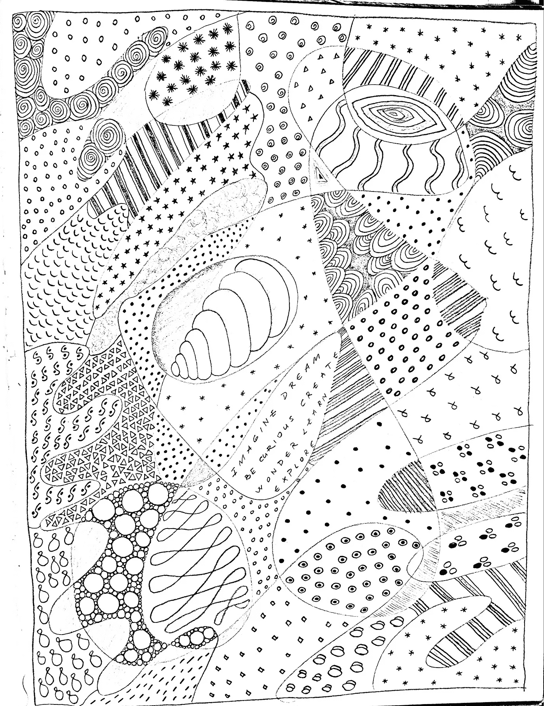
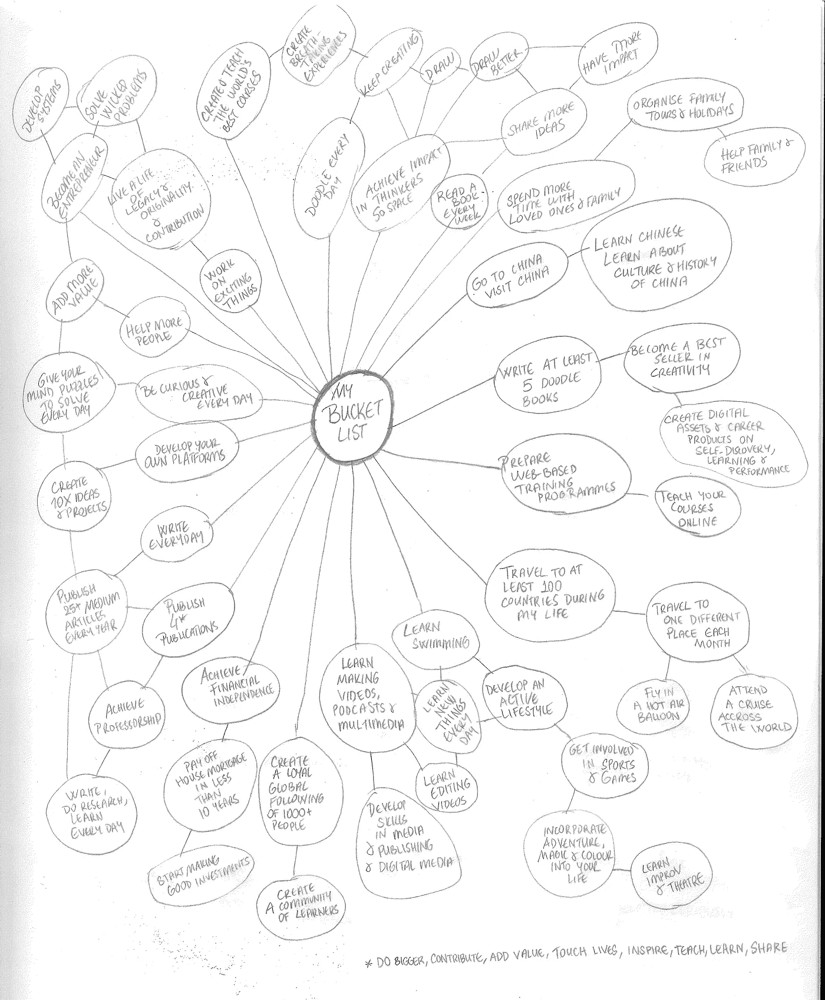

# 你如何创建鼓舞人心的资产创造目标来建立你的游戏？

> 原文：<https://medium.datadriveninvestor.com/here-are-my-2021-goals-ea65c2c5fa7e?source=collection_archive---------26----------------------->

## 我分享我的 2021 年目标，这样你就可以创造你自己的目标

Photo by [Stephen Leonardi](https://unsplash.com/@stephenleo1982?utm_source=medium&utm_medium=referral) on [Unsplash](https://unsplash.com?utm_source=medium&utm_medium=referral)

在一个领域进行 10，000 次实验现在被誉为创新成功的新秘诀。文艺复兴时期的人和发明家通过做 10，000 次实验而茁壮成长。

无论你的激情是什么，你都需要创作大量的作品来做出巨大的贡献，这意味着你要创作成千上万的作品。乔·罗根创作了 4000 集播客，被下载了近 2 亿次。创建这个巨大的图书馆使他成为播客之王，Spotify 向 Joe Rogan 支付了 1 亿美元来许可他的内容。

从达芬奇到莫扎特，从爱迪生到爱因斯坦，多产的发明家和天才让自己做了成千上万的实验。爱因斯坦名下有 2332 项专利。爱因斯坦发表了 300 多篇论文。列奥纳多每天都从一张当天要学的东西的清单开始——从地质学到光学。

众所周知，脸书、Zara、谷歌、P&G 或亚马逊等公司每个月都会进行数百次实验。这些实验的绝大多数都以失败告终，然而他们每天都在继续实验。他们都知道实验是前进的唯一途径。

你每天做多少实验？你每天给自己多少次失败的机会？你每天都在学习多少新的、新鲜的、令人兴奋的东西？这些是当今世界创新和成功的真正衡量标准。你需要继续实验，直到你在你想贡献的领域中达到 10，000 个实验。

从这个意义上说，我想和你们分享我的 2021 年目标。我希望你可以用这些例子来制定你自己的目标。

# 1.我想在 2021 年期间写至少 200 篇中型文章。

如果我能完成这个目标，到 2021 年底，我在 Medium 上发表的文章总数将达到 400 篇。

 [## 在媒体上发表 200 篇文章的体会

### 即使你非常忙，你也可以继续你的写作之旅

medium.com](https://medium.com/illumination/what-i-learned-from-publishing-200-articles-on-medium-78ce8e2153d3) 

# 2.我想在 2021 年期间创建至少 100 个 YouTube 视频。

这意味着到 2021 年底，我的视频总数将超过 300 个。

 [## 法赫里·卡拉卡斯

### Fahri Karakas 博士的数字收藏英国东安格利亚大学诺里奇商学院

www.youtube.com](https://www.youtube.com/user/eylemaktunali/videos)  [## H2M 电视

### H2M TV H2M= Hayal，Heyecan，Merak Biz，her in sann yeryu züNDE hayatta kalabilmek I ' in H2O ' ya(su)muhta oldu kadar…

www.youtube.com](https://www.youtube.com/c/H2MTv1/videos) 

# 3.我想在 2021 年创作至少 300 幅涂鸦。

这包括我想在这一年中创作的基于涂鸦的练习和涂鸦艺术。如果我能做到这一点，我的涂鸦作品或海报总页数将超过 1500(件或页)。

Doodle created by Author

# 4.我想在 2021 年期间撰写并发表至少 1 篇高质量的学术文章。

最近，我对学术界，尤其是研究领域感到非常失望和游离。在疫情关闭期间，我无法专注于我的研究和写作。更糟糕的是，我觉得研究有点毫无意义——它与现实世界相去甚远。因此，我需要恢复理智，重新获得学术写作的能力。似乎我暂时失去了成为一名学术作家的信念和技能——这意味着我需要找回自己和作为一名学者的技能。

你可以在下面看到我的谷歌学术页面:

https://scholar.google.com/citations?user=vxzs2XsAAAAJ&HL = en&oi = ao

# 5.我想在 2021 年期间读至少 100 本书。

我的目标是在 2021 年读 100 本书。这意味着我会尝试全年每周两次发布简短的书评。

我建议你也这样做。这是我给你的挑战:你每周选择两本书来读，并试着在一周内读完这两本书。然后，你将在 Medium 上发表一篇简短的评论，记录你从每本书中学到了什么。用这种方法，你将在一年内读完 100 本书。此外，你还将在媒体上发表 100 篇书评。你准备好了吗？你可以从列出你想在新的一年里阅读的所有书籍(小说或非小说)开始。

你可以和我一起参加这个挑战，我们每个人都将阅读 100 本书，彼此分享我们的学习和见解。我相信这个挑战将极大地丰富我们的想象力，提高我们的生活质量。我刚刚开始实施这个挑战——你可以在下面看到我的书评样本:

 [## 为什么你应该读迪亚曼蒂斯和科特勒的《未来比你想象的要快》

### 我最近开始了一系列新的书评。我将接受这个挑战，发布一本一分钟的书…

medium.com](https://medium.com/predict/why-you-should-read-the-future-is-faster-than-you-think-by-diamandis-and-kotler-b24d9d497d0c) 

# 6.我想尝试我从未尝试过的令人兴奋的项目。

前进的一个方法是创建你自己的遗愿清单。你可以看到我前段时间创建的遗愿清单:

Bucket List, created by Author

 [## 创建你的遗愿清单将有助于你设计生活中的冒险

### 遗愿清单是你死前想做的所有事情的清单。

medium.com](https://medium.com/illumination/creating-your-bucket-list-will-help-you-design-the-adventures-of-your-life-7e4ea4ed5035) 

另一种方法是列出 10 件你愿意尝试的事情，如果你不害怕的话。

 [## 想想如果你不害怕，你会尝试的 10 件事

### 十大系列— 8

medium.com](https://medium.com/datadriveninvestor/think-of-top-10-things-you-would-try-out-if-you-were-not-afraid-3d98a02e27de) 

我自己也这样做过:我最近列出了 10 件事，如果我不害怕，我会去尝试。

如果我不害怕:

*   我会写自己的诗，创作自己的说唱歌曲，创作自己的舞蹈动作。
*   我将建立我自己的国际学院/培训中心，在那里我将设计和创造一些世界上最鼓舞人心的课程。我会去几十个国家，在世界范围内提供我的培训项目。
*   我会在我热爱的领域写并出版至少 10 本书。
*   我会撰写并在顶级期刊上发表至少 10 篇多学科的原创文章。
*   我会创作我自己的伦敦音乐剧，以机器人/机器和人类挤在一起为特色。
*   我会创建一个涂鸦艺术展，在美术馆、博物馆和数字空间巡回展出。
*   我会创作自己的漫画书，里面有一系列丰富多彩的人物、冒险、惊喜和曲折。
*   我会做很多实验来创造 100 种不同的文具创新、数码产品和其他创新。
*   我会创建自己的电视频道和媒体帝国，拥有一整套节目和原创节目。
*   我会创建一个创造力黑客马拉松和加速器周末，每个参与者都可以回收和释放自己的创造力，并开始创建自己的资产。

今年，我将尝试至少对其中一项倡议采取行动。

你想从 2021 年得到什么？

创建你自己的目标/愿望/项目，现在就写下来。

度过充满冒险、快乐和成功的一年。

新年快乐

## 法赫里·卡拉卡斯是《自制工作室》的作者。你可以在这里探索更多[。](https://selfmakingstudio.com/)