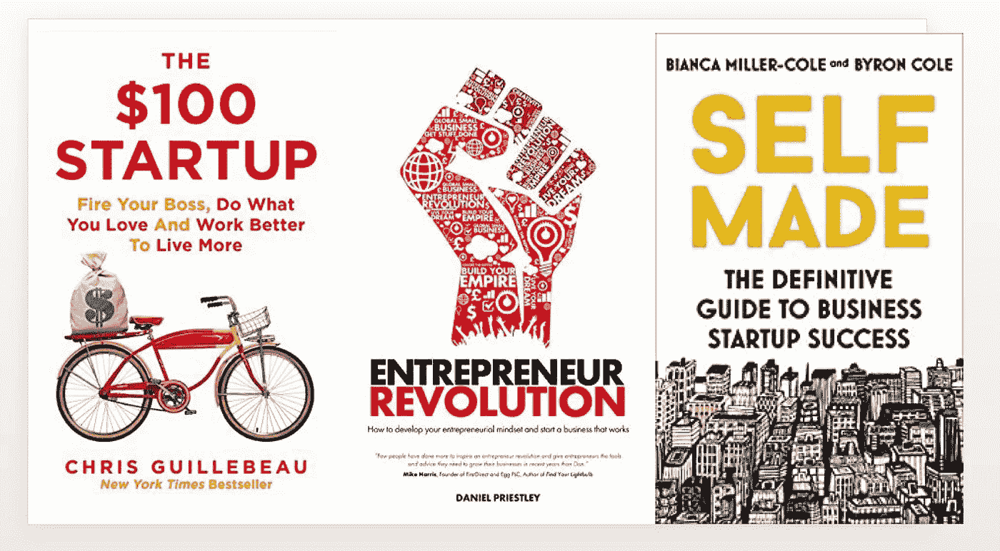
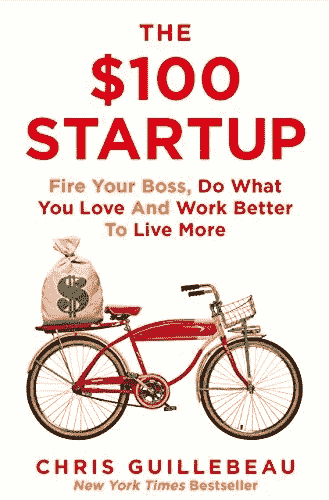
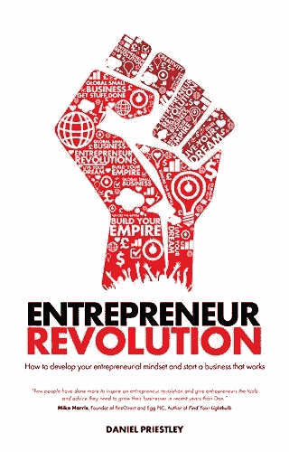
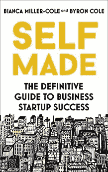
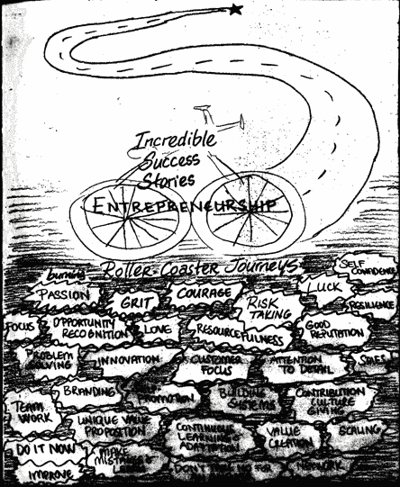
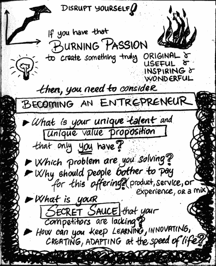

# 以下是我认为最适合自己创业的三本书

> 原文：<https://medium.datadriveninvestor.com/here-are-my-top-3-books-on-starting-your-own-business-518b8bdcdc53?source=collection_archive---------5----------------------->

## 这些畅销书将为你的创业之旅提供灵感和工具

Image Created by Author, Book Cover Images Courtesy of Authors

几个朋友问我一直在看什么书。我已经决定开始一个书评系列，分享我觉得对我感兴趣的每个主题都有用且有见地的前三本书。

今天，我将重点介绍三本书，它们将帮助你创业。在我们生活的时代，每个人都应该把自己视为企业家。开创自己的事业从未如此简单。你只需要一台笔记本电脑、一部手机和一个互联网连接。如果你建立一个系统并帮助其他人解决他们的问题，你可以创造巨大的价值。

你的出发点可能是你的激情、好奇心和兴趣。或者你可以挖掘自己的天赋和优势。你与世界分享你的艺术、手艺或实践，并开始培养你的观众。你开始创造自己的创造性资产，比如一本书、一组艺术作品、一个播客、一个 YouTube 频道、一组媒体文章、一门在线课程等等。

我们生活在一个混乱的时代，积极的收入是不够的，因为从长远来看，薪水成瘾会让你变得脆弱和厌恶风险。从长远来看，要想抗脆弱和财务上灵活，你需要使你的收入来源多样化。这意味着建立多种被动收入来源，如版税、投资、图书销售、房地产、网络研讨会、在线课程或电子商务。建立自己的企业可以让你建立一个可持续的财富生成系统，这将持续增加收入、声誉和回报。

当我们考虑企业家精神时，我们会犯的一个错误是，我们认为这是一种英勇的、不朽的、高风险的行为。然而，创业不一定要宏大——你可以从小的实验开始，将你的大愿景分解为日常的小步骤，通过增量和渐进的行动建立自己的游戏。比如在介质上写作，就是一个创业实验。每篇文章都是资产创造的一个小练习。你的生意包括一系列的写作和内容创作。

这是所有关于建立你自己的游戏，你会出类拔萃。这也意味着你需要创造你自己的类别，你可以成为垄断者。问问你自己:有哪些新鲜、刺激、原创的东西只有你能带给这个世界？理想情况下，你应该关注这些事情来放大你的贡献和影响。

重要的是，你要从小处着手，让这一点对你自己切实可行。即使你是一名学生或全职员工，你也可以建立一个小公司作为副业。你可以把这看作是一个实验，一个你将随着时间的推移而建立的投资。你只需要在晚上或周末花几个小时。

企业家精神包括通过利用你独特的技能和知识建立一个可持续的创造价值的系统。当你发现有机会解决问题来赚钱时，你就可以开始行动了。你可以从小处着手，采取简单的行动来创造一个最低限度的可行的数字产品或服务。你不断迭代，不断学习，尝试一系列的策略和行为。你的艺术和手艺每天都在进步。你不断改进和即兴创作，直到你有一个无法复制的秘方。

在你的创业之旅中，你肯定会遇到很多挑战。然而，这些挑战将帮助你学习、成长，并在工作中做得更好。

我们的思维习惯于线性地思考企业家的成功，然而，成功几乎从来不是线性的。你将经历一个失望的低谷，在那里你将面对大量的挑战。你会犯很多错误，遇到困难，你会想退出。然而，你需要坚持下去，着眼于长远。随着时间的推移，你的成功会越来越多。你的成绩会成倍增长。连续 31 天每天翻倍的 1 便士将变成 10，737，418.24 美元。这就是指数思维的力量。记住，企业家的成功是非线性的。求知若渴，实验不懈，勇于创新。运用登月思维取得突破性进展。这将是一生的冒险，你是英雄。从这里开始你的旅程！

# 《100 美元的创业:解雇你的老板，做你喜欢的事情，更好地工作以生活得更好》,克里斯·吉列博著

The $100 Startup, Image [Source](https://www.amazon.co.uk/dp/B007WTR2W6/ref=dp-kindle-redirect?_encoding=UTF8&btkr=1)

《100 美元创业》是启动你创业之旅的非常实用的指南。它向你展示了如何摆脱朝九晚五工作的束缚，并通过结合你的激情和技能来追求你的抱负。作者克里斯·吉列博(Chris Guillebeau)在创业期间，几乎去过世界上的每个国家。Chris 有一个很棒的博客，名为[不随波逐流的艺术](http://chrisguillebeau.com/3x5/)，他在那里分享了许多关于生活方式设计、创业成功和打破规则的实用技巧。

克里斯发现了 1500 名企业家，其中许多人用 100 美元或更少的钱建立了自己的企业。这些人现在通过投资于他们的个人激情和优势，每年可以赚 50，000 美元或更多。这本书分享了企业家的案例研究，这些企业家能够以给他们自由和满足感的方式重组他们的生活。

这本书很有启发性，也很实用。你不需要任何学位、商业计划或雇员就能成功。你只需要开发一个源于你喜欢做的事情的产品或服务。如果人们愿意为此付费，而你又想出了一个赚钱的方法，瞧。这是成功的简单秘诀。

在计划和行动的战斗中，行动总是赢家。所以，你需要从现在开始，从小处着手。你的目标是在你想要的时间和地点，按照你自己的方式过上好日子。你可以通过实现激情和收入的完美结合来做到这一点，让工作成为你热爱的事情。本书的前提是通过实际例子和见解告诉你如何做到这一点。有些部分听起来有点简单，但如果你刚刚开始创业之旅，它们仍然有用。

以下是本书的一些关键见解和论点:

*   并非所有的激情都是生意。只要你能找到愿意为你的产品或服务买单的客户，你的兴趣就能转化为可行的赚钱点子。
*   你需要给顾客他们想要的，而不是你认为他们应该有的。你的工作不是教你的顾客如何钓鱼，而是给他们鱼吃。客户只想要简单的解决方案来解决他们的问题。
*   尽快获得你的第一笔销售。然后，你可以测试市场，获得反馈，并将其纳入，使您的产品更具吸引力。节俭消费，最小化你的成本，最大化你的现金流。

书中一些引人注目的引言如下:

> 新的现实是，在一份工作上工作可能是风险更大的选择
> 
> *“当你开始像企业家一样思考时，你会发现商业创意可以来自任何地方。”"如果你以帮助他人为业，你将永远有大量的工作。"*
> 
> *“价值就是帮助人。如果你试图建立一个微型企业，并通过帮助别人来开始你的努力，你就在正确的轨道上。当你陷入困境时，问问你自己:我怎样才能给予更多的价值？或者更简单地说:我怎样才能更好地帮助我的客户？”*
> 
> 当一个人做出有用的东西并与世界分享时，价值就被创造出来了
> 
> “十五年来，约翰和芭芭拉·瓦里安一直是家具制造商，住在加州帕克菲尔德的一个牧场上……在一群骑马爱好者询问他们是否可以付费在牧场上骑马后，一个偶然的想法产生了。他们也需要吃东西——约翰和芭芭拉能为此做些什么吗？是的，他们可以。2006 年秋天，一场毁灭性的大火烧毁了他们的大部分库存，促使他们重新评估整个运营。他们没有重建家具业务，而是决定改变路线。”“我们一直喜欢马，”芭芭拉说，“所以我们决定让更多的团体出钱来牧场。“他们建造了一个工棚，并升级了其他建筑，为骑行团体提供了包含所有餐饮和活动的特定套餐。约翰和芭芭拉重新开放了 V6 农场，占地 20000 英亩，正好位于洛杉矶和旧金山之间。芭芭拉的故事引起了我的注意，因为她说了一些话。我总是问企业主他们卖什么，为什么他们的客户从他们那里购买，答案往往在多个方面都很有见地。许多人直接回答这个问题——“我们出售小部件，人们购买它们是因为他们需要一个小部件”——但偶尔，我会听到更机敏的回答。“我们不是在卖骑马，*”芭芭拉强调道*我们提供自由。我们的工作帮助我们的客人逃离，即使只是一瞬间，成为他们可能从未考虑过的人。*“区别至关重要。大多数参观 V6 牧场的人白天有工作，假期有限。为什么他们选择去一个小镇的农场，而不是去夏威夷的海滩？答案就在约翰和芭芭拉提议背后的故事和信息中。帮助他们的客户“*逃离并成为另一个人*”远比提供骑马服务更有价值。最重要的是，V6 牧场卖的是快乐。”*
> 
> 《呆伯特》系列漫画的创作者斯科特·亚当斯(Scott Adams)是这样解释他的成功的:我成功地成为了一名漫画家，拥有可以忽略不计的艺术天赋、一些基本的写作技巧、普通的幽默感和一点商业世界的经验。“呆伯特”漫画是所有四种技能的结合。世界上有很多更优秀的艺术家、更聪明的作家、更幽默的幽默作家和更有经验的商人。难得的是，这些谦虚的技能都集中在一个人身上。价值就是这样创造的。
> 
> **“未来的营销就像性:只有失败者才会为此买单。”**
> 
> **“要在一个商业项目中取得成功，尤其是一个令你兴奋不已的项目，仔细思考你拥有的所有可能对他人有帮助的技能，尤其是这些技能的组合，会有所帮助。”**
> 
> *“起步并不需要花费太多，你可以比你想象的更有创造力(有没有考虑过申请汽车贷款来资助你的创业？但是他们没有梦想，而是采取了行动，现在他们正在实现梦想的路上。你不需要有特殊的天赋，你可能已经有了。你不需要有很多钱来开始。你不需要有 MBA 学位。不要！你只需要采取行动，做一些有用的东西，并与世界分享。”*

# *《企业家革命:如何发展你的企业家思维，开创一个成功的企业》,克里斯·吉列博著*

**

*Entrepreneur Revolution, Image [Source](https://www.amazon.co.uk/Entrepreneur-Revolution-Develop-Entrepreneurial-Business/dp/0857087827/ref=sr_1_1?crid=DU293AT7GKIA&dchild=1&keywords=the+entrepreneur+revolution&qid=1599594016&sprefix=the+entrepreneur+revo%2Caps%2C150&sr=8-1)*

*丹尼尔·普里斯特利认为，我们正在经历一场创业革命。这场革命和工业革命一样意义重大，影响深远。技术变革和互联网让非常小的企业能够与大公司竞争。如果你想做你热爱的事情，你擅长的事情，以及能让你赚钱的事情(这三件事情中最理想的甜蜜点是创业精神最旺盛的地方)，Priestley 为你提供了一个很好的指导。*

*丹尼尔·普里斯特利是四本畅销书的作者:《影响力关键人物》、《企业家革命》、《超额认购》和《24 项资产》。Priestley 在澳大利亚、新加坡和英国建立并出售企业。他是 Dent Global 的创始人之一，Dent Global 是企业家脱颖而出和扩大规模的伟大商业加速器。他被 Enterprise Nation 评为英国十大商业顾问*

*该书指导你如何从工业革命经济中挣脱出来，如何在企业家革命中找到自己的位置，以及如何实现企业家革命梦想。*

*以下是本书中的一些关键讨论:*

*   *世界正在进入一个新时代，工业时代已经结束。是时候从工业革命的思维定势中挣脱出来，停止如此努力的工作，追寻你的梦想，一路发财了。*
*   *工业系统旨在让人们像训练有素的猴子一样工作，这些猴子可以连续多年执行令人麻木的重复任务。这个系统的建立是为了防止人们把时间花在他们更高的思想上——建立帝国的部分。*
*   *群众被两件事所控制:第一，他们相信他们能够生存。他们不会感到威胁，所以他们不会变得野蛮，行为像爬行动物。第二，当他们不工作时，他们总是忙于消费和娱乐，这样他们就没有机会进入他们更高的心灵。通过这种方式，他们将成为出色的消费者，不会挑战现状。几个世纪以来群众都是这样被对待的。传统的主流媒体确保人们保持在他们的猴脑中。广告、娱乐、消费无时无刻不在轰炸、分散大众的注意力。*
*   *你需要超越你的猴脑，发出所有噪音的信号。这将给你一个机会去接近你的内在帝国建造者。然后，你可以利用新的想法来帮助人们，开始创新和创造新事物，并发现你几乎不知道存在的大量资源。说服自己:你不需要娱乐、分心或消费。此刻你是完整的，你的生存没有受到任何威胁。不要在情绪起伏时过度刺激自己。开始建立一个创造力和生产力的个人系统。*

*这本书最好的贡献之一是它为读者提供了十个挑战。如果你运用这些挑战，你将学会如何像企业家一样思考和行动。你将摆脱工业时代的心态，向一整套新的可能性和机遇敞开你的大脑。以下是其中的一些挑战:*

*   *打三个电话。你可以使用这个星球上所有的资源。需要这些资源的时候就去要。学会通过正确的对话来获得它们。学习和实践:接电话、发邮件、安排会议。开始对话，但不知道它会把你引向何方。*
*   *至少把收入的 10%存起来。建立一个新的银行账户，并把 10%的钱存入那个账户。这个账户会让你的猴脑平静下来，帮助你对冒险感觉良好。不要碰这些钱。从长远来看，这将是你财富的一部分。你将通过储蓄和投资来规划你的未来。*
*   *不要把时间花在让你沮丧的消极的人身上。与激励你实现最佳自我的人交朋友。多花点时间和那些能激发你潜能的人交谈。列出你目前花时间在一起的人，决定谁留下谁离开。记住:你是你最常相处的五个人的平均值。这些人塑造你的观点，扩大你的关系网，帮助你获取资源，让你注意到新的机会。*
*   *随身携带 1000 美元。你可以改变金额，但想法是携带让你不舒服的金额，并且你会在某一天赚到。当你带着这么多现金的时候，你不会屈服于你的猴子或者爬虫的大脑。你不会担心眼前的生存问题，你的大脑会向富足的想法敞开。你的潜意识应该习惯于富足、资产和机会的概念(而不是稀缺、紧缩和风险)。*
*   *不要独自吃午餐。每周至少为你还不认识的人买两顿午餐。建立一个良好的人际网络，这些人不是顾客、客户或老朋友。邀请其他企业家、商业领袖、投资者、艺术家或你可以学习的人。获得好的建议和新的想法。倾听他们的故事，学习他们的人生经历。发展与人的联系，这样你就可以开始互相介绍人了。拥有一个好的人际网络比其他因素更能增加你的净资产。*
*   *不要听新闻。放弃电视、报纸、传统媒体和新闻。不要认为你错过了什么。你的时间和精力非常宝贵，不要把它们浪费在新闻上。你会震惊于你花了多少精力来娱乐你的猴脑。用这些时间和精力来学习和创造你的资产。你将不再担心新闻，而是保持鼓舞和兴奋。你会得到一个动力。然后你将开始实现自己有新闻价值的事情。*
*   *记下你反思的日记。列出你的优先事项、高价值的任务、目标、想法和梦想。跟踪你的项目，记下你的里程碑。在你的计划和目标上取得进展。捕捉你所有的想法。注意你周围的机会。进行计算、探索资源、规划您的想法、创建图表和解决问题。写下你最感激的是什么，你想在未来三个月内实现什么，哪些是最有前景的商业想法或投资。*
*   *首先计划你的假期。大多数人围绕他们的工作计划他们的假期，并希望有一些空闲时间和金钱来度假。但是，你的时间有限，你需要适当的假期。划出 8 到 12 周的假期。想出你想去哪里旅行，想象你的假期，决定你的预算和行程。逆向工程你的工作，为你想过的生活方式服务。然后，你的大脑会放松，因为它知道假期就要来了。这会让你更有效率和创造力。你的家人和朋友也会欣赏这一点。假期也是思考周，在这里你可以恢复活力，获得新的想法，阅读，写作，学习，记日记，发现新的机会。当你离开工作的时候，你会得到你最好的想法，因为你会更有创造力，你会看到全局。*
*   *让你的创业团队就位。成功人士身边都是才华横溢的团队。在你身边建立一个由优秀的人组成的团队，他们可以帮助你实现目标。*

*这本书提供了许多类似上面的实用建议和练习。我发现它们非常有用，非常鼓舞人心。起初，当你应用这些想法时，你可能会感到有点不舒服，但它们是完全值得的。*

# *比安卡·米勒·科尔和拜伦·科尔的《自我奋斗:创业成功的权威指南》*

**

*Image [Source](https://www.amazon.co.uk/Self-Made-definitive-business-startup-ebook/dp/B01MSVQRBL/ref=tmm_kin_swatch_0?_encoding=UTF8&qid=&sr=)*

*对于任何想经营自己企业的人来说，这是一个非常实用和有用的工具包。它的特色是采访知名企业家、领导人和专家，分享宝贵的建议和经验。这本书涵盖了创业过程的每个阶段，从创业到成熟，并讨论了将一个新想法转化为商业上可行的主张的策略。以下是一些突出的内容:*

*   *作者提出了企业家的四个步骤:愿景、行动、反应和进化。它们涵盖了对新一代企业家至关重要的现代技术和社交媒体问题。'*
*   *这本书涵盖了商业的所有方面，从构思一个想法到实现愿景。它包括关于如何启动商业计划的替代方案、如何找到真正重要的信息、如何组建公司、如何根据预算创建网站、如何从人群中脱颖而出、如何建立个人品牌、如何谈判和建立网络、如何将社交媒体转化为收入以及如何评估和出售业务的宝贵意见和建议。*

*以下是书中一些颇有见地的引文:*

> *“对你的商务之旅有一个清晰的认识是首要的也是最重要的。如果你不知道你要去哪里，你就不能计划你的路线，所以你脑海中的梦想目的地是至关重要的。每个成功的白手起家的人都有一个他们努力实现的愿景。*
> 
> **从比尔·盖茨的梦想到“让每张桌子上都有一台电脑”，从谢尔盖·布林和拉里·佩奇的“组织互联网”的愿景，到杰森·威尔的“给世界加果汁”的目标:他们都是从最终目标出发的。你自己的长期目标是当情况变得艰难时推动你前进的动力，也是帮助你做出商业决策的动力。你的愿景就是你的“为什么”——这是你做这件事的最终原因。是的，你可能希望自己创业，因为你希望自己创业给你带来灵活性；你想消除被雇佣带来的收入上限，你想成为自己的老板，但你也应该对自己希望做的事情和希望解决的问题有一个愿景。”**
> 
> **“对自己比对工作更努力……..为什么？因为你的工作会因此受益，你的生活也会受益。你是值得投资的。你成为什么样的人比你得到什么更重要。”**

**

*Image created by Author*

# *那我们该怎么办？*

*我们生活在历史上最有趣的时代之一。如果你有一台笔记本电脑，一部手机和一个互联网连接，你可以立即成为一个企业家，建立自己的公司。*

*信息丰富且免费。你可以接触到世界上所有的知识。你可以自学任何你想学的东西。你可以掌握和教授任何领域。当你学习新事物时，你可以与世界分享你的激情、好奇和创造。*

*我们生活在一个思想可以改变人们生活的世界。这意味着我们所有人都可以创造自己的游戏，成为一名企业家。事实上，创造自己的游戏从未如此重要。你现在可以设计游戏，创建我们自己的博客或播客或 YouTube 频道，或者在 Kickstarter 上筹集资金。你可以写本书，和全世界分享你的声音。你可以在健康、保健、生产力或创造力方面创建自己的生活方式品牌。你可以创造新鲜和令人兴奋的数字产品(培训、课程、体验等)。).你可以利用众筹来启动你的想法和项目。*

*成为企业家不需要辞职或拥有资本。你可以运用想象力创造自己的创造性资产，并与世界分享。你可以发挥想象力，把新鲜刺激的东西带给这个世界。当今世界，你的好奇心和想象力是最大的工具和武器。*

*我们生活在一个注意力最重要的世界。注意力是新的黄金——它是最重要、最珍贵、最受追捧的东西。作为一名企业家，你需要学会如何吸引注意力，为你的企业制造好奇心、惊喜和病毒式传播。你需要讲述自己的故事，创建自己的个人品牌，并与自己的粉丝和部落建立联系。*

*这个世界需要你的创造力、想象力和好奇心。作为一名企业家，你可以创造你自己的冒险和游戏。可以培养一种激烈无畏的想象力。你可以大胆试验，创造创新，将不可能的领域联系起来。你可以创建自己的品牌、产品、服务，甚至虚拟形象。你可以找回童年的创造力。*

*最好的创业公司会去有未来的地方。他们创新，创造未来。他们是在被破坏之前破坏的人。你需要看清自己的前进方向，了解外部世界的变化，发现新的趋势和挑战，努力为你的企业创造新的机遇和可能性。*

**

*Image created by Author*

*作为一个企业家，你每天都需要学习，重新发明，打乱自己。如果你不能适应和学习，你的企业可能会变得无足轻重。你不知道明天的机会。然而，你需要新的思考、学习、创造和创新的方式。好奇心会给你优势，因为你可以利用新奇、令人惊讶和有影响力的东西。*

*   *如何通过每天的学习、改变、提高来复合自己？*
*   *你如何对自己和你的资产创造进行长期投资？*
*   *你每天都在学习新的令人兴奋的东西吗？您是否将它们应用于您的业务？*
*   *你如何确保自己每天都在学习、鞭策自己和大脑？*

*如果你想长期走运，你需要给自己提供很多失败的机会。失败仅仅是更大旅程中的停止点。你需要庆祝你的失败，并把它们作为学习的机会。培养失败后重新站起来的勇气和韧性。即使全世界都反对你的想法，你也需要坚持下去，保持耐心。J. K .罗琳在出版《哈利·波特》之前被十几家出版商拒绝。星球大战被许多主要研究拒绝，直到它成为一个价值 700 亿美元的家喻户晓的品牌。*

*当你为自己的企业设定长期目标时，一定要为 X 目标(未知目标)留有余地。x 目标是你现在看不到的目标。它们会在你探索未知领域时出现。*

*你的创业之旅不是短跑，而是马拉松。玩长线游戏。从长远来看，复合你自己、你的企业、你的技能、你的资产和你的关系网。*

## *法赫里·卡拉卡斯是《自制工作室》的作者。你可以在这里探索更多[。](https://selfmakingstudio.com/)*