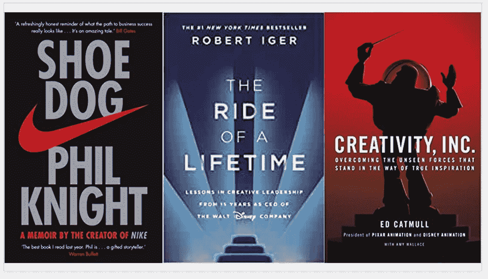
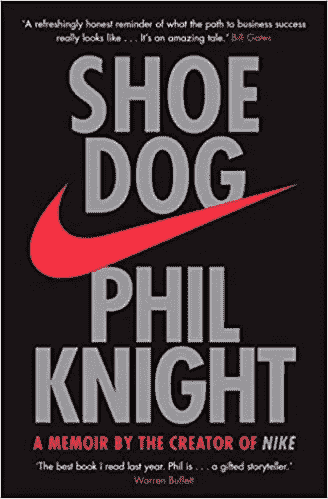
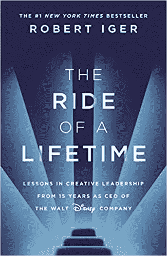
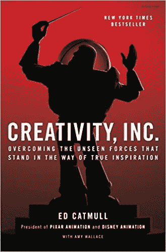

# 以下是我的三大领导力回忆录

> 原文：<https://medium.datadriveninvestor.com/here-are-my-top-3-leadership-memoirs-41441a0a19a0?source=collection_archive---------7----------------------->

## 这些由耐克、迪士尼和皮克斯首席执行官撰写的传记将为你提供一个关于领导力和创造力的迷人视角

Image Created by Author, Book Cover Images Courtesy of Authors

以上这三本书(《鞋狗》、《一生的旅程》和《创造力公司》)都深深地激励了我，并在企业家精神、领导力、商业和创造力方面给我上了宝贵的一课。这三本书的共同点是，它们都是由我们这一代最具创造力的商界领袖撰写的自传。通过阅读这些书籍，你可以获得一些难得的见解和视角，了解是什么造就了运动服装、娱乐和动画等快速发展行业的杰出领导者。

# 《鞋狗:耐克创始人回忆录》作者:菲尔·奈特

Shoe Dog, Image [Source](https://www.amazon.co.uk/Shoe-Dog-Memoir-Creator-NIKE/dp/1471146723/ref=sr_1_1?dchild=1&keywords=nike+founder&qid=1600780452&sr=8-1)

《鞋狗》是我这辈子看过的最惊险的创业书籍之一。如果你想要一本有简单清单或清晰成功公式的书，这本书绝对不是它。菲尔·奈特带你去一个不可思议的旅程，充满了危险，错误，间谍，破产，失败和混乱。这绝对是一个英雄的旅程，因为你一路上见证了许多牺牲、激情和斗争。当你读这本书时，你会确信，当你面对如此多的风险、障碍甚至敌人时，避免失败是不可能的。然而，菲尔和他的朋友们不知何故活了下来，并且一次比一次强大！

整个旅程压力如此之大，以至于我发现自己在读这本书的时候几乎要吐了，因为我无法理解所有的风险。这也解释了为什么我一开始就不适合创业。同时，旅程美得惊人，充满冒险。

菲尔在他的回忆录中非常诚实，并公开了耐克成功故事的偶然性。菲尔花了 35 美元请一名艺术生设计了著名的耐克标志(swoosh ),他对此犹豫了很久。他也不确定自己选择的公司名称:耐克。“也许随着时间的推移，我们会越来越喜欢它，”他想。

菲尔认为日本鞋在美国市场有销路。他想挑战德国品牌阿迪达斯和彪马的统治地位。他在读 MBA 期间写了一篇关于这个潜在市场的论文。完成学位后，菲尔向父亲借了 50 美元，创建了自己的公司，从日本进口质优价廉的运动鞋。这家公司的名字叫蓝带体育。他第一年挣了 8000 美元。今天，耐克的年销售额超过 300 亿美元。如果你想了解商业的非线性和混乱的本质，这是一本很棒的书，可以教你这些。

耐克的早期充满了很多悬念和风险。这种风险很大程度上与糟糕的财务状况、与银行的谈判以及在高负债水平中生存有关。菲尔详细描述了创业初期的快乐和痛苦。这是一个不太可能的团体，他们紧密团结，不合群，热爱跑步和运动。他们有一个共同的使命:在全世界建立一个标志性的、改变游戏规则的、可盈利的企业和品牌。

《鞋狗》包含了很多有价值的课程，关于从零开始建立一些东西，克服逆境，承担风险，充满活力和与众不同，并最终在世界上留下你的印记。

 [## 领导力。赢得|数据驱动型投资者需要更广阔的视角

### 不管他们愿不愿意，领导者都是快速运转的机器中的齿轮，这就要求他们夹住自己的爪子…

www.datadriveninvestor.com](https://www.datadriveninvestor.com/2020/02/07/leadership-it-takes-a-wider-perspective-to-win/) 

书中一些引人注目的引言如下:

> 因此，在 1962 年的那个早晨，我告诉自己:让别人都称你的想法为疯狂吧。。。继续走。别停下来。在到达那里之前，不要想着停下来，也不要过多考虑“那里”在哪里。不管发生什么，不要停下来。”
> 
> *“我会告诉那些五十多岁的男男女女，不要满足于一份工作、一种职业甚至是一份事业。寻求一种召唤。即使你不知道那是什么意思，也要寻找它。如果你追随自己的使命，疲劳将更容易忍受，失望将成为动力，兴奋将是你从未感受过的。”*
> 
> *“开车回波特兰的路上，我一直在思考我在销售方面的突然成功。我卖不出百科全书，而且我鄙视它。我在销售共同基金方面略胜一筹，但我感到内心已死。那么，为什么卖鞋如此不同呢？因为，我意识到，它卖不出去。我相信跑步。我相信如果人们每天出去跑几英里，世界会变得更好，我也相信穿这双鞋跑步会更好。人们感觉到了我的信仰，他们自己也想要一些这种信仰。信仰，我决定了。信念不可抗拒。有时"*
> 
> “我想建造属于我自己的东西，我可以指着它说:那是我造的。这是我认为让生活变得有意义的唯一方式。”
> 
> “我回想起我在俄勒冈的跑步生涯。我和比我更好、更快、更有天赋的人竞争过。许多人是未来的奥运选手。然而，我已经训练自己忘记这个不愉快的事实。人们本能地认为竞争总是一件好事，它总能激发出人们最好的一面，但这只适用于那些能够忘记竞争的人。我从径赛中学到，竞争的艺术是遗忘的艺术，我现在提醒自己这一事实。你必须忘记你的极限。你必须忘记你的怀疑，你的痛苦，你的过去。你"
> 
> “我是一个线性思考者，根据禅宗的说法，线性思考只不过是一种错觉，是让我们不快乐的众多错觉之一。禅宗说，现实是非线性的。没有未来，没有过去。一切都是现在。”
> 
> *“不要告诉人们如何做事，告诉他们做什么，让他们用他们的结果给你惊喜。”*
> 
> *“懦夫从不出发，弱者死于途中。女士们先生们，就剩下我们了。我们。”*

# 《一生的旅程:担任华特·迪士尼公司首席执行官 15 年来的创造性领导经验》，作者罗伯特·艾格

The Ride of a Lifetime — Image Source

鲍勃·伊格尔是他那一代人中最成功的首席执行官之一。他重塑了世界上最受欢迎的公司之一，并启发了那些将迪士尼魔法带入生活的人们。Iger 在 ABC 集团工作了 22 年。迪士尼收购 ABC 后，他出任迪士尼首席执行官长达 15 年(2005 年至 2020 年)。他带领迪士尼经历了许多技术、创新和全球扩张方面的变革。在他任职期间，迪士尼收购了世界领先的娱乐品牌，包括皮克斯、漫威、卢卡斯影业(星球大战系列)，甚至 21 世纪福克斯。迪士尼成为世界上最大、最受赞赏的媒体公司——他们现在基本上拥有整个娱乐业:)

Iger 的愿景可以概括为三个简单的想法:重新致力于最高质量，拥抱技术而不是与之对抗，以及放眼全球，将迪士尼打造成国际市场上的强大品牌。伊格尔下了大赌注，包括收购皮克斯，以激发和重塑迪士尼的动画能力。另一个赌注是建立迪士尼的流媒体服务，托管迪士尼的所有内容——这已经得到了回报，迪士尼现在拥有超过 5500 万订户(成为网飞的一个严重竞争对手)。他的策略是加倍投资高质量的内容，并将其放入流媒体服务。

以下是这本书的一些重要见解和教训:

*   重视能力胜于经验，将人们放在能够拓展和增长他们能力的岗位上。
*   领导者必须愿意承担风险，下大赌注。对失败的恐惧摧毁了创造力。
*   你需要坦然面对失败——不是因为不努力，而是因为如果你想要创新，你需要允许失败。
*   即使面对困难，乐观的领导者也会找到通向最佳结果的道路，而不是屈服于悲观和责备。
*   所有的决定，无论多么困难，都可以及时做出。优柔寡断既浪费又打击士气。
*   体面地待人，有同理心，容易接近他们。

书中一些引人注目的引文如下:

> 本质上，好的领导不是不可或缺的；这是为了帮助其他人做好准备，有可能接替你的位置——让他们了解你自己的决策，确定他们需要发展的技能，并帮助他们提高，就像我不得不做的那样，有时诚实地告诉他们为什么他们还没有准备好下一步。”
> 
> *“不要为了安全而冒险。投身于为伟大创造可能性的事业。”*
> 
> *“哪件事我没有花足够的时间？你从与投资者一起策划增长战略，到与 Imagineers 一起查看一个巨大的新主题公园景点的设计，到对一部电影的粗略剪辑发表意见，到讨论安全措施、董事会治理、门票定价和薪酬水平……总会有危机和失败，对此你永远无法做好充分准备。”*
> 
> 一个好的领导者最重要的品质之一是乐观，一种对可以实现的目标的务实的热情。即使面对艰难的选择和不太理想的结果，乐观的领导者也不会向悲观屈服。简而言之，悲观主义者不会给人们带来动力或活力。”
> 
> 领导者的乐观精神是至关重要的，尤其是在充满挑战的时期。悲观导致偏执，偏执导致防御性，防御性导致风险厌恶。乐观让一台不同的机器运转起来。尤其是在困难时刻，你所领导的人需要对你专注于重要事情的能力有信心，而不是在一个防御性和自我保护的地方运作。这不是说事情不好的时候是好的，也不是传达某种“事情会解决”的内在信念。“这是关于相信你和你周围的人可以朝着最好的结果前进，而不是传达一种感觉，如果事情没有按你的方式发展，一切都会失去。作为一名领导者，你所设定的基调对你周围的人有着巨大的影响。没有人愿意追随悲观主义者。”
> 
> *“我倾向于将坏消息视为一个可以解决的问题，一件我可以控制的事情，而不是发生在我身上的事情。”*
> 
> *“问你需要问的问题，不道歉地承认你不懂的东西，尽可能快地做好学习你需要学习的东西的工作。”*
> 
> “这些年来，我被问了很多关于培养雄心的最佳方式——无论是自己的还是你管理的人的。作为一个领导者，你应该希望你周围的人渴望上升并承担更多的责任，只要梦想他们想要的工作不会分散他们对现有工作的注意力。你不能让野心太过超前于机会。我见过很多人把目光放在某个特定的工作或项目上，但是真正得到它的机会是如此的渺茫。他们对远处小东西的关注成了问题。他们对自己所处的位置变得不耐烦了。他们对自己的责任不够重视，因为他们太渴望别的东西，所以他们的雄心变得适得其反。知道如何找到平衡很重要——做好你的工作；要有耐心；寻找机会投入、扩展和成长；通过态度、精力和专注，让自己成为老板觉得有机会时必须求助的人之一。相反，如果你是老板，这些人是需要培养的——不是那些嚷嚷着要升职、抱怨自己没有被充分利用的人，而是那些日复一日证明自己不可或缺的人。”
> 
> *“本质上，好的领导不是不可或缺的；这是为了帮助其他人做好准备，有可能接替你的位置——让他们了解你自己的决策，确定他们需要发展的技能，并帮助他们提高，就像我不得不做的那样，有时诚实地告诉他们为什么他们还没有准备好下一步。”*
> 
> *“也许对我们许多人来说都是如此:无论我们成为什么样的人，无论我们取得什么样的成就，我们仍然觉得自己本质上还是很久以前某个简单时期的那个孩子。不知何故，我认为这也是领导的诀窍，即使这个世界告诉你你有多么强大和重要，你也要保持对自己的认识。当你开始相信这一切的时候，当你看着镜子里的自己，看到自己额头上的头衔的时候，你已经迷失了方向。这可能是最难的，但也是最需要记住的一课，无论你在这条路上的什么地方，你都是原来的你。”*
> 
> 将你的焦虑投射到你的团队会适得其反。这很微妙，但传达你分担他们的压力——你与他们同甘共苦——和传达你需要他们来减轻你的压力是有区别的。”

# 艾德·卡姆尔的《创造力公司:克服阻碍真正灵感的看不见的力量》

Creativity Inc, Image [Source](https://www.amazon.co.uk/Creativity-Inc-Overcoming-Unseen-Inspiration/dp/0593070097/ref=sr_1_1?crid=3TJYM9VF8E63W&dchild=1&keywords=creativity+inc&qid=1600801036&s=books&sprefix=creativi%2Caps%2C189&sr=1-1)

皮克斯是我一直以来最喜欢的电影公司。他们从未创作过低于最高优秀标准的动画电影。《勇敢》、《超人总动员》、《玩具总动员》、《海底总动员》、《向上》、《反过来》、《可可》、《汽车总动员》、《瓦力》、《怪兽电力公司》……都是瞬间经典。20 年来，皮克斯一直统治着动画世界，获得了 30 项奥斯卡奖。

然而，我最喜欢的皮克斯电影是《料理鼠王》。我记得我被这部不可思议的电影纯粹的创造力和精神迷住了！

皮克斯如何才能始终如一地创作出如此惊艳的电影？他们如何运用集体创造力？创造力公司提供了一个难得的由内而外的视角，来审视无情行业中的商业、创造力和领导力。

艾德·卡姆尔有一个雄心勃勃的梦想:制作世界上第一部电脑动画电影。他讲述了自己与约翰·拉塞特和史蒂夫·乔布斯一起创建皮克斯，革新动画电影产业，以及制作世界上第一部电脑动画电影《玩具总动员》的冒险经历。他描述了皮克斯是如何发展出一种激光文化的，这种文化注重感人的故事情节、创造性的情节和情感的真实性。

创意公司是原创方面的大师级人物——它展示了决策过程、会议、事后分析和“智囊团”会议，这些会议开发了历史上一些最成功的电影。皮克斯取得创造性成功的关键因素是卡特莫尔和他的同事们营造的独特的文化环境。这一点可以在《纽约时报》罕见的一段参观皮克斯工作室的新闻片段中得到完美体现:

书中的一些关键观点如下:

*   给一个平庸的团队一个好主意，他们就会搞砸。但是把一个平庸的想法给一个伟大的团队，他们要么修正它，要么想出更好的东西。
*   防范风险不是管理者的职责。经理的工作是让其他人安全地服用它们。
*   防止错误的成本往往远远大于修复错误的成本。
*   公司的沟通结构不应反映其组织结构。每个人都应该能够与任何人交谈。
*   信任、透明和允许错误是成功的创造性领导的基本要素。
*   当一群人在做新的事情时，提供一个可以安全坦诚的环境是很重要的。
*   人们不诚实有各种各样的原因，包括礼貌，尊重上级，害怕尴尬。经理应该为员工营造一种完全诚实的安全文化。
*   皮克斯最初的想法是丑陋的婴儿。他们开始是笨拙的、未成形的、脆弱的和不完整的。它们被如此多次地提炼和修改，直到它们变得优秀。
*   原创是脆弱的。这个世界经常对新的天才和新的创造不友好。新事物需要朋友。“我们的工作是保护我们的孩子不被过快地评判。我们的工作是保护新生事物。”
*   原创是脆弱的。没有奥卡姆剃刀，也没有伟大的作品以某种方式预先存在，等待被发现。
*   我们应该培养与比我们聪明的人的关系，并坚持让他们不断提供坦诚的反馈。
*   我们必须把恐惧和失败分开。失败是对未来的重要投资。

以下是书中一些颇有见地的引文:

> *“对很多人来说，改变航向也是软弱的表现，等于承认自己不知道自己在做什么。这让我觉得特别奇怪——就我个人而言，我认为不能改变自己想法的人是危险的。众所周知，史蒂夫·乔布斯会根据新的事实立即改变主意，我不知道有谁认为他很软弱。”*
> 
> *如果你给一个平庸的团队一个好主意，他们会搞砸的。如果你给一个优秀的团队一个平庸的想法，他们要么修正它，要么扔掉它，想出更好的东西。”*
> 
> *“不要等到事情完美了，才和别人分享。早出晚归。到了那里会很美，但一路上不会很美。”*
> 
> 如果走廊里的真理比会议上的多，那你就有问题了
> 
> *“让团队走上正轨是让想法走上正轨的必要前提。说你想要有才华的人很容易，你也确实想要，但这些人相互交往的方式才是真正的关键。即使是最聪明的人，如果不匹配，也会形成一个无效的团队。这意味着更好的方法是关注团队的表现，而不是团队中个人的才能。一个好的团队是由互补的人组成的……找到合适的人和合适的化学物质比找到合适的想法更重要。”*
> 
> *“信任并不意味着你相信某人不会搞砸——它意味着即使他们搞砸了，你也信任他们。”*
> 
> *“一般来说，人们都不太愿意说出可能会带来麻烦的话。智囊团会议、每日例会、事后分析和笔记日都是为了强化这样一种观念:表达自己是可以的。所有这些都是自我评估的机制，旨在发现真相。”*
> 
> *“我相信最好的管理者会承认他们不知道的事情，并为之腾出空间——这不仅仅是因为谦逊是一种美德，还因为只有当一个人接受了这种心态，最引人注目的突破才会发生。我认为经理们必须放松控制，而不是收紧。他们必须接受风险；他们必须信任与他们一起工作的人，并努力为他们扫清道路；他们必须始终关注和参与任何制造恐惧的事情。此外，成功的领导者接受现实，即他们的模型可能是错误的或不完整的。只有当我们承认我们不知道的东西时，我们才有希望学会它。”*
> 
> *“谨防制定过多的规则。规则可以简化经理们的生活，但它们可能会贬低 95%表现良好的人。不要创造规则来控制另外的 5%——单独解决常识的滥用。这是更多的工作，但最终更健康。”*

## 法赫里·卡拉卡斯是[自制工作室](https://www.amazon.co.uk/Self-Making-Studio-Inspirational-Self-Discovery-Employability/dp/173077282X/)的作者。你可以在这里探索更多[。](https://selfmakingstudio.com/)

## 访问专家视图— [订阅 DDI 英特尔](https://datadriveninvestor.com/ddi-intel)