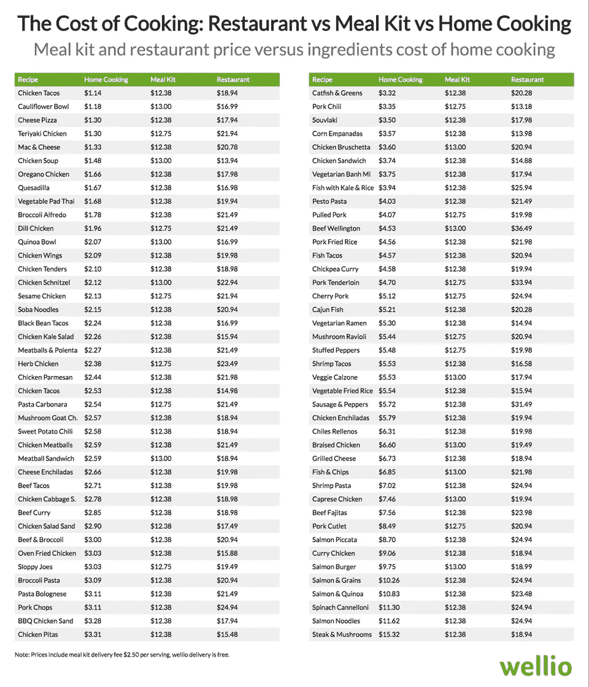
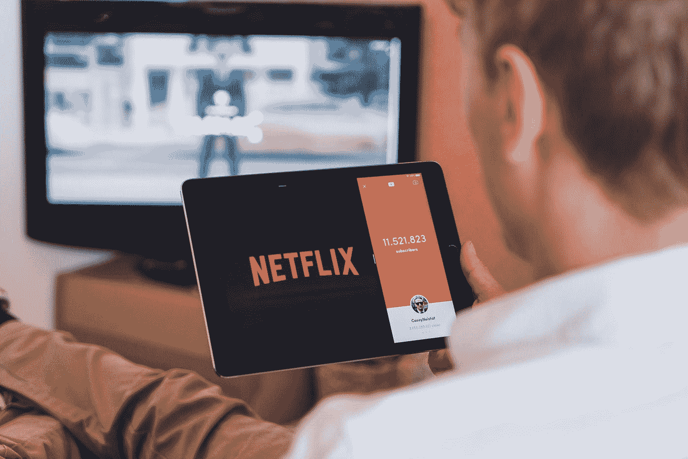
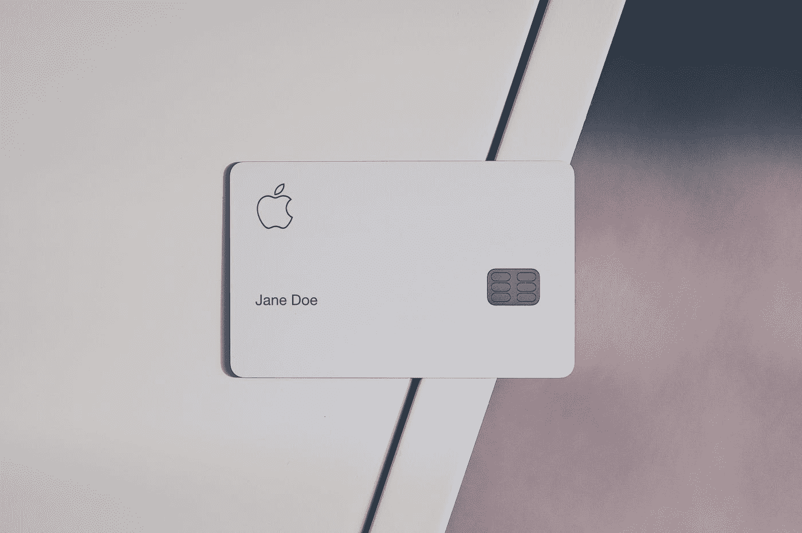

# 以下是在冠状病毒封锁期间省钱的实用方法

> 原文：<https://medium.datadriveninvestor.com/here-are-practical-ways-to-save-money-during-the-coronavirus-lockdown-8cd84995d9d8?source=collection_archive---------7----------------------->

## 这里有一些实用的方法可以让你的储蓄账户里有更多的钱

Photo by [Michael Longmire](https://unsplash.com/@f7photo?utm_source=medium&utm_medium=referral) on [Unsplash](https://unsplash.com?utm_source=medium&utm_medium=referral)

随着冠状病毒在全球范围内超过 100 万例，世界目前正处于经济不确定的状态。

随着许多工作面临风险，现在是**集中精力节约和削减不必要开支的最佳时机。**

我们中的许多人目前在家远程工作，所以我们可以做一些事情，把更多的钱存入我们的银行账户，这是我们通常无法做到的。

**就我个人而言，在冠状病毒期间，我已经能够节省更多的钱。我不仅存了钱，还发现了我过去浪费钱的方式。**

以下是一些实用的方法。

# 1.为你的汽车省钱

Photo by [Grahame Jenkins](https://unsplash.com/@grahamejenkins?utm_source=medium&utm_medium=referral) on [Unsplash](https://unsplash.com?utm_source=medium&utm_medium=referral)

在一个不太需要开车的时代，你可以做的第一件事就是看看你目前的保险计划。

 [## 更好的预算，打造更大的|数据驱动型投资者

### 即使是专家也承认它们并不完美。从 1 到 10 的范围内，安东尼·科普曼和德尔…

www.datadriveninvestor.com](https://www.datadriveninvestor.com/2018/11/08/budget-better-to-build-bigger/) 

## 支付较低的保险费

有许多保险公司根据你开了多少车来定价。通勤时间越长或开车距离越远，发生事故的风险就越高(当然！)，这与您的溢价直接相关。

在我们不开车上班的时候，降低你的保险费用可能是一个可行的选择，可以节省一点钱。

> “当汽车无人驾驶时，几乎没有任何风险，”保险行业监管机构、ValChoice 首席执行官兼创始人丹·吉田说。

第一个合乎逻辑的选择是联系你的保险公司，看看你是否可以自己做出调整或者如果你的保费即将上涨，做出相应的改变。

储蓄将因情况而异，一旦你不得不回到以前的驾驶频率，你最有可能需要改变你的保费，但目前来看，这不太可能很快实现。

# 2.自己做饭

如果你订阅了食物，可能是时候取消了。

更糟糕的是，如果你一周点几次外卖或者更多(像我的一些朋友)，也是时候重新考虑这个选择了。

有了更多在家的时间，做饭是省钱的可行选择。

**但是你真的能省下多少？**

**看下面的数据**，无论是套餐还是餐馆外卖，你平均每餐节省了 10-15 美元。如果你是一个外卖食品狂热者，这可以很容易地节省数百英镑。

Source: [http://www.getwellio.com/ranking-least-nutritious-meal-dollar-2](http://www.getwellio.com/ranking-least-nutritious-meal-dollar-2/)

看一看上面，你可能会看到你最喜欢的食物，以及自制食物、套餐和餐馆的对比。

# 3.平衡预算——取消任何你在家不用的订阅

Photo by [YTCount](https://unsplash.com/@ytcount?utm_source=medium&utm_medium=referral) on [Unsplash](https://unsplash.com?utm_source=medium&utm_medium=referral)

如果你从来没有做过预算，或者你没有坚持做预算，那么是时候重新审视一下了。

这意味着计算你所有的花费，尤其是不必要的服务。

在工作不稳定的情况下，拥有足够的现金来支付最基本的开支从未如此重要。如果你目前所在的行业深受冠状病毒的影响，如旅游、酒店或观光业，这一点尤为重要。

> 国际金融理财师的安迪·潘科是 T4 Tenon 金融公司的老板，他说:“典型的建议是让 T2 手头有足够的现金来支付三到六个月的必要开支。”。“现在是更新你的分析和假设的好时机，看看三到六个月是否足够。”

## 记得检查你的订阅

订阅是很容易注册的，但是如果你不注意的话，你的账户就会被吃掉。

如果你不能马上背出你所有的订阅，你需要列一个清单。此外，如果你不能证明订阅的价值，也是时候重新考虑这些了。

**以下是您目前可能订阅的领域清单:**

*   **Google Play 或 iOS 订阅**——如果你现在有任何订阅，特别是如果它们是社交或约会应用，取消它们可能是明智的
*   **亚马逊订阅**——有这么多订阅，包括它的 Appstore、Kindle、Prime 等等，你需要问问自己现在是否需要它
*   **健身房会员资格** —全世界有超过 6250 万名健身房会员，如果你现在还没有冻结你的会员资格(或者如果你的健身房还没有自动冻结会员资格)，现在是时候这么做了
*   **食物订阅—** 不太常见，但也值得探索。现在有这么多时间在家，没有理由不自己做饭
*   **您可能订阅的任何其他游戏或技术订阅**

# 4.理清你的贷款——为你的房屋贷款再融资，取消信用卡收费

Photo by Mark [S.](https://unsplash.com/@blocks?utm_source=medium&utm_medium=referral) on [Unsplash](https://unsplash.com?utm_source=medium&utm_medium=referral)

类似于整理你的预算和开支，掌握你的贷款，包括你的信用卡，是至关重要的。

超过 1 . 89 亿美国人拥有信用卡，平均每个持卡人至少拥有四张信用卡。).随着数百万人也卷入某种形式的抵押贷款，这可能是一个很好的时机来探索一些选择。

## 取消任何有费用的信用卡

如今许多信用卡都有附加费用。

许多这样的卡与基于航空公司或银行的旅行或奖励系统相关联。

**在一个不需要旅行也不需要过度消费的时代，取消这些卡以避免费用**可能是一个好时机，特别是如果你的年费即将到来。

## 重新贷款或减少你的还款

一般来说，偿还债务越快越好。

然而，如果你想在这种冠状病毒情况下保持安全**，寻求减少你的还款是一个很容易的第一步**，以减少对你储蓄的影响，以防你需要度过难关(例如，失业)。由于利率处于历史低点，现在是考虑这个问题的最佳时机。

如果你想更进一步，你的住房贷款再融资可能也是一个可行的选择。

大多数银行现在都在提供帮助，所以和他们谈谈，看看对你的财务状况来说什么是最好的选择。

# 5.赚点外快

Photo by [Bench Accounting](https://unsplash.com/@benchaccounting?utm_source=medium&utm_medium=referral) on [Unsplash](https://unsplash.com?utm_source=medium&utm_medium=referral)

我的意思是，从技术上讲，如果你也在赚钱，那你就是在省钱，对吗？

我们有了更多的时间，与其上演那场网飞秀，为什么不探索一些方法来赚点现金，帮助缓冲你的储蓄账户呢。我个人一直在做更多的自由职业来帮助赚点外快。

有很多方法可以从兼职经济中赚钱，许多人认为这是全职工作的可行替代方案。

> 62%愿意在未来两年内离开雇主的千禧一代认为零工经济是全职工作的可行替代方案

有一些很棒的网站可以尝试，包括 Fiverr、Upwork、Freelancer 等等。

# 摘要

虽然这些建议中有许多在纸上可能很简单，但有许多是你应该做的事情，但很可能没有付诸行动。

能够存下足够的钱可以减轻你的压力，尤其是当事情变糟的时候。

在当前不确定的经济形势下，确保你管理好你的所有财务，包括你的预算和支出、贷款以及其他杂项费用，这对于省钱是至关重要的。

## [和成千上万的人一起加入我的创业和营销简讯吧！](https://cornertechmarketing.substack.com/)