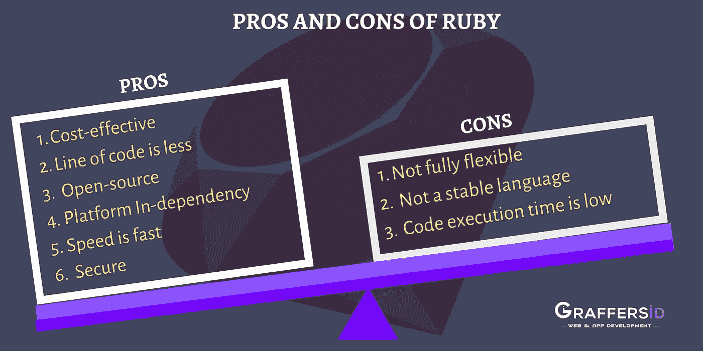
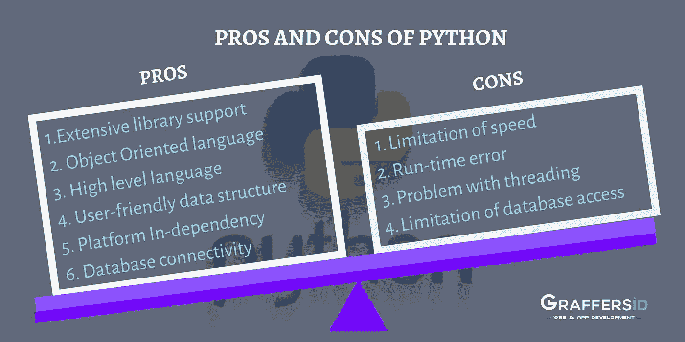
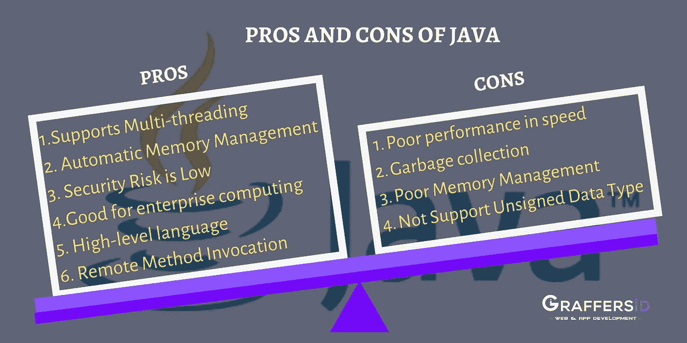
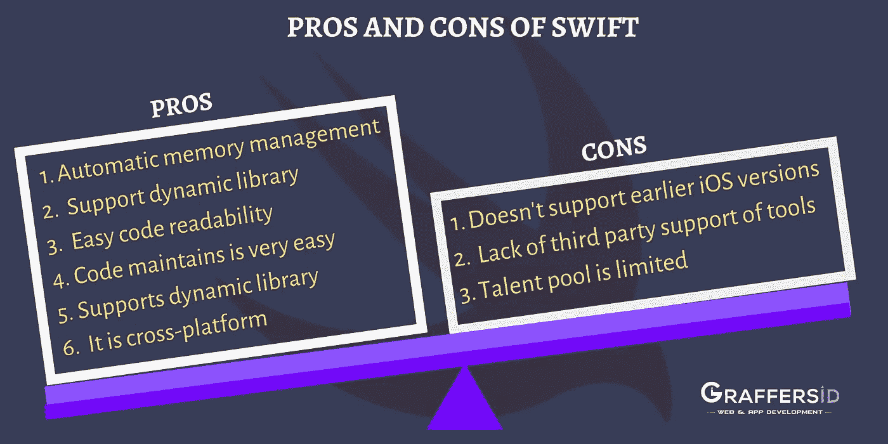
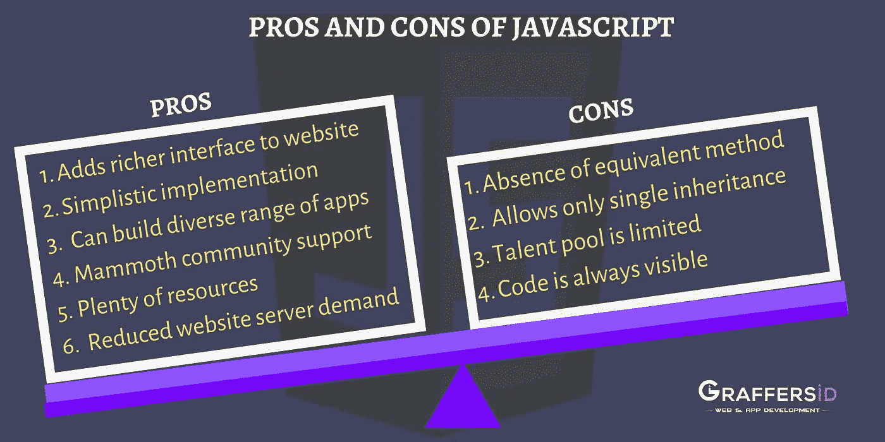
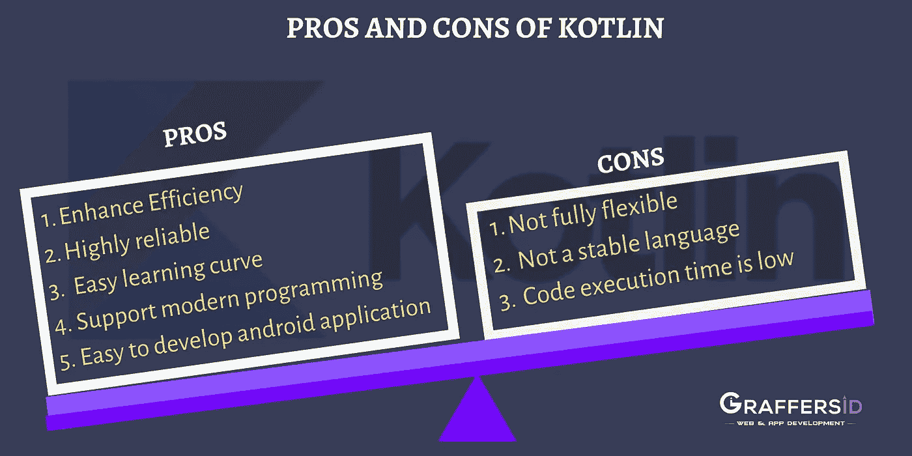

# 以下是 2020 年的编程语言趋势

> 原文：<https://medium.datadriveninvestor.com/here-are-programming-languages-that-will-trend-in-2020-752c5fa10070?source=collection_archive---------5----------------------->

好奇 2020 年会给编程界带来什么？你来对地方了。这篇文章为您带来了编程世界的最新趋势。

所以，别等了，让我们来看看 2020 年和未来几年的编程语言趋势。

**铁锈:**

Rust 是一种多范例系统编程语言，使每个人都能构建高效可靠的软件。从语法上来说，Rust 类似于 C++，但是它提供了更好的内存安全性，同时保持了高性能。

 [## 创建折衷书架的程序员指南

### 每个开发者都应该有一个书架。他的内阁中可能的文本集合是无数的，但不是每一个集合…

www.datadriveninvestor.com](https://www.datadriveninvestor.com/2019/03/25/a-programmers-guide-to-creating-an-eclectic-bookshelf/) 

Rust 已经成功地证明了自己是一门伟大的语言，拥有一个充满活力和活跃的社区。随着脸书在 Rust 上建造它有史以来最大的项目 Libra，我们可以清楚地说 Rust 已经起飞了。而且，今年 Rust 肯定会正式成为主流。

以下是在 Rust 中编程的操作系统和相关组件:

*   魔法口袋
*   斯特拉斯
*   有轨车
*   鞭炮
*   氧化还原

Pros and Cons of Rust

**巨蟒:**

Python 于 1991 年发布，由吉多·范·罗苏姆创建。Python 是最简单的语言之一，也是高级的、用户友好的、易学的、快码的。

根据 IEEE spectrum 的一份报告，Python 统治着企业、web 和嵌入式编程领域，是大多数排名指标的王者。Python 是一个机会的金矿，可以帮助开发人员构建基于虚拟现实的应用程序。这种多功能语言提供了无缝体验，有助于使用机器学习和人工智能等趋势技术创建广泛的应用程序。

Python 的几个应用包括:

*   操作系统开发
*   企业和商业应用
*   Web 框架和应用程序开发
*   图形用户界面桌面应用程序开发
*   用于原型制作

Pros and Cons of Python

**Java:**

Java 于 1995 年出现在业界，具有运行任何浏览器窗口的灵活选项。Java 是一种通用编程语言，它是基于类的、同步的和面向对象的。Java 旨在允许应用程序开发人员编写一次代码，然后在任何地方运行，而无需重新编译。

TIOBE 最近进行的一项调查表明，Java 是一种顶级编程语言。

Java 适应动态环境，这意味着促进内存的动态分配，从而提高应用程序的性能并减少内存。通过使用字节码，可以很容易地翻译成机器码，Java 实现了高效率。

Java 主要用于开发:

*   嵌入式系统和网络应用
*   应用服务器和网络服务器的开发
*   开发企业应用程序
*   游戏引擎和云应用的开发
*   分布式应用的开发

Pros and Cons of Java

**Swift:**

Swift 编程语言由苹果公司于 2014 年 6 月推出，它是一种多范式、通用的 iOS 应用程序开发编程语言，适用于 iOS、iPads、TVOS、macOS、Linus、手表和 Z/OS。

这种强大而直观的编程语言旨在与苹果的 Cocoa 框架一起工作。Swift 的主要目标是帮助开发者构建能够在苹果设备上高效运行的应用。Swift 删除所有不安全的代码并跟踪所有错误，从而消除不正确的应用程序操作。

以下是 Swift 的一些应用:

*   Mac OS 桌面应用程序
*   iOS 应用程序开发

Pros and Cons of Swift

**Javascript:**

Javascript 出现于 1995 年 12 月，是一种动态语言，它是多范式的，基于原型的。Javascript 作为网络语言，支持命令式、面向对象和声明式风格。

Javascript 确保没有漏洞，提高了数据验证的可能性。Javascript 用于客户端编程和服务器端。该语言提供一致的更新，这有助于您满足市场的期望。

Javascript 是一种广泛使用的编程语言，它使开发者能够创建高级应用程序。它适用于参与基于 web 的应用程序生产的 WEBVR 平台。

以下是 Javascript 框架的一些应用:

*   Web 服务器应用程序开发
*   Web 应用程序开发
*   移动应用程序开发
*   智能手表应用
*   使用 HTML5 的游戏开发

**PHP:**

PHP，也称为超文本预处理程序，是一种广泛用于基于 web 的应用程序的语言。它使开发人员能够创建与数据库有效协作的交互式动态网页。PHP 很容易嵌入到 HTML 文件和 HTML 代码中，也被认为是一种通用编程语言。如果您希望从服务器端进行开发，那么这就是您希望选择的语言。

下面是 PHP 的一些应用:

*   电子商务 Web 应用程序
*   Web 应用程序开发
*   合作医疗的发展
*   图像处理和图形设计
*   数据表示系统的开发。

Pros and Cons of Javascript

**红宝石:**

Ruby 由 Yukihiro Matsumoto 设计，是一种面向对象的脚本编程语言。一些顶级组织如 Groupon、摩托罗拉、Scribd 和 Github 都在使用这种通用编程语言。

这种灵活的语言有助于重新设计现有的零件，并使用户能够自由地修改零件。它不需要任何变量声明，通常更喜欢英文关键字。

Ruby 主要用于构建:

*   Web 应用程序开发
*   服务器端应用程序开发

Pros and Cons of Ruby

**科特林:**

由 JetBrains 设计的 Kotlin 于 2011 年首次亮相。Kotlin 作为谷歌和安卓的官方语言已经获得了发展势头。它作为最好的统计类型、跨平台、通用编程语言之一而广受欢迎。

Kotlin 是一种独特的语言，预计将在 2020 年提高生产率。这种现代语言对初学者是有益的，可以作为 web 开发的切入点。利用 Kotlin 多平台框架，人们可以选择同时运行两个平台的共享代码库。

以下是 Kotlin 的一些应用:

*   Android 应用程序开发
*   原生应用程序开发。

比较语言并为您的项目选择正确的语言是一项令人生畏的工作。弄清楚哪种语言最适合你取决于需求和你希望在 2020 年遵循的未来方法。考虑到科技行业的快速增长，说所有语言对于构建下一代应用程序都是必不可少的，这一点不会错。

Pros and Cons of Kotlin