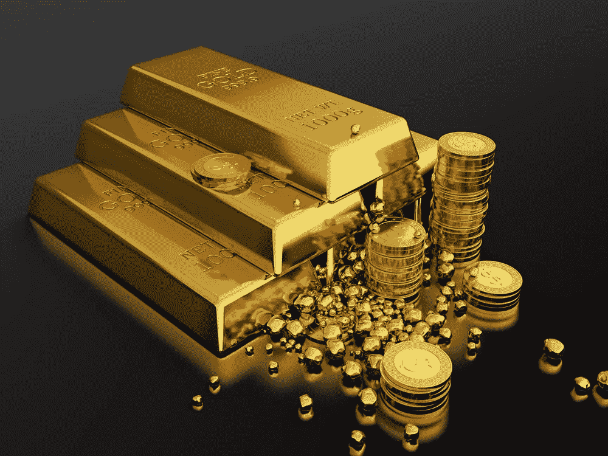

# 媒体评论说，“比特币不是一种安全的资产！”

> 原文：<https://medium.datadriveninvestor.com/here-comes-the-media-dogpile-saying-bitcoins-not-a-safe-haven-asset-f4d32923e208?source=collection_archive---------14----------------------->

周一，在冠状病毒恐慌和穆罕默德·本·萨勒曼和弗拉基米尔·普京之间的石油(自我)摊牌中，[市场经历了自 2008 年金融危机以来最严重的单次下跌。](https://www.wsj.com/articles/asian-stock-markets-in-early-monday-sell-off-after-saudi-arabias-decision-to-cut-most-of-its-oil-prices-11583713399)

市场[收复了](https://www.cnbc.com/2020/02/24/turnaround-tuesday-stocks-tend-to-bounce-back-quickly-from-market-drops-like-this-one.html)昨天的部分失地，但[今天很快又收复了](https://www.wsj.com/articles/global-markets-calmer-after-two-hectic-days-11583899913)失地，这向投资者发出信号，表明离悬崖还有很长的路要走。

在这样的时候，避险资产会占据他们的首发位置。黄金*——这种资产的顶峰已经响应了这一号召，上涨至 2011 年以来从未见过的水平，飙升至每盎司 1700 美元，而 30 年期美国国债有史以来首次跌破 1%。*

*与此同时，数字黄金(即比特币)继续扮演着跷跷板上的古怪小孩的角色。它在同一个不稳定和不可预测的来回钟摆中交易，这种情况已经持续了几个月(几年？).最近的抛售似乎与 9 月和 11 月发生的抛售没有任何不同。这只是比特币在做它的事情。显然，数字货币并不担心感染现实世界的病毒。*

* [## 算法交易的机器学习|数据驱动的投资者

### 当你的一个朋友在脸书上传你的新海滩照，平台建议给你的脸加上标签，这是…

www.datadriveninvestor.com](https://www.datadriveninvestor.com/2019/01/30/machine-learning-for-stock-market-investing/) 

也许是时候面对事实了，称比特币为避险资产并不符合要求。

*“那么叫它什么呢？”*

“这里有一个！“不相关的避险资产”怎么样

*“等什么？”*

*"* 你知道，一项资产是安全的避风港*因为*它与任何事物都不相关，明白吗！?"

*“否”*

英国《金融时报》最近发表了一篇题为《你猜对了[》的文章，抨击比特币和加密货币不符合它们的安全港“地位”，文章称，“比特币不应该是一个安全港吗？”](https://ftalphaville.ft.com/2020/03/09/1583742985000/Isn-t-bitcoin-meant-to-be-a-safe-haven-/)作者将“不相关的安全港”的概念称为“一种荒谬的逃避条款，每当比特币在风险厌恶时期表现不佳时，它就可以被推出。”

这一点毋庸置疑，但我不禁要问，“因为比特币不及黄金而对其进行批评，这种比较公平吗？”

让我们看看。

黄金的市值约为 7 万亿美元，至少 5000 年来它一直被用作价值储存手段。比特币的市值约为 1450 亿美元，12 年来一直被用作价值储存手段。比特币的市值约为雪佛龙的规模，作为一种货币，它与巴基斯坦卢比齐名。

然而，比特币确实有一个巴基斯坦卢比没有的优势。这就是它卡戴珊式的媒体形象。

这让比特币感觉像一只 800 磅的大猩猩，而它实际上是全球金融犀牛背上的一只跳蚤。这种不成比例的媒体关注造成了不切实际的期望、炒作和失望的循环(排名不分先后)。因为比特币不符合黄金的资产类别而生气，就像职业小轮车骑手因为一个蹒跚学步的孩子使用辅助轮而生气一样。

给自己一些成长和发展的时间怎么样？

这是许多人已经知道的丑陋事实，但数量惊人的人不知道——比特币和密码是金融宇宙中的一个小点，一个淡蓝色的点。然而，许多人的预期是，它将像阿特拉斯一样，一夜之间肩负起摇摇欲坠、支离破碎的全球金融体系的重担。这里有一个统计数据，比特币目前的市值是纽交所的 0.9%，相比之下，黄金的市值约为 43%。让那件事过去一会儿。

我的观点是什么？比特币在 2008 年还为时过早，12 年后的 2020 年被认为是与黄金同等的避险资产仍然为时过早。

因为即使更多的传统投资者现在可以从他们的 TD Ameritrade 和查尔斯·施瓦布账户购买比特币，但它仍然是*风险太大，不透明，大多数人很少理解，所以实际上并没有这样做。*

比特币似乎不遵循任何真正的模式或可预测的性质，这一事实使它成为一个奇怪的水晶球，经验丰富的投资者不愿窥视。

"你是说“不相关的资产类别”吗？"嗯，也许吧。但是直到我知道*那个*到底是什么意思，我才会避开。"

渐渐地，随着千禧一代和 Z 世代获得更多财富，比特币成熟，随着 BTC 交易所交易基金获得批准，机构资金决定涌入，我们就可以谈论数字黄金和实物之间的相关性了。在那之前，让我们把媒体的轰动效应留给冠状病毒，MBS 和普京，还有[卫生纸上的挤兑](https://www.cnn.com/2020/03/09/health/toilet-paper-shortages-novel-coronavirus-trnd/index.html)。*