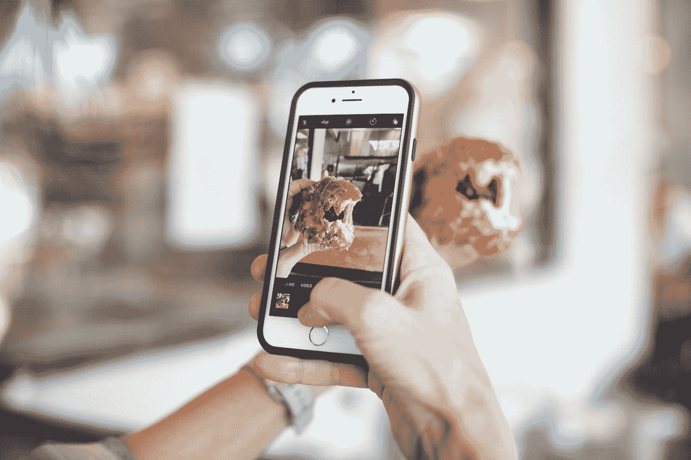

# 以下是在 Instagram 上成长的 30 分钟常规

> 原文：<https://medium.datadriveninvestor.com/here-is-a-30-minutes-routine-to-grow-on-instagram-99c250244171?source=collection_archive---------10----------------------->

## **如何最大限度地利用你的时间来培养追随者**

Photo by [Callie Morgan](https://unsplash.com/@calliestorystreet?utm_source=medium&utm_medium=referral) on [Unsplash](https://unsplash.com?utm_source=medium&utm_medium=referral)

你可能熟悉帕累托原则，我们也称之为 80/20 法则。这条规则解释了你 20%的行动贡献了 80%的结果。

今天，我们将学习如何只关注重要的 20%，以确保你在 Instagram 上获得 80%的增长结果。

每天花在你身上的时间不应该超过 30 分钟，但是如果你没有这么多时间的话，你可以把这个过程延长或者缩短。重要的是每天都要做。每天做 10 分钟比每周做一次一小时要好。

# **适时发帖(5 分钟)**

你可能会问什么时候合适？因为我们关注的是你可以做的 20%来获得 80%的回报，所以当你有时间发帖的时候才是发帖的正确时间。

当然，我们可以开始思考什么时候是发帖的最佳时间。我们可以进行严肃的 A/B 测试，收集半年的数据。但也没那么值得。优化你发帖的时间只会对你的帖子的表现产生有限的影响，不会大幅改变你在 Instagram 上的增长。

 [## 影响者在聚光灯下表演|数据驱动的投资者

### 影响者营销是一个脱颖而出的游戏。结果是一个令人难忘的-和可信的-连接到一个产品或…

www.datadriveninvestor.com](https://www.datadriveninvestor.com/2020/01/15/influencers-perform-in-the-spotlight/) 

白天可以的时候就发帖子。确保你的标题吸引人。做一点标签研究。把你的内容发布出去，这才是最重要的。

定期出现在你的读者群中会增加你的影响力，你的参与度，从而增加你的粉丝数量。

# **评论他人内容(20 分钟)**

通过一些标签或位置研究，或任何其他你能想到的相关方式，找到你所在领域的人发布的内容。尽量具体，尽可能精确地锁定目标人群。想想你的理想追随者。谁会对你的内容感兴趣？这个人在 Instagram 上关注什么？这个人在平台上发帖是什么？他们用的是什么标签？通过回答这些问题，你会更好地了解瞄准谁以及如何瞄准他们。

现在你可以看到潜在关注你的人的帖子，开始喜欢和评论他们的内容。留下真诚有趣的评论。如果你想进入下一步，你甚至可以 DM 他们，开始建立关系。

这里的要点是尽可能真诚和深刻地与某人交往。

如果你看到一个你喜欢的账号，喜欢几个帖子，评论几个帖子，甚至可能 DM 他们，告诉他们你有多喜欢他们做的事情，为什么。Instagram 就是要建立一种关系。如果这个人最终关注了你，你可以确定这个用户将来会关注你的内容。

20 分钟，你会喜欢，评论，DM。不要停下来。你做得越多，你的追随者就越多。

# **回复您的 DMs 和评论(5 分钟)**

深入你与听众建立的关系。回复你收到的所有邮件和评论。

这一步可能需要 5 分钟以上，这取决于你的听众人数和你的参与度。但是既然你正在阅读关于建立 Instagram 程序的文章，我想你的账户应该还是很小的。

这里的重点是尽可能地加深关系，所以尽量不要中断对话。提出问题，征求他们的意见。你参与的越多，这些人未来与你的接触就越多，他们自然会更多地推送和分享你的内容。

这里的要点是要一直保持对话。这可能看起来垃圾邮件和恼人的，但相信我，大多数时候，你没有打扰任何人。

现在，每天遵循这个惯例，你应该每天都有相当稳定和可持续的新追随者。

这似乎是一种非常 DIY 的增长方式，但这就是当你开始使用 Instagram 时，如何获得最高质量的有机增长。过一段时间，特别是如果你的参与度很高，你在标签中的排名会更高，你会更频繁地出现在探索页面上，使你的帐户自然增长。

然而，就目前而言，你必须通过开始对话，与人交往，并展示你的存在，来获得你的第一批参与的追随者和粉丝。

你有没有觉得你在社交媒体，尤其是 Instagram 上尝试了一切来发展？希望接下来的事情是你实现目标的最后一件事。

你有没有觉得你在 Instagram 上尝试了一切去成长？希望接下来的事情是你实现目标的最后一件事。

在您的收件箱& **中获取[最好的 Instagram 成长知识](https://charlestumiottojackson.ck.page/regularmedium)立即免费下载我的 Instagram 小抄**。