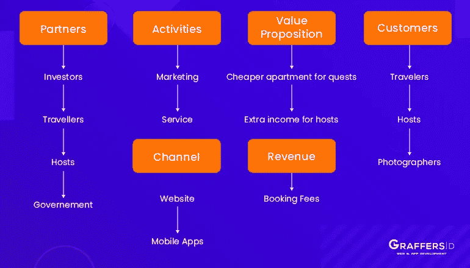
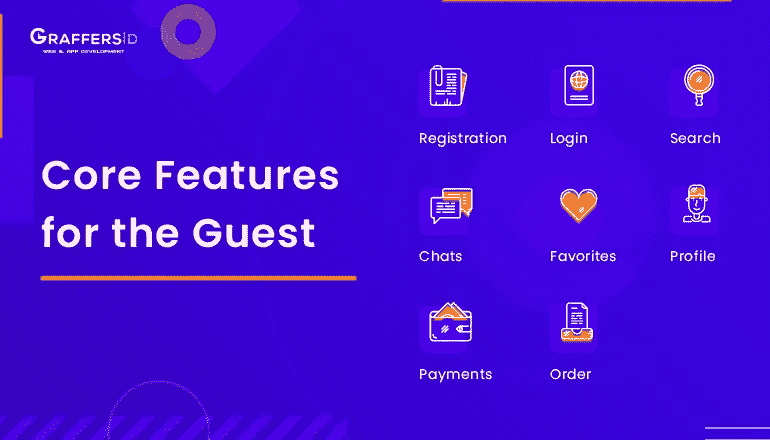
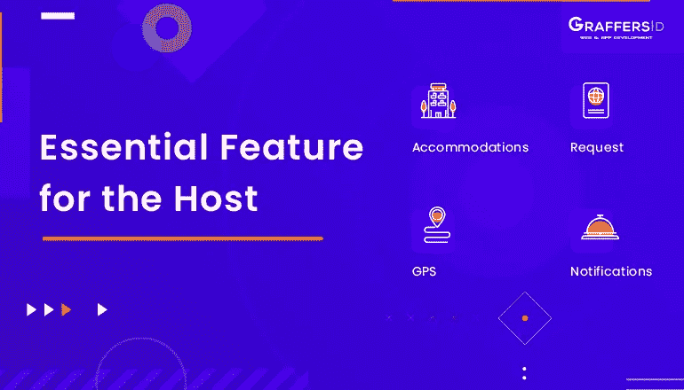
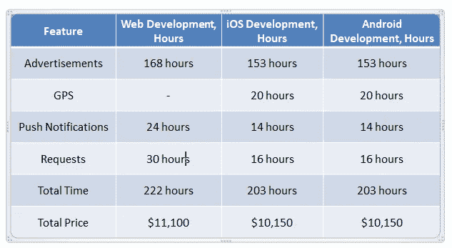
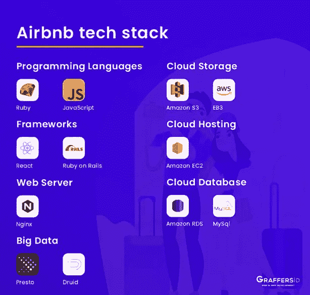
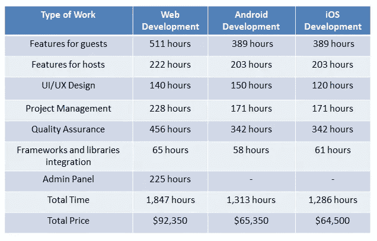

# 以下是创建类似 Airbnb 的应用程序的详细指南

> 原文：<https://medium.datadriveninvestor.com/here-is-a-detailed-guide-to-create-an-app-like-airbnb-a224f40c3c32?source=collection_archive---------19----------------------->

你是否也有一个家外之家的想法，并希望得到一个行业巨头 Airbnb 的复制品？如果是的话，那么你只需要花 8 分钟的时间来学习如何构建和开发一个像 Airbnb 这样的度假租赁应用。

虽然有传言称度假租赁行业已经饱和。但是像 **Airbnb 这样的市场中的独角兽目前只拥有度假租赁市场**的 10-15 %,这意味着仍然有很大的空间让另一只独角兽来打破这个利基市场。

 [## 2019 年最值得学习的编码语言|数据驱动的投资者

### 在我读大学的那几年，我跳过了很多次夜游去学习 Java，希望有一天它能帮助我在…

www.datadriveninvestor.com](https://www.datadriveninvestor.com/2019/02/21/best-coding-languages-to-learn-in-2019/) 

所以，现在的问题是，如何创建一个像 Airbnb 这样的应用程序，它对你的口袋来说会有多重。这里有一个完整的指南，可以帮助你建立与 Airbnb 相同的模式来启动你的创业公司。

**本博客涵盖:**

*   **什么是 Airbnb？**
*   **Airbnb 的基金**
*   **为什么你应该考虑建立一个像 Airbnb 这样的应用程序？**
*   **Airbnb 的竞争对手是谁？**
*   **Airbnb 如何运作？**
*   **Airbnb 商业模式**
*   **Airbnb 结果**
*   **如何做一个像 Airbnb 这样的 app？**
*   **Airbnb 的功能和开发成本**
*   **团队和技术**
*   **创建像 Airbnb 这样的应用程序的最终估计值**

让我们开始吧:

# Airbnb 是什么？

Airbnb 是最好和最受欢迎的寄宿家庭平台之一，通过其物业租赁服务，旅行者可以住在当地，让主人和客人都有更好的体验。该公司总部位于旧金山，通过 web 和移动应用程序在世界各地运营在线酒店和在线市场服务。会员们可以利用这些服务为到他们那里旅游的游客提供寄宿家庭。

Airbnb 经历了 9 年的漫长旅程，从其产品中产生可持续的收入，并将其转化为移动应用程序，最初是从一个网站开始的。

# Airbnb 的基金

这个寄宿家庭应用程序将寻找舒适和负担得起的地方的旅行者与在世界各地拥有如此令人鼓舞的地方的房主联系起来。Airbnb 在大约 191 个国家和 65000 个城市拥有超过**450 万个房源**。

迄今为止，该公司已经获得了来自 15 家公司的融资，已经筹集了 44 亿美元。

# 为什么你应该考虑建立一个像 Airbnb 这样的应用程序？

像 Airbnb 和优步这样的应用程序被认为是人与社会互动的进步方式的最好例子。这两家公司成功获得了独角兽地位，因为它们帮助建立了“共享经济”模式。Airbnb 帮助旅行者以低廉的价格入住酒店，同时也为他们提供了一个通过出租酒店来赚钱的机会。

旅游行业的度假租赁需求增长显著；然而，供应量并没有增加到那个水平。因此，通过使用 Airbnb 这样的应用程序来启动你的创业公司，有很大的机会进入这个利基市场。

**Airbnb 的竞争对手是谁？**

Airbnb 并不是唯一一个涉足改变游戏规则的旅行模式的平台。在构建像 Airbnb 这样的应用程序时，也可以考虑一些公司:

1.  **HomeAway:** 它拥有超过 100 万份全球房源，并提供类似 Airbnb 的服务。它还提供一些额外的服务，比如保险项目。它还运营一些其他网站，如 TravelMob、VacationRentals 和 VRBO。
2.  这款应用程序要求用户分享他们的个人 id、账单和个人照片，以确保应用程序对客人的安全。
3.  FlipKey: 这是猫途鹰旗下的一家公司，拥有大量用户。他们每天提供 5000 多种特价商品来维持用户的忠诚度。

**Airbnb 是如何运作的？**

Airbnb 有两类用户——客人和房东。

**Airbnb 如何为客人服务？**

**步骤 1:** 用户访问 web 或移动应用程序，并注册为访客。

**第二步:**接下来，他们完成个人资料，并添加必要的数据，如身份证号、个人资料图片等。

**第三步:**客户可以选择合适的住处，比如空间类型、价格、位置等等。

第四步:客人要求入住并收到确认。

**第五步:**使用服务前需要支付预约费用。

**第六步:**最后一步，享受入住。

**Airbnb 如何为主机工作？**

**第一步:**用户需要注册成为主持人，并确认他们年满 18 岁。

**第二步:**之后用户就可以在 Airbnb 上添加房源了。主人可以添加关于住宿的数据，如公寓类型、位置和可以住宿的客人数量。

**第三步:**要求房东上传公寓的实景图片，也要提到价格。

第四步:当客人要求入住时，讨论所有细节，如清洁标准、安静时间，主人可以开始谈话。

**第五步:**如果一切顺利，主人批准入住。但是，如果需要，房东也有机会拒绝入住。

**第六步:**主人在客人入住后 24 小时内收到款项。

**Airbnb 商业模式**

Airbnb 提供 iOS 和 Android 两大移动平台的应用程序，并且还有一个 web 应用程序。Airbnb 还支持智能手表，这样用户可以更快地收到通知，并保持最新状态，而无需任何更改。

公司通过收取预订费来产生收入:

*   每一笔交易，主人都要向 Airbnb 支付 3%的费用。
*   根据预订的规模，客人必须支付 6-12%的预订费。

Airbnb Business Model

**Airbnb 结果**

*   据 SimilarWeb 报道，Airbnb 是旅游细分市场中第四个可下载的网站。
*   平均每天有超过 200 万人选择 Airbnb。
*   Airbnb 在 2019 年创造了约 12.6 亿美元的收入，这意味着增长约 14.7%
*   这项服务在 191 个国家提供，提供大约 700 万个住宿。
*   Airbnb 在全球拥有超过 1 . 5 亿名活跃用户(T21)。

**如何搭建一个像 Airbnb 这样的 App？**

构建 Airbnb 这样的应用程序需要遵循几个步骤:

第一步:制定商业计划

提出一个想法是不够的。你需要确定你的目标，遵循商业计划并保持有组织性。

第二步:找到开发者

要创建 Airbnb 克隆应用，你需要一个经验丰富的 web 开发团队。你可以建立一个内部团队，或者将你的开发需求外包给印度等国家。

**第三步:构建用户友好的设计:**

Airbnb 应用程序界面简单易用，非常直观。用户倾向于放弃具有交互设计的应用程序，所以一定要注意你的 [UI/UX 设计](https://graffersid.com/blogs/here-is-the-difference-between-ui-and-ux-design/)。

**第四步:整合基本特征:**

最初，你可以考虑建立一个类似 Airbnb 的应用程序，具备一些基本功能。获取应用的 MVP 版本，了解用户需求，获取反馈。在您发现用户正在寻找什么之后，您可以考虑添加一些高级功能来使您的应用程序与众不同。

**第五步:测试应用**

在启动应用程序之前，确保您的开发团队仔细测试应用程序以消除错误。

**第六步:定期更新**

定期维护应用程序，并不断添加令人兴奋的新功能。

**Airbnb 为客人提供的应用功能及其费用**

Core Features for the Guest

**注册:**

要开始使用该应用程序，游客需要首先在该应用程序上注册。基本模式将包括为用户提供电子邮件和密码注册。此外，创建“条款和政策”屏幕也很重要，因为用户应该同意使用政策。

**登录:**

确保为用户提供选项，如登录谷歌帐户，脸书和电子邮件。每个集成大约需要 8 个小时的开发时间。除此之外，添加像“注销”和“忘记密码”这样的功能以确保你的应用程序是用户友好的也是很重要的。

**搜索:**

最好在选项中添加一个高级搜索系统，用户可以应用各种过滤器找到他们的临时住所，如客人数量和旅行日期。

**收藏夹:**

该功能为用户提供了将他们喜欢的地方添加到列表中的选项。之后，他们可以从他们的“最喜欢的标记”住宿中选择想要的一个。

**简介:**

像 Airbnb 这样的应用有两种类型的用户——客人和主人。确保添加一个功能，以便客人和主人都可以编辑个人资料，并添加个人数据，如姓名、年龄、性别等。

**聊天:**

有了聊天功能，客人和主人会发现在申请入住后，可以很容易地交流和讨论位置等问题。客人可以在参观之前索要酒店的照片。此外，开发人员还可以添加各种状态，如阅读和打字，使应用程序更加人性化。

**支付:**

为用户提供各种支付方式来简化支付过程是有益的。此外，应该有一个选项可以添加和删除卡。

**订单:**

任何预订服务应用程序的最后一个功能是请求停留。用户选择要住的房子，如果所需数据上的住宿可用，应该能够预订它。

Airbnb Guest Features Development Cost

**针对主机的 Airbnb 应用功能及其成本**

Core Features for the Host

**住宿:**

Airbnb 允许房东制作一个关于他们住宿的广告。他们需要描述所有细节，如客人数量、公寓类型等。此外，它需要上传照片和视频，并根据每晚设置上市物业的价格。

**通知:**

这个功能很有用，可以让 Airbnb 更方便。例如，一旦客人提出请求，主人就可以收到即时通知。还可以通知主机预订更改、未检查的请求等。

**GPS:**

客户可以查看他们想住的地方，找到靠近咖啡馆和令人兴奋的景点的公寓。

以下是您在 Airbnb 应用程序上发现的一些高级功能，您可以考虑在以后添加:

*   超级嘉宾和超级主持人
*   多语言支持
*   货币转换器
*   Airbnb Plus，提供高品质、设备完善的房屋。

Airbnb Host Features Development Cost

**团队和技术打造 Airbnb 这样的应用**

构建像 Airbnb 这样的网络和移动应用程序需要以下专家:

*   商业分析员
*   项目管理人
*   2 名安卓开发者
*   2 名 iOS 开发者
*   UI/UX 设计器
*   后端开发人员
*   前端开发人员
*   质量保证工程师

要构建一个像 Airbnb 这样的移动应用，开发人员必须精通趋势编程语言，如 Kotlin (Android)和 Swift (iOS)。对于 web 开发，你需要懂 Javascript 的软件工程师。

**Airbnb 等应用的技术堆栈**

Airbnb Tech Stack

要构建像 Airbnb 这样的应用，你需要以下技术栈:

*   编程语言:Kotlin、Swift 和 Javascript
*   前端框架:React.js、Express.js 和 Angular
*   后端框架:Ruby on Rails，Node.js，Meteor.js，Django
*   服务器端技术:Azure，OpenStack，Google Cloud，DigitalOcean
*   网络级缓存服务:Redis、Nginx
*   数据库:MSSQL，MySQL，Cassandra，Azure DocumentDB，MongoDB。

**创建像 Airbnb 这样的应用程序的最终估计**

考虑到所有的因素，建立一个像 Airbnb 这样的应用程序的最终成本，网页版大约可以达到**92，350** 美元，移动应用程序(一个平台)大约可以达到**65，650** 美元

Final Estimate to Create an App like Airbnb

**总结**

制作一个像 Airbnb 这样的应用是一件不同的事情，扩展它以获得一百万用户是完全不同的事情。在本指南中，我解释了构建 Airbnb 这样的应用程序所需的流程、所有必要的功能和技术堆栈。然而，如果你还在努力从 MVP 开始或者开发一个原型，请随时与我们联系。

*原载于 2020 年 2 月 27 日*[*https://graffersid.com*](https://graffersid.com/create-an-app-like-airbnb/)T22。