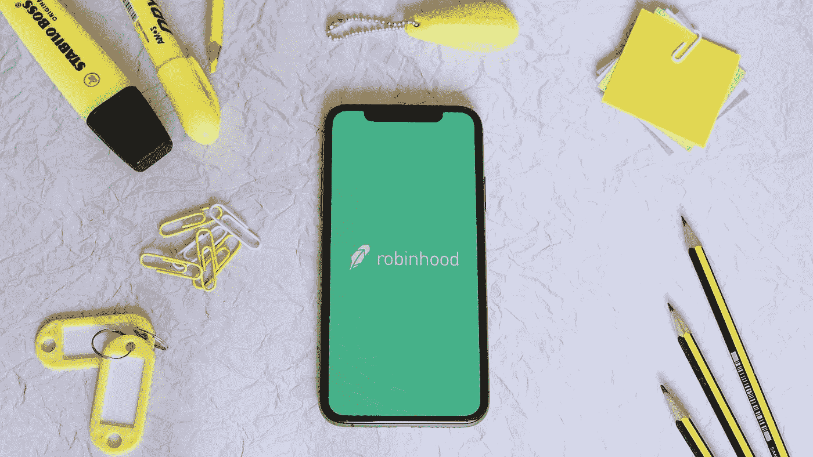
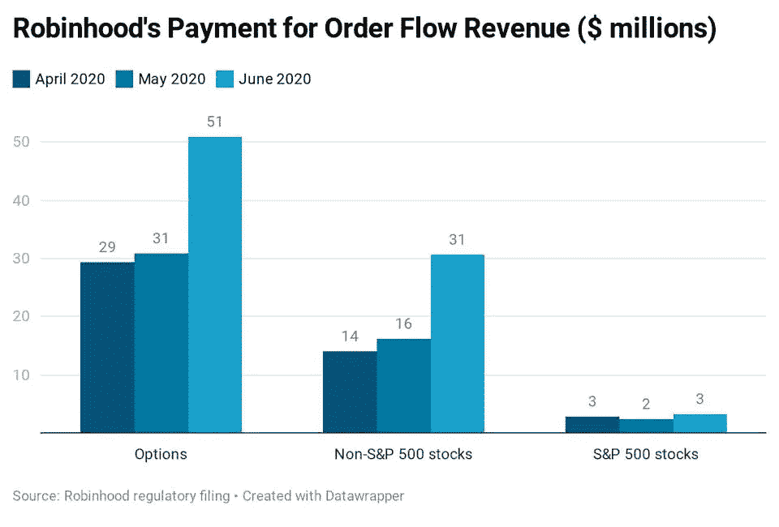
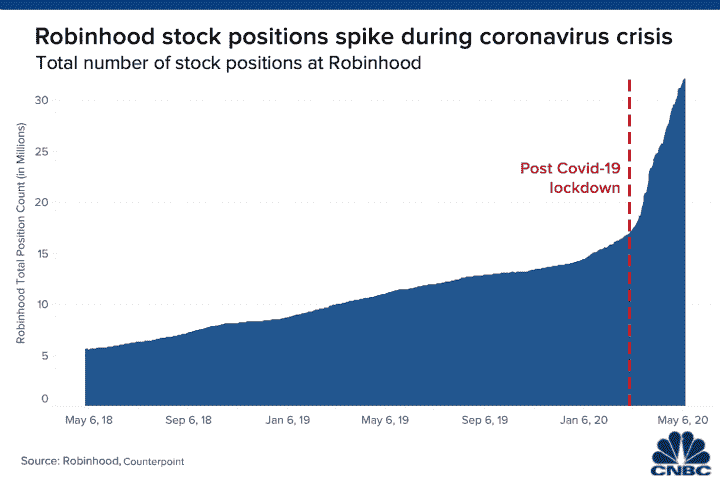
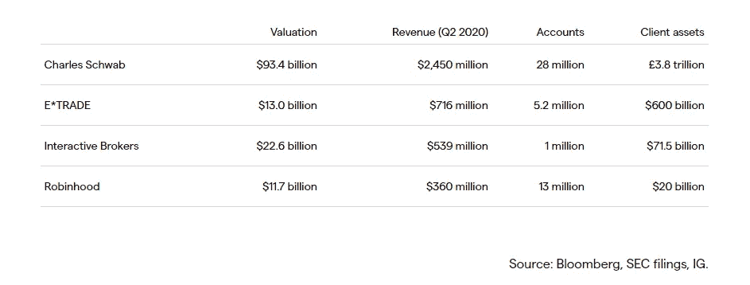

# 以下是你需要知道的关于 robin hood 2021 年 IPO 的一切

> 原文：<https://medium.datadriveninvestor.com/here-is-everything-you-need-to-know-about-robinhoods-ipo-in-2021-da78de0944d?source=collection_archive---------27----------------------->

## 让我们来看看它们的数量以及 2020 年的最新增长

Source: [https://investorplace.com/2020/11/4-robinhood-stocks-apha-mrna-plug-spce-to-keep-on-your-watchlist/](https://investorplace.com/2020/11/4-robinhood-stocks-apha-mrna-plug-spce-to-keep-on-your-watchlist/)

罗宾汉是千禧一代散户投资的代表。随着大量群体致力于通过该应用进行交易，它已经席卷了投资市场，并创造了一种新的投资者组合，他们愿意为了一两美元而孤注一掷。

随着 2020 的增长，Robinhood 在 9 月份的私人融资轮后成功达到了 112 亿美元的巨额估值，并利用这个机会宣布了 2020 年底的 IPO。

近年来，科技公司的首次公开募股已经成为成功的封面故事。Robinhood 将获得与 IPO 相同的待遇，其估值可能超过 200 亿美元。

让我们更深入地了解一下它最近的增长、统计数据和公司的整体表现。

# 什么是罗宾汉？

Robinhood 由 Baiju Bhatt 和 Vladimir Tenev 创立，是一款向用户提供佣金交易的交易应用。当然，自不到十年前问世以来，它已经吸引了一大批千禧一代。

它通过几种不同的方式赚钱，包括:

*   通过现金管理借记卡产生的可互换费用
*   现金产生的收入
*   交易场所和做市商的回扣
*   来自其交易的订单流收入
*   robin hood Gold——其更高级的交易应用程序的月度订阅

它还有其他一些方式，但这是它创收的主要方法。

[robin hood 2020 年的订单流收入在 2020 年第二季度达到 1.8 亿美元，](https://www.mobilemarketingreads.com/robinhood-revenue-and-usage-statistics-2020/)其中大部分收入来自期权交易，这是该平台上一种受欢迎的交易工具。当然，这不会是 Robinhood 的全部收入，因为这是经纪公司因指导订单而获得的报酬(订单流收入)。

当然，罗宾汉还有其他收入来源，但这将是其大部分收入([估计约 45 — 50%](https://www.businessofapps.com/data/robinhood-statistics/) )。尽管如此，从其监管文件来看(因为它正在 IPO)，这是其订单流收入的近期收入数据。

Source: [https://www.mobilemarketingreads.com/robinhood-revenue-and-usage-statistics-2020/](https://www.mobilemarketingreads.com/robinhood-revenue-and-usage-statistics-2020/)

与过去几个月相比，2020 年 6 月有了巨大的增长，其非标准普尔 500 股票和期权类别的数量几乎翻了一番。[为了查看其最近的数字](https://www.businessofapps.com/data/robinhood-statistics/)，这里是其订单流收入的汇总(同样，这只是作为交易经纪人的收入)。

*   2015 年——290 万美元
*   2016 年——930 万美元
*   2017 年——2100 万美元
*   2018 年——6900 万美元

它的收入每年增长近 3 倍，但 2020 年的数字尤其令人印象深刻。

# 2020 年的增长

毫无疑问，2020 年是罗宾汉的一年。

虽然它在过去几年里一直在稳步增长，但直到最近用户才开始疯狂增长。

Source: [https://www.cnbc.com/2020/05/12/young-investors-pile-into-stocks-seeing-generational-buying-moment-instead-of-risk.html](https://www.cnbc.com/2020/05/12/young-investors-pile-into-stocks-seeing-generational-buying-moment-instead-of-risk.html)

这无疑促使罗宾汉决定在 2021 年寻求 IPO，以利用这些数字和增长。

> “该公司在 2020 年初增加了 300 万个新客户账户，最近表示，6 月份日均收入交易(DARTs)达到 430 万笔，超过了所有其他公开交易的经纪公司”——[福布斯](https://www.forbes.com/sites/sergeiklebnikov/2020/08/17/robinhood-valuation-soars-to-112-billion-with-new-funding-and-record-growth/)

对于任何初创公司来说，这些都是难以置信的数字，尤其是那些主要在一个市场(美国市场)运营的公司。然而，与查尔斯·施瓦布等其他知名交易应用相比，一个主要问题是平均客户余额。查尔斯·施瓦布的平均客户余额是 135，000 美元，而罗宾汉只有 1500 美元。

尽管 Robinhood 可能执行了更多的日常交易，并拥有非常活跃的用户群，但其客户规模账户仍相对低于市场上经验丰富的老牌应用。然而，随着时间的推移，这种情况可能会发生变化，因为千禧一代的收入越来越高，所以 Robinhood 管理客户流失将非常重要。

 [## 医院的分解——创业的反直觉机会？|数据驱动…

### Tau Ventures 是一个种子基金，投资于数字健康、企业和自动化(汽车)领域的应用人工智能

www.datadriveninvestor.com](https://www.datadriveninvestor.com/2021/01/10/disaggregation-of-the-hospital-a-counterintuitive-opportunity-for-startups/) 

# 通往 112 亿美元的道路

在最近一轮 2 亿美元的融资中，它的估值达到了 112 亿美元。这比它四个月前获得的 86 亿美元的估值有所提高。这种现金注入显然是来自疫情交易高点后，许多人被锁在家里。

如果你对它的资金来源感兴趣，下面有一个很好的总结。

你可以看到，自 2017 年以来，它的估值飙升，并保持了这一势头，硅谷一些最大的风险投资公司也加入了它的行列。其中包括红杉资本、Index Ventures 和 DST Global。

# 绝对是 2021 年值得关注的 IPO 之一

讽刺的是，如果你想投资 IPO，Robinhood 肯定会是你关注的对象。尽管它要赶上其他应用的收入和估值还有很长的路要走，但它已经通过吸引市场的重要部分——千禧一代——在竞争中取得了一席之地。

Source: [https://www.ig.com/au/shares/ipos/robinhood-ipo](https://www.ig.com/au/shares/ipos/robinhood-ipo)

如果罗宾汉能够抓住这一市场，可以肯定地说，他们将获得更大的增长。毕竟，随着年龄的增长，这是会不断投资并获得更多收入的目标受众。

希望这总结了你从 Robinhood 最近的增长和整体财务健康状况中需要了解的大部分内容。就我个人而言，我会推迟对这个应用程序的投资，直到它稳定下来，尤其是最近它获得了所有的现金注入。

## * [来](https://cornertechmarketing.substack.com/) j [和成千上万的其他人一起加入我的创业简讯吧！](https://cornertechmarketing.substack.com/) *

获得专家视图— [**订阅 DDI 英特尔**](https://datadriveninvestor.com/ddi-intel)