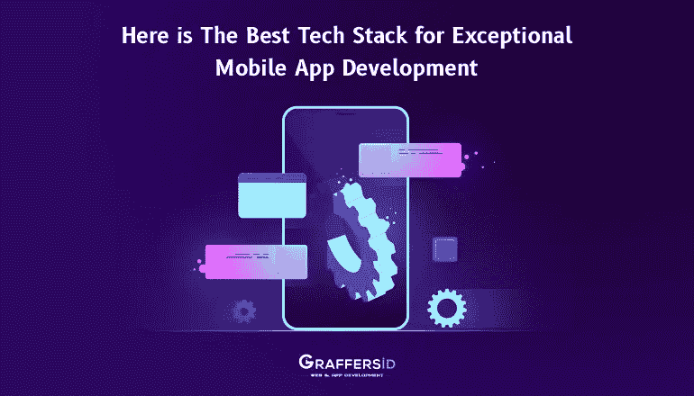

# 这里是卓越的移动应用程序开发的最佳技术栈

> 原文：<https://medium.datadriveninvestor.com/here-is-the-best-tech-stack-for-exceptional-mobile-app-development-5a614875f2c9?source=collection_archive---------12----------------------->

BI 将想法付诸实施，吸引目标用户，并推动利润增长。难道应用程序的开发不仅仅是一项艰巨的任务吗？

开发人员努力开发具有挑战性的应用程序，以吸引精通技术的一代；然而，在大多数情况下，他们的产品会因为技术堆栈的错误选择而适得其反。

移动市场的竞争正在上升到一个新的水平，用过时的技术栈开发令人讨厌的、有问题的应用程序是一个坏主意。这不仅会损害公司的声誉，还会让你的竞争对手得逞。

 [## 2019 年移动应用开发之路|数据驱动的投资者

### 任何在移动应用程序开发行业工作的人，无论他们是专注于在伦敦开发 iOS 应用程序还是…

www.datadriveninvestor.com](https://www.datadriveninvestor.com/2019/01/15/the-path-of-mobile-app-development-in-2019/) 

为了避免对您的品牌价值造成任何危险并提供出色的体验，为移动应用程序开发选择正确的技术组合至关重要。正确的技术堆栈不仅会赋予您的项目生命力，还会使其具有可扩展性并符合功能要求，除此之外，明智选择的技术堆栈还会降低移动应用开发的成本并缩短开发时间。

您可以选择以下顶级技术堆栈来创建高质量的应用程序:

**原生应用开发**

原生应用程序开发包括使用特定于平台的软件开发工具包、编程语言和操作系统供应商提供的其他工具。因此，构建原生应用程序需要您为每个应用程序采用单独的移动应用程序开发技术。像 Pokemon GO 和 Lyft 这样的流行应用程序利用了原生方法。

**2020 年 iOS 应用的技术堆栈**

这是一个用于构建原生 iOS 应用的移动应用技术栈

**编程语言**

**目标 C**

Objective C 基于 C 语言，是一种高级语言，在 Swift 出现之前为构建 iOS 应用程序而开发。C 语言的这个超集被几家应用程序开发公司用来为 Mac、iPad、iPhone、Apple Watch 和更多设备构建应用程序。

使目标 C 成为可靠选项的一些原因是:

*   私有 API 的简单使用
*   与 C++的兼容性
*   大量的社区支持
*   大量第三方库
*   高度认可
*   苹果技术简单易用

**雨燕**

Swift 是一种广泛用于构建顶级 iOS 和 OS X 应用程序的编程语言，是一种多范式开源语言。Stack Overflow 最近的一项调查显示，Swift 是专业开发人员社区的首选语言。

以下是 Swift 成为关注焦点的几个原因:

*   更快更好的性能
*   符合目标 C
*   多设备支持
*   动态库
*   积极的社区支持
*   安全且不易出错。

**工具包:苹果 Xcode:**

如果你使用 Swift 作为开发原生应用的编程语言，那么你将需要 Apple Xcode 作为工具包。Apple Xcode toolkit 提供的全功能开发环境让您可以创建移动和桌面应用程序。Xcode 附带了检测和调试工具、对 Git 存储库的集成支持、用于构建用户界面的图形编辑器以及集成文档。

**SDK: iOS SDK**

iOS SDK 包括一个 API，作为软件应用程序及其平台之间的链接。API 可以通过多种方式构建，并且包含有用的编程工具。

**2020 年 Android 应用的技术堆栈**

这是用于构建原生 Android 应用的移动应用技术栈

**编程语言:Java**

对于 Android 应用程序开发来说，Java 总是排在首位。Java 是一种面向对象的编程语言，它提供了丰富的库和工具，使得编写高质量的移动应用程序变得容易。以下是 Java 成为制作 Android 应用程序的首选语言之一的一些原因:

*   便携且可扩展
*   高度安全
*   自动内存管理
*   多线程能力
*   庞大的开源支持生态系统。

**编程语言:科特林**

与 Java 相比，Kotlin 是新的，于 2011 年问世。这种语言是一个完美的解决方案，结合了简单和强大。

Kotlin 不仅是一种流行的 OOP 语言，而且支持高阶函数和 lambadas。它提高了速度，使执行日常开发任务变得更加容易。

以下是使用 Kotlin 的好处:

*   语言简洁而安全
*   扩展功能
*   多平台
*   活跃社区
*   有助于减少 bug。

**工具包:Android Studio 和 Android 开发者工具**

Android Studio 带有性能工具、代码编辑、灵活的即时构建/部署系统。它帮助您构建高质量和独特的应用程序。

Android Developer Tools 提供了特定于 Android 的编码支持，并允许开发人员使用仿真器、图形用户界面构建器、设备上调试工具和可脚本化的测试自动化支持。

**SDK:安卓 SDK**

Android SDK 使用可以单独下载的组件。第三方加载项也可供下载。

苹果和谷歌都为应用开发者提供界面元素、开发工具和 SDK。

**跨平台 App 开发**

这种方法意味着开发一个可以在多种移动平台上完美使用的移动应用程序。跨平台方法允许开发人员使用单个代码库构建应用程序，该应用程序可以同时在不同的平台上运行。

**React Native+Javascript:**

React Native 是一个 Javascript 框架，用于编写在 Android 和 iOS 上看起来都是本机的移动应用程序。React Native 使用与 Android 和 iOS 应用相同的基本 UI 构建块。

React Native 引入了一种全新的、功能强大的方法来构建用户界面。使用 React Native，您的应用程序逻辑是用 Javascript 编写和运行的，应用程序用户界面完全是本机的。Skype 和 Instagram 就是这类应用的完美例子。

您还可以使用 Typescript 语言来构建跨平台的应用程序。在编写 React 组件时，Typescript 提供了快速、简单的错误检测功能。泛型组件在 TypeScript 工具箱中非常有用。当收紧反馈回路、编写组件并帮助您快速找到错误时，它们提供了额外的安全级别。

**Xamarin+C#**

Xamarin 是一个跨平台移动应用开发工具，它使用 C#作为跨平台开发的主要语言。C#是一种静态类型语言，具有 IDE 支持和成熟的工具。用 C#编写的应用被交叉编译成原生的 iOS 和 Android 二进制文件。甚至可以使用 C##代码和特定于设备的 API 中的功能。比如 Slack 和 Pinterest 这样的应用，都是用 Xamarin 搭建的。

**混合应用开发**

混合应用程序开发利用了 HTML5、CSS 和 Javascript 等 web 技术。共享的

**2020 年混合应用的技术堆栈**

跨平台应用程序开发有一个不同的框架。以下是其中的几个例子:

**科尔多瓦/PhoneGap:**

Apache Cordova 是一个开源框架，主要用于运行基于 Javascript 的应用程序。本地设备功能通过基于 HTML 的应用程序和 JavaScript APIs 公开，因此可以访问特定于设备的功能，如相机和传感器。

开发人员主要依靠 CSS 和 HTML 来构建用户界面，因为 PhoneGap 支持 Angular JS、jQuery 和 Knockout.js 等库。

在使用 Cordova 时，开发人员不仅仅依赖 HTML 和 CSS 来构建用户界面，因为它支持许多框架和库，如 Angular JS、jQuery 和 Knockout.js。

**离子:**

Ionic 是一个基于 Angular JS 的框架，这就是为什么它用一个著名的框架支持社区，并分享一整套优势。Ionic 还很好地实现了使混合应用程序具有本机外观的关键能力。

有了 Ionic，你只需要设计一个应用一次，就可以跨 Android、iOS、Windows 设备部署。使用 Ionic 的主要优势包括:

*   支持稳健的开发
*   无需从头开始编写所有代码
*   几个现成的插件
*   角度兼容
*   参与社区

**结论:**

上述是移动应用程序开发的趋势技术栈。您可以选择最符合您的愿景和项目需求的方案。明智的选择不仅会在网络世界占据主导地位，还会帮助你登上月球。

最初发布于:[https://graffers id . com/technology-stack-for-mobile-app-development/](https://graffersid.com/technology-stack-for-mobile-app-development/)