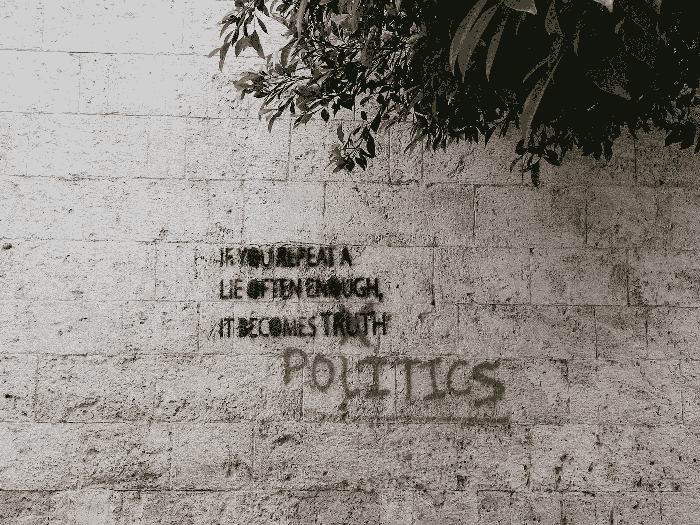

# 又来了。美国人已经受够了这个烂摊子。

> 原文：<https://medium.datadriveninvestor.com/here-we-go-again-americans-are-done-with-this-mess-b6509bae9584?source=collection_archive---------8----------------------->

## 我们是后暴行时代。

Photo by [Brian Wertheim](https://unsplash.com/@brianwertheim?utm_source=unsplash&utm_medium=referral&utm_content=creditCopyText) on [Unsplash](https://unsplash.com/s/photos/politics?utm_source=unsplash&utm_medium=referral&utm_content=creditCopyText)

“又来了，”我想。

几年前，我的一些同事为我和我的配偶筹集了一些钱。我们期待着一个孩子。他们试图在一次会议上给我，装在一个小包里，里面有一些购物卡和新生儿的衣服。

我的老板不喜欢这样。

他从我手里抢过包，然后站在房间前面。他做了一次演讲，讲述了我对这个部门有多重要，以及每个人——尤其是他——是如何参与进来的。

然后他把它呈现给我，好像是他自己缝的衣服。他让我做了一个小小的获奖感言。

整件事很尴尬。

后来我发现他其实什么都没贡献。一毛钱都没有。至少，这是人类行为中很有价值的一课。他一直做这种事，我终于学会了期待。

让你想起谁了吗？

# 我们没什么好说的了。

当唐纳德·特朗普(Donald Trump)在圣诞节前几天站在摄像机前，威胁要否决花了 9 个月时间才敲定的刺激计划时，我们无话可说。

任何有脑子的人都知道是怎么回事。这是另一个游戏。这是“又来了”的一个版本

而且不仅仅是川普了。

是他们所有人。

我们对政府的信任度已经降到了历史最低点。这使它又降了一级，但它真的不会变得更糟了。我们不确定民主党人是否能做得更多，但他们这些天确实似乎吃亏了。他们似乎总是让鲨鱼吃我们的午餐。问一个仅存的还有点理智的美国人，他们会耸耸肩，告诉你他们不再在乎了。

现在总是*有事*。

我们已经厌倦了。

# 我们生活在可能的土地上。

我们的政府不再运作了。

大家都知道。

我们只能靠自己了。我们*已经*待了大约一年了。不，我们还没有把树枝削成长矛和猎杀松鼠，但是我们知道人类善良的极限。它没有灭绝，但肯定濒临灭绝。对于那些还没有失去同理心的人来说，他们现在只是太累了，除了自己最亲近的亲人之外，无法照顾任何人。

你能责怪他们吗？

其他一切都是掷硬币。当然，仍有一些机构活力，但已经不多了。T4:也许你可以得到一些失业救济金。也许你会得到粮票。也许你的邮件会准时到达，由一个筋疲力尽的邮递员送到你的手中。也许你会找到一份有健康保险的工作。事实是，10 年或 15 年前所有感觉像权利和保障的东西都不见了。

任何今天拥有任何东西的人都是极其幸运的。

我们中的一些人甚至不知道。

 [## 全民或跨州的国营保险私人医疗保险:经济学…

### 我们目前生活在一个所有非医疗行业都痴迷于…

www.datadriveninvestor.com](https://www.datadriveninvestor.com/2020/05/21/state-run-insurance-for-all-or-across-the-state-lines-private-healthcare-coverage-economics-politics-social-mix-up/) 

# 我们的政客不关心我们。

这真的需要再说一遍吗？

我们差不多该停止迷恋马戏表演了。我们的政客现在轮流哗众取宠。这就是他们所做的一切。

一切都是为了邀功和指责对方。他们不在乎过程中谁会受伤。他们花在推特上的时间比实际协商任何事情的时间都多。

我们似乎鼓励它。

# 很多美国人都在自动回复。

几天前，我写了一篇文章，讲述了千禧一代如何努力过上体面的生活，尽管他们既有全职工作，也在兼职从事一些行当。千禧一代不是唯一在应对不可救药的经济的人，但我们是不成比例的大多数。

在这些回复中，像这样的东西很突出:

> 停止抱怨，走出去，为你自己的处境做点什么。

现在这种事经常发生。那种想法很正常。像这样的美国人处于自动反应状态。

他们不读书。他们不听。

当他们听到别人的挣扎时，他们会认为是他们的错。就像我们的领导，他们就是不在乎。

他们想哗众取宠。

# 我们已经习惯了功能障碍。

我们不再对任何事情感到惊讶。

我们不再期待刺激计划这样的事情了。我们预计会有更多的坏消息和困难。当我们听到新的超级 Covid 变体即将出现时，我们耸耸肩。我们说，“这是必然的。”

这就是现在的生活，等待下一个负担。与此同时，我们尽可能地享受这一点点时光。

我们已经放弃招募任何人戴面具。我们不再试图对我们的对手使用逻辑或理性。我们在保护自己，和少数我们关心的人。

我们只能这样了。

# 刺激的时代已经结束。

这种刺激总是一个笑话。

我们的政府就像我们打了败仗后出现的骑兵。看，我们*输了*与 Covid 的战斗。它赢了。它正在掠夺美国的每一个城镇。我们生病了。我们很害怕。我们失业了。

我们的托儿所已经关门了。我们的老师和医护人员已经筋疲力尽了。他们中的许多人正计划离开。我们只是在等烟雾散去。

# 我们不是放弃生活，只是帮助。

我们只是放弃了政府。我们知道发生了什么。我们将被期望在没有*任何*那种会有所不同的帮助的情况下抚养我们的孩子并保住工作。

我们一直在做这件事。

我们要对自己的健康负责，无论是精神健康还是其他方面。我们只需要确保在明年或后年的任何时候，我们都不会病到需要医疗护理的地步。

那也不是新闻。

# 我们受够了愤怒。

总会有大多数人喜欢大喊大叫和哗众取宠。众所周知，很多美国人更喜欢确保彼此毁灭。

然后是美国，少数几个看着这一切的人越来越冷漠。我们看到了愤怒带来的好处。这改变不了什么。它只会消耗我们宝贵的能量。

我们玩完了。

帮我们，或者不帮我们。我们很久以前就不再等待了。我们知道我们唯一能做的就是自救。我们可以帮助少数人，但我们不能拯救所有人。这让我们有些苦涩，但并不愤怒。尽管如此，我们仍然可以表达我们的失望。

# 我们的领导就像我的老板一样。

他们会从你手里偷走一些东西，只为了发表一篇演讲，然后把它像珍贵的礼物一样还给你。收下你的“礼物”，但你不必说谢谢。他们还没有赢得它。

差远了。

## 访问专家视图— [订阅 DDI 英特尔](https://datadriveninvestor.com/ddi-intel)