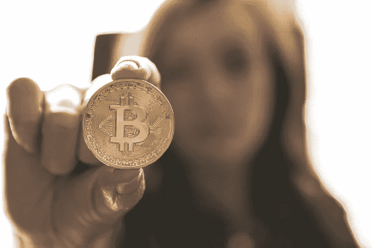

# 比特币又来了

> 原文：<https://medium.datadriveninvestor.com/here-we-go-again-with-bitcoin-b4b8ec09d079?source=collection_archive---------9----------------------->

我们以前看过这个故事吗？

Image By: Andre Francois McKenzie, Unsplash

前几天，我收到了一封电子邮件，邮件来自我与之打交道的一家银行，内容是关于比特币的再次兴起。它说:“*比特币今天早上达到历史新高，达到 30，000 加元，或 23，446 美元*”

哎呀，我的 10 英尺消毒杆在哪里？是的，在这个价格上我不会碰比特币。

邮件继续写道:“*这可能很难相信，但如果你在 2010 年 3 月只投资 5 美元到比特币，它现在会价值约 5000 万美元。是的，你没看错*。”

对于那些关注比特币阵痛的人来说，你会知道，2017 年 12 月，比特币触及 19783 美元的高点，然后像井里的石头一样下跌，到 2018 年 2 月，仅过了短短 3 个月，就触及 6200 美元的低点。如果你当时买入了比特币，并购买了价值 10 万美元的比特币，你将会购买 16 个比特币。根据今天 30，000 加元的价值，这 16 枚硬币今天的价值为 480，000 加元。鉴于 2018 年底部下跌时发生的事情，这是一个非常好的卖出时机。

过去 10 年，比特币经历了比网飞任何东西都多的戏剧性事件。

Image By: Pricsilla Du Preeze, Unsplash

该银行的电子邮件中还提到了以下内容:“*尽管争论将会继续，比特币将会像过山车一样继续涨跌，但比特币已经存在了 10 多年，永远只会有 2100 万枚*。”

一个问题是。我们怎么知道会有 2100 万个比特币？谁在做这种断言？银行吗？我表示怀疑。据称是比特币幕后黑手的人？没有。他甚至不承认自己是创始人，更不用说透露自己的真名了。中本聪是第一个开发比特币的人使用的笔名。许多人声称或已经声称是他，但迄今为止，这个人仍然笼罩在神秘之中。在这个 [**网站**](https://www.investopedia.com/tech/what-happens-bitcoin-after-21-million-mined/#:~:text=Bitcoin%20also%20has%20a%20stipulation,one%20block%20every%20ten%20minutes.) 上有一些关于比特币这个上限的有趣猜测。出现的尖锐问题；**比特币的协议有没有可能被改变，以允许更大的供应量？**有趣的问题。

 [## 稳定币会危及比特币在加密领域的地位吗？数据驱动的投资者

### Stablecoin 是一种加密货币，主要用于维持稳定的市场价值。它可以通过…

www.datadriveninvestor.com](https://www.datadriveninvestor.com/2020/06/08/can-a-stablecoin-jeopardize-the-position-of-bitcoin-in-the-crypto-space/) 

不管你在硬币的哪一面(抱歉双关语)；无论赞成还是反对，请记住，比特币是一种波动性很大的货币，至少应该被视为投机性的。问问任何真正的投资专家的意见，他们会建议你投资组合中投机类的比例不要超过 10%。

考虑以每股 3 万美元的价格买入比特币？考虑到短短两年前发生的大规模崩盘，问问自己这种回报是否值得冒险。

如果你对这个帖子有任何意见、异议或其他信息，请通过**媒体**或通过我的 [**网站**](http://www.handshakeconsultants.com/) 联系我。

关注我上 [**TWITTER**](https://twitter.com/Handshake2015) **，**[**FACEBOOK**](https://www.facebook.com/michael.trigg.773)&[**LINKEDIN**](https://www.linkedin.com/in/handshakeconsultants/)。

## 获得专家观点— [订阅 DDI 英特尔](https://datadriveninvestor.com/ddi-intel)