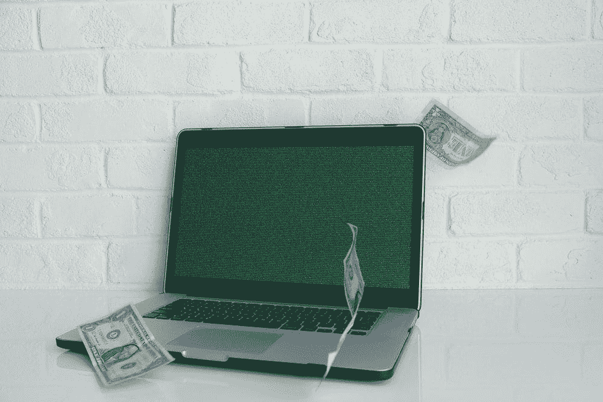

# 帮助你节省更多钱的 5 个小贴士

> 原文：<https://medium.datadriveninvestor.com/heres-5-tips-to-help-you-save-a-little-bit-more-money-6936e4f51570?source=collection_archive---------15----------------------->

每个人都想赚越来越多的钱，但有时，人们没有意识到的是，你可能只需要多存一点点。

Photo by [Michael Longmire](https://unsplash.com/@f7photo?utm_source=unsplash&utm_medium=referral&utm_content=creditCopyText) on [Unsplash](https://unsplash.com/s/photos/money?utm_source=unsplash&utm_medium=referral&utm_content=creditCopyText)

存钱是很重要的，这是我们大多数人从小就被告知要做的事情，但我们大多数人实际上不知道如何去做。

在这里，我将分享我学到的 5 个技巧，帮助我在月底多存一点钱。

## 1.量入为出。

如果你想省钱，你需要想出一个办法，要么赚更多，要么花更少。

理论上，这听起来很容易，对吗？不是，但也没那么难。你看，你只需要找出一个适合你的系统。

那么，**活在你的手段**下面到底意味着什么呢？这意味着你将不得不做出选择和牺牲，你不能仅仅因为某个家庭成员，或者朋友，甚至一个完全陌生的人(社交媒体的影响)买了它，就到处去买你看到的所有东西。你需要把这种想法从你的脑海中抹去，你需要买那些你并不真正需要也不会让你开心的东西，只是因为你最喜欢的“*影响者*”告诉你这么做。

你需要专注于对你来说真正必不可少的东西，比如房租、食物、医疗保险等等，然后想办法不把剩下的钱花在一些愚蠢的事情上，去打动那些并不真正关心你的人。

# “我们用不需要的钱买我们不需要的东西，我们不必给我们不喜欢的人留下深刻印象。”—戴夫·拉姆齐

接下来的 4 个话题，会让你对如何在月底节省更多的钱有更好的认识。记住，省钱只取决于你和你的意志力。

## **2。自动化流程。**

眼不见，心不烦，对吗？嗯，不完全是那样，但是当涉及到钱的时候，这个谚语是 99.99%准确的。

Photo by [NeONBRAND](https://unsplash.com/@neonbrand?utm_source=unsplash&utm_medium=referral&utm_content=creditCopyText) on [Unsplash](https://unsplash.com/s/photos/matrix?utm_source=unsplash&utm_medium=referral&utm_content=creditCopyText)

你看，大多数人拿到工资后，马上就开始花钱，房租、保险、食物、衣服、账单，应有尽有。当他们拿到下一份薪水时，他们意识到他们根本没有存下任何钱。

即使当我们说一拿到钱就要存 10%或 15%的时候，当我们最终看到所有的钱都在我们手里时，我们会立刻把消费习惯放在储蓄之前。这就是为什么我们要努力遵循沃伦·巴菲特所说的:“*不要把花完剩下的存起来，而是把存完剩下的花掉。*”。因此，你能做的最好的事情，就是设置你的银行账户，把你工资的一定比例(10%，15%，20%……你觉得合适的任何比例)转移到一个单独的储蓄账户，并且每个月自动完成。这样你甚至看不到钱，所以根据人类的本性，你甚至不会去想它。

## 3.有目的的节约。

我们经常听到这样的话，但它意味着什么呢？这意味着，仅仅因为有人告诉你要存钱，就去存钱并不是一个明智的策略。

在我们开始存钱之前，我们需要告诉我们的大脑我们为什么要这样做。首先，如果你没有足够支付 6 到 12 个月费用的应急基金，那应该是你唯一的目的。不管你对自己的工作和薪水感觉有多好，你都应该(我再重复一遍)，至少存下 6 个月的个人开销。

在你完成了第一点之后，你需要为你继续存钱制定一个计划。每个人都知道把钱藏在床垫下不是一个明智的决定，但是把所有的钱都存在银行里也不是一个好主意。最好的情况是，银行每年给你 0.2%的利息，所以从理论上讲，由于通货膨胀(大约每年 1.8%)，你每年仍会亏损。

那么，你应该怎么做呢？

我们大多数人都不是真正的投资大师(就像你在 Instagram 上看到的那些)，所以最好的选择是定期向低成本的标准普尔 500 指数基金(例如 VOO)付款。这样，你就不需要做投资者必须做的所有无聊的工作，但你仍然能够反映标准普尔 500 指数，该指数在过去 60 年中每年产生约 8%的收益。

Photo by [Micheile Henderson](https://unsplash.com/@micheile?utm_source=unsplash&utm_medium=referral&utm_content=creditCopyText) on [Unsplash](https://unsplash.com/s/photos/money?utm_source=unsplash&utm_medium=referral&utm_content=creditCopyText)

如果你能承担更多的风险，你喜欢搜索和分析不同的公司，看他们的资产负债表和损益表，你可以选择个股，但请记住，这是更高的风险。所以，如果你真的在考虑走投资者的道路，我建议你做的是，把你储蓄的 50%投入标准普尔 500 指数基金，另外 50%投资个股，但记住，你不应该把所有的鸡蛋放在同一个篮子里。

如果你制定了一个省钱的策略，并把它和一些目标结合起来，你会发现把那 5 美元放在口袋里比去买星巴克咖啡要容易得多。

## **4。用现金，不要借记卡！**

对你们中的一些人来说，这可能有点奇怪，但相信我，当你想在月底存一点额外的现金时，如果你使用真正的现金而不是借记卡或信用卡会有帮助。

Photo by [Jessica Lewis](https://unsplash.com/@thepaintedsquare?utm_source=unsplash&utm_medium=referral&utm_content=creditCopyText) on [Unsplash](https://unsplash.com/s/photos/10-dollars?utm_source=unsplash&utm_medium=referral&utm_content=creditCopyText)

这是为什么呢？

这是因为当你看到钱从你手里出来时，你会比从你的卡里出来时更珍惜它。

让我们来看看这个例子:今天是星期天，你去商场，你并不真的需要买什么，但你到了那里，开始看商店，突然你觉得至少需要买一样东西。如果你的支票账户上有 1000 美元，并且只使用借记卡。你看到一双价值 90 美元的漂亮鞋子，然后一条价值 60 美元的漂亮牛仔裤，然后一件价值 30 美元的酷 t 恤，最后，你路过一家星巴克，花 10 美元买了一杯咖啡和一个松饼。把所有这些加起来，你就在几个小时上花了 190 美元。

现在，同样的例子，你的支票账户上有 1000 美元，但你不是只使用借记卡，而是去 ATM 机提取 50 美元，这就是那个星期天下午你能花的全部。你买了同样 30 美元的 t 恤，在星巴克花了同样的 10 美元。你没有用卡消费 190 美元，而是只花了 40 美元现金。这样你就可以在你的储蓄账户上存 100 美元，在你的假期储蓄罐里存 50 美元。

这个例子对你们中的一些人来说可能有点奇怪，但是当你开始只用现金买东西时，你会开始更加重视你的钱，你会开始对你的消费习惯做出更明智的决定。

如果你不相信我，试几个月，然后告诉我效果如何。

## 5.预算！预算！预算！

最后但同样重要的是，你需要一个预算。我再说一遍，以防你没看副标题:**你需要预算！**

有趣的是，我们很容易记录生活中的一切，如“我们一天吃了多少卡路里”，“我们跑了多少英里”，“我们在学校得了多少个 A”，你明白这一点，但当涉及到钱时，出于某种神秘的原因，我们不喜欢记录它。

如果你想在月底多存一点钱，你需要知道你可以增加哪些收入来源，减少哪些开支，而知道所有这些的唯一方法就是使用预算。不是心理预算，而是在电子表格上写得很好的预算。

Photo by [Adeolu Eletu](https://unsplash.com/@adeolueletu?utm_source=unsplash&utm_medium=referral&utm_content=creditCopyText) on [Unsplash](https://unsplash.com/s/photos/money-computers?utm_source=unsplash&utm_medium=referral&utm_content=creditCopyText)

你需要打开一个 Excel 电子表格，开始输入你一个月挣多少钱，以及这些钱来自哪里。然后你需要列出那个月你所有的花费。这样，下个月开始的时候，你可以很容易地发现你把大部分钱花在了哪里，并找到一种方法来削减它，或者至少减少它。

这看起来没什么大不了的，但请花点时间想想世界上的每一家公司。你想知道他们如何跟踪他们所有的收入来源、支出，以及他们必须投资多少钱等等？你猜对了:他们使用预算。

我希望这能帮助你们中的一些人，记住，你不需要把你生活中赚的所有东西都存起来，尽可能过得节俭。你只需要在你的消费习惯上做一些调整，随着时间的推移，你会发现，在应用这 5 个原则的同时逐渐省钱会比你实际想象的要容易得多。