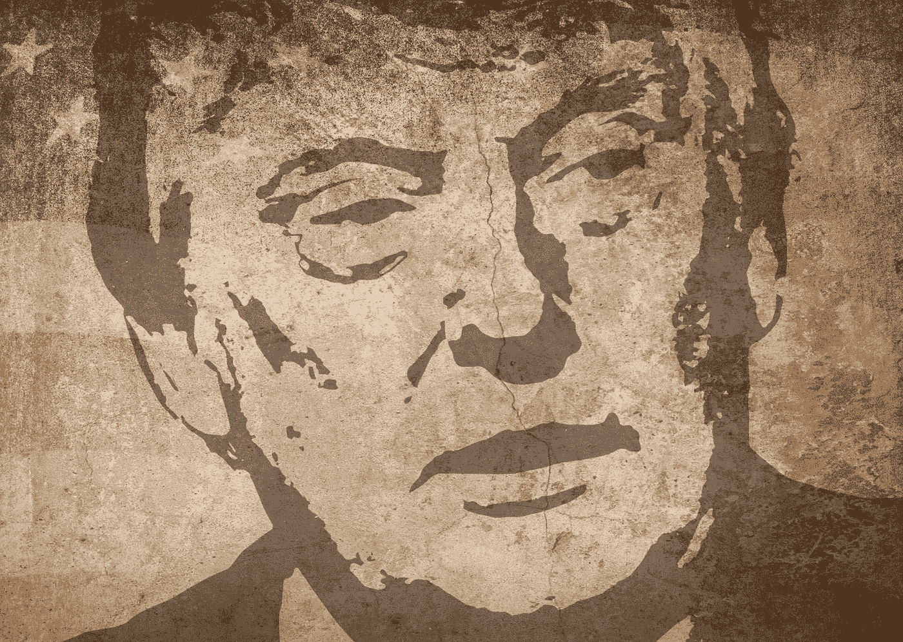

# 这是一个特朗普已经通过的测试

> 原文：<https://medium.datadriveninvestor.com/heres-a-test-that-trump-has-aced-2ae5b7a9b572?source=collection_archive---------1----------------------->

## 这不是他一直吹嘘的那个

在最近福克斯新闻频道对资深记者克里斯·华莱士的采访中，[被誉为“如何不让特朗普逃脱他一贯的胡说八道的大师级人物”，唐纳德·特朗普吹嘘说](https://youtu.be/5c0xkgX4itQ)[以如此出色的成绩通过了认知测试](https://www.washingtonpost.com/politics/trump-bragging-cognitive-test-dementia/2020/07/22/6578e826-cb65-11ea-91f1-28aca4d833a0_story.html),以至于医生们都感动地告诉他——在测试的中途，因为，嗯，只是*等不及了——他的回答给他们留下了多么深刻的印象。为什么不呢？他的超级英雄技能被发现不仅仅包括纯粹的谎言和犯罪欺诈。根据特朗普的说法，他的精神敏锐度超过了正常功能成年人认知范围内的普通人。*

测试是两年前的事了。

“这不是最困难的考验，”华莱士对特朗普不明智的吹嘘做出了明显的轻蔑回应。“他们有一张照片，上面写着，‘那是什么？’它是一头大象。"

与椭圆形办公室现任主人的这种怀疑的交流为深夜电视节目提供了无尽的素材，也为才华横溢的莎拉·库珀提供了无尽的素材。但是是史蒂芬·科拜尔清楚地指出了其令人不安的背景。

“令人不寒而栗，”科尔伯特宣称，“看到世界上最有权力的人吹嘘他通过了一项测试，这项测试是为了了解人们是否应该被允许自己乘坐公交车。”

事实上，医学和公共卫生专家强调，特朗普一直提到的认知测试是 [*而不是*智商的指标](https://www.washingtonpost.com/politics/trump-bragging-cognitive-test-dementia/2020/07/22/6578e826-cb65-11ea-91f1-28aca4d833a0_story.html)，以至于[似乎认为是](https://www.cnn.com/2020/07/23/politics/donald-trump-cognitive-test-montreal-mental-health/index.html)。但在特朗普的世界里，随意将事实混为一谈纯粹是一种不便——在这种情况下，可以用事实作为棍棒，在竞选广告中痛击“昏昏欲睡的乔·拜登”，或在政治辩论中奚落他。特朗普再次依靠表演而非实质来赢得 2020 年大选。因为没有人比唐纳德·特朗普(Donald Trump)更擅长在自己头脑的空旷音乐厅里自吹自擂，所以上周三晚上他又出现在那里，试图用自己的认知敏锐度给无知的人留下深刻印象。

 [## 尚未展开的政治辩论|数据驱动型投资者

### 《纽约时报》在 2020 年 6 月 3 日在线发表了阿肯色参议员汤姆的一篇专栏文章后，受到了很大的关注…

www.datadriveninvestor.com](https://www.datadriveninvestor.com/2020/06/08/the-political-debate-that-has-not-been/) 

“他们说，‘太神奇了。“你是怎么做到的，”我这样做是因为我的记忆力很好，”特朗普取悦了福克斯新闻频道的马克·西格尔博士，比 T7 博士或真正的记者更谄媚因为我在那里认知。"

这对纽约南区来说无疑是个好消息。他们管辖范围内有一系列针对特朗普的刑事指控，涉及他的生意、竞选、就职和总统任期。根据特朗普自己关于他“稳定的天才”的遗嘱，对于他多年的涉嫌犯罪活动，能力下降的抗辩将不会被考虑。

无论如何，没有一个严肃的心理医生会对唐纳德·特朗普受到的明显的认知和身体衰退提出异议。事实上，[许多人认为](https://meaww.com/trump-is-not-well-frontotemporal-dementia-walter-reed-hospital-visit-spark-twitterati-speculation)他患有额颞叶痴呆，和折磨他父亲的疾病一样。他[似乎无法](https://www.snopes.com/fact-check/donald-trump-sentence/)现在[在一个美好的日子里，除了两个简短的句子之外，传达](https://www.alternet.org/2020/07/trump-stuns-observers-as-his-press-conference-goes-off-the-deep-end-self-destruction-of-the-president/)一系列连贯的有意识的思想。最多三个。或许，小唐纳德对这类事情比平时更敏感。毕竟，美国总统并不经常被自己的侄女公开揭露心理障碍、说谎者、骗子、小偷以及智力贫乏——甚至在年轻时也是如此。

“为了对冲他的赌注，”玛丽·特朗普在她的新《家庭大揭秘》中写道，“他让乔·夏皮罗(Joe Shapiro)替他参加 sat 考试，夏皮罗是一个聪明的孩子，以擅长考试而闻名。在照片身份证和电脑记录出现之前，这要容易得多。从不缺钱的唐纳德给了他的伙伴很多钱。

唐纳德一直在吹嘘他的学术实力，这让他被沃顿商学院录取——这一说法仍然没有得到证实。他的前私人律师兼调解人迈克尔·科恩作证说[曾写信给特朗普的母校](https://time.com/5540152/donald-trump-michael-cohen-academic-records/)，威胁说如果特朗普的任何文字记录被公开，他将采取法律行动。

但是为什么要继续谈论关于美国总统的品格和正直的鸡毛蒜皮的小事呢？撇开这些讨厌的事实不谈，我想让特朗普和他的崇拜者放心，有一个测试*亲爱的领袖真的通过了，我的计算是 100%的记分卡:煽动者气味测试。*

我们来算一下，好吗？

1.  他/她会点燃激情吗？是/否
2.  他/她会让团队对立吗？是/否
3.  他/她对复杂的问题有简单的答案吗？是/否
4.  **他/她是否鼓励针对对手的暴力行为？是/否**
5.  **他/她是否建议酷刑和非法战争？是/否**
6.  他/她提议大屠杀和种族灭绝吗？是/否
7.  他/她是否承诺解决问题？是/否
8.  **他/她会把问题的原因归咎于某些团体、宗教或国家吗？是/否**
9.  **他/她是否有** [**浮夸的性格**](http://www.nytimes.com/2015/09/06/opinion/the-narcissist-in-chief.html) **的风格？是/否**
10.  **他/她是否具有** [**专制型人格风格**](https://www.psychologistworld.com/influence_personality/authoritarian_personality.php) **？是/否**
11.  他/她喜欢欺负人吗？是/否
12.  他/她是否忽略了基本的礼节？是/否
13.  **他/她是否像希特勒使用的** [**褐衫**](http://www.theholocaustexplained.org/ks3/the-nazi-rise-to-power/how-did-nazis-gain-power/the-role-of-the-sa/#.VvG-sD_dl6w) **一样使用私人保安部队？是/否**
14.  他/她是否对规则和法律表现出不耐烦？是/否
15.  **他/她是否经常撒谎、捏造事实、夸大事实？是/否**
16.  他/她是否经常用粗暴的攻击来侮辱批评者和反对者？是/否
17.  他/她是否在“幕后”做一些与公众形象和公开宣称的价值观相反的事情？是/否
18.  他/她是否以一种戏剧性的方式说话，旨在煽动愤怒、激起激情和赢得忠诚？是/否

**等级:A+**

特朗普赢得 2016 年大选后不久，当我第一次在[为《赫芬顿邮报》](https://www.huffpost.com/entry/the-rise-of-a-demagogue-while-americas-eyes-are-wide_b_58313aa1e4b0eaa5f14d463a)发表题为“美国大开眼界之际一个煽动家的崛起”的文章时，用于识别危险煽动家的 18 项标准中只有 16 项已经适用于唐纳德·特朗普。第 6 条和第 13 条标准还不适用。

**然而，川普的蓄意，** [**刑事过失**](https://www.vox.com/2020/6/8/21242003/trump-failed-coronavirus-response) [**冠状病毒反应**](https://www.washingtonpost.com/politics/2020/04/07/timeline-trumps-coronavirus-response-is-increasingly-damning/) **，其中已经遗留下** [**15 万美国人死亡**](https://ncov2019.live/) **，现已封存 6 号。更准确地说，他犯有灭绝种族罪——“由于政府的犯罪疏忽和疏忽行为造成大量死亡”**

**他咄咄逼人地部署“** [**秘密警察**](https://www.washingtonpost.com/opinions/2020/06/09/dangerous-rise-anonymous-cops/) **”以平息华盛顿特区的第一修正案权利，随后，波特兰、俄勒冈州，当然也会检查标准 13**。否则，如何将那些身穿防暴服、没有可识别标志、拒绝表明身份、使用催泪弹和闪光弹来帮助他们残暴对待行使和平集会合法权利的公民的所谓“联邦官员”归类呢？以前，这种现象只在美国人喜欢归类为“香蕉共和国”的地区或独裁政权中出现过，而不是在美国本土。

Police at protests across the U.S. are hiding their badge numbers, names, and other forms of identification, making it even harder to hold officers accountable for violence and misconduct.

此外，让我们搞清楚第 6 条标准。美国现在是全球冠状病毒的中心，疫情已经没有随机悲剧了。从一开始，特朗普为了“经济”和他的连任竞选的种族灭绝议程就很清楚。世界将永远见证特朗普阿谀奉承崇拜的恐怖，包括得克萨斯州副州长丹·帕特里克在内，[提议](https://www.vanityfair.com/news/2020/03/dan-patrick-coronavirus-grandparents)老年人——那些最危险的人——应该自愿牺牲以拯救经济。保守派电台主持人格伦·贝克[只是在愿意牺牲自己的孩子时才停下来](https://www.washingtonpost.com/nation/2020/03/25/coronavirus-glenn-beck-trump/)。事实上，特朗普的这个新政党(原名共和党)已经失去了任何道德权威来告诫那些它认为不那么正义的人“选择生活”。

就目前情况而言，我们的孩子现在没有被排除在为一场值得特朗普连任的集会而向股市之神献祭的人祭之外。特朗普蛊惑人心地坚持公立学校在秋季如期全面复课——而他的儿子[巴伦的私立学校肯定不会](https://www.nytimes.com/2020/07/23/us/politics/barron-trump-school-coronavirus.html)——是反社会的。在特朗普目前的政策下，学校将成为冠状病毒的震中。父母最终必须权衡他们的孩子成为“傻瓜”是否比死去更好。

“非常明确地说，”副总统迈克·彭斯[在 7 月初无耻地宣称](https://www.washingtonpost.com/politics/trump-administration-officials-downplay-guidance-from-health-experts-as-they-push-to-reopen-schools/2020/07/08/236a6c5e-c13b-11ea-b178-bb7b05b94af1_story.html)“我们不希望疾控中心的指导成为人们不重开学校的理由。”

疾病控制和预防中心(CDC)——美国国家公共卫生研究所——已经说得很清楚了。任何大型的面对面的聚会,“人们很难保持至少 6 英尺的距离，并且与会者来自当地以外的地方”,都为传播冠状病毒提供了最高的风险。这一警告已被明确纳入他们的学校重新开放准则。然而，特朗普政府空洞的借口是，美国的一切都像 7 月 4 日的苹果派一样正常。而且，通过[的强硬策略](https://www.washingtonpost.com/education/2020/07/25/confused-by-cdcs-changing-guidance-school-reopening-here-are-recommendations-experts-not-pressured-by-white-house/)，联邦政府控制的疾病控制中心似乎已经屈服了。抛弃的是任何科学驱动的客观性的幻想。他们的新[声明](https://www.cdc.gov/coronavirus/2019-ncov/community/schools-childcare/reopening-schools.html)？"今年秋天重新开放美国学校的重要性."

美国顶级免疫学家、国家过敏和传染病研究所主任安东尼·福奇[一直毫不含糊](https://www.statnews.com/2020/06/30/u-s-could-see-100000-new-covid-19-cases-per-day-fauci-says/):川普的不变轨迹可能会导致每天多达 10 万例新冠肺炎新增病例*。最坏的情况预测将 1 . 6 亿到 2 . 14 亿美国人置于疫情感染的危险中，并估计有 20 万到 170 万人可能死亡。*

然而，几个月来，特朗普故意无视 CDC 的指导方针。他坚决拒绝在基本卫生政策上以身作则，比如戴口罩，并公开拍拍他的共和党走狗的头，因为他们也这么做了。这一点，即使特朗普在他们州内的竞选集会创造了[感染中心](https://www.nytimes.com/2020/07/08/us/politics/coronavirus-tulsa-trump-rally.html)。尽管像佛罗里达州、得克萨斯州和亚利桑那州这样的州——它们的共和党州长不光彩地卑躬屈膝，通过保持经济开放来保持对他的好感——现在都争着创造每天死亡人数和重症监护室床位不可用的 T2 记录。尽管冷藏车在医院外面排起了临时停尸房的长队来处理过多的尸体。

此外，当采取适当行动的唯一一线希望来自政治上重要的摇摆州如密歇根州、明尼苏达州和威斯康星州的冠状病毒病例激增时，以及在那些被[特朗普的顾问归类为“我们的人民”](https://www.washingtonpost.com/politics/trump-not-solve-coronavirus-crisis/2020/07/26/7fca9a92-cdb0-11ea-91f1-28aca4d833a0_story.html)的人中，特朗普的联邦反应如何？

念道，“*白*人。”*老年*、*白人*、*宗教*、*种族主义*这些人很大程度上构成了特朗普的基础。

“这本来是可以阻止的。特朗普周四厚颜无耻地宣称:“这本来可以很快、很容易地被阻止。”。“但出于某种原因，它不是，我们会找出原因是什么。”

在最近的一篇文章中，我强调了这个疫情的一个明显趋势:到目前为止，越是白人的州，冠状病毒死亡人数越低，这可能解释了川普缺乏紧迫感。我还概述了为什么美国白人应该意识到他们也已经成为特朗普更大权力游戏中不可阻挡的棋子。我没有结巴。或许，这种曙光意识正在出现。

## 为什么煽动家比法西斯更坏

早在 2016 年 12 月，我就已经[明确地](https://medium.com/@donnakassin/the-fascist-barbarians-are-closer-to-the-gate-than-you-think-4a72bee349af)和[明确地](https://www.huffpost.com/entry/no-trump-is-not-insane-every-alternative-fact-is_b_587fc2a9e4b06a0baf64929c)为什么唐纳德·川普应该被认为是法西斯。事实上，2018 年 4 月，当前联邦调查局局长詹姆斯·科米将特朗普归类为“黑帮老大”时，我[特别指出](https://medium.com/@donnakassin/more-important-is-what-james-comey-didnt-say-in-his-abc-interview-5e842ecf0c56)科米**“避开了准确定义特朗普白宫散发的恶臭的 F 字:** [**法西斯主义**](https://en.wikipedia.org/wiki/Fascism) **。”事实上，我对那些油嘴滑舌的专家表示不屑，他们会以错误的新闻诚信关注科米的揭露。**

“暗示政治专家，”我写道，“他们会提供严肃的分析，声称要解构科米所说的话。不过，很有可能，这将是拐弯抹角的练习，这很不幸。因为文字很重要。”

一个月前，关于科米和他之前的其他人，如前国务卿雷克斯·蒂勒森所描述的白宫混乱，[我曾宣布](https://medium.com/@donnakassin/the-fascist-barbarians-are-closer-to-the-gate-than-you-think-4a72bee349af)， ***这种破坏稳定的混乱是新兴法西斯政权的特征。这不是在特朗普的白宫里随机发生的。***

因此，本周，我听到著名记者迈赫迪·哈桑[使用我在 2018 年使用的确切语言](https://medium.com/@donnakassin/more-important-is-what-james-comey-didnt-say-in-his-abc-interview-5e842ecf0c56)——就好像这是一些我们都应该聚集在一起听的新发现一样，我不太开心。

“我认为在美国，是时候了”哈桑在他的 MSNBC 独白中真诚地坚持道，“我们终于可以就脏话进行一次正式的对话了。不，不是那个——法西斯主义。”

正是这种平淡无奇的新闻伪装，表明我们现在落后于美国的曲线球有多远，促使我现在指出唐纳德·特朗普实际上比法西斯主义者差得多——他是一个煽动者。与真正的法西斯主义者不同，特朗普没有深厚的政治价值观——他没有。这就是他对美国民主生存的严重威胁。他在意识形态上的灵活性*是*明显而现实的危险。事实上，他已经清楚地表明了他对那种可能引发这个国家内战的剧变的鲁莽漠视。

真正的法西斯主义者为他们的事业牺牲一切。但是他们*有*目标。他们*有*价值观——尽管可能很可怕——来指导他们的行动。相比之下，煽动者会说或做任何事来获得职位或巩固权力。如果促进他们崛起的政治体系在这个过程中被摧毁，那就顺其自然吧。真正的法西斯主义者崇拜暴力以达到更大的目的——很像弗拉基米尔·普京吞并乌克兰的领土要求。煽动者利用人口中最暴力的潮流只是为了提高自己的声望。

当唐纳德·特朗普说他可能不会遵守 2020 年选举的结果时，我们必须相信他的话。这个国家的希望很可能寄托在南希·佩洛西的誓言上，即如果有必要，将特朗普“熏”出白宫。正如特朗普在他的准军事秘密部队中所展示的那样，他准备释放致命伤害，破坏像美国这样的民主国家生存所需的文明规则。一旦这个妖怪被放出瓶子，选民被激活使用暴力进行统治，(小“d”)民主政治的普通规则就烟消云散了，不知道接下来会发生什么。问问那些美国创造的、美国人喜欢嘲笑的“香蕉共和国”。

2016 年大选后，美国确实是可以争夺的。还没有人完全知道唐纳德·特朗普在秘密谈话中向弗拉基米尔·普京出售了什么来赢得他的好感。如果特朗普是一个稳定的天才，那么这种支持应该包括政治庇护。他不会是第一个需要它的煽动者。

**相关视频:**强烈建议与本条连用。

Rachel Maddow looks at what has turned out to be prescient advice from Masha Gessen and Timothy Snyder about the necessity of institutions in preserving democracy, and the necessity of engaged citizens in protecting those institutions from a threatening autocracy like the Donald Trump presidency. Aired on 02/12/20.

**访问专家视图—** [**订阅 DDI 英特尔**](https://datadriveninvestor.com/ddi-intel)